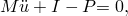
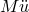
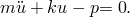
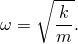
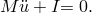
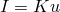
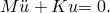
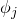

# 7.1 Introduction

A dynamic simulation is one in which inertia forces are included in the dynamic equation of equilibrium:

where 

*M*

is the mass of the structure,

is the acceleration of the structure,

*I*

are the internal forces in the structure, and

*P*

are the applied external forces.

The expression in the equation shown above is nothing more than Newton's second law of motion ().

The inclusion of the inertial forces () in the equation of equilibrium is the major difference between static and dynamic analyses. Another difference between the two types of simulations is in the definition of the internal forces, *I*. In a static analysis the internal forces arise only from the deformation of the structure; in a dynamic analysis the internal forces contain contributions created by both the motion (i.e., damping) and the deformation of the structure.

### 7.1.1 Natural frequencies and mode shapes

The simplest dynamic problem is that of a mass oscillating on a spring, as shown in [Figure 7--1](ch07s01.md#gss-mass-spring).

**Figure 7–1** Mass-spring system.

The internal force in the spring is given by  so that its dynamic equation of motion is 

This mass-spring system has a *natural frequency* (in radians/time) given by 

If the mass is moved and then released, it will oscillate at this frequency. If the force is applied at this frequency, the amplitude of the displacement will increase dramatically—a phenomenon known as resonance.

Real structures have a large number of natural frequencies. It is important to design structures in such a way that the frequencies at which they may be loaded are not close to the natural frequencies. The natural frequencies can be determined by considering the dynamic response of the unloaded structure ( in the dynamic equilibrium equation). The equation of motion is then

For an undamped system , so 

Solutions to this equation have the form 

Substituting this into the equation of motion yields the *eigenvalue* problem 

where .

This system has *n* eigenvalues, where *n* is the number of degrees of freedom in the finite element model. Let  be the *j*th eigenvalue. Its square root, , is the *natural frequency* of the *j*th mode of the structure, and  is the corresponding *j*th *eigenvector*. The eigenvector is also known as the *mode shape* because it is the deformed shape of the structure as it vibrates in the *j*th mode.

In Abaqus the [*FREQUENCY](../key/key-link.md#usb-kws-hfrequency) procedure is used to extract the modes and frequencies of the structure. This procedure is easy to use in that you need only specify the number of modes required or the maximum frequency of interest.

### 7.1.2 Modal superposition

The natural frequencies and mode shapes of a structure can be used to characterize its dynamic response to loads in the linear regime. The deformation of the structure can be calculated from a combination of the mode shapes of the structure using the *modal superposition* technique. Each mode shape is multiplied by a scale factor. The vector of displacements in the model, *u*, is defined as 

where  is the modal displacement and  is the generalized coordinate of mode *i*. This technique is valid only for simulations with small displacements, linear elastic materials, and no contact conditions—in other words, linear problems.

In structural dynamic problems the response of a structure usually is dominated by a relatively small number of modes, making modal superposition a particularly efficient method for calculating the response of such systems. Consider a model containing 10,000 degrees of freedom. Direct integration of the dynamic equations of motion would require the solution of 10,000 simultaneous equations at each point in time. If the structural response is characterized by 100 modes, only 100 equations need to be solved every time increment. Moreover, the modal equations are uncoupled, whereas the original equations of motion are coupled. There is an initial cost in calculating the modes and frequencies, but the savings obtained in the calculation of the response greatly outweigh the cost.

If nonlinearities are present in the simulation, the natural frequencies may change significantly during the analysis, and modal superposition cannot be employed. In this case direct integration of the dynamic equation of equilibrium is required, which is much more expensive than modal analysis.

A problem should have the following characteristics for it to be suitable for linear transient dynamic analysis:
- The system should be linear: linear material behavior, no contact conditions, and no nonlinear geometric effects.
- The response should be dominated by relatively few frequencies. As the frequency content of the response increases, such as is the case in shock and impact problems, the modal superposition technique becomes less effective.
- The dominant loading frequencies should be in the range of the extracted frequencies to ensure that the loads can be described accurately.
- The initial accelerations generated by any suddenly applied loads should be described accurately by the eigenmodes.
- The system should not be heavily damped.

