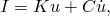
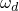
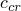
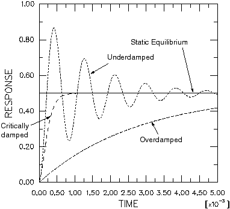
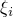

# 7.2 Damping


If an undamped structure is allowed to vibrate freely, the magnitude of the oscillation is constant. In reality, however, energy is dissipated by the structure's motion, and the magnitude of the oscillation decreases until the oscillation stops. This energy dissipation is known as damping. Damping is usually assumed to be viscous or proportional to velocity. The dynamic equilibrium equation can be rewritten to include damping as




where

*C*

is the damping matrix for the structure and


is the velocity of the structure.

The dissipation of energy is caused by a number of effects, including friction at the joints of the structure and localized material hysteresis. Damping is a convenient way of including the important absorption of energy without modeling the effects in detail.

In Abaqus/Standard the eigenmodes are calculated for the undamped system, yet most engineering problems involve some kind of damping, however small. The relationship between the damped natural frequency and the undamped natural frequency for each mode is


where



is the damped eigenvalue,


is the damping ratio, which is the fraction of critical damping,

*c*

is the damping of that mode shape, and



is the critical damping.

The eigenfrequencies of the damped system are very close to the corresponding quantities for the undamped system for small values of  ( < 0.1). As  increases, the undamped eigenfrequencies become less accurate; and as  approaches 1, the use of undamped eigenfrequencies becomes invalid.

If a structure is critically damped (), after any disturbance it will return to its initial static configuration as quickly as possible without overshooting ([Figure 7--2](ch07s02.md#gss-damping-v)).

**Figure 7–2** Damped motion patterns for various values of .



### 7.2.1 Definition of damping in Abaqus/Standard

In Abaqus/Standard a number of different types of damping can be defined for a transient modal analysis: direct modal damping, Rayleigh damping, and composite modal damping.

Damping is defined for modal dynamic procedures by using the [*MODAL DAMPING](../key/key-link.md#usb-kws-hmodaldamp) option. This option is part of the step definition and allows different amounts of damping to be defined for each mode. Direct, Rayleigh, and composite damping can all be defined this way.

**Direct modal damping**

The fraction of critical damping, , associated with each mode can be defined using direct modal damping. Typically, values in the range of 1% to 10% of critical damping are used. Direct modal damping allows you to define precisely the damping of each mode of the system.

The VISCOUS=FRACTION OF CRITICAL DAMPING parameter on the [*MODAL DAMPING](../key/key-link.md#usb-kws-hmodaldamp) option indicates that direct modal damping is being specified. For example, to define 4% of critical modal damping for the first 10 modes and 5% for modes 11–20, include the following in the step definition:

```
[*MODAL DAMPING](../key/key-link.md#usb-kws-hmodaldamp), VISCOUS=FRACTION OF CRITICAL DAMPING
1, 10, 0.04
11, 20, 0.05
```

**Rayleigh damping**

In Rayleigh damping the assumption is made that the damping matrix is a linear combination of the mass and stiffness matrices, 


where  and  are user-defined constants. Although the assumption that the damping is proportional to the mass and stiffness matrices has no rigorous physical basis, in practice the damping distribution rarely is known in sufficient detail to warrant any other more complicated model. In general, this model ceases to be reliable for heavily damped systems; that is, above approximately 10% of critical damping. As with the other forms of damping, you can define precisely the Rayleigh damping of each mode of the system.

For a given mode *i*, the damping ratio, , and the Rayleigh damping values,  and , are related through 


The VISCOUS=RAYLEIGH parameter on the [*MODAL DAMPING](../key/key-link.md#usb-kws-hmodaldamp) option indicates that Rayleigh damping is to be used. For example, to define  = 0.2525 and  = 2.9  103 for modes 1–10 and  = 0.2727 and  = 3.03  103 for modes 11–20, the following lines would be included in the step definition:

```
[*MODAL DAMPING](../key/key-link.md#usb-kws-hmodaldamp), VISCOUS=RAYLEIGH
1, 10, 0.2525, 2.9E-3
11, 20, 0.2727, 3.03E-3
```

**Composite damping**

In composite damping a fraction of critical damping is defined for each material, and a composite damping value is found for the whole structure. This option is useful when many different materials are present in the structure. Composite damping is not discussed further in this guide.

### 7.2.2 Choosing damping values

In most linear dynamic problems the proper specification of damping is important to obtain accurate results. However, damping is approximate in the sense that it models the energy absorbing characteristics of the structure without attempting to model the physical mechanisms that cause them. Therefore, it is difficult to determine the damping data required for a simulation. Occasionally, you may have data available from dynamic tests, but often you will have to work with data gleaned from references or experience. In such cases you should be very cautious in interpreting the results, and you should use parametric studies to assess the sensitivity of the simulation to damping values.


