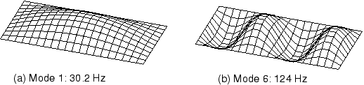

# 7.4 Mesh design for dynamics

When you are designing meshes for dynamic simulations, you need to consider the mode shapes that will be excited in the response and use a mesh that is able to represent those mode shapes adequately. This means that a mesh that is adequate for a static simulation may be unsuitable for calculating the dynamic response to loading that excites high frequency modes.

Consider, for example, the plate shown in [Figure 7--3](ch07s04.md#gss-coarse-mesh). The mesh of first-order shell elements is adequate for a static analysis of the plate under a uniform load and is also suitable for the prediction of the first mode shape. However, the mesh is clearly too coarse to be able to model the sixth mode accurately.

**Figure 7–3** Vibration frequencies and corresponding mode shapes of the plate based on the coarse mesh.

[Figure 7--4](ch07s04.md#gss-fine-mesh) shows the same plate modeled with a refined mesh of first-order elements. The displaced shape for the sixth mode now looks much better, and the frequency predicted for this mode is more accurate. If the dynamic loading on the plate is such that there is significant excitation of this mode, the refined mesh must be used; the results from the coarse mesh will not be accurate.

**Figure 7–4** Vibration frequencies and corresponding mode shapes of the plate based on the fine mesh.

