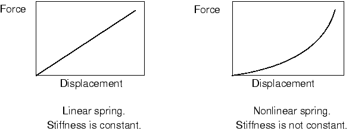

# 8 Nonlinearity

This chapter discusses nonlinear structural analysis in Abaqus. The differences between linear and nonlinear analyses are summarized below.

**Linear analysis**

All the analyses discussed so far have been linear: there is a linear relationship between the applied loads and the response of the system. For example, if a linear spring extends statically by 1 m under a load of 10 N, it will extend by 2 m when a load of 20 N is applied. This means that in a linear Abaqus/Standard analysis the flexibility of the structure need only be calculated once (by assembling the stiffness matrix and inverting it). The linear response of the structure to other load cases can be found by multiplying the new vector of loads by the inverted stiffness matrix. Furthermore, the structure's response to various load cases can be scaled by constants and/or superimposed on one another to determine its response to a completely new load case, provided that the new load case is the sum (or multiple) of previous ones. This principle of superposition of load cases assumes that the same boundary conditions are used for all the load cases.

Abaqus/Standard uses the principle of superposition of load cases in linear dynamics simulations, which are discussed in [Chapter 7, "Linear Dynamics](ch07.md).”

**Nonlinear analysis**

A nonlinear structural problem is one in which the structure's stiffness changes as it deforms. All physical structures exhibit nonlinear behavior. Linear analysis is a convenient approximation that is often adequate for design purposes. It is obviously inadequate for many structural simulations including manufacturing processes, such as forging or stamping; crash analyses; and analyses of rubber components, such as tires or engine mounts. A simple example is a spring with a nonlinear stiffening response (see [Figure 8--1](ch08.md#gss-spring)).

**Figure 8–1** Linear and nonlinear spring characteristics.

Since the stiffness is now dependent on the displacement, the initial flexibility can no longer be multiplied by the applied load to calculate the spring's displacement for any load. In a nonlinear implicit analysis the stiffness matrix of the structure has to be assembled and inverted many times during the course of the analysis, making it much more expensive to solve than a linear implicit analysis. In an explicit analysis the increased cost of a nonlinear analysis is due to reductions in the stable time increment. The stable time increment is discussed further in [Chapter 9, "Nonlinear Explicit Dynamics](ch09.md).”

Since the response of a nonlinear system is not a linear function of the magnitude of the applied load, it is not possible to create solutions for different load cases by superposition. Each load case must be defined and solved as a separate analysis.

