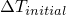
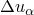
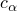
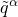
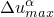
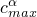
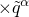
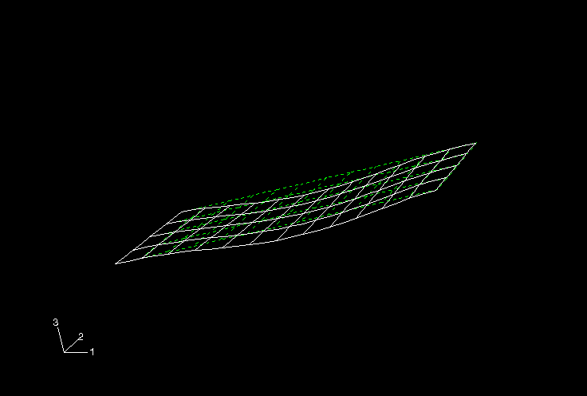

# 8.4 Example: nonlinear skew plate


This example is a continuation of the linear skew plate simulation described in [Chapter 5, "Using Shell Elements](ch05.md),” and shown in [Figure 8--11](ch08s04.md#gss-skewplate). 

**Figure 8–11** Skew plate.


You will now reanalyze the plate in Abaqus/Standard to include the effects of geometric nonlinearity. The results from this analysis will allow you to determine the importance of geometrically nonlinear effects and, therefore, the validity of the linear analysis.

You only need to modify the history data to convert this model from a linear simulation to a nonlinear simulation.

If you wish, you can follow the guidelines at the end of this example to extend the simulation to perform a dynamic analysis using Abaqus/Explicit.

The steps that follow assumes that you have access to the full input file for this example. This input file, `skew_nl.inp`, is available in ["Nonlinear skew plate," Section A.6](ap01s06.md). Instructions on how to fetch and run the script are given in [Appendix A, "Example Files](ap01.md).” If you wish to create the entire model using Abaqus/CAE, please refer to ["Example: nonlinear skew plate," Section 8.4 of Getting Started with Abaqus: Interactive Edition](../gsa/gsa-link.md#gsa-nln-skewplate).

### 8.4.1 Modifications to the input file---the history data

This example does not change any model data in the original skew plate example; only history data changes are included.

**Applying NLGEOM to the step**

Set the NLGEOM parameter equal to YES on the [*STEP](../key/key-link.md#usb-kws-hstep) option, and remove the PERTURBATION parameter. This indicates that the analysis now includes nonlinear geometric effects. The default maximum number of increments is 100; Abaqus may use fewer increments than this upper limit, but it will stop the analysis if it needs more.

The modified [*STEP](../key/key-link.md#usb-kws-hstep) option looks like:

```
*STEP, NLGEOM=YES
```

You may also wish to modify the description of the step to reflect that this is now a nonlinear analysis.

**Defining the step time**

This analysis requires a data line to the [*STATIC](../key/key-link.md#usb-kws-hstatic) option that specifies the size of the initial time increment, , for the analysis and the total step time for the simulation. A total step time of 1.0 is used, and  is specified such that Abaqus applies 10% of the load in the first increment. The completed [*STATIC](../key/key-link.md#usb-kws-hstatic) option block will, therefore, be

```
*STATIC
0.1, 1.0
```

**Output control**

In a linear analysis Abaqus solves the equilibrium equations once and calculates the results for this one solution. A nonlinear analysis can produce much more output because results can be requested at the end of each converged increment. If you do not select the output requests carefully, the output files become very large, potentially filling the disk space on your computer.

As noted earlier, output is available in four different files:
- the output database (`.odb`) file, which contains data in a neutral binary format necessary to postprocess the results with Abaqus/Viewer;
- the data (`.dat`) file, which contains printed tables of selected results;
- the restart (`.res`) file, which is used to continue the analysis; and
- the results (`.fil`) file, which is used with third-party postprocessors.

Only the options for the output database (`.odb`) and printed output (`.dat`) files are discussed here. If selected carefully, data can be saved frequently during the simulation without using excessive disk space.

Remove the existing output requests from your input file; and add the following output options, which ensure that only selected output is saved during the nonlinear analysis.

To reduce the size of the output database file, the FREQUENCY parameter is used on the [*OUTPUT](../key/key-link.md#usb-kws-houtput), FIELD option; in this simulation field output is written every second increment. Thus, the FREQUENCY parameter is set to 2 on the [*OUTPUT](../key/key-link.md#usb-kws-houtput) option: 

```
*OUTPUT, FIELD, FREQUENCY=2, VARIABLE=PRESELECT
```
The parameter VARIABLE=PRESELECT indicates that a preselected set of the most commonly used field variables for a given type of analysis will be written to the output database (`.odb`) file. If you are simply interested in the final results, set the FREQUENCY parameter equal to a large number. Results are always stored at the end of each step, regardless of the value of the FREQUENCY parameter; therefore, using a large value causes only the final results to be saved.

Request that the displacements of the nodes at the midspan be saved to the output database file. These results will be used later to demonstrate the *X–Y* plotting capability in Abaqus/Viewer. Use the default FREQUENCY value (FREQUENCY=1) for this history output request for the output database file. Here the [*NODE OUTPUT](../key/key-link.md#usb-kws-hnodeoutput) option must appear immediately after the history output request. Remember to use the NSET or ELSET parameters when limiting the output being requested to a subset of the model; otherwise, the default subset, which is the entire model, will be used.

Finally, request that reaction forces (RF) be printed for all the nodes in the model and that the displacements (U) be printed for the nodes at the midspan (node set `MIDSPAN`). You will need two [*NODE PRINT](../key/key-link.md#usb-kws-hnodeprint) options because you are requesting results for two different subsets of the model. Again, use the FREQUENCY parameter to reduce the amount of output; print the data every second increment.

The new list of output request option blocks looks like: 

```
*OUTPUT, FIELD, FREQUENCY=2, VARIABLE=PRESELECT
*OUTPUT, HISTORY, FREQUENCY=1
*NODE OUTPUT, NSET=MIDSPAN
U,
*NODE PRINT, NSET=MIDSPAN, FREQUENCY=2
U,
*NODE PRINT, SUMMARY=NO, TOTALS=YES, FREQUENCY=2
RF,
```
Finally, the step definition is completed using the [*END STEP](../key/key-link.md#usb-kws-hendstep) option.
```
*END STEP
```

### 8.4.2 Running the analysis

Store the modified input in a file called `skew_nl.inp` (an example input file is listed in ["Nonlinear skew plate," Section A.6](ap01s06.md)). Run the analysis using the following command:

```
abaqus job=skew_nl interactive
```

### 8.4.3 Results

During a nonlinear analysis, two additional output files become very important. They are the status file (`skew_nl.sta`) and the message file (`skew_nl.msg`). As the analysis progresses, Abaqus will write data to both of these files. You can view the data even as Abaqus continues your analysis. You will need to learn how to use the data in these files to assess Abaqus's progress on your simulations. There may be situations where you decide, based on information in these files, to terminate your analysis early. A more likely scenario is that you may need to use these files to learn what caused Abaqus to terminate your analysis prematurely; i.e., what caused the convergence problems.

**Status file**

The status file is particularly useful for monitoring the progress of a nonlinear simulation while the job is running. The output below shows the status file for this nonlinear skewed plate example.

```
 SUMMARY OF JOB INFORMATION:
 STEP  INC ATT SEVERE EQUIL TOTAL  TOTAL      STEP       INC OF       DOF    IF
               DISCON ITERS ITERS  TIME/    TIME/LPF    TIME/LPF    MONITOR RIKS
               ITERS               FREQ
   1     1   1     0     4     4  0.100      0.100      0.1000    
   1     2   1     0     2     2  0.200      0.200      0.1000    
   1     3   1     0     2     2  0.350      0.350      0.1500    
   1     4   1     0     2     2  0.575      0.575      0.2250    
   1     5   1     0     3     3  0.913      0.913      0.3375    
   1     6   1     0     2     2  1.00       1.00       0.08750   

```
The status file contains a separate line for every converged increment in the simulation. The first column shows the step number—in this case there is only one step. The second column gives the increment number. The sixth column shows the number of iterations Abaqus needed to obtain a converged solution in each increment; for example, Abaqus needed 4 iterations in increment 1. The eighth column shows the total step time completed, and the ninth column shows the increment size (). 

This example shows how Abaqus automatically controls the increment size and, therefore, the proportion of load applied in each increment. In this analysis Abaqus applied 10% of the total load in the first increment: you specified  to be 0.1 and the step time to be 1.0. Abaqus needed four iterations to converge to a solution in the first increment. Abaqus only needed two iterations in the second increment, so it automatically increased the size of the next increment by 50% to  = 0.15. Abaqus also increased  in both the fourth and fifth increments. It adjusted the final increment size to be just enough to complete the analysis; in this case the final increment size was 0.0875.

**Message file**

The message file contains more detailed information about the progress of the analysis than the status file. Abaqus lists all of the tolerances and parameters to control the analysis at the start of each step in the message file, as shown below. This is done for each step because these controls can be modified from step to step. The default values of these controls are appropriate for most analyses, so normally it is not necessary for you to modify them. The modification of control tolerances and parameters is beyond the scope of this guide (it is discussed in ["Commonly used control parameters," Section 7.2.2 of the Abaqus Analysis User's Guide](../usb/usb-link.md#usb-anl-aconvergecontrol)).

```
                        S T E P       1     S T A T I C   A N A L Y S I S

          Uniform pressure (20.0 kPa) load                                                

     AUTOMATIC TIME CONTROL WITH -
          A SUGGESTED INITIAL TIME INCREMENT OF                0.100    
          AND A TOTAL TIME PERIOD OF                            1.00    
          THE MINIMUM TIME INCREMENT ALLOWED IS                1.000E-05
          THE MAXIMUM TIME INCREMENT ALLOWED IS                 1.00    

     LINEAR EQUATION SOLVER TYPE         DIRECT SPARSE

 CONVERGENCE TOLERANCE PARAMETERS FOR FORCE    
     CRITERION FOR RESIDUAL FORCE     FOR A NONLINEAR PROBLEM          5.000E-03
     CRITERION FOR DISP.    CORRECTION IN A NONLINEAR PROBLEM          1.000E-02
     INITIAL VALUE OF TIME AVERAGE FORCE                               1.000E-02
     AVERAGE FORCE     IS TIME AVERAGE FORCE    
     ALTERNATE CRIT. FOR RESIDUAL FORCE     FOR A NONLINEAR PROBLEM    2.000E-02
     CRITERION FOR ZERO FORCE     RELATIVE TO TIME AVRG. FORCE         1.000E-05
     CRITERION FOR RESIDUAL FORCE     WHEN THERE IS ZERO FLUX          1.000E-05
     CRITERION FOR DISP.    CORRECTION WHEN THERE IS ZERO FLUX         1.000E-03
     CRITERION FOR RESIDUAL FORCE     FOR A LINEAR INCREMENT           1.000E-08
     FIELD CONVERSION RATIO                                             1.00    
     CRITERION FOR ZERO FORCE     REL. TO TIME AVRG. MAX. FORCE        1.000E-05
     CRITERION FOR ZERO DISP.    RELATIVE TO CHARACTERISTIC LENGTH     1.000E-08

 CONVERGENCE TOLERANCE PARAMETERS FOR MOMENT   
     CRITERION FOR RESIDUAL MOMENT    FOR A NONLINEAR PROBLEM          5.000E-03
     CRITERION FOR ROTATION CORRECTION IN A NONLINEAR PROBLEM          1.000E-02
     INITIAL VALUE OF TIME AVERAGE MOMENT                              1.000E-02
     AVERAGE MOMENT    IS TIME AVERAGE MOMENT   
     ALTERNATE CRIT. FOR RESIDUAL MOMENT    FOR A NONLINEAR PROBLEM    2.000E-02
     CRITERION FOR ZERO MOMENT    RELATIVE TO TIME AVRG. MOMENT        1.000E-05
     CRITERION FOR RESIDUAL MOMENT    WHEN THERE IS ZERO FLUX          1.000E-05
     CRITERION FOR ROTATION CORRECTION WHEN THERE IS ZERO FLUX         1.000E-03
     CRITERION FOR RESIDUAL MOMENT    FOR A LINEAR INCREMENT           1.000E-08
     FIELD CONVERSION RATIO                                             1.00    
     CRITERION FOR ZERO MOMENT    REL. TO TIME AVRG. MAX. MOMENT       1.000E-05

     VOLUMETRIC STRAIN COMPATIBILITY TOLERANCE FOR HYBRID SOLIDS       1.000E-05
     AXIAL STRAIN COMPATIBILITY TOLERANCE FOR HYBRID BEAMS             1.000E-05
     TRANS. SHEAR STRAIN COMPATIBILITY TOLERANCE FOR HYBRID BEAMS      1.000E-05
     SOFT CONTACT CONSTRAINT COMPATIBILITY TOLERANCE FOR P>P0          5.000E-03
     SOFT CONTACT CONSTRAINT COMPATIBILITY TOLERANCE FOR P=0.0         0.100    
     DISPLACEMENT COMPATIBILITY TOLERANCE FOR DCOUP ELEMENTS           1.000E-05
     ROTATION COMPATIBILITY TOLERANCE FOR DCOUP ELEMENTS               1.000E-05

 EQUILIBRIUM WILL BE CHECKED FOR SEVERE DISCONTINUITY ITERATIONS

 TIME INCREMENTATION CONTROL PARAMETERS:
     FIRST EQUILIBRIUM ITERATION FOR CONSECUTIVE DIVERGENCE CHECK              4
     EQUILIBRIUM ITERATION AT WHICH LOG. CONVERGENCE RATE CHECK BEGINS         8
     EQUILIBRIUM ITERATION AFTER WHICH ALTERNATE RESIDUAL IS USED              9
     MAXIMUM EQUILIBRIUM ITERATIONS ALLOWED                                   16
     EQUILIBRIUM ITERATION COUNT FOR CUT-BACK IN NEXT INCREMENT               10
     MAXIMUM EQUILIB. ITERS IN TWO INCREMENTS FOR TIME INCREMENT INCREASE      4
     MAXIMUM ITERATIONS FOR SEVERE DISCONTINUITIES                            50
     MAXIMUM CUT-BACKS ALLOWED IN AN INCREMENT                                 5
     MAXIMUM DISCON. ITERS IN TWO INCREMENTS FOR TIME INCREMENT INCREASE      50
     MAXIMUM CONTACT AUGMENTATIONS FOR *SURFACE BEHAVIOR,AUGMENTED LAGRANGE    6
     CUT-BACK FACTOR AFTER DIVERGENCE                                 0.2500    
     CUT-BACK FACTOR FOR TOO SLOW CONVERGENCE                         0.5000    
     CUT-BACK FACTOR AFTER TOO MANY EQUILIBRIUM ITERATIONS            0.7500    
     CUT-BACK FACTOR AFTER TOO MANY SEVERE DISCONTINUITY ITERATIONS   0.2500    
     CUT-BACK FACTOR AFTER PROBLEMS IN ELEMENT ASSEMBLY               0.2500    
     INCREASE FACTOR AFTER TWO INCREMENTS THAT CONVERGE QUICKLY        1.500    
     MAX. TIME INCREMENT INCREASE FACTOR ALLOWED                       1.500    
     MAX. TIME INCREMENT INCREASE FACTOR ALLOWED (DYNAMICS)            1.250    
     MAX. TIME INCREMENT INCREASE FACTOR ALLOWED (DIFFUSION)           2.000    
     MINIMUM TIME INCREMENT RATIO FOR EXTRAPOLATION TO OCCUR          0.1000    
     MAX. RATIO OF TIME INCREMENT TO STABILITY LIMIT                   1.000    
     FRACTION OF STABILITY LIMIT FOR NEW TIME INCREMENT               0.9500    
     TIME INCREMENT INCREASE FACTOR BEFORE A TIME POINT                1.000    
     GLOBAL STABILIZATION CONTROL IS NOT USED

          PRINT OF INCREMENT NUMBER, TIME, ETC., EVERY    1  INCREMENTS

```

Abaqus lists a summary of each iteration in the message file after the lists of tolerances and controls. It prints the values of the largest residual force, ; largest increment of displacement, ; the largest correction to displacement, ; and the time averaged force, . It also prints the nodes and degrees of freedom (DOF) at which , , and  occur. A similar summary is printed for rotational degrees of freedom.

```
  INCREMENT     1 STARTS. ATTEMPT NUMBER  1, TIME INCREMENT  0.100    

               CONVERGENCE CHECKS FOR EQUILIBRIUM ITERATION     1

 AVERAGE FORCE                       12.2       TIME AVG. FORCE        12.2    
 LARGEST RESIDUAL FORCE             -749.       AT NODE       1051   DOF  1
 LARGEST INCREMENT OF DISP.        -5.576E-03   AT NODE        559   DOF  3
 LARGEST CORRECTION TO DISP.       -5.576E-03   AT NODE        559   DOF  3
          FORCE     EQUILIBRIUM NOT ACHIEVED WITHIN TOLERANCE.

 AVERAGE MOMENT                      1.12       TIME AVG. MOMENT       1.12    
 LARGEST RESIDUAL MOMENT           -3.273E-03   AT NODE       1104   DOF  5
 LARGEST INCREMENT OF ROTATION      1.598E-02   AT NODE        159   DOF  5
 LARGEST CORRECTION TO ROTATION     1.598E-02   AT NODE        159   DOF  5
          ROTATION CORRECTION TOO LARGE COMPARED TO ROTATION INCREMENT

```

In this example the initial time increment is 0.1, as specified in the input file. The average force for the increment is 12.2 N, and  has the same value since this is the first increment. The largest residual force in the model, , is  749 N, which is clearly greater than 0.005  .  occurred at node 1051 in degree of freedom 1. Abaqus must also check for equilibrium of the moments in the model since this model includes shell elements. The moment/rotation field also failed to satisfy the equilibrium check.

Although failure to satisfy the equilibrium check is enough to cause Abaqus to try another iteration, you should also examine the displacement correction. In the first iteration of the first increment of the first step the largest increment of displacement, , and the largest correction to displacement, , are both 5.576  103 m; and the largest increment of rotation and correction to rotation are both 1.598  102 radians. Since the incremental values and the corrections are always equal in the first iteration of the first increment of the first step, the check that the largest corrections to nodal variables are less than 1% of the largest incremental values will always fail. However, if Abaqus judges the solution to be linear (a judgement based on the magnitude of the residuals,  < 108), it will ignore this criterion.

Since Abaqus did not find an equilibrium solution in the first iteration, it tries a second iteration, as shown below.

```
                CONVERGENCE CHECKS FOR EQUILIBRIUM ITERATION     2

 AVERAGE FORCE                       1.00       TIME AVG. FORCE        1.00    
 LARGEST RESIDUAL FORCE            -0.173       AT NODE       1051   DOF  1
 LARGEST INCREMENT OF DISP.        -5.582E-03   AT NODE        651   DOF  3
 LARGEST CORRECTION TO DISP.       -7.050E-05   AT NODE       1201   DOF  1
          FORCE     EQUILIBRIUM NOT ACHIEVED WITHIN TOLERANCE.

 AVERAGE MOMENT                      1.12       TIME AVG. MOMENT       1.12    
 LARGEST RESIDUAL MOMENT           -8.698E-04   AT NODE        208   DOF  5
 LARGEST INCREMENT OF ROTATION     -1.597E-02   AT NODE       1051   DOF  5
 LARGEST CORRECTION TO ROTATION     1.305E-04   AT NODE        409   DOF  4
          THE MOMENT    EQUILIBRIUM EQUATIONS HAVE CONVERGED

```

In the second iteration  has fallen to 0.173 N at node 1051 in degree of freedom 1. However, equilibrium is not satisfied in this iteration because 0.005 , where  = 1.00 N, is still less than . The displacement correction criterion also failed again because  = 7.050  105, which occurred at node 1201 in degree of freedom 1, is more than 1% of  = 5.582  103, the maximum displacement increment.

Both the moment residual check and the largest correction to rotation check were satisfied in this second iteration; however, Abaqus must perform two more iterations because the solutions did not pass the force residual check (or the largest correction to displacement criterion). The message file summaries for the additional iterations necessary to obtain a solution in the first increment are shown below.

```
                CONVERGENCE CHECKS FOR EQUILIBRIUM ITERATION     3

 AVERAGE FORCE                      0.997       TIME AVG. FORCE       0.997    
 LARGEST RESIDUAL FORCE            -5.838E-03   AT NODE        459   DOF  2
 LARGEST INCREMENT OF DISP.        -5.582E-03   AT NODE        651   DOF  3
 LARGEST CORRECTION TO DISP.        9.150E-06   AT NODE        559   DOF  3
          FORCE     EQUILIBRIUM NOT ACHIEVED WITHIN TOLERANCE.

 AVERAGE MOMENT                      1.12       TIME AVG. MOMENT       1.12    
 LARGEST RESIDUAL MOMENT           -1.338E-06   AT NODE        908   DOF  5
 LARGEST INCREMENT OF ROTATION     -1.597E-02   AT NODE       1051   DOF  5
 LARGEST CORRECTION TO ROTATION     3.233E-05   AT NODE        809   DOF  5
          THE MOMENT    EQUILIBRIUM EQUATIONS HAVE CONVERGED

                CONVERGENCE CHECKS FOR EQUILIBRIUM ITERATION     4

 AVERAGE FORCE                      0.997       TIME AVG. FORCE       0.997    
 LARGEST RESIDUAL FORCE            -1.581E-07   AT NODE       1002   DOF  1
 LARGEST INCREMENT OF DISP.        -5.582E-03   AT NODE        651   DOF  3
 LARGEST CORRECTION TO DISP.        1.945E-09   AT NODE        559   DOF  3
          THE FORCE     EQUILIBRIUM EQUATIONS HAVE CONVERGED

 AVERAGE MOMENT                      1.12       TIME AVG. MOMENT       1.12    
 LARGEST RESIDUAL MOMENT            3.691E-10   AT NODE        259   DOF  5
 LARGEST INCREMENT OF ROTATION     -1.597E-02   AT NODE       1051   DOF  5
 LARGEST CORRECTION TO ROTATION     6.461E-09   AT NODE        809   DOF  5
          THE MOMENT    EQUILIBRIUM EQUATIONS HAVE CONVERGED

 ITERATION SUMMARY FOR THE INCREMENT:   4 TOTAL ITERATIONS, OF WHICH
   0 ARE SEVERE DISCONTINUITY ITERATIONS AND  4 ARE EQUILIBRIUM ITERATIONS.

 TIME INCREMENT COMPLETED  0.100    ,  FRACTION OF STEP COMPLETED  0.100    
 STEP TIME COMPLETED       0.100    ,  TOTAL TIME COMPLETED        0.100

```

After four iterations  = 0.997 N and  = 1.581  107 N at node 1002 in degree of freedom 1. These values satisfy < 0.005  , so the force residual check is satisfied. Comparing  to the largest increment of displacement shows that the displacement correction is below the required tolerance. The solution for the forces and displacements has, therefore, converged. The checks for both the moment residual and the rotation correction continue to be satisfied, as they have been since the second iteration. With a solution that satisfies equilibrium for all variables (displacement and rotation in this case), the first load increment is complete. The increment summary shows the number of iterations that were required for this increment, the size of the increment, and the fraction of the step that has been completed.

The second increment requires two iterations to converge, as shown below. 

```
  INCREMENT     2 STARTS. ATTEMPT NUMBER  1, TIME INCREMENT  0.100    

               CONVERGENCE CHECKS FOR EQUILIBRIUM ITERATION     1

 AVERAGE FORCE                       10.2       TIME AVG. FORCE        6.33    
 LARGEST RESIDUAL FORCE             -4.11       AT NODE        459   DOF  2
 LARGEST INCREMENT OF DISP.        -5.585E-03   AT NODE        651   DOF  3
 LARGEST CORRECTION TO DISP.        1.846E-04   AT NODE        509   DOF  3
          FORCE     EQUILIBRIUM NOT ACHIEVED WITHIN TOLERANCE.

 AVERAGE MOMENT                      2.27       TIME AVG. MOMENT       1.70    
 LARGEST RESIDUAL MOMENT           -1.226E-02   AT NODE        208   DOF  4
 LARGEST INCREMENT OF ROTATION     -1.586E-02   AT NODE       1051   DOF  4
 LARGEST CORRECTION TO ROTATION    -7.332E-04   AT NODE        409   DOF  5
          MOMENT    EQUILIBRIUM NOT ACHIEVED WITHIN TOLERANCE.

               CONVERGENCE CHECKS FOR EQUILIBRIUM ITERATION     2

 AVERAGE FORCE                       10.2       TIME AVG. FORCE        6.33    
 LARGEST RESIDUAL FORCE            -5.316E-04   AT NODE        359   DOF  2
 LARGEST INCREMENT OF DISP.        -5.587E-03   AT NODE        651   DOF  3
 LARGEST CORRECTION TO DISP.       -2.954E-06   AT NODE        459   DOF  3
          THE FORCE     EQUILIBRIUM EQUATIONS HAVE CONVERGED

 AVERAGE MOMENT                      2.67       TIME AVG. MOMENT       1.90    
 LARGEST RESIDUAL MOMENT            4.569E-07   AT NODE        208   DOF  4
 LARGEST INCREMENT OF ROTATION     -1.586E-02   AT NODE       1051   DOF  4
 LARGEST CORRECTION TO ROTATION     1.028E-05   AT NODE        209   DOF  4
          THE MOMENT    EQUILIBRIUM EQUATIONS HAVE CONVERGED
          TIME INCREMENT MAY NOW INCREASE TO    0.150    

 ITERATION SUMMARY FOR THE INCREMENT:   2 TOTAL ITERATIONS, OF WHICH
   0 ARE SEVERE DISCONTINUITY ITERATIONS AND  2 ARE EQUILIBRIUM ITERATIONS.

 TIME INCREMENT COMPLETED  0.100    ,  FRACTION OF STEP COMPLETED  0.200    
 STEP TIME COMPLETED       0.200    ,  TOTAL TIME COMPLETED        0.200    

```

Abaqus continues this process of applying an increment of load then iterating to find a solution until it completes the whole analysis (or reaches the increment specified as the value of the INC parameter). In this analysis it required four more increments. Abaqus gives a summary at the end of the message file of how the analysis progressed and how many error and warning messages it issued. The summary for this analysis is shown below. An important item to check is how many iterations Abaqus uses. In this analysis it performed 15 iterations over the six increments: the model's system of equations was solved 15 times (i.e., 15 matrix decompositions), illustrating the increased computational expense of nonlinear analyses compared with linear simulations.

```
          THE ANALYSIS HAS BEEN COMPLETED

     ANALYSIS SUMMARY:
     TOTAL OF          6  INCREMENTS
                       0  CUTBACKS IN AUTOMATIC INCREMENTATION
                      15  ITERATIONS INCLUDING CONTACT ITERATIONS IF PRESENT
                      15  PASSES THROUGH THE EQUATION SOLVER OF WHICH 
                      15  INVOLVE MATRIX DECOMPOSITION, INCLUDING
                       0  DECOMPOSITION(S) OF THE MASS MATRIX
                       1  REORDERING OF EQUATIONS TO MINIMIZE WAVEFRONT
                       0  ADDITIONAL RESIDUAL EVALUATIONS FOR LINE SEARCHES
                       0  ADDITIONAL OPERATOR EVALUATIONS FOR LINE SEARCHES
                       1  WARNING MESSAGES DURING USER INPUT PROCESSING
                       0  WARNING MESSAGES DURING ANALYSIS
                       0  ANALYSIS WARNINGS ARE NUMERICAL PROBLEM MESSAGES
                       0  ANALYSIS WARNINGS ARE NEGATIVE EIGENVALUE MESSAGES
                       0  ERROR MESSAGES

     JOB TIME SUMMARY
       USER TIME (SEC)      =  0.50000    
       SYSTEM TIME (SEC)    =   0.0000    
       TOTAL CPU TIME (SEC) =  0.50000    
       WALLCLOCK TIME (SEC) =          2

```

You should always check this summary at the end of every Abaqus simulation. It tells you if the analysis job ran to completion (i.e., whether it terminated without a FORTRAN error), and it gives the number of error and warning messages Abaqus issued during the simulation. Always investigate any errors or warnings. All warnings and errors generated during the analysis are found in the message (`.msg`) file. Warnings issued “during user input processing” are found in the data (`.dat`) file.

**Data file**

The tables of displacements and reaction forces that you requested are in the data (`.dat`) file. The midspan deflections at the end of the step can be found near the end of the file.

```
   THE FOLLOWING TABLE IS PRINTED FOR NODES BELONGING TO NODE SET MIDSPAN

       NODE FOOT-   U1          U2          U3          UR1         UR2         UR3      
            NOTE

        601     -1.2795E-04 -4.4921E-05 -1.0831E-02 
        602     -1.2457E-04 -4.5147E-05 -1.0749E-02 
        603     -1.2218E-04 -4.5645E-05 -1.0679E-02 
        604     -1.2070E-04 -4.5966E-05 -1.0625E-02 
        605     -1.1891E-04 -4.6602E-05 -1.0581E-02 
        606     -1.1749E-04 -4.6822E-05 -1.0553E-02 
        607     -1.1489E-04 -4.7487E-05 -1.0537E-02 
        608     -1.1213E-04 -4.7541E-05 -1.0541E-02 
        609     -1.0685E-04 -4.8026E-05 -1.0561E-02 

 MAXIMUM        -1.0685E-04 -4.4921E-05 -1.0537E-02   0.000       0.000       0.000    
 AT NODE               609         601         607           0           0           0

 MINIMUM        -1.2795E-04 -4.8026E-05 -1.0831E-02   0.000       0.000       0.000    
 AT NODE               601         609         601           0           0           0

```

Compare these with the displacements from the linear analysis in [Chapter 5, "Using Shell Elements](ch05.md).” The maximum displacement at the midspan in this simulation is about 9% less than that predicted from the linear analysis. Including the nonlinear geometric effects in the simulation reduces the vertical deflection (U3) of the midspan of the plate.

Another difference between the two analyses is that in the nonlinear simulation there are nonzero deflections in the 1- and 2-directions. What effects make the in-plane displacements, U1 and U2, nonzero in the nonlinear analysis? Why is the vertical deflection of the plate less in the nonlinear analysis?

The plate deforms into a curved shape: a geometry change that is taken into account in the nonlinear simulation. As a consequence, membrane effects cause some of the load to be carried by membrane action rather than by bending alone. This makes the plate stiffer. In addition, the pressure loading, which is always normal to the plate's surface, starts to have a component in the 1- and 2-directions as the plate deforms. The nonlinear analysis includes the effects of this stiffening and the changing direction of the pressure. Neither of these effects is included in the linear simulation.

The differences between the linear and nonlinear simulations are sufficiently large to indicate that a linear simulation is not adequate for this plate under this particular loading condition.

For five degree of freedom shells, such as the S8R5 element used in this analysis, Abaqus does not output total rotations at the nodes.

### 8.4.4 Postprocessing

When you are in the directory containing the output database file `skew_nl.odb`, type the following command at the operating system prompt:

```
abaqus viewer odb=skew_nl
```

**Showing the available frames**

To begin this exercise, determine the available output frames (the increment intervals at which results were written to the output database).

**To show the available frames:**

1. From the main menu bar, select ****Result****Step/Frame****. The **Step/Frame** dialog box appears. During the analysis Abaqus/Standard wrote field output results to the output database file every second increment, as was requested. Abaqus/Viewer displays the list of the available frames, as shown in [Figure 8--12](ch08s04.md#gss-c7-frame-selector-v). **Figure 8--12** Available frames.  The list tabulates the steps and increments for which field variables are stored. This analysis consisted of a single step with six increments. The results for increment 0 (the initial state of the step) are saved by default, and you saved data for increments 2, 4, and 6. By default, Abaqus/Viewer always uses the data for the last available increment saved in the output database file.
2. Click **OK** to dismiss the **Step/Frame** dialog box.

**Displaying the deformed and undeformed model shapes**

Use the **Allow Multiple Plot States**  tool to display the deformed model shape with the undeformed model shape superimposed. Set the render style for both images to wireframe, and toggle off the translucency of the superimposed plot from the **Superimpose Plot Options** dialog box. Rotate the view to obtain a plot similar to that shown in [Figure 8--13](ch08s04.md#gss-deform-plate-v). By default, the deformed shape is plotted for the last increment. (For clarity, the edges of the undeformed shape are plotted using a dashed style.) 

**Figure 8–13** Deformed and undeformed model shapes of the skew plate.



**Using results from other frames**

You can evaluate the results from other increments saved to the output database file by selecting the appropriate frame.

**To select a new frame:**

1. From the main menu bar, select ****Result****Step/Frame****. The **Step/Frame** dialog box appears.
2. Select `Increment 4` from the **Frame** menu.
3. Click **OK** to apply your changes and to close the **Step/Frame** dialog box.

Any plots now requested will use results from increment 4. Repeat this procedure, substituting the increment number of interest, to move through the output database file.

**Note:**Alternatively, you may use the **Frame Selector** dialog box to select a results frame.

**X–Y plotting**

You saved the displacements of the midspan nodes (node set `MIDSPAN`) in the history portion of the output database file `skew_nl.odb` for each increment of the simulation. You can use these results to create *X–Y* plots. In particular, you will plot the vertical displacement history of the nodes located at the edges of the plate midspan.

**To create X–Y plots of the midspan displacements:**

1. First, display only the nodes in the node set named `PART-1--1.MIDSPAN`: in the Results Tree, expand the **Node Sets** container underneath the output database file named `skew_nl.odb`. Click mouse button 3 on the set named **PART-1-1.MIDSPAN**, and select **Replace** from the menu that appears.
2. Use the **Common Plot Options** dialog box to show the node labels (i.e., numbers) to determine which nodes are located at the edges of the plate midspan.
3. In the Results Tree, expand the **History Output** container for the output database named `skew_nl.odb`.
4. Locate the output labeled as follows: `Spatial displacement: U3 at Node *xxx* in NSET MIDSPAN`. Each of these curves represents the vertical motion of one of the midspan nodes. **Tip:**Filter the container according to `*U3*` to facilitate your selection.
5. Select (using **[Ctrl]****+Click**) the vertical motion of the two midspan edge nodes. Use the node labels to determine which curves you need to select.
6. Click mouse button 3, and select **Plot** from the menu that appears. Abaqus reads the data for both curves from the output database file and plots a graph similar to the one shown in [Figure 8--14](ch08s04.md#gss-midspan-v). (For clarity, the second curve has been changed to a dashed line, and the default grid and legend positions have been changed.) **Figure 8--14** Midspan displacement history at the edges of the skew plate.  The nonlinear nature of this simulation is clearly seen in these curves: as the analysis progresses, the plate stiffens. In this simulation the increase in the plate stiffness with the deformation is due to membrane effects. Therefore, the resulting peak displacement is less than that predicted by the linear analysis, which did not include this effect.

You can create *X–Y* curves from either history or field data stored in the output database (`.odb`) file. *X–Y* curves can also be read from an external file or they can be typed into the Visualization module interactively. Once curves have been created, their data can be further manipulated and plotted to the screen in graphical form.

The *X–Y* plotting capability of Abaqus/Viewer is discussed further in [Chapter 10, "Materials](ch10.md).”

**Tabular data**

Create a tabular data report of the midspan displacements. Use the node set `PART-1–1.MIDSPAN` to create the appropriate display group and the frame selector to choose the final frame. The contents of the report are shown below.

```
Source 1
---------

   ODB: skew_nl.odb
   Step: Step-1
   Frame: Increment      6: Step Time =    1.000

Loc 1 : Nodal values from source 1

Output sorted by column "Node Label".

Field Output reported at nodes for part: PART-1-1

            Node            U.U1            U.U2            U.U3
           Label          @Loc 1          @Loc 1          @Loc 1
-----------------------------------------------------------------
             601    -2.68589E-03    -746.369E-06    -49.4577E-03
             602    -2.62498E-03    -749.228E-06    -48.9958E-03
             603    -2.57304E-03    -758.277E-06    -48.5853E-03
             604    -2.53788E-03    -761.475E-06    -48.1742E-03
             605    -2.48991E-03     -774.13E-06    -47.6904E-03
             606    -2.45666E-03    -777.171E-06    -47.1307E-03
             607    -2.40294E-03      -792.3E-06      -46.52E-03
             608    -2.36145E-03    -793.014E-06    -45.9489E-03
             609    -2.27792E-03    -805.258E-06    -45.4701E-03

  Minimum           -2.68589E-03    -805.258E-06    -49.4577E-03

         At Node             601             609             601
  Maximum           -2.27792E-03    -746.369E-06    -45.4701E-03

         At Node             609             601             609

```

### 8.4.5 Running the analysis in Abaqus/Explicit

As an optional exercise, you can modify the model and run a dynamic analysis of the skew plate in Abaqus/Explicit. To do so, you must add a density of 7800 kg/m3 to the material definition and change the element type to S4R (with appropriate modifications to the element connectivity list). After making the appropriate model changes, you can create and run a new job to examine the transient dynamic effects in the plate under a suddenly applied load.


