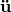
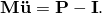
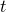
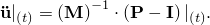
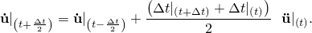
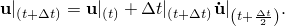
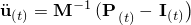
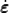
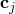
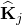

# 9.2 Explicit dynamic finite element methods

This section contains an algorithmic description of the Abaqus/Explicit solver as well as a comparison between implicit and explicit time integration and a discussion of the advantages of the explicit dynamics method.

### 9.2.1 Explicit time integration

Abaqus/Explicit uses a central difference rule to integrate the equations of motion explicitly through time, using the kinematic conditions at one increment to calculate the kinematic conditions at the next increment. At the beginning of the increment the program solves for dynamic equilibrium, which states that the nodal mass matrix, , times the nodal accelerations, , equals the net nodal forces (the difference between the external applied forces, , and internal element forces, ):

The accelerations at the beginning of the current increment (time ) are calculated as

Since the explicit procedure always uses a diagonal, or lumped, mass matrix, solving for the accelerations is trivial; there are no simultaneous equations to solve. The acceleration of any node is determined completely by its mass and the net force acting on it, making the nodal calculations very inexpensive.

The accelerations are integrated through time using the central difference rule, which calculates the change in velocity assuming that the acceleration is constant. This change in velocity is added to the velocity from the middle of the previous increment to determine the velocities at the middle of the current increment:

The velocities are integrated through time and added to the displacements at the beginning of the increment to determine the displacements at the end of the increment:

Thus, satisfying dynamic equilibrium at the beginning of the increment provides the accelerations. Knowing the accelerations, the velocities and displacements are advanced “explicitly” through time. The term “explicit” refers to the fact that the state at the end of the increment is based solely on the displacements, velocities, and accelerations at the beginning of the increment. This method integrates constant accelerations exactly. For the method to produce accurate results, the time increments must be quite small so that the accelerations are nearly constant during an increment. Since the time increments must be small, analyses typically require many thousands of increments. Fortunately, each increment is inexpensive because there are no simultaneous equations to solve. Most of the computational expense lies in the element calculations to determine the internal forces of the elements acting on the nodes. The element calculations include determining element strains and applying material constitutive relationships (the element stiffness) to determine element stresses and, consequently, internal forces.

Here is a summary of the explicit dynamics algorithm:

1. Nodal calculations. 1. Dynamic equilibrium.  2. Integrate explicitly through time.  
2. Element calculations. 1. Compute element strain increments, , from the strain rate, . 2. Compute stresses, , from constitutive equations.  3. Assemble nodal internal forces, .
3. Set  to  and return to Step 1.

### 9.2.2 Comparison of implicit and explicit time integration procedures

For both the implicit and the explicit time integration procedures, equilibrium is defined in terms of the external applied forces, , the internal element forces, , and the nodal accelerations:

where  is the mass matrix. Both procedures solve for nodal accelerations and use the same element calculations to determine the internal element forces. The biggest difference between the two procedures lies in the manner in which the nodal accelerations are computed. In the implicit procedure a set of linear equations is solved by a direct solution method. The computational cost of solving this set of equations is high when compared to the relatively low cost of the nodal calculations with the explicit method.

Abaqus/Standard uses automatic incrementation based on the full Newton iterative solution method. Newton's method seeks to satisfy dynamic equilibrium at the end of the increment at time  and to compute displacements at the same time. The time increment, , is relatively large compared to that used in the explicit method because the implicit scheme is unconditionally stable. For a nonlinear problem each increment typically requires several iterations to obtain a solution within the prescribed tolerances. Each Newton iteration solves for a correction, , to the incremental displacements, . Each iteration requires the solution of a set of simultaneous equations, 

which is an expensive procedure for large models. The effective stiffness matrix, , is a linear combination of the tangent stiffness matrix and the mass matrix for the iteration. The iterations continue until several quantities—force residual, displacement correction, etc.—are within the prescribed tolerances. For a smooth nonlinear response Newton's method has a quadratic rate of convergence, as illustrated below:

| Iteration | Relative Error |
| --- | --- |
| 1 | 1 |
| 2 | 102 |
| 3 | 104 |
| . | . |
| . | . |
| . | . |

However, if the model contains highly discontinuous processes, such as contact and frictional sliding, quadratic convergence may be lost and a large number of iterations may be required. Cutbacks in the time increment size may become necessary to satisfy equilibrium. In extreme cases the resulting time increment size in the implicit analysis may be on the same order as a typical stable time increment for an explicit analysis, while still carrying the high solution cost of implicit iteration. In some cases convergence may not be possible using the implicit method.

Each iteration in an implicit analysis requires solving a large system of linear equations, a procedure that requires considerable computation, disk space, and memory. For large problems these equation solver requirements are dominant over the requirements of the element and material calculations, which are similar for an analysis in Abaqus/Explicit. As the problem size increases, the equation solver requirements grow rapidly so that, in practice, the maximum size of an implicit analysis that can be solved on a given machine often is dictated by the amount of disk space and memory available on the machine rather than by the required computation time.

### 9.2.3 Advantages of the explicit time integration method

The explicit method is especially well-suited to solving high-speed dynamic events that require many small increments to obtain a high-resolution solution. If the duration of the event is short, the solution can be obtained efficiently.

Contact conditions and other extremely discontinuous events are readily formulated in the explicit method and can be enforced on a node-by-node basis without iteration. The nodal accelerations can be adjusted to balance the external and internal forces during contact.

The most striking feature of the explicit method is the absence of a global tangent stiffness matrix, which is required with implicit methods. Since the state of the model is advanced explicitly, iterations and tolerances are not required.

