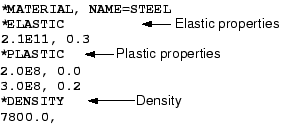
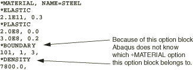

# 10.1 Defining materials in Abaqus

You can use any number of different materials in your simulation. Each material definition starts with a [*MATERIAL](../key/key-link.md#usb-kws-mmaterial) option. The NAME parameter identifies the name associated with the material being defined. This name is used to assign the material definition to specific elements in the model.

The material definition is one of the few situations in which the position of option blocks in the Abaqus input file is important. All of the option blocks defining specific aspects of a material's behavior, such as its elastic modulus or density, must follow the [*MATERIAL](../key/key-link.md#usb-kws-mmaterial) option directly. Furthermore, the material option blocks defining the behavior of a particular material cannot be interrupted by other nonmaterial options. Abaqus issues an error message if it cannot associate a material behavior option block, such as [*ELASTIC](../key/key-link.md#usb-kws-melastic), with a prior [*MATERIAL](../key/key-link.md#usb-kws-mmaterial) option.

For example, consider a material description, such as an elastic-plastic metal subjected to gravitational loads, that requires several material behavior option blocks to supply Abaqus with the necessary data. In addition to the elastic and plastic property option blocks, Abaqus needs the material's density to calculate the gravitational loads. Thus, the complete material description would be 

A non-material option block between the [*PLASTIC](../key/key-link.md#usb-kws-mplastic) and [*DENSITY](../key/key-link.md#usb-kws-mdensity) options, as shown in the following input, would cause Abaqus to terminate the analysis with an error message.

