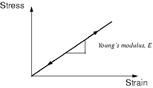
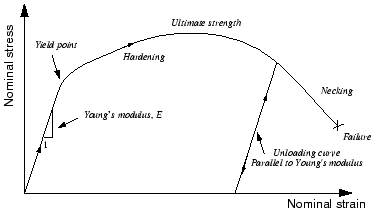
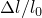
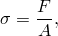
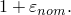
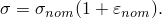
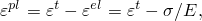
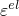
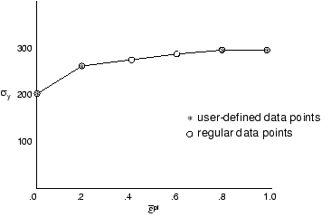
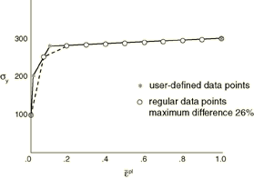

# 10.2 Plasticity in ductile metals

Many metals have approximately linear elastic behavior at low strain magnitudes (see [Figure 10--1](ch10s02.md#gss-stress-strain)), and the stiffness of the material, known as the Young's or elastic modulus, is constant.

**Figure 10–1** Stress-strain behavior for a linear elastic material, such as steel, at small strains.

At higher stress (and strain) magnitudes, metals begin to have nonlinear, inelastic behavior (see [Figure 10--2](ch10s02.md#gss-nominal)), which is referred to as plasticity.

**Figure 10–2** Nominal stress-strain behavior of an elastic-plastic material in a tensile test.

### 10.2.1 Characteristics of plasticity in ductile metals

The plastic behavior of a material is described by its yield point and its post-yield hardening. The shift from elastic to plastic behavior occurs at a certain point, known as the elastic limit or yield point, on a material's stress-strain curve (see [Figure 10--2](ch10s02.md#gss-nominal)). The stress at the yield point is called the yield stress. In most metals the initial yield stress is 0.05 to 0.1% of the material's elastic modulus.

The deformation of the metal prior to reaching the yield point creates only elastic strains, which are fully recovered if the applied load is removed. However, once the stress in the metal exceeds the yield stress, permanent (inelastic) deformation begins to occur. The strains associated with this permanent deformation are called plastic strains. Both elastic and plastic strains accumulate as the metal deforms in the post-yield region.

The stiffness of a metal typically decreases dramatically once the material yields (see [Figure 10--2](ch10s02.md#gss-nominal)). A ductile metal that has yielded will recover its initial elastic stiffness when the applied load is removed (see [Figure 10--2](ch10s02.md#gss-nominal)). Often the plastic deformation of the material increases its yield stress for subsequent loadings: this behavior is called work hardening.

Another important feature of metal plasticity is that the inelastic deformation is associated with nearly incompressible material behavior. Modeling this effect places some severe restrictions on the type of elements that can be used in elastic-plastic simulations.

A metal deforming plastically under a tensile load may experience highly localized extension and thinning, called *necking*, as the material fails (see [Figure 10--2](ch10s02.md#gss-nominal)). The engineering stress (force per unit undeformed area) in the metal is known as the *nominal stress*, with the conjugate *nominal strain* (length change per unit undeformed length). The nominal stress in the metal as it is necking is much lower than the material's ultimate strength. This material behavior is caused by the geometry of the test specimen, the nature of the test itself, and the stress and strain measures used. For example, testing the same material in compression produces a stress-strain plot that does not have a necking region because the specimen is not going to thin as it deforms under compressive loads. A mathematical model describing the plastic behavior of metals should be able to account for differences in the compressive and tensile behavior independent of the structure's geometry or the nature of the applied loads. This goal can be accomplished if the familiar definitions of nominal stress, , and nominal strain, , where the subscript 0 indicates a value from the undeformed state of the material, are replaced by new measures of stress and strain that account for the change in area during the finite deformations.

### 10.2.2 Stress and strain measures for finite deformations

Strains in compression and tension are the same only if considered in the limit as ; i.e.,

and

where *l* is the current length,  is the original length, and  is the *true strain* or *logarithmic strain*.

The stress measure that is the conjugate to the true strain is called the *true stress* and is defined as

where *F* is the force in the material and *A* is the current area. A ductile metal subjected to finite deformations will have the same stress-strain behavior in tension and compression if true stress is plotted against true strain.

### 10.2.3 Defining plasticity in Abaqus

When defining plasticity data in Abaqus, you must use *true stress* and *true strain*. Abaqus requires these values to interpret the data correctly.

Quite often material test data are supplied using values of nominal stress and strain. In such situations you must use the expressions presented below to convert the plastic material data from nominal stress-strain values to true stress-strain values.

The relationship between true strain and nominal strain is established by expressing the nominal strain as

Adding unity to both sides of this expression and taking the natural log of both sides provides the relationship between the true strain and the nominal strain:

The relationship between true stress and nominal stress is formed by considering the incompressible nature of the plastic deformation and assuming the elasticity is also incompressible, so 

The current area is related to the original area by 

Substituting this definition of *A* into the definition of true stress gives 

where 

can also be written as 

Making this final substitution provides the relationship between true stress and nominal stress and strain: 

These relationships are valid only prior to necking.

The [*PLASTIC](../key/key-link.md#usb-kws-mplastic) option in Abaqus defines the post-yield behavior for most metals. Abaqus approximates the smooth stress-strain behavior of the material with a series of straight lines joining the given data points. Any number of points can be used to approximate the actual material behavior; therefore, it is possible to use a very close approximation of the actual material behavior. The data on the [*PLASTIC](../key/key-link.md#usb-kws-mplastic) option define the true yield stress of the material as a function of true plastic strain. The first piece of data given defines the initial yield stress of the material and, therefore, should have a plastic strain value of zero.

The strains provided in material test data used to define the plastic behavior are not likely to be the plastic strains in the material. Instead, they will probably be the total strains in the material. You must decompose these total strain values into the elastic and plastic strain components. The plastic strain is obtained by subtracting the elastic strain, defined as the value of true stress divided by the Young's modulus, from the value of total strain (see [Figure 10--3](ch10s02.md#gss-total-strain)). 

**Figure 10–3** Decomposition of the total strain into elastic and plastic components.

This relationship is written 

where

is true plastic strain,

is true total strain,

is true elastic strain,

is true stress, and

*E*

is Young's modulus.

**Example of converting material test data to Abaqus input**

The nominal stress-strain curve in [Figure 10--4](ch10s02.md#gss-elastoplast) will be used as an example of how to convert the test data defining a material's plastic behavior into the appropriate input format for Abaqus. The six points shown on the nominal stress-strain curve will be used as the data for the [*PLASTIC](../key/key-link.md#usb-kws-mplastic) option.

**Figure 10–4** Elastic-plastic material behavior.

The first step is to use the equations relating the true stress to the nominal stress and strain and the true strain to the nominal strain (shown earlier) to convert the nominal stress and nominal strain to true stress and true strain. Once these values are known, the equation relating the plastic strain to the total and elastic strains (shown earlier) can be used to determine the plastic strains associated with each yield stress value. The converted data are shown in [Table 10--1](ch10s02.md#gss-chp-mat-stress-table). 

**Table 10–1** Stress and strain conversions.
| Nominal Stress (Pa) | Nominal Strain | True Stress (Pa) | True Strain | Plastic Strain |
| --- | --- | --- | --- | --- |
| 200E6 | 0.00095 | 200.2E6 | 0.00095 | 0.0 |
| 240E6 | 0.025 | 246E6 | 0.0247 | 0.0235 |
| 280E6 | 0.050 | 294E6 | 0.0488 | 0.0474 |
| 340E6 | 0.100 | 374E6 | 0.0953 | 0.0935 |
| 380E6 | 0.150 | 437E6 | 0.1398 | 0.1377 |
| 400E6 | 0.200 | 480E6 | 0.1823 | 0.1800 |

While there are few differences between the nominal and true values at small strains, there are very significant differences at larger strain values; therefore, it is extremely important to provide the proper stress-strain data to Abaqus if the strains in the simulation will be large.

**Data regularization in Abaqus/Explicit**

When performing an analysis, Abaqus/Explicit may not use the material data exactly as defined by the user; for efficiency, all material data that are defined in tabular form are automatically *regularized*. Material data can be functions of temperature, external fields, and internal state variables, such as plastic strain. For each material point calculation, the state of the material must be determined by interpolation, and, for efficiency, Abaqus/Explicit fits the user-defined curves with curves composed of equally spaced points. These regularized material curves are the material data used during the analysis. It is important to understand the differences that might exist between the regularized material curves used in the analysis and the curves that you specified.

To illustrate the implications of using regularized material data, consider the following two cases. [Figure 10--5](ch10s02.md#gxi-regularized-data) shows a case in which the user has defined data that are not regular. 

**Figure 10–5** Example of user data that can be regularized exactly.

In this example Abaqus/Explicit generates the six regular data points shown, and the user's data are reproduced exactly. [Figure 10--6](ch10s02.md#gxi-dif-regularize) shows a case where the user has defined data that are difficult to regularize exactly. In this example it is assumed that Abaqus/Explicit has regularized the data by dividing the range into 10 intervals that do not reproduce the user's data points exactly.

**Figure 10–6** Example of user data that are difficult to regularize.

Abaqus/Explicit attempts to use enough intervals such that the maximum error between the regularized data and the user-defined data is less than 3%; however, you can change this error tolerance. If more than 200 intervals are required to obtain an acceptable regularized curve, the analysis stops during the data checking with an error message. In general, the regularization is more difficult if the smallest interval defined by the user is small compared to the range of the independent variable. In [Figure 10--6](ch10s02.md#gxi-dif-regularize) the data point for a strain of 1.0 makes the range of strain values large compared to the small intervals defined at low strain levels. Removing this last data point enables the data to be regularized much more easily.

**Interpolation between data points**

Abaqus interpolates linearly between the data points provided (or, in Abaqus/Explicit, regularized data) to obtain the material's response and assumes that the response is constant outside the range defined by the input data, as shown in [Figure 10--7](ch10s02.md#gss-mat-svpe). Thus, the stress in this material will never exceed 480 MPa; when the stress in the material reaches 480 MPa, the material will deform continuously until the stress is reduced below this value.

**Figure 10–7** Material curve used by Abaqus.

**Material calibration in Abaqus/CAE**

Abaqus/CAE allows you to calibrate a material model from test data. With this capability, you can import material test data into Abaqus/CAE, process the data, and derive elastic and plastic isotropic material behaviors from the data. This feature is discussed further in ["Creating material calibrations," Section 12.17 of the Abaqus/CAE User's Guide](../usi/usi-link.md#usi-prp-calibration).

