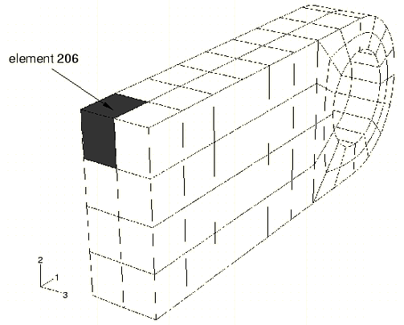
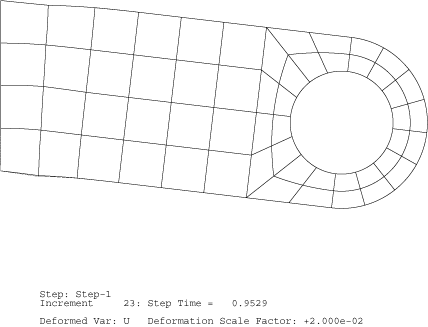
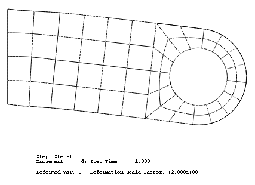
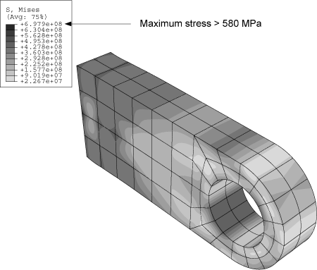
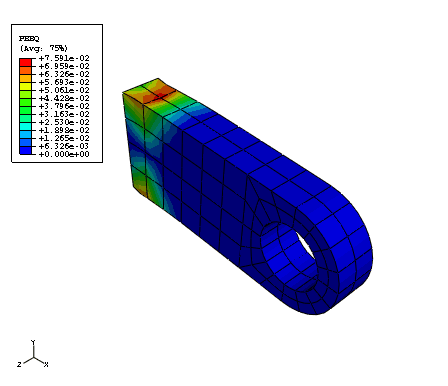
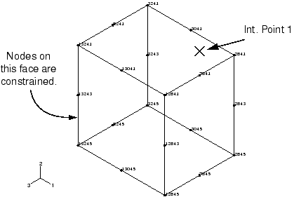
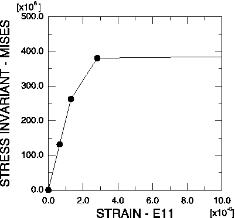

# 10.4 Example: connecting lug with plasticity


You have been asked to investigate what happens if the steel connecting lug from [Chapter 4, "Using Continuum Elements](ch04.md),” is subjected to an extreme load (60 kN) caused by an accident. The results from the linear analysis indicate that the lug will yield. You need to determine the extent of the plastic deformation in the lug and the magnitude of the plastic strains so that you can assess whether or not the lug will fail. You do not need to consider inertial effects in this analysis; thus, you will use Abaqus/Standard to examine the static response of the lug.

The only inelastic material data available for the steel are its yield stress (380 MPa) and its strain at failure (0.15). You decide to assume that the steel is perfectly plastic: the material does not harden, and the stress can never exceed 380 MPa (see [Figure 10--8](ch10s04.md#gss-steel)). 

**Figure 10–8** Stress-strain behavior for the steel.


In reality some hardening will probably occur, but this assumption is conservative; if the material hardens, the plastic strains will be less than those predicted by the simulation.

The steps that follow assume that you have access to the full input file for this example. This input file, `lug_plas.inp`, is provided in ["Connecting lug with plasticity," Section A.8](ap01s08.md). Instructions on how to fetch and run the script are given in [Appendix A, "Example Files](ap01.md).”

If you wish to create the entire model using Abaqus/CAE, please refer to ["Example: connecting lug with plasticity," Section 10.4 of Getting Started with Abaqus: Interactive Edition](../gsa/gsa-link.md#gsa-mat-connectlug).

### 10.4.1 Modifications to the input file---the model data

In this example, the material definition specifies the post-yield behavior of the material using the [*PLASTIC](../key/key-link.md#usb-kws-mplastic) option. The Young's modulus for the material is 200 GPa, and the initial yield stress at zero plastic strain is 380 MPa. Since you are modeling the steel as perfectly plastic, no other yield stresses are given on the [*PLASTIC](../key/key-link.md#usb-kws-mplastic) option.

The complete material definition is:

```
*MATERIAL, NAME=STEEL
*ELASTIC
200.E9, 0.3
*PLASTIC
380.E6,0.0
```
 All other option blocks in the model definition portion of the input file remain unchanged.

### 10.4.2 Modifications to the input file---the history data

This analysis requires a general, nonlinear simulation because of the nonlinear material behavior in the model. Therefore, the PERTURBATION parameter must be removed from the [*STEP](../key/key-link.md#usb-kws-hstep) option. The total step time in the [*STATIC](../key/key-link.md#usb-kws-hstatic) procedure option block has been set to 1.0, and the initial increment size is 20% of the total step time. This simulation is a static analysis of the lug under the extreme loads; you do not know in advance how many increments this simulation may require. The default maximum of 100 increments, however, is reasonably large and should be sufficient for this analysis. Also, we assume that the effects of geometric nonlinearity will not be important in this simulation, so the NLGEOM parameter is omitted from the [*STEP](../key/key-link.md#usb-kws-hstep) option. This portion of the input file appears as follows.

```
*STEP
*STATIC
0.2, 1.0
```

**Loading**

The load applied in this simulation is twice what was applied in the linear elastic simulation of the lug (60 kN vs. 30 kN). Therefore, this model doubles the magnitude of the pressures applied to the lug. The modified [*DLOAD](../key/key-link.md#usb-kws-hdload) option block looks like:

```
*DLOAD
PRESS, P6, 1.E+08
```

**Output requests**

You will use Abaqus/Viewer to review all of the results from this simulation, so all printed output requests have been deleted. The resulting output request option in your input file appears below:

```
*OUTPUT, FIELD, FREQUENCY=1, VARIABLE=PRESELECT
```

You will need to save some history data in the output database file to use with the *X–Y* plotting capability in Abaqus/Viewer. The displacements for node set `HOLEBOT`, which should already exist, are stored using the following option:

```
*OUTPUT, HISTORY, FREQUENCY=1
*NODE OUTPUT, NSET=HOLEBOT
U,
```

You also want detailed results for one of the elements along the built-in end of the lug (see [Figure 10--9](ch10s04.md#gss-elem206)).

**Figure 10–9** Element 206.



This is element 206 in the mesh generated by the commands found in ["Connecting lug with plasticity," Section A.8](ap01s08.md); the element in this location may have a different number in your model. This element is chosen because it is the element for which the stresses are most likely to be largest in magnitude. In the input file for this example, an element set has been created that contains the element, and saves the stresses (S), stress invariants (SINV), plastic strains (PE), and strains (E) for that element set in the output database file. The necessary option blocks are shown below:
```
*ELEMENT OUTPUT, ELSET=EL206
S, SINV, PE, E
*ELSET, ELSET=EL206
206,
```

**Note:**The [*ELSET](../key/key-link.md#usb-kws-melset) option used to define the element set appears after the output requests so as to not break up the block of suboptions associated with the [*OUTPUT](../key/key-link.md#usb-kws-houtput) option.

### 10.4.3 Running the analysis

Save these changes to your model, and run the analysis with the following command:

```
abaqus job=lug_plas
```

**Status file**

Monitor the simulation while it is running by looking at the status file, `lug_plas.sta`. When Abaqus has finished the simulation, your status file will contain information similar to the following:

```
 SUMMARY OF JOB INFORMATION:
 STEP  INC ATT SEVERE EQUIL TOTAL  TOTAL      STEP       INC OF       DOF    IF
               DISCON ITERS ITERS  TIME/    TIME/LPF    TIME/LPF    MONITOR RIKS
               ITERS               FREQ
   1     1   1     0     1     1  0.200      0.200      0.2000    
   1     2   1     0     1     1  0.400      0.400      0.2000    
   1     3   1     0     3     3  0.700      0.700      0.3000    
   1     4   1U    0     4     4  0.700      0.700      0.3000    
   1     4   2     0     2     2  0.775      0.775      0.07500   
   1     5   1     0     4     4  0.887      0.887      0.1125    
   1     6   1U    0     4     4  0.887      0.887      0.1125    
   1     6   2     0     3     3  0.916      0.916      0.02813   
   1     7   1U    0     5     5  0.916      0.916      0.04219   
   1     7   2     0     2     2  0.926      0.926      0.01055   
   1     8   1     0     4     4  0.942      0.942      0.01582   
   1     9   1U    0     3     3  0.942      0.942      0.02373   
   1     9   2     0     5     5  0.948      0.948      0.005933  
   1    10   1U    0     4     4  0.948      0.948      0.005933  
   1    10   2     0     4     4  0.949      0.949      0.001483  
   1    11   1     0     4     4  0.951      0.951      0.001483  
   1    12   1U    0     3     3  0.951      0.951      0.002225  
   1    12   2     0     3     3  0.951      0.951      0.0005562 
   1    13   1     0     4     4  0.952      0.952      0.0008343 
   1    14   1U    0     2     2  0.952      0.952      0.001251  
   1    14   2     0     4     4  0.953      0.953      0.0003129 
   1    15   1U    0     2     2  0.953      0.953      0.0004693 
   1    15   2     0     3     3  0.953      0.953      0.0001173 
   1    16   1U    0     3     3  0.953      0.953      0.0001760 
   1    16   2     0     3     3  0.953      0.953      4.399e-005
   1    17   1     0     3     3  0.953      0.953      6.599e-005
   1    18   1U    0     2     2  0.953      0.953      9.899e-005
   1    18   2     0     2     2  0.953      0.953      2.475e-005
   1    19   1     0     3     3  0.953      0.953      3.712e-005
   1    20   1U    0     1     1  0.953      0.953      5.568e-005
   1    20   2     0     3     3  0.953      0.953      1.392e-005
   1    21   1     0     3     3  0.953      0.953      2.088e-005
   1    22   1U    0     1     1  0.953      0.953      3.132e-005
   1    22   2     0     2     2  0.953      0.953      1.000e-005
   1    23   1     0     3     3  0.953      0.953      1.500e-005
   1    24   1U    0     1     1  0.953      0.953      2.250e-005

 THE ANALYSIS HAS NOT BEEN COMPLETED

```
Abaqus was able to apply only 95% of the prescribed load to the model and still obtain a converged solution. The status file shows that Abaqus reduced the size of the time increment, which is shown in the last (right-hand) column, many times during the simulation and stopped the analysis in the 24th increment. You will have to look at the information in the message file to understand why Abaqus terminated the simulation early.

**Message file**

The message file, `lug_plas.msg`, contains detailed information about the simulation's progress (see ["Results," Section 8.4.3](ch08s04.md#gsk-gen-nln-results), for more information about the format of the message file).

Look at the information for the first increment in the analysis (it is also shown below); you will discover that the model's initial behavior is linear, and the displacement correction is ignored because the residual force is essentially zero. The model's behavior was also linear in the second increment.

```
   INCREMENT     1 STARTS. ATTEMPT NUMBER  1, TIME INCREMENT  0.200    

               CONVERGENCE CHECKS FOR EQUILIBRIUM ITERATION     1

 AVERAGE FORCE                       128.       TIME AVG. FORCE          128.    
 LARGEST RESIDUAL FORCE            -6.684E-10   AT NODE      10605   DOF  2
 LARGEST INCREMENT OF DISP.        -1.685E-04   AT NODE        815   DOF  2
 LARGEST CORRECTION TO DISP.       -1.685E-06   AT NODE        815   DOF  2
          THE FORCE     EQUILIBRIUM RESPONSE WAS LINEAR IN THIS INCREMENT

ITERATION SUMMARY FOR THE INCREMENT:   1 TOTAL ITERATION, OF WHICH
   0 ARE SEVERE DISCONTINUITY ITERATIONS AND  1 ARE EQUILIBRIUM ITERATIONS.

```

Abaqus requires several iterations to obtain a converged solution in the third increment, which indicates that nonlinear behavior occurred in the model during this increment. The only nonlinearity in the model is the plastic material behavior, so the steel must have started to yield somewhere in the lug at this applied load magnitude. The summaries of the iterations for the third increment are shown below.

```
   INCREMENT     3 STARTS. ATTEMPT NUMBER  1, TIME INCREMENT  0.300    

               CONVERGENCE CHECKS FOR EQUILIBRIUM ITERATION     1

 AVERAGE FORCE                       794.       TIME AVG. FORCE        459.    
 LARGEST RESIDUAL FORCE              831.       AT NODE      13057   DOF  1
 LARGEST INCREMENT OF DISP.        -2.573E-04   AT NODE      20815   DOF  2
 LARGEST CORRECTION TO DISP.       -4.658E-06   AT NODE      10817   DOF  2
          FORCE     EQUILIBRIUM NOT ACHIEVED WITHIN TOLERANCE.

               CONVERGENCE CHECKS FOR EQUILIBRIUM ITERATION     2

 AVERAGE FORCE                       797.       TIME AVG. FORCE        460.    
 LARGEST RESIDUAL FORCE             -23.5       AT NODE      12843   DOF  1
 LARGEST INCREMENT OF DISP.        -2.690E-04   AT NODE      20815   DOF  2
 LARGEST CORRECTION TO DISP.       -1.171E-05   AT NODE       5817   DOF  2
          FORCE     EQUILIBRIUM NOT ACHIEVED WITHIN TOLERANCE.

               CONVERGENCE CHECKS FOR EQUILIBRIUM ITERATION     3

 AVERAGE FORCE                       801.       TIME AVG. FORCE        461.    
 LARGEST RESIDUAL FORCE             1.755E-02   AT NODE      12855   DOF  1
 LARGEST INCREMENT OF DISP.        -2.691E-04   AT NODE        815   DOF  2
 LARGEST CORRECTION TO DISP.       -1.054E-07   AT NODE        817   DOF  2
          THE FORCE     EQUILIBRIUM EQUATIONS HAVE CONVERGED

 ITERATION SUMMARY FOR THE INCREMENT:   3 TOTAL ITERATIONS, OF WHICH
   0 ARE SEVERE DISCONTINUITY ITERATIONS AND  3 ARE EQUILIBRIUM ITERATIONS.

 TIME INCREMENT COMPLETED  0.300    ,  FRACTION OF STEP COMPLETED  0.700    
 STEP TIME COMPLETED       0.700    ,  TOTAL TIME COMPLETED        0.700
```

Abaqus attempts to find a solution in the fourth increment using an increment size of 0.3, which means it is applying 30% of the total load, or 18 MPa, during this increment. After several iterations, Abaqus issues warning messages that the strain increments it calculated exceed the strain at initial yield by 50 times. After a few more iterations Abaqus determines that the solution in this increment is not going to converge; instead, it is diverging. Therefore, Abaqus abandons this attempt at finding a solution, reduces the increment size to 25% of the value used in the first attempt, and tries a second attempt at finding a solution. This reduction in increment size is called a *cut-back*. With the smaller increment size, Abaqus finds a converged solution in just a few iterations. Some of the iteration summaries from the first attempt of the fourth increment are shown below.

```
   INCREMENT     4 STARTS. ATTEMPT NUMBER  1, TIME INCREMENT  0.300    

               CONVERGENCE CHECKS FOR EQUILIBRIUM ITERATION     1

 AVERAGE FORCE                      1.196E+03   TIME AVG. FORCE        645.    
 LARGEST RESIDUAL FORCE            -4.908E+03   AT NODE      12849   DOF  2
 LARGEST INCREMENT OF DISP.        -5.806E-04   AT NODE      10817   DOF  2
 LARGEST CORRECTION TO DISP.       -3.116E-04   AT NODE      10817   DOF  2
          FORCE     EQUILIBRIUM NOT ACHIEVED WITHIN TOLERANCE.

               CONVERGENCE CHECKS FOR EQUILIBRIUM ITERATION     2

 AVERAGE FORCE                      1.286E+03   TIME AVG. FORCE        668.    
 LARGEST RESIDUAL FORCE             1.168E+04   AT NODE      13045   DOF  1
 LARGEST INCREMENT OF DISP.        -1.484E-03   AT NODE      10817   DOF  2
 LARGEST CORRECTION TO DISP.       -9.038E-04   AT NODE      10817   DOF  2
          FORCE     EQUILIBRIUM NOT ACHIEVED WITHIN TOLERANCE.

               CONVERGENCE CHECKS FOR EQUILIBRIUM ITERATION     3

 AVERAGE FORCE                      1.486E+03   TIME AVG. FORCE        717.    
 LARGEST RESIDUAL FORCE             1.721E+04   AT NODE      13049   DOF  2
 LARGEST INCREMENT OF DISP.        -6.796E-03   AT NODE      10817   DOF  2
 LARGEST CORRECTION TO DISP.       -5.311E-03   AT NODE        817   DOF  2
          FORCE     EQUILIBRIUM NOT ACHIEVED WITHIN TOLERANCE.

***WARNING: THE STRAIN INCREMENT HAS EXCEEDED FIFTY TIMES THE STRAIN TO CAUSE
            FIRST YIELD AT 120 POINTS

               CONVERGENCE CHECKS FOR EQUILIBRIUM ITERATION     4

 AVERAGE FORCE                      2.356E+03   TIME AVG. FORCE        935.    
 LARGEST RESIDUAL FORCE            -4.587E+04   AT NODE      12447   DOF  1
 LARGEST INCREMENT OF DISP.        -7.530E-02   AT NODE      10817   DOF  2
 LARGEST CORRECTION TO DISP.       -6.850E-02   AT NODE       5817   DOF  2
          FORCE     EQUILIBRIUM NOT ACHIEVED WITHIN TOLERANCE.

***NOTE: THE SOLUTION APPEARS TO BE DIVERGING. CONVERGENCE IS JUDGED UNLIKELY.
```

Now that you have reviewed the early increments of the simulation, move to the end of the message file and review the last increment Abaqus attempted. You will see that Abaqus is using a very small increment size, on the order of 1.0  105, in this final increment because of the many cut-backs. The iteration summaries for the last increment are shown below. Abaqus makes two attempts to find a solution in this final increment, but it must cut back the time increment in each attempt because the strain increments are so large that it does not even try to perform the plasticity calculations. This check on the magnitude of the total strain increment is another example of the many automatic solution controls Abaqus uses to ensure that the solution obtained for your simulation is both accurate and efficient. The automatic solution controls are suitable for almost all simulations. Therefore, you do not have to worry about providing parameters to control the solution algorithm: you only have to be concerned with the input data for your model.

```
   INCREMENT    24 STARTS. ATTEMPT NUMBER  1, TIME INCREMENT  2.250E-05    

***WARNING: THE STRAIN INCREMENT HAS EXCEEDED FIFTY TIMES THE STRAIN TO CAUSE
            FIRST YIELD AT 152 POINTS

***WARNING: THE STRAIN INCREMENT IS SO LARGE THAT THE PROGRAM WILL NOT ATTEMPT
            THE PLASTICITY CALCULATION AT 16 POINTS

***NOTE: MATERIAL CALCULATIONS FAILED TO CONVERGE OR WERE NOT ATTEMPTED 
         AT ONE OR MORE POINTS. CONVERGENCE IS JUDGED UNLIKELY.

   INCREMENT    24 STARTS. ATTEMPT NUMBER  2, TIME INCREMENT  1.000E-05    

***WARNING: THE STRAIN INCREMENT HAS EXCEEDED FIFTY TIMES THE STRAIN TO CAUSE
            FIRST YIELD AT 120 POINTS

***WARNING: THE STRAIN INCREMENT HAS EXCEEDED FIFTY TIMES THE STRAIN TO CAUSE
            FIRST YIELD AT 132 POINTS

               CONVERGENCE CHECKS FOR EQUILIBRIUM ITERATION     1

 AVERAGE FORCE                      1.751E+03   TIME AVG. FORCE       1.352E+03.    
 LARGEST RESIDUAL FORCE             -44.9       AT NODE      11841   DOF  2
 LARGEST INCREMENT OF DISP.        -0.153       AT NODE      15817   DOF  2
 LARGEST CORRECTION TO DISP.       -4.662E-02   AT NODE      10817   DOF  2
          FORCE     EQUILIBRIUM NOT ACHIEVED WITHIN TOLERANCE.

***WARNING: THE STRAIN INCREMENT HAS EXCEEDED FIFTY TIMES THE STRAIN TO CAUSE
            FIRST YIELD AT 136 POINTS

***WARNING: THE STRAIN INCREMENT IS SO LARGE THAT THE PROGRAM WILL NOT ATTEMPT
            THE PLASTICITY CALCULATION AT 4 POINTS

***NOTE: MATERIAL CALCULATIONS FAILED TO CONVERGE OR WERE NOT ATTEMPTED 
              AT ONE OR MORE POINTS. CONVERGENCE IS JUDGED UNLIKELY.

***ERROR: TIME INCREMENT REQUIRED IS LESS THAN THE MINIMUM SPECIFIED

```

If you look at the summary at the end of the message file, you will find that Abaqus issued many warning messages during the analysis. Reviewing the message file will show that most of these warnings were the result of numerical problems with the plasticity calculations. You know that Abaqus terminated the analysis early because these numerical problems forced it to cut back the time increment until it was below the minimum allowable time increment.

In the third column of the status file you will see the number of attempts Abaqus made to solve an increment. In the sixth column the number of iterations needed for the last attempt at an increment is printed. Now, you should look at the results in Abaqus/Viewer to understand what caused this excessive plasticity.

### 10.4.4 Postprocessing the results

Look at the results in Abaqus/Viewer to understand what caused the excessive plasticity. Run Abaqus/Viewer by entering the following command at the operating system prompt:

```
abaqus viewer odb=lug_plas
```

**Plotting the deformed model shape**

Create a plot of the model's deformed shape, and check that this shape is realistic.

The default view is isometric. You can set the view shown in [Figure 10--10](ch10s04.md#gss-hardening) by using the options in the **View** menu or the tools in the **View Manipulation** toolbar; in this figure perspective is also turned off.

**Figure 10–10** Deformed model shape using results for the simulation without hardening.



The displacements and, particularly, the rotations of the lug shown in the plot are large but do not seem large enough to have caused all of the numerical problems seen in the simulation. Look closely at the information in the plot's title for an explanation. The deformation scale factor used in this plot is 0.02; i.e., the displacements are scaled to 2% of their actual values. (Your deformation scale factor may be different.)

Abaqus/Viewer always scales the displacements in a geometrically linear simulation such that the deformed shape of the model fits into the viewport. (This is in contrast to a geometrically nonlinear simulation, where Abaqus/Viewer does not scale the displacements and, instead, adjusts the view by zooming in or out to fit the deformed shape in the plot.) To plot the actual displacements, set the deformation scale factor to 1.0. This will produce a plot of the model in which the lug has deformed until it is almost parallel to the vertical (global *Y*) axis.

The applied load of 60 kN exceeds the limit load of the lug, and the lug collapses when the material yields at all the integration points through its thickness. The lug then has no stiffness to resist further deformation because of the perfectly plastic post-yield behavior of the steel. This is consistent with the pattern observed earlier concerning the locations of the large strain increments and maximum displacement corrections.

### 10.4.5 Adding hardening to the material model

The connecting lug simulation with perfectly plastic material behavior predicts that the lug will suffer catastrophic failure caused by the collapse of the structure. We have already mentioned that the steel would probably exhibit some hardening after it has yielded. You suspect that including hardening behavior would allow the lug to withstand this 60 kN load because of the additional stiffness it would provide. Therefore, you decide to add some hardening to the steel's material property definition. Assume that the yield stress increases to 580 MPa at a plastic strain of 0.35, which represents typical hardening for this class of steel. The stress-strain curve for the modified material model is shown in [Figure 10--11](ch10s04.md#gss-modified). 

**Figure 10–11** Modified stress-strain behavior of the steel.


Modify your [*PLASTIC](../key/key-link.md#usb-kws-mplastic) option block as follows so that it includes the hardening data:

```
*PLASTIC
380.E6, 0.00
580.E6, 0.35
```

### 10.4.6 Running the analysis with plastic hardening

Save the model with plastic hardening to a new input file named `lug_plas_hard.inp`, and run the analysis using the command

```
abaqus job=lug_plas_hard
```

**Status file**

The summary of the analysis in the status file, which is shown below, shows that Abaqus found a converged solution when the full 60 kN load was applied. The hardening data added enough stiffness to the lug to prevent it from collapsing under the 60 kN load.

```
 SUMMARY OF JOB INFORMATION:
 STEP  INC ATT SEVERE EQUIL TOTAL  TOTAL      STEP       INC OF       DOF    IF
               DISCON ITERS ITERS  TIME/    TIME/LPF    TIME/LPF    MONITOR RIKS
               ITERS               FREQ
   1     1   1     0     1     1  0.200      0.200      0.2000    
   1     2   1     0     1     1  0.400      0.400      0.2000    
   1     3   1     0     3     3  0.700      0.700      0.3000    
   1     4   1     0     7     7  1.00       1.00       0.3000
```

In this simulation there is very little information of interest in the message file. There are no warnings issued during the analysis, so you can proceed directly to postprocessing the results with Abaqus/Viewer.

### 10.4.7 Postprocessing the results

Start Abaqus/Viewer, and use the following command to review the results of the second analysis:

```
abaqus viewer odb=lug_plas_hard
```

**Deformed model shape and peak displacements**

Plot the deformed model shape with these new results, and change the deformation scale factor to 2 to obtain a plot similar to [Figure 10--12](ch10s04.md#gss-plot). The displayed deformations are double the actual deformations.

**Figure 10–12** Deformed model shape for the simulation with plastic hardening.



**Contour plot of Mises stress**

Contour the Mises stress in the model. Create a filled contour plot using ten contour intervals on the actual deformed shape of the lug (i.e., set the deformation scale factor to 1.0) with the plot title and state blocks suppressed. Use the view manipulation tools to position and size the model to obtain a plot similar to that shown in [Figure 10--13](ch10s04.md#gss-von-mises).

**Figure 10–13** Contour of Mises stress.



Do the values listed in the contour legend surprise you? The maximum stress is greater than 580 MPa, which should not be possible since the material was assumed to be perfectly plastic at this stress magnitude. This misleading result occurs because of the algorithm that Abaqus/Viewer uses to create contour plots for element variables, such as stress. The contouring algorithm requires data at the nodes; however, Abaqus/Standard calculates element variables at the integration points. Abaqus/Viewer calculates nodal values of element variables by extrapolating the data from the integration points to the nodes. The extrapolation order depends on the element type; for second-order, reduced-integration elements Abaqus/Viewer uses linear extrapolation to calculate the nodal values of element variables. To display a contour plot of Mises stress, Abaqus/Viewer extrapolates the stress components from the integration points to the nodal locations within each element and calculates the Mises stress. If the differences in Mises stress values fall within the specified averaging threshold, nodal averaged Mises stresses are calculated from each surrounding element's invariant stress value. Invariant values exceeding the elastic limit can be produced by the extrapolation process.

Try plotting contours of each component of the stress tensor (variables S11, S22, S33, S12, S23, and S13). You will see that there are significant variations in these stresses across the elements at the built-in end. This causes the extrapolated nodal stresses to be higher than the values at the integration points. The Mises stress calculated from these values will, therefore, also be higher.

**Note:**Element type C3D10I does not suffer from this extrapolation problem. The integration points of this element type are located at the nodes, resulting in improved surface stress visualization.

The Mises stress at an integration point can never exceed the current yield stress of the element's material; however, the extrapolated nodal values reported in a contour plot may do so. In addition, the individual stress components may have magnitudes that exceed the value of the current yield stress; only the Mises stress is required to have a magnitude less than or equal to the value of the current yield stress.

You can use the query tools in the Visualization module to check the Mises stress at the integration points.

**To query the Mises stress:**

1. From the main menu bar, select ****Tools****Query****; or use the  tool in the **Query** toolbar. The **Query** dialog box appears.
2. In the **Visualization Module Queries** field, select **Probe values**. The **Probe Values** dialog box appears.
3. Make sure that **Elements** and the output position **Integration Pt** are selected.
4. Use the cursor to select elements near the constrained end of the lug. Abaqus/Viewer reports the element ID and type by default and the value of the Mises stress at each integration point starting with the first integration point. The Mises stress values at the integration points are all lower than the values reported in the contour legend and also below the yield stress of 580 MPa. You can click mouse button 1 to store probed values.
5. Click **Cancel** when you have finished probing the results.

The fact that the extrapolated values are so different from the integration point values indicates that there is a rapid variation of stress across the elements and that the mesh is too coarse for accurate stress calculations. This extrapolation error will be less significant if the mesh is refined but will always be present to some extent. Therefore, always use nodal values of element variables with caution.

**Contour plot of equivalent plastic strain**

The equivalent plastic strain in a material (PEEQ) is a scalar variable that is used to represent the material's inelastic deformation. If this variable is greater than zero, the material has yielded. Those parts of the lug that have yielded can be identified in a contour plot of PEEQ by selecting **Primary** from the list of variable types on the left side of the **Field Output** toolbar and selecting **PEEQ** from the list of output variables. Any areas in the model plotted in a dark color in Abaqus/Viewer  still have elastic material behavior (see [Figure 10--14](ch10s04.md#gss-plastic-strain)). 

**Figure 10–14** Contour of equivalent plastic strain (PEEQ).



It is clear from the plot that there is gross yielding in the lug where it is attached to its parent structure. The maximum plastic strain reported in the contour legend is about 10%. However, this value may contain errors from the extrapolation process. Use the query tool  to check the integration point values of PEEQ in the elements with the largest plastic strains. You will find that the largest equivalent plastic strains in the model are about 0.067 at the integration points. This does not necessarily indicate a large extrapolation error since there are strain gradients present in the vicinity of the peak plastic deformation.

**Creating a variable-variable (stress-strain) plot**

The *X–Y* plotting capability in Abaqus/Viewer was introduced earlier in this guide. In this section you will learn how to create *X–Y* plots showing the variation of one variable as a function of another. You will use the stress and strain data saved to the output database (`.odb`) file to create a stress-strain plot for one of the integration points in an element adjacent to the constrained end of the lug.

In the model used in this discussion, the stress-strain data were saved for element 206. You may have specified a different element number in your model; if you did, use that element number in place of 206 in the input examples that follow. Also, use data from an integration point that is closest to the top surface of the lug but not adjacent to the constrained nodes. Thus, you will need to identify the element's label as well as its nodal connectivity to determine which integration point to use.

**To determine the integration point number:**

1. In the **Display Group** toolbar, select the **Create Display Group**  tool; in the **Create Display Group** dialog box, select **Elements** as the item and **Element sets** as the method. From the list of available element sets, select **EL206** and toggle on **Highlight items in viewport** to confirm its selection. Click **Replace**.
2. Plot the undeformed shape of this element with the node labels made visible. Click the auto-fit tool  to obtain a plot similar to [Figure 10--15](ch10s04.md#gss-integration). **Figure 10--15** Location of integration point 1 in element 206. 
3. Use the **Query** tool to obtain the nodal connectivity for this corner element (select **Element**, and click the element in the viewport). The nodal connectivity will be printed to the message area; you are interested in only the first four nodes.
4. Compare the nodal connectivity list with the undeformed model shape plot to determine which is the 1--2--3--4 face on your C3D20R element, as defined in ["Three-dimensional solid element library," Section 28.1.4 of the Abaqus Analysis User's Guide](../usb/usb-link.md#usb-elm-e3delem). For example, in [Figure 10--15](ch10s04.md#gss-integration) the 2841, 3241, 3245, 2845 face corresponds to the 1--2--3--4 face. After comparing these, you will find we are interested in the point that corresponds to integration point 1.

**To create history curves of stress and direct strain along the lug in element 206:**

1. In the Results Tree, click mouse button 3 on **History Output** for the output database named `lug_plas_hard.odb`. From the menu that appears, select **Filter**.
2. In the filter field, enter `*MISES*` to restrict the history output to just the Mises stress.
3. Click mouse button 3 on the MISES stress at element 206, integration point 1. From the menu that appears, select **Save As**. Enter the name `MISES` and click **OK**.
4. Filter the history output using `*E11*` and save the **E11** strain component at the same integration point. Name the curve `E11`.

The **MISES** stress, rather than the component of the true stress tensor, is used because the plasticity model defines plastic yield in terms of Mises stress. The **E11** strain component is used because it is the largest component of the total strain tensor at this point; using it clearly shows the elastic, as well as the plastic, behavior of the material at this integration point.

The curves appear in the **XYData** container. Each of the curves is a history (variable versus time) plot. You must combine the plots, eliminating the time dependence, to produce the desired stress-strain plot. 

**To combine history curves to produce a stress-strain plot:**

1. In the Results Tree, double-click **XYData**. The **Create XY Data** dialog box appears.
2. Select **Operate on XY data**, and click **Continue**. The **Operate on XY Data** dialog box appears. Expand the **Name** field to see the full name of each curve.
3. From the **Operators** listed, select **combine(X,X)**. `combine( )` appears in the text field at the top of the dialog box.
4. In the **XY Data** field, select the stress and strain curves.
5. Click **Add to Expression**. The expression `combine("E11", "MISES")` appears in the text field. In this expression `"E11"` will determine the *X*-values and `"MISES"` will determine the *Y*-values in the combined plot.
6. Save the combined data object by clicking **Save As** at the bottom of the dialog box. The **Save XY Data As** dialog box appears. In the **Name** text field, type `SVE11`; and click **OK** to close the dialog box.
7. To view the combined stress-strain plot, click **Plot Expression** at the bottom of the dialog box.
8. Click **Cancel** to close the dialog box.
9. Click  in the prompt area to cancel the current procedure.

This *X–Y* plot would be clearer if the limits on the *X*- and *Y*-axes were changed.

**To customize the stress-strain curve:**

1. Double-click either axis to open the **Axis Options** dialog box.
2. Set the maximum value of the *X*-axis (E11 strain) to `0.09`, the maximum value of the *Y*-axis (MISES stress) to `500` MPa, and the minimum value to `0.0` MPa.
3. Switch to the **Title** tabbed page, and customize the *X*- and *Y*-axis labels as shown in [Figure 10--16](ch10s04.md#gss-e11). **Figure 10--16** Mises stress vs. direct strain (E11) along the lug in the corner element. 
4. Click **Dismiss** to close the **Axis Options** dialog box.
5. It will also be helpful to display a symbol at each data point of the curve. Open the **Curve Options** dialog box.
6. From the **Curves** field, select the stress-strain curve (`SVE11`). The `SVE11` data object is highlighted.
7. Toggle on **Show symbol**. Accept the defaults, and click **Dismiss** at the bottom of the dialog box. The stress-strain plot appears with a symbol at each data point of the curve.

You should now have a plot similar to the one shown in [Figure 10--16](ch10s04.md#gss-e11). The stress-strain curve shows that the material behavior was linear elastic for this integration point during the first two increments of the simulation. In this plot it appears that the material remains linear during the third increment of the analysis; however, it does yield during this increment. This illusion is created by the extent of strain shown in the plot. If you limit the maximum strain displayed to 0.01 and set the minimum value to 0.0, the nonlinear material behavior in the third increment can be seen more clearly (see [Figure 10--17](ch10s04.md#gss-mises-stress)). 

**Figure 10–17** Mises stress vs. direct strain (E11) along the lug in the corner element. Maximum strain 0.01.



This stress-strain curve contains another apparent error. It appears that the material yields at 250 MPa, which is well below the initial yield stress. However, this error is caused by the fact that Abaqus/Viewer connects the data points on the curve with straight lines. If you limit the increment size, the additional points on the graph will provide a better display of the material response and show yield occurring at exactly 380 MPa.

The results from this second simulation indicate that the lug will withstand this 60 kN load if the steel hardens after it yields. Taken together, the results of the two simulations demonstrate that it is very important to determine the actual post-yield hardening behavior of the steel. If the steel has very little hardening, the lug may collapse under the 60 kN load. Whereas if it has moderate hardening, the lug will probably withstand the load although there will be extensive plastic yielding in the lug (see [Figure 10--14](ch10s04.md#gss-plastic-strain)). However, even with plastic hardening, the factor of safety for this loading will probably be very small.


