# 10.7 Example: axisymmetric mount


You have been asked to find the axial stiffness of the rubber mount shown in [Figure 10--39](ch10s07.md#gss-axi-mount) and to identify any areas of high maximum principal stress that might limit the fatigue life of the mount. The mount is bonded at both ends to steel plates. It will experience axial loads up to 5.5 kN distributed uniformly across the plates. The cross-section geometry and dimensions are given in [Figure 10--39](ch10s07.md#gss-axi-mount).

**Figure 10–39** Axisymmetric mount.


You can use axisymmetric elements for this simulation since both the geometry of the structure and the loading are axisymmetric. Therefore, you only need to model a plane through the component: each element represents a complete 360 ring. You will examine the static response of the mount; therefore, you will use Abaqus/Standard for your analysis.

### 10.7.1 Symmetry

You do not need to model the whole section of this axisymmetric component because the problem is symmetric about a horizontal line through the center of the mount. By modeling only half of the section, you can use half as many elements and, hence, approximately half the number of degrees of freedom. This significantly reduces the run time and storage requirements for the analysis or, alternatively, allows you to use a more refined mesh.

Many problems contain some degree of symmetry. For example, mirror symmetry, cyclic symmetry, axisymmetry, or repetitive symmetry (shown in [Figure 10--40](ch10s07.md#gss-symmetry)) are common. More than one type of symmetry may be present in the structure or component that you want to model.

**Figure 10–40** Various forms of symmetry.

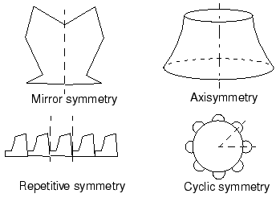

When modeling just a portion of a symmetric component, you have to add boundary conditions to make the model behave as if the whole component were being modeled. You may also have to adjust the applied loads to reflect the portion of the structure actually being modeled. Consider the portal frame in [Figure 10--41](ch10s07.md#gss-portal-frame).

**Figure 10–41** Symmetric portal frame.

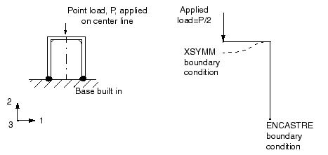

The frame is symmetric about the vertical line shown in the figure. To maintain symmetry in the model, any nodes on the symmetry line must be constrained from translating in the 1-direction and from rotating about the 2- or 3-axes (degrees of freedom 5 and 6). Therefore, the symmetry constraints are 

```
[*BOUNDARY](../key/key-link.md#usb-kws-hboundary)
*<node>*,1
*<node>*,5,6
```

In the frame problem the load is applied along the model's symmetry plane; therefore, only half of the total value should be applied to the portion you are modeling.

In axisymmetric analyses using axisymmetric elements, such as this rubber mount example, we need model only the cross-section of the component. The element formulation automatically includes the effects of axial symmetry.

### 10.7.2 Coordinate system

The model in this example uses the default *r–z* (1–2) axisymmetric coordinate system in this simulation. Its origin is placed at the level of the bottom of the plate, as shown in [Figure 10--39](ch10s07.md#gss-axi-mount).

### 10.7.3 Mesh design

The mesh in this example uses a 30  15 mesh of first-order, axisymmetric, hybrid solid elements (CAX4H) for the rubber mount. Only the bottom half of the mount is specified in the model, as shown in [Figure 10--42](ch10s07.md#gss-mesh). 

**Figure 10–42** Mesh for the rubber mount.


Hybrid elements are required in this example because the material is fully incompressible. The elements are not expected to be subjected to bending, so shear locking in these fully integrated elements should not be a concern. Model the steel plates with a single layer of incompatible mode elements (CAX4I) because it is possible that the plates may bend as the rubber underneath them deforms.

The node and element numbers from the input file given in ["Axisymmetric mount," Section A.10](ap01s10.md), are shown in [Figure 10--43](ch10s07.md#gss-nodenumber) and [Figure 10--44](ch10s07.md#gss-elemnumber). These will be used in the discussion of this example. If you build the model yourself, it will probably have different node and element numbers.

**Figure 10–43** Node numbers.

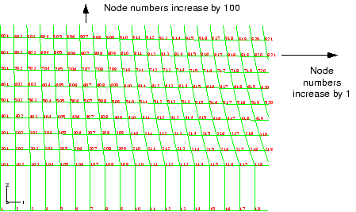

**Figure 10–44** Element numbers.

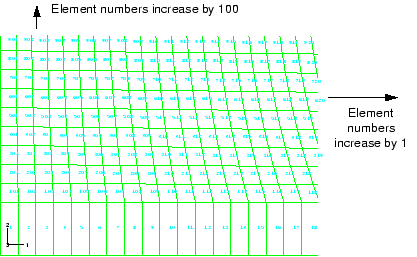

### 10.7.4 Preprocessing---creating the model

The steps that follow assume that you have access to the full input file for this example. This input file, `mount.inp`, is provided in ["Blast loading on a stiffened plate," Section A.9](ap01s09.md). Instructions on how to fetch and run the script are given in [Appendix A, "Example Files](ap01.md).”

If you use Abaqus/CAE or another preprocessor to create the mesh for this model, try to create a node set `MIDDLE` containing all the nodes on the symmetry plane, and apply a pressure load of 0.50 MPa to the bottom of the plate ([Figure 10--45](ch10s07.md#gss-middle)). Check that this pressure results in a total applied load of 5.5 kN (5.5 kN = 0.50 MPa  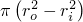). If you can't create the mesh, the Abaqus input options used to create the model can be found in ["Axisymmetric mount," Section A.10](ap01s10.md). 

**Figure 10–45** Node set `MIDDLE` and pressure loading.

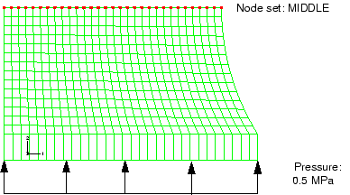

If you wish to create the entire model using Abaqus/CAE, refer to ["Example: axisymmetric mount," Section 10.7 of Getting Started with Abaqus: Interactive Edition](../gsa/gsa-link.md#gsa-mat-exaximount).

### 10.7.5 Reviewing the input file---the model data

We review the model data, including the geometry definition (nodes and elements) and the material properties.

**Model description**

The input file should contain a suitable description of the analysis.

```
*HEADING
Axisymmetric mount analysis under axial loading
S.I. Units (m, kg, N, sec)
```

**Nodal coordinates and element connectivity**

There will be at least two [*ELEMENT](../key/key-link.md#usb-kws-melement) option blocks in the input file since two different types of elements are used in the simulation. It is a good idea to check that the element types are correct and that the element sets containing the elements have descriptive names. The [*ELEMENT](../key/key-link.md#usb-kws-melement) options in your input file should look like

```
*ELEMENT, TYPE=CAX4I, ELSET=PLATE
*ELEMENT, TYPE=CAX4H, ELSET=RUBBER
```

**Node sets**

Check that the node set `MIDDLE` has been created. If it has not, add it using an editor.

**Property definition**

Two element property definitions are required: one for the elements modeling the rubber and one for those modeling the plates. The following element property definitions should be in your model:

```
*SOLID SECTION, MATERIAL=RUBBER, ELSET=RUBBER
*SOLID SECTION, MATERIAL=STEEL, ELSET=PLATE
```

**Material properties: hyperelastic model for the rubber**

You have been given some experimental test data, shown in [Figure 10--46](ch10s07.md#gss-mat-testdata), for the rubber material used in the mount. Three different sets of test data—a uniaxial test, a biaxial test, and a planar (shear) test—are available. You decide to have Abaqus calculate the appropriate hyperelastic material constants from the test data. You are not sure how large the strains will be in the rubber mount, but you suspect that they will be under 2.0. 

**Figure 10–46** Material test data for the rubber material.

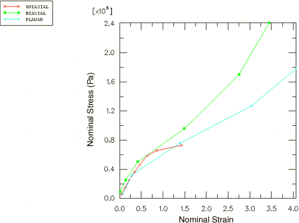

The test data for the biaxial and planar tests go well beyond this magnitude, so you decide to perform a one-element simulation of the experimental tests to confirm that the coefficients that Abaqus calculates from the test data are adequate.

Use a first-order, polynomial strain energy function to model the rubber material. Indicate these choices by using the N=1 and POLYNOMIAL parameters on the [*HYPERELASTIC](../key/key-link.md#usb-kws-mhyperelast) option. Use the TEST DATA INPUT parameter to indicate that Abaqus should find the material constants from the test data you will provide. The test data are given on options that immediately follow the [*HYPERELASTIC](../key/key-link.md#usb-kws-mhyperelast) option. The data should be entered as nominal stress and the corresponding nominal strain, with negative values indicating compression. You may be able to enter the data directly using your preprocessor (for instance, if you are using Abaqus/CAE); otherwise, you will have to add it to your input file with an editor. The material definition for the rubber will look like

```
*MATERIAL, NAME=RUBBER
*HYPERELASTIC, N=1, POLYNOMIAL, TEST DATA INPUT
*UNIAXIAL TEST DATA
 0.054E6,  0.0380
 0.152E6,  0.1338
 0.254E6,  0.2210
 0.362E6,  0.3450
 0.459E6,  0.4600
 0.583E6,  0.6242
 0.656E6,  0.8510
 0.730E6,  1.4268
*BIAXIAL TEST DATA
 0.089E6,  0.0200
 0.255E6,  0.1400
 0.503E6,  0.4200
 0.958E6,  1.4900
 1.703E6,  2.7500
 2.413E6,  3.4500
*PLANAR TEST DATA
 0.055E6,  0.0690
 0.324E6,  0.2828
 0.758E6,  1.3862
 1.269E6,  3.0345
 1.779E6,  4.0621
```

The input file for the single-element simulation of the three experimental tests is shown in ["Test fit of hyperelastic material data," Section A.11](ap01s11.md). The computational and experimental results for the various types of tests are compared in [Figure 10--47](ch10s07.md#gss-biaxial), [Figure 10--48](ch10s07.md#gss-uniaxial), and [Figure 10--49](ch10s07.md#gss-planar). 

**Figure 10–47** Comparison of experimental data (BIAXIAL) and Abaqus results (BIAX_COMP): biaxial tension.

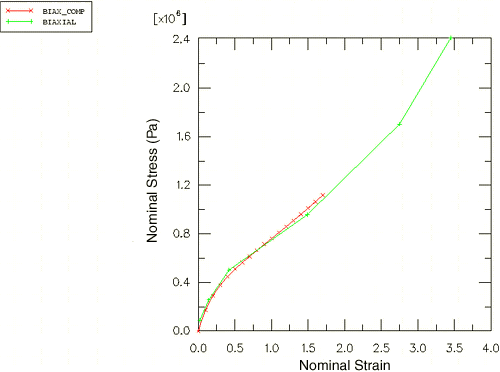

**Figure 10–48** Comparison of experimental data (UNIAXIAL) and Abaqus results (UNI_COMP): uniaxial tension.

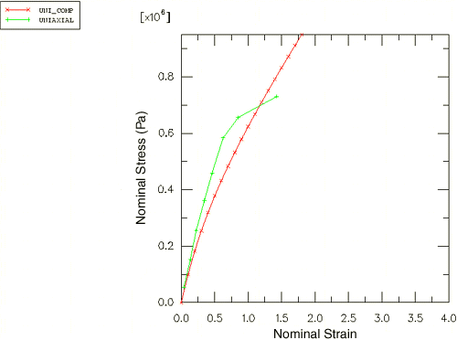

**Figure 10–49** Comparison of experimental data (PLANAR) and Abaqus results (PLANAR_COMP): planar shear.

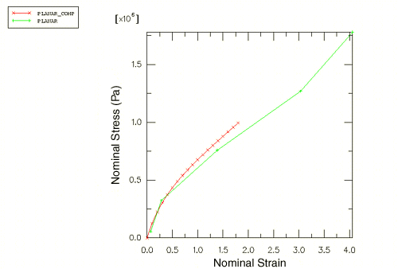

The Abaqus and experimental results for the biaxial tension test match very well. The computational and experimental results for the uniaxial tension and planar tests match well at strains less than 100%. The hyperelastic material model created from these material test data is probably not suitable for use in general simulations where the strains may be larger than 100%. However, the model will be adequate for this simulation if the principal strains remain within the strain magnitudes where the data and the hyperelastic model fit well. If you find that the results are beyond these magnitudes or if you are asked to perform a different simulation, you will have to insist on getting better material data. Otherwise, you will not be able to have much confidence in your results.

**Material properties: elastic properties for the steel**

The steel is modeled with linear elastic properties only ( = 200 GPa,  = 0.3) because the loads should not be large enough to cause inelastic deformations. Thus, the material option blocks for the steel are

```
*MATERIAL, NAME=STEEL
*ELASTIC
2.0E11, 0.3
```

### 10.7.6 Reviewing the input---the history data

We now discuss the history data associated with this problem, including the time incrementation parameters, boundary conditions, loading, and output requests.

**Including nonlinear geometry and specifying the initial increment size**

When hyperelastic materials are used in a model, Abaqus assumes that it may undergo large deformations. But large deformations and other nonlinear geometric effects are included only if the NLGEOM parameter is set to YES on the [*STEP](../key/key-link.md#usb-kws-hstep) option. Therefore, you must include it in this simulation or Abaqus will terminate the analysis with an input error. The [*STEP](../key/key-link.md#usb-kws-hstep) option should look like

```
*STEP, NLGEOM=YES
```

The simulation will be a static analysis with a total step time of 1.0. Specify the initial time increment to be 1/100th of the total step time. The procedure option block should look like

```
*STATIC
.01, 1.0
```

**Boundary conditions**

Specify symmetry boundary conditions on the nodes lying on the symmetry plane. In this model the symmetry conditions prevent the nodes from moving in degree of freedom 2 (axially), as shown in [Figure 10--50](ch10s07.md#gss-boundarycond). 

**Figure 10–50** Boundary conditions on the rubber mount.

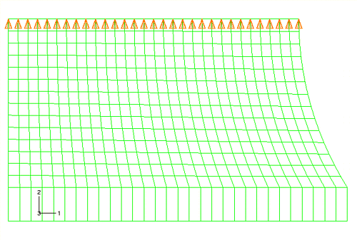

Symmetry conditions that constrain motion in the global 2-direction can be applied using the YSYMM type boundary condition, or you can simply constrain the 2-direction. In this case the [*BOUNDARY](../key/key-link.md#usb-kws-hboundary) option block has the following format:
```
*BOUNDARY
MIDDLE, 2, 2, 0.0
```

No boundary constraints are needed in the radial direction (global 1-direction) because the axisymmetric nature of the model does not allow the structure to move as a rigid body in the radial direction. Abaqus will allow nodes to move in the radial direction, even those initially on the axis of symmetry (i.e., those with a radial coordinate of 0.0), if no boundary conditions are applied to their radial displacements (degree of freedom 1). Since you want to let the mount deform radially in this analysis, do not apply any boundary conditions; again, Abaqus will prevent rigid body motions automatically.

**Loading**

The mount must carry a maximum axial load of 5.5 kN, spread uniformly over the steel plates. A distributed load is, therefore, applied to the bottom of the steel plate. The magnitude of the pressure is given by

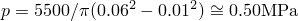

If you generated the pressure loading using a preprocessor, a [*DLOAD](../key/key-link.md#usb-kws-hdload) option block with many data lines may be present in the input file.

```
*DLOAD
 1, P1, 0.50E6
 2, P1, 0.50E6
...
29, P1, 0.50E6
30, P1, 0.50E6
```

For the element and node numbering discussed here, the pressure is applied to face 1 of all the elements in element set `PLATE`. This allows us to use a much more compact format for the data lines of the [*DLOAD](../key/key-link.md#usb-kws-hdload) option block.

```
*DLOAD
PLATE, P1, 0.50E6
```

**Output requests**

Write the preselected variables and nominal strains as field output to the output database file. In addition, write the displacement of one of the nodes on the bottom of the steel plate to the output database file so that the stiffness of the mount can be calculated. You will need to create a node set containing the node. The output option blocks in your model should be similar to the following:

```
*NSET, NSET=OUT
1,
*OUTPUT, FIELD, VARIABLE=PRESELECT
*ELEMENT OUTPUT
NE,
*OUTPUT, HISTORY
*NODE OUTPUT, NSET=OUT
U,
```
 Ensure that the end of the step definition is clearly marked with an [*END STEP](../key/key-link.md#usb-kws-hendstep) option.

### 10.7.7 Running the analysis

Store your input options in a file called `mount.inp`. The input options for the model discussed in the above sections can be found in ["Axisymmetric mount," Section A.10](ap01s10.md). Since the nonlinear nature of the simulation means that it may take some time to complete, use the following command to run the analysis in the background:

```
abaqus job=mount
```

When the job has completed, check the data file, `mount.dat`, for errors. If there are any, correct the input file and rerun the analysis. If necessary, compare your input with that shown in ["Axisymmetric mount," Section A.10](ap01s10.md).

### 10.7.8 Results

We briefly review the results associated with the polynomial fit of the test data.

**The hyperelastic material parameters**

In this simulation you specified that the material is incompressible (=0). The incompressibility is assumed since no volumetric test data were provided. To simulate compressible behavior, you must provide volumetric test data in addition to the other test data. You also specified that Abaqus should use a first-order, polynomial strain energy function. This form of the hyperelasticity model is known as the Mooney-Rivlin material model.

The hyperelastic material coefficients—, , and —that Abaqus calculates from the material test data are given in the data file, `mount.dat`, provided that you used the [*PREPRINT](../key/key-link.md#usb-kws-mpreprint), MODEL=YES option in the model data section of the input file. The material test data are also written in the file so that you can ensure that Abaqus used the correct data, as shown below.

```
                         M A T E R I A L   D E S C R I P T I O N

  MATERIAL NAME: RUBBER                                                                          

     HYPERELASTIC MATERIAL PROPERTIES

          UNIAXIAL TEST DATA

          NOMINAL STRAIN     NOMINAL STRESS(TEST)     NOMINAL STRESS(ABAQUS)           
             3.8000E-02             5.4000E+04             3.9605E+04
             0.1338                 1.5200E+05             1.2803E+05
             0.2210                 2.5400E+05             1.9764E+05
             0.3450                 3.6200E+05             2.8404E+05
             0.4600                 4.5900E+05             3.5477E+05
             0.6242                 5.8300E+05             4.4505E+05
             0.8510                 6.5600E+05             5.5627E+05
              1.427                 7.3000E+05             8.0275E+05

     HYPERELASTIC MATERIAL PROPERTIES

          BIAXIAL TEST DATA

          NOMINAL STRAIN     NOMINAL STRESS(TEST)     NOMINAL STRESS(ABAQUS)           
             2.0000E-02             8.9000E+04             4.1264E+04
             0.1400                 2.5500E+05             2.2551E+05
             0.4200                 5.0300E+05             4.6078E+05
              1.490                 9.5800E+05             1.0063E+06
              2.750                 1.7030E+06             1.7767E+06
              3.450                 2.4130E+06             2.3301E+06

     HYPERELASTIC MATERIAL PROPERTIES

          PLANAR TEST DATA

          NOMINAL STRAIN     NOMINAL STRESS(TEST)     NOMINAL STRESS(ABAQUS)           
             6.9000E-02             5.5000E+04             9.0339E+04
             0.2828                 3.2400E+05             2.9189E+05
              1.386                 7.5800E+05             8.3431E+05
              3.034                 1.2690E+06             1.4500E+06
              4.062                 1.7790E+06             1.8235E+06

     HYPERELASTICITY - MOONEY-RIVLIN STRAIN ENERGY

                       D1                C10               C01

                   0.00000000        176050.524        4332.63031    
```

If there were any problems with the stability of the hyperelastic material model, warning messages would be given before the material parameters. The material model is stable at all strains with these material test data and this strain energy function. However, if you specified that a second-order (N=2), polynomial strain energy function be used, you would see the following warnings in the data file:

```
  *HYPERELASTIC, N=2, POLYNOMIAL, TEST DATA INPUT
***WARNING: UNSTABLE HYPERELASTIC MATERIAL
        FOR UNIAXIAL TENSION WITH A NOMINAL STRAIN LARGER THAN        6.9700
        FOR UNIAXIAL COMPRESSION WITH A NOMINAL STRAIN LESS THAN     -0.9795
        FOR BIAXIAL TENSION WITH A NOMINAL STRAIN LARGER THAN         5.9800
        FOR BIAXIAL COMPRESSION WITH A NOMINAL STRAIN LESS THAN      -0.6458
        FOR PLANE TENSION WITH A NOMINAL STRAIN LARGER THAN           7.0400
        FOR PLANE COMPRESSION WITH A NOMINAL STRAIN LESS THAN        -0.8756

        POLYNOMIAL STRAIN ENERGY FUNCTION WITH N =  2
             D1         C10         C01         
             D2         C20         C11         C02         
         0.0000E+00  0.1934E+06  -148.2    
         0.0000E+00  -805.7       180.0      -3.967
```

If you only had the uniaxial test data available for this problem, you would find that the Mooney-Rivlin material model Abaqus creates would have unstable material behavior above certain strain magnitudes.

### 10.7.9 Postprocessing

Use Abaqus/Viewer to look at the analysis results by issuing the following command at the operating system prompt:

```
abaqus viewer odb=mount
```

**Calculating the stiffness of the mount**

Determine the stiffness of the mount by creating an *X–Y* plot of the displacement of the steel plate as a function of the applied load. You will first create a plot of the vertical displacement of the node on the steel plate for which you wrote data to the output database file. Data were written for the node in set `OUT` in this model.

**To create a history curve of vertical displacement and swap the *X*- and *Y*-axes:**

1. In the Results Tree, expand the **History Output** container underneath the output database named `mount.odb`.
2. Locate and select the vertical displacement U2 at the node in set `OUT`.
3. Click mouse button 3, and select **Save As** from the menu that appears to save the *X--Y* data. The **Save XY Data As** dialog box appears.
4. In the **Save XY Data As** dialog box, name the curve `SWAPPED` and select **swap(XY)** as the save operation; click **OK**. The plot of time-displacement appears in the viewport.

You now have a curve of time-displacement. What you need is a curve showing force-displacement. This is easy to create because in this simulation the force applied to the mount is directly proportional to the total time in the analysis. All you have to do to plot a force-displacement curve is multiply the curve `SWAPPED` by the magnitude of the load (5.5 kN).

**To multiply a curve by a constant value:**

1. In the Results Tree, double-click **XYData**. The **Create XY Data** dialog box appears.
2. Select **Operate on XY data**, and click **Continue**. The **Operate on XY Data** dialog box appears.
3. In the **XY Data** field, double-click `SWAPPED`. The expression `"SWAPPED"` appears in the text field at the top of the dialog box. Your cursor should be at the end of the text field.
4. Multiply the data object in the text field by the magnitude of the applied load by entering `*5500`.
5. Save the multiplied data object by clicking **Save As** at the bottom of the dialog box. The **Save XY Data As** dialog box appears.
6. In the **Name** text field, type `FORCEDEF`; and click **OK** to close the dialog box.
7. To view the force-displacement plot, click **Plot Expression** at the bottom of the **Operate on XY Data** dialog box.

You have now created a curve with the force-deflection characteristic of the mount (the axis labels do not reflect this since you did not change the actual variable plotted). To get the stiffness, you need to differentiate the curve `FORCEDEF`. You can do this by using the `differentiate( )` operator in the **Operate on XY Data** dialog box.

**To obtain the stiffness:**

1. In the **Operate on XY Data** dialog box, clear the current expression.
2. From the **Operators** listed, click **differentiate(X)**. `differentiate( )` appears in the text field at the top of the dialog box.
3. In the **XY Data** field, double-click `FORCEDEF`. The expression `differentiate( "FORCEDEF" )` appears in the text field.
4. Save the differentiated data object by clicking **Save As** at the bottom of the dialog box. The **Save XY Data As** dialog box appears.
5. In the **Name** text field, type `STIFF`; and click **OK** to close the dialog box.
6. To plot the stiffness-displacement curve, click **Plot Expression** at the bottom of the **Operate on XY Data** dialog box.
7. Click **Cancel** to close the dialog box.
8. Open the **Axis Options** dialog box, and switch to the **Title** tabbed page.
9. Customize the axis titles so they appear as shown in [Figure 10--51](ch10s07.md#gss-stiff). **Figure 10--51** Stiffness characteristic of the mount. 
10. Click **Dismiss** to close the **Axis Options** dialog box.

The stiffness of the mount increases by almost 100% as the mount deforms. This is a result of the nonlinear nature of the rubber and the change in shape of the mount as it deforms. Alternatively, you could have created the stiffness-displacement curve directly by combining all the operators above into one expression.

**To define the stiffness curve directly:**

1. In the Results Tree, double-click **XYData**. The **Create XY Data** dialog box appears.
2. Select **Operate on XY data**, and click **Continue**. The **Operate on XY Data** dialog box appears.
3. From the **Operators** listed, click **differentiate(X)**. `differentiate( )` appears in the text field at the top of the dialog box.
4. In the **XY Data** field, double-click `SWAPPED`. The expression `differentiate( "SWAPPED" )` appears in the text field.
5. Place the cursor in the text field directly after the `"SWAPPED"` data object, and type `*5500` to multiply the swapped data by the constant total force value. `differentiate( "SWAPPED"*5500 )` appears in the text field.
6. Save the differentiated data object by clicking **Save As** at the bottom of the dialog box. The **Save XY Data As** dialog box appears.
7. In the **Name** text field, type `STIFFNESS`; and click **OK** to close the dialog box.
8. Click **Cancel** to close the **Operate on XY Data** dialog box.
9. Customize the *X*- and *Y*-axis labels as they appear in [Figure 10--51](ch10s07.md#gss-stiff) if you have not already done so.
10. In the Results Tree, click mouse button 3 on `STIFFNESS` underneath the **XYData** container and select **Plot** from the menu that appears to view the plot in [Figure 10--51](ch10s07.md#gss-stiff) that shows the variation of the mount's axial stiffness as the mount deforms.

**Model shape plots**

You will begin by plotting the undeformed model shape of the mount.

**To plot the undeformed model shape:**

From the main menu bar, select ****Plot****Undeformed Shape****; or use the  tool in the Visualization module toolbox to plot the undeformed model shape (see [Figure 10--52](ch10s07.md#gss-undeform-shape)).

**Figure 10–52** Undeformed model shape of the rubber mount.

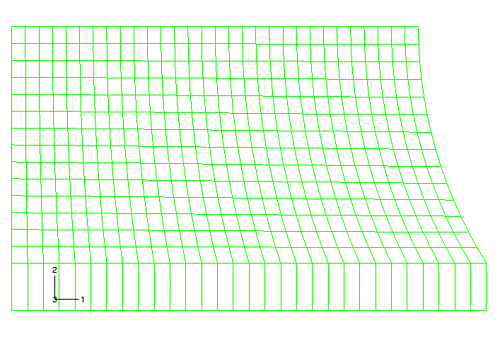

If the figure obscures the plot title, you can move the plot by clicking the  tool and holding down mouse button 1 to pan the deformed shape to the desired location. Alternatively, you can turn the plot title off (****Viewport****Viewport Annotation Options****).

In this figure the axisymmetric model is displayed as a planar, two-dimensional shape. You can producing a three-dimensional visual effect by sweeping the model through a specified angle. In addition, you can also mirror results about selected planes (such as symmetry planes) to render results on a full three-dimensional representation of the model. These are visualization aids only. Any numerical representation of the results, such as the contour legend, indicates only the portion of the model that was analyzed. Since in this problem the symmetry plane does not necessarily coincide with one of the global coordinate system planes, a local system will be defined to facilitate the mirroring operation.

**To define a local coordinate system for postprocessing:**

1. From the main menu bar, select ****Tools****Coordinate System****Create****.
2. In the **Create Coordinate System** dialog box, enter `rectangular` as the name and click **Continue**.
3. Select the node at the top-left corner of the model as the origin, the node at the top-right corner as the point on the *X*-axis, and the node at the bottom-left corner as the point in the *X--Y* plane.

**To mirror and sweep the cross-section:**

1. From the main menu bar, select ****View****ODB Display Options****.
2. In the **ODB Display Options** dialog box, click the **Mirror/Pattern** tab.
3. Select **rectangular** from the **Mirror CSYS** list.
4. Select **XZ** as the mirror plane.
5. Click **Apply**. The mirrored image appears.
6. Click the **Sweep/Extrude** tab.
7. Toggle on **Sweep elements** and set the sweep range from `0` to `270` degrees. Set the number of segments to `45`.
8. Click **OK**. The swept image appears. To more clearly distinguish between the rubber and the steel, color code the model based on section assignment.

You will now plot the deformed model shape of the mount. This will allow you to evaluate the quality of the deformed mesh and to assess the need for mesh refinement.

**To plot the deformed model shape:**

From the main menu bar, select  ****Plot****Deformed Shape****, or use the  tool to plot the deformed model shape of the mount (see [Figure 10--53](ch10s07.md#gss-deformed-v)).

**Figure 10–53** Deformed model shape of the rubber under an applied load of 5500 N (mirrored/swept image).


The plate has been pushed up, causing the rubber to bulge at the sides. Zoom in on the bottom left corner of the mesh using the  tool from the **View Manipulation** toolbar. Click mouse button 1, and hold it down to define the first corner of the new view; move the mouse to create a box enclosing the viewing area that you want ([Figure 10--54](ch10s07.md#gss-distortion)); and release the mouse button. Alternatively, you can zoom and pan the plot by selecting ****View****Specify**** from the main menu bar.

You should have a plot similar to the one shown in [Figure 10--54](ch10s07.md#gss-distortion) (in this and the images that follow, the sweep and mirroring operations applied earlier have been suppressed).

**Figure 10–54** Distortion at the left-hand corner of the rubber mount model.


Some elements in this corner of the model are becoming badly distorted because the mesh design in this area was inadequate for the type of deformation that occurs there. Although the shape of the elements is fine at the start of the analysis, they become badly distorted as the rubber bulges outward, especially the element in the corner. If the loading were increased further, the element distortion may become so excessive that the analysis may abort. ["Mesh design for large distortions," Section 10.8](ch10s08.md), discusses how to improve the mesh design for this problem.

The keystoning pattern exhibited by the distorted elements in the bottom right-hand corner of the model indicates that they are locking. A contour plot of the hydrostatic pressure stress in these elements (without averaging across elements sharing common nodes) shows rapid variation in the pressure stress between adjacent elements. This indicates that these elements are suffering from volumetric locking, which was discussed earlier in ["Selecting elements for elastic-plastic problems," Section 10.3](ch10s03.md), in the context of plastic incompressibility. Volumetric locking arises in this problem from overconstraint. The steel is very stiff compared to the rubber. Thus, along the bond line the rubber elements cannot deform laterally. Since these elements must also satisfy incompressibility requirements, they are highly constrained and locking occurs. Analysis techniques that address volumetric locking are discussed in ["Techniques for reducing volumetric locking," Section 10.9](ch10s09.md).

**Contouring the maximum principal stress**

Plot the maximum in-plane principal stress in the model. Follow the procedure given below to create a filled contour plot on the actual deformed shape of the mount with the plot title suppressed.

**To contour the maximum principal stress:**

1. By default, Abaqus/Viewer displays **S**, **Mises** as the primary field output variable. In the **Field Output** toolbar, select **Max. Principal** as the invariant. Abaqus/Viewer automatically changes the current plot state to display a contour plot of the maximum in-plane principal stresses on the deformed model shape.
2. Open the **Contour Plot Options** dialog box.
3. Drag the uniform contour intervals slider to `8`.
4. Click **OK** to view the contour plot and to close the dialog box. Create a display group showing only the elements in the rubber mount.
5. In the Results Tree, expand the **Materials** container underneath the output database file named `Mount.odb`.
6. Click mouse button 3 on **RUBBER**, and select **Replace** from the menu that appears to replace the current display with the selected elements.
7. The viewport display changes and displays only the rubber mount elements, as shown in [Figure 10--55](ch10s07.md#gss-contours). **Figure 10--55** Contours of maximum principal stress in the rubber mount. 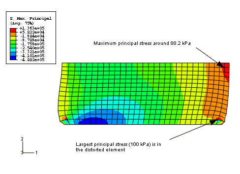

The maximum principal stress in the model, reported in the contour legend, is 136 kPa. Although the mesh in this model is fairly refined and, thus, the extrapolation error should be minimal, you may want to use the query tool  to determine the more accurate integration point values of the maximum principal stress.

When you look at the integration point values, you will discover that the peak value of maximum principal stress occurs in one of the distorted elements in the bottom right-hand part of the model. This value is likely to be unreliable because of the levels of element distortion and volumetric locking. If this value is ignored, there is an area near the plane of symmetry where the maximum principal stress is around 88.2 kPa.

The easiest way to check the range of the principal strains in the model is to display the maximum and minimum values in the contour legend.

**To check the principal nominal strain magnitude:**

1. From the main menu bar, select ****Viewport****Viewport Annotation Options****. The **Viewport Annotation Options** dialog box appears.
2. Click the **Legend** tab, and toggle on **Show min/max values**.
3. Click **OK**. The maximum and minimum values appear at the bottom of the contour legend in the viewport.
4. In the **Field Output** toolbar, select **Primary** as the variable type if it is not already selected. Abaqus/Viewer automatically changes the current plot state to display a contour plot of the maximum in-plane principal stresses on the deformed model shape.
5. From the list of output variables, select **NE**.
6. From the list of invariants in the **Field Output** toolbar, select **Max. Principal** if it is not already selected. The contour plot changes to display values for maximum principal nominal strain. Note the value of the maximum principal nominal strain from the contour legend.
7. From the list of invariants, select **Min. Principal**. The contour plot changes to display values for minimum principal nominal strain. Note the value of the minimum principal nominal strain from the contour legend.

The maximum and minimum principal nominal strain values indicate that the maximum tensile nominal strain in the model is about 100% and the maximum compressive nominal strain is about 56%. Because the nominal strains in the model remained within the range where the Abaqus hyperelasticity model has a good fit to the material data, you can be fairly confident that the response predicted by the mount is reasonable from a material modeling viewpoint.


