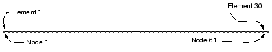
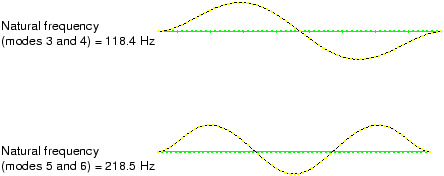

# 11.3 Example: vibration of a piping system


In this example you will study the vibrational frequencies of a 5 m long section of a piping system. The pipe is made of steel and has an outer diameter of 18 cm and a 2 cm wall thickness (see [Figure 11--8](ch11s03.md#gss-pipingsystem)). 

**Figure 11–8** Portion of piping system being analyzed.


It is clamped firmly at one end and can move only axially at the other end. This 5 m portion of the piping system may be subjected to harmonic loading at frequencies up to 50 Hz. The lowest vibrational mode of the unloaded structure is 40.1 Hz, but this value does not consider how the loading applied to the piping structure may affect its response. To ensure that the section does not resonate, you have been asked to determine the magnitude of the in-service load that is required so that its lowest vibrational mode is higher than 50 Hz. You are told that the section of pipe will be subjected to axial tension when in service. Start by considering a load magnitude of 4 MN.

The lowest vibrational mode of the pipe will be a sine wave deformation in any direction transverse to the pipe axis because of the symmetry of the structure's cross-section. You will use three-dimensional beam elements to model the pipe section.

The analysis requires a natural frequency extraction. Thus, you will use Abaqus/Standard as your analysis product.

### 11.3.1 Coordinate system

The default, global coordinate system is used. Place the origin at the left end of the pipe section, and make the axis of the pipe and the global 1-axis coincident, as shown in [Figure 11--8](ch11s03.md#gss-pipingsystem).

### 11.3.2 Mesh design

Model the pipe section with a uniformly spaced mesh of 30 second-order, pipe elements (PIPE32). The node and element numbers of the model used in this discussion are shown in [Figure 11--9](ch11s03.md#gss-node-elem1).

**Figure 11–9** Node and element numbers (both increase by 1 from left to right).



### 11.3.3 Preprocessing---creating the model

You can create the mesh for this example using your preprocessor, or if you prefer, you can use the Abaqus mesh generation options shown in ["Vibration of a piping system," Section A.12](ap01s12.md). If you wish to create the entire model using Abaqus/CAE please refer to ["Example: vibration of a piping system," Section 11.3 of Getting Started with Abaqus: Interactive Edition](../gsa/gsa-link.md#gsa-stp-exapipingsys).

### 11.3.4 Reviewing the input file---the model data

The steps that follow assumes that you have access to the full input file for this example. This input file, `pipe-2.inp`, is provided in ["Vibration of a piping system," Section A.12](ap01s12.md). Instructions on how to fetch and run the script are given in [Appendix A, "Example Files](ap01.md).”

The model definition—including the model description, node and element definitions, section properties, and material properties—is discussed next.

**Model description**

The [*HEADING](../key/key-link.md#usb-kws-mheading) option should include a suitable title in the data lines. In the sample input file, this option looks like the following:

```
*HEADING
Analysis of a 5 meter long pipe under tensile load
Pipe has OD of 180 mm and ID of 140 mm
S.I. Units
```

**Nodal coordinates and element connectivity**

Check that the correct element type (PIPE32) has been used and that the element set names are suitably descriptive.

```
*ELEMENT, TYPE=PIPE32, ELSET=PIPE
```

Create node sets containing the nodes at either end of the pipe section. The following option blocks create the node sets for the model shown in [Figure 11--9](ch11s03.md#gss-node-elem1):

```
*NSET, NSET=LEFT
1
*NSET, NSET=RIGHT
61
```

**Beam properties**

The [*BEAM SECTION](../key/key-link.md#usb-kws-mbeamsection), SECTION=PIPE option will be used with the PIPE32 elements. The outer radius (90 mm) and the wall thickness (20 mm) are needed to define this beam section type geometrically. It is easier to define the orientation of the beam section geometry for this model than it was for the cargo crane model in the earlier chapters because the pipe section is symmetric. Define the approximate -direction as the vector (0., 0., –1.0). In this model the actual -vector will coincide with this approximate vector.

```
*BEAM SECTION, ELSET=PIPE, MATERIAL=STEEL, SECTION=PIPE
0.09, 0.02
0.0, 0.0, -1.0
```

**Material data**

The option blocks defining the material behavior of the steel pipe in your model are included in the following lines:

```
*MATERIAL, NAME=STEEL
*ELASTIC
200.E9, 0.3
```

You must define the density of the steel material (7800 kg/m3) because eigenmodes and eigenfrequencies are being extracted in this simulation and a mass matrix is needed for this procedure. Therefore, the following option block must follow the [*ELASTIC](../key/key-link.md#usb-kws-melastic) option block:

```
*DENSITY
7800.,
```

### 11.3.5 Reviewing the input file---the history data

In this simulation you need to investigate the eigenmodes and eigenfrequencies of the steel pipe section when a 4 MN tensile load is applied. Therefore, the load history data will be split into two steps:

| Step 1. General step: | Apply a 4 MN tensile force. |
| --- | --- |
| Step 2. Linear perturbation step: | Calculate modes and frequencies. |

The actual magnitude of time in these steps will have no effect on the results; unless the model includes damping or rate-dependent material properties, “time” has no physical meaning in a static analysis procedure. Therefore, use a step time of 1.0 in the general analysis steps.

**Step 1 – Apply a 4 MN tensile force**

The options necessary to define the first analysis step—including the procedure definition, boundary conditions, loading, and output requests—are reviewed.

**Step and analysis procedure definition**

The first step is a general static step that includes the effect of geometric nonlinearity. Specify an initial increment size that is 1/10 the total step time, causing Abaqus to apply 10% of the load in the first increment. The following option blocks define the analysis procedure, and they include a meaningful description of the step to make reviewing the load history much easier:

```
*STEP, NLGEOM=YES
Apply axial tensile load of 4.0 MN
*STATIC
0.1, 1.0
```

**Boundary conditions**

The pipe section is clamped at its left end (node 1 in the model shown in [Figure 11--9](ch11s03.md#gss-node-elem1)). It is also clamped at the other end; however, the axial force must be applied at this end, so only degrees of freedom 2 to 6 are constrained.

```
*BOUNDARY
LEFT, 1, 6
RIGHT, 2, 6
```

**Tensile loading**

Apply a 4 MN tensile force to the right end of the pipe section such that it deforms in the positive axial (global 1) direction. Forces are applied, by default, in the global coordinate system. Therefore, the [*CLOAD](../key/key-link.md#usb-kws-hcload) option block looks like

```
*CLOAD
RIGHT, 1, 4.0E6
```
In this case the load is applied directly to the node set defined earlier. Use the node set name from your model or the node number in the [*CLOAD](../key/key-link.md#usb-kws-hcload) option in your input file.

**Output requests**

Write data to the restart file every 10 increments. In addition, write the preselected field data every 10 increments as well as the stress components and stress invariants for element 25 as history data to the output database file. The following option blocks define these output requests:

```
*ELSET, ELSET=ELEMENT25
25
*RESTART, WRITE, FREQUENCY=10
*OUTPUT, FIELD, FREQUENCY=10, VARIABLE=PRESELECT
*OUTPUT, HISTORY
*ELEMENT OUTPUT, ELSET=ELEMENT25
S, SINV

```
End the step with the [*END STEP](../key/key-link.md#usb-kws-hendstep) option.

**Step 2 – Extract modes and frequencies**

The second step extracts the natural frequencies of the extended pipe. The required options are discussed below.

**Step and analysis procedure definition**

In the second step you need to calculate the eigenmodes and eigenfrequencies of the pipe in its loaded state. The eigenfrequency extraction procedure ([*FREQUENCY](../key/key-link.md#usb-kws-hfrequency) option) used in this step is a linear perturbation procedure. Although only the first (lowest) eigenmode is of interest, extract the first eight eigenmodes for the model. Specify this number on the data line of the [*FREQUENCY](../key/key-link.md#usb-kws-hfrequency) option block. The option blocks to define the analysis procedure should look similar to the following:

```
*STEP, PERTURBATION
Extract modes and frequencies
*FREQUENCY
8,
```

**Loads**

You require the natural frequencies of the extended pipe section. This does not involve the application of any perturbation loads, and the fixed boundary conditions are carried over from the previous general step. Therefore, you do not need to specify any loads or boundary conditions in this step.

**Output requests**

Any output requests required in a linear perturbation step must be redefined since the requests from the previous general step do not carry over. You want data to be written to the restart and output database files. The following option blocks define these requests:

```
*RESTART, WRITE
*OUTPUT, FIELD, VARIABLE=PRESELECT
```
Again, mark the termination of the step definition with the [*END STEP](../key/key-link.md#usb-kws-hendstep) option.

### 11.3.6 Running the analysis

Store the input option blocks in a file called `pipe.inp`. Run the analysis in the background using the command

```
abaqus job=pipe
```

### 11.3.7 Status file

Check the status file as the job is running. When the analysis completes, the contents of the status file will look similar to

```
 SUMMARY OF JOB INFORMATION:
 STEP  INC ATT SEVERE EQUIL TOTAL  TOTAL      STEP       INC OF       DOF    IF
               DISCON ITERS ITERS  TIME/    TIME/LPF    TIME/LPF    MONITOR RIKS
               ITERS               FREQ
   1     1   1     0     1     1  0.100      0.100      0.1000    
   1     2   1     0     1     1  0.200      0.200      0.1000    
   1     3   1     0     1     1  0.350      0.350      0.1500    
   1     4   1     0     1     1  0.575      0.575      0.2250    
   1     5   1     0     1     1  0.913      0.913      0.3375    
   1     6   1     0     1     1  1.00       1.00       0.08750   
   2     1   1     0     4     0  1.00       1.00e-36   1.000e-36 
```

Both steps are shown, and the time associated with the linear perturbation step (Step 2) is very small: the [*FREQUENCY](../key/key-link.md#usb-kws-hfrequency) procedure, or any linear perturbation procedure, does not contribute to the general loading history of the model.

### 11.3.8 Postprocessing

Run Abaqus/Viewer using the command

```
abaqus viewer odb=pipe
```

**Deformed shapes from the linear perturbation steps**

When Abaqus/Viewer starts, it automatically uses the last available frame on the output database file. The results from the second step of this simulation are the natural mode shapes of the pipe and the corresponding natural frequencies. Plot the first mode shape.

**To plot the first mode shape:**

1. From the main menu bar, select ****Result****Step/Frame****. The **Step/Frame** dialog box appears.
2. Select step `Step-2` and frame `Mode 1`.
3. Click **OK**.
4. From the main menu bar, select ****Plot****Deformed Shape****.
5. Click the  tool in the toolbox to allow multiple plot states in the viewport; then click the  tool or select ****Plot****Undeformed Shape**** to add the undeformed shape plot to the existing deformed plot in the viewport.
6. Include node symbols on both plots (the superimpose options control the appearance of the undeformed shape when multiple plot states are displayed). Change the color of the node symbols to green and the symbol shape to a solid circle.
7. Click the auto-fit tool  so that the entire plot is rescaled to fit in the viewport.

The default view is isometric. Try rotating the model to find a better view of the first eigenmode, similar to that shown in [Figure 11--10](ch11s03.md#gss-pipesection).

**Figure 11–10** First and second eigenmode shapes of the pipe section under the tensile load (the modes lie in planes orthogonal to each other).


Since this is a linear perturbation step, the undeformed shape is the shape of the structure in the base state. This makes it easy to see the motion relative to the base state. Use the ** Frame Selector** to plot the other mode shapes. You will discover that this model has many repeated eigenmodes. This is a result of the symmetric nature of the pipe's cross-section, which yields two eigenmodes for each natural frequency, corresponding to the 1–2 and 1–3 planes. The second eigenmode shape is shown in [Figure 11--10](ch11s03.md#gss-pipesection). Some of the higher vibrational mode shapes are shown in [Figure 11--11](ch11s03.md#gss-eigenmodes).

**Figure 11–11** Shapes of eigenmodes 3 through 6; corresponding mode shapes lie in planes orthogonal to each other.



The natural frequency associated with each eigenmode is reported in the plot title. The lowest natural frequency of the pipe section when the 4 MN tensile load is applied is 47.1 Hz. The tensile loading has increased the stiffness of the pipe and, thus, increased the vibrational frequencies of the pipe section. This lowest natural frequency is within the frequency range of the harmonic loads; therefore, resonance of the pipe may be a problem when it is used with this loading.

You, therefore, need to continue the simulation and apply additional tensile load to the pipe section until you find the magnitude that raises the natural frequency of the pipe section to an acceptable level. Rather than repeating the analysis and increasing the applied axial load, you can use the restart capability in Abaqus to continue the load history of a prior simulation in a new analysis.


