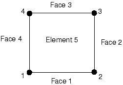
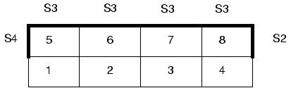
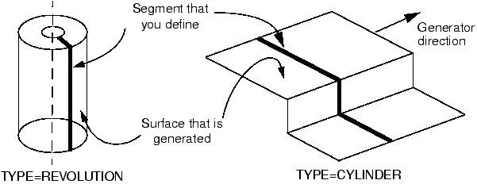
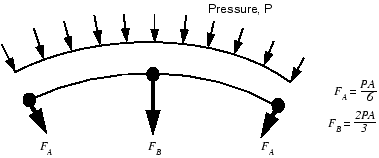

# 12.3 Defining contact in Abaqus/Standard


The first step in defining contact pairs in Abaqus/Standard is to create the surfaces using the [*SURFACE](../key/key-link.md#usb-kws-msurface) option. The next step is to specify the surfaces that interact with one another using the [*CONTACT PAIR](../key/key-link.md#usb-kws-hcontactpair) option. Each contact interaction refers to a surface interaction definition, which is created with the [*SURFACE INTERACTION](../key/key-link.md#usb-kws-hsurfaceinteraction) option. A contact pressure-clearance relationship and friction properties can be assigned to a surface interaction definition.

The definition of surfaces is optional for general contact because an all-inclusive element-based surface is automatically created when the [*CONTACT](../key/key-link.md#usb-kws-hcontact) option is used. Specific surface pairings may be used, however, to include regions not included in the default surface ([*CONTACT INCLUSIONS](../key/key-link.md#usb-kws-hcontactinclusions)), to preclude interaction between different regions of a model ([*CONTACT EXCLUSIONS](../key/key-link.md#usb-kws-hcontactexclusions)), or to override global contact property assignments. For example, if you want to apply a certain friction coefficient to all but a few surfaces in your model, you can assign a global friction coefficient and and override this property for a given pair of user-defined surfaces using the [*CONTACT PROPERTY ASSIGNMENT](../key/key-link.md#usb-kws-hcontpropassign) option.

### 12.3.1 Defining surfaces

Surfaces are created with the [*SURFACE](../key/key-link.md#usb-kws-msurface) option by identifying all of the element faces that form the surface. This is done in much the same way as defining distributed pressure loads.

**Surfaces on continuum elements**

A two-dimensional, first-order continuum element, such as CPE4, has four faces consisting of the segments defined by nodes 1–2, 2–3, 3–4, and 4–1, respectively, as shown in [Figure 12--4](ch12s03.md#gss-four-node). The face identifiers consist of the letter “S” followed by the face number. For example, use the following option block to include face 2 of the element shown in [Figure 12--4](ch12s03.md#gss-four-node) in a surface called `FLANGE1`:

```
*SURFACE, NAME=FLANGE1
5, S2
```

**Figure 12–4** Face numbers on a two-dimensional, first-order (4-node) element.



As is the case for many options in Abaqus, both element numbers and element sets can be used; the use of element sets can make the definition of large surfaces much easier. It is valid to specify both element sets and individual elements in the same [*SURFACE](../key/key-link.md#usb-kws-msurface) option block, as shown in [Figure 12--5](ch12s03.md#gss-topsurf) and the example below. The surface `TOPSURF` consists of the element faces shown in [Figure 12--5](ch12s03.md#gss-topsurf) and is created as follows:

```
*ELSET, ELSET=TOP, GENERATE
5, 8
*SURFACE, NAME=TOPSURF
TOP, S3
5, S4
8, S2
```

**Figure 12–5** Face numbers and elements that form the surface `TOPSURF`.



Abaqus can determine the free faces of two- and three-dimensional continuum elements automatically and use them to create a surface. To use this capability, simply include all the elements whose free faces make up the surface on the data lines of the [*SURFACE](../key/key-link.md#usb-kws-msurface) option. Either element sets or individual element numbers can be used. If elements in the interior of the body are included, Abaqus will ignore them. For example, the surface shown in [Figure 12--5](ch12s03.md#gss-topsurf) could also be defined using

```
*SURFACE, NAME=TOPSURF
TOP,
```

**Surfaces on shell, membrane, and rigid elements**

For shell, membrane, and rigid elements you must specify which side of the element forms the contact surface. The side in the direction of the positive element normal is called SPOS, while the side in the direction of the negative element normal is called SNEG, as shown in [Figure 12--6](ch12s03.md#gss-surface). As discussed in [Chapter 5, "Using Shell Elements](ch05.md),” the connectivity of an element defines the positive element normal. The positive element normals can be viewed in Abaqus/Viewer.

**Figure 12–6** Surfaces on a two-dimensional shell or rigid element.


The following option block defines surface `SURF1` as the surface composed of all the SPOS faces of the elements in element set `SHELLS`:

```
*SURFACE, NAME=SURF1
SHELLS, SPOS
```

Restrictions on the types of surfaces that can be created in Abaqus are discussed in ["Surface definition," Section 2.3 of the Abaqus Analysis User's Guide](../usb/usb-link.md#usbdefsurfs); please read them before beginning a contact simulation.

**Rigid surfaces**

Rigid surfaces are the surfaces of rigid bodies. They can be defined as an analytical shape, or they can be based on the underlying surfaces of elements associated with the rigid body.

Analytical rigid surfaces are created by defining a series of connected lines, arcs, and parabolas. The parameter ANALYTICAL SURFACE on the [*RIGID BODY](../key/key-link.md#usb-kws-mrigidbody) option binds an analytical rigid surface (defined with the TYPE parameter on the [*SURFACE](../key/key-link.md#usb-kws-msurface) option) with a rigid body. The [*RIGID BODY](../key/key-link.md#usb-kws-mrigidbody) option must be defined in the model definition. The TYPE parameter on the [*SURFACE](../key/key-link.md#usb-kws-msurface) option defines the dimensionality of the surface, and it has three possible values:
- Use TYPE=SEGMENTS to define a two-dimensional analytical rigid surface.
- Use TYPE=CYLINDRICAL to define a three-dimensional analytical rigid surface that is extruded infinitely in the out-of-plane direction.
- Use TYPE=REVOLUTION to define a three-dimensional analytical rigid surface of revolution.

The following is an example input for the two-dimensional analytical rigid surface named `SRIGID` shown in [Figure 12--7](ch12s03.md#gss-analrigidsurf):

```
*SURFACE, TYPE=SEGMENTS, NAME=SRIGID
START, 5.0, 0.0
LINE, 10.0, 0.0
CIRCL, 15.0, 5.0, 10.0, 5.0
```
 where the rigid body is defined by 
```
*RIGID BODY, ANALYTICAL SURFACE=SRIGID, REF NODE=10000
```

**Figure 12–7** Analytical rigid surfaces.



Discretized rigid surfaces are based on the underlying elements that make up a rigid body; thus, they can be more geometrically complex than analytical rigid surfaces. Discretized rigid surfaces are defined using the [*SURFACE](../key/key-link.md#usb-kws-msurface) option in exactly the same manner as surfaces on deformable bodies.

### 12.3.2 Contact interactions

With the contact pair approach, you define possible contact between two surfaces in an Abaqus/Standard simulation by giving the surface names on the [*CONTACT PAIR](../key/key-link.md#usb-kws-hcontactpair) option. When you define a contact pair, you must decide whether the magnitude of the relative sliding will be small or finite. The default is the more general finite-sliding formulation. The small-sliding formulation  is appropriate if the relative motion of the two surfaces is less than a small proportion of the characteristic length of an element face. The small-sliding formulation is selected by including the SMALL SLIDING parameter on the [*CONTACT PAIR](../key/key-link.md#usb-kws-hcontactpair) option. Using the small-sliding formulation will result in a more efficient analysis.

Each contact pair must refer to a surface interaction definition, in much the same way that each element must refer to an element property definition. Use the INTERACTION parameter on the [*CONTACT PAIR](../key/key-link.md#usb-kws-hcontactpair) option to refer to a [*SURFACE INTERACTION](../key/key-link.md#usb-kws-hsurfaceinteraction) option where the different surface interaction models, such as [*FRICTION](../key/key-link.md#usb-kws-hfriction), can be defined.

The following example:

```
*CONTACT PAIR, INTERACTION=FRIC, SMALL SLIDING
FLANGE1, FLANGE2
*SURFACE INTERACTION, NAME=FRIC
*FRICTION
0.1,
```
specifies that surfaces `FLANGE1` and `FLANGE2` might interact with each other and that the amount of relative sliding that occurs will be considered to be small. The interaction between the surfaces includes friction, with a friction coefficient of 0.1.

With the general contact approach, you do not need to explicitly define and pair individual surfaces. By using the [*CONTACT](../key/key-link.md#usb-kws-hcontact) option and its related sub-options, Abaqus/Standard automatically defines an “all-inclusive” element-based surface and enforces contact between the members of that surface. The contact definition as a result is considerably simplified. The following example:

```
*CONTACT
*CONTACT INCLUSIONS, ALL EXTERIOR
*CONTACT PROPERTY ASSIGNMENT
 , , FRIC,
*SURFACE INTERACTION, NAME=FRIC
*FRICTION
0.1
```
specifies that all exterior faces in a given model might interact with each other. The interaction between all surfaces includes friction, with a friction coefficient of 0.1.

### 12.3.3 Slave and master surfaces

By default, contact pairs in Abaqus/Standard use a pure master-slave contact algorithm: nodes on one surface (the slave) cannot penetrate the segments that make up the other surface (the master), as shown in [Figure 12--8](ch12s03.md#gss-master-surf). The algorithm places no restrictions on the master surface; it can penetrate the slave surface between slave nodes, as shown in [Figure 12--8](ch12s03.md#gss-master-surf). The order of the two surfaces given on the [*CONTACT PAIR](../key/key-link.md#usb-kws-hcontactpair) option determines which surface is the master surface and which is the slave surface; the first surface is the slave surface, and the second is the master surface.

**Figure 12–8** The master surface can penetrate the slave surface.


Due to the strict master-slave formulation, you must be careful to select the slave and master surfaces correctly in order to achieve the best possible contact simulation. Some simple rules to follow are:
- the slave surface should be the more finely meshed surface; and
- if the mesh densities are similar, the slave surface should be the surface with the softer underlying material.

The general contact algorithm in Abaqus/Standard enforces contact in an average sense between interacting surfaces; Abaqus/Standard automatically assigns master and slave roles.

### 12.3.4 Contact discretization

Abaqus/Standard offers two contact discretization methods: a traditional node-to-surface method and a surface-to-surface method. The node-to-surface discretization method defines contact conditions between each slave node and the master surface. The surface-to-surface discretization method considers the shape of both the master and slave surfaces when defining the contact constraints. The contact pair algorithm can use either discretization method; general contact uses only the surface-to-surface approach.

### 12.3.5 Small and finite sliding

When using the small-sliding formulation, Abaqus/Standard establishes the relationship between the slave nodes and the master surface at the beginning of the simulation. Abaqus/Standard determines which segment on the master surface will interact with each node on the slave surface. It maintains these relationships throughout the analysis, never changing which master surface segments interact with which slave nodes. If geometric nonlinearity is included in the model by setting the NLGEOM parameter equal to YES on the [*STEP](../key/key-link.md#usb-kws-hstep) option, the small-sliding algorithm accounts for any rotation and deformation of the master surface and updates the load path through which the contact forces are transmitted. If geometric nonlinearity is not included in the model, any rotation or deformation of the master surface is ignored and the load path remains fixed.

The finite-sliding contact formulation requires that Abaqus/Standard continually track which part of the master surface is in contact with each slave node. This is a very complex calculation, especially if both the contacting bodies are deformable. The structures in such simulations can be either two- or three-dimensional. Abaqus/Standard can also model the finite-sliding self-contact of a deformable body. Such a situation occurs when a structure folds over onto itself.

The finite-sliding formulation for contact between a deformable body and a rigid surface is not as complex as the finite-sliding formulation for two deformable bodies. Finite-sliding simulations where the master surface is rigid can be performed for both two- and three-dimensional models.

The contact pair algorithm can consider either small or finite sliding effects; general contact only considers finite sliding effects.

### 12.3.6 Element selection

Selection of elements for contact depends heavily on the contact enforcement used. For example, for traditional contact formulations (i.e., the node-to-surface discretization) it is generally better to use first-order elements for those parts of a model that will form a slave surface. Second-order elements can sometimes cause problems in this case because of the way these elements calculate consistent nodal loads for a constant pressure. The consistent nodal loads for a constant pressure, *P*, on a second-order, two-dimensional element with area *A* are shown in [Figure 12--9](ch12s03.md#gss-nodloadconstpress).

**Figure 12–9** Equivalent nodal loads for a constant pressure on a two-dimensional, second-order element.



The node-to-surface contact formulation bases important decisions on the forces acting on the slave nodes. It is difficult for the algorithm to tell if the force distribution shown in [Figure 12--9](ch12s03.md#gss-nodloadconstpress) represents a constant contact pressure or an actual variation across the element. The equivalent nodal forces for a three-dimensional, second-order brick element are even more confusing because they do not even have the same sign for a constant pressure, making it very difficult for the algorithm to work correctly, especially for nonuniform contact. Therefore, to avoid such problems, Abaqus/Standard automatically adds a midface node to any face of a second-order, three-dimensional brick or wedge element that defines a slave surface when it is used with the node-to-surface formulation. The equivalent nodal forces for a second-order element face with a midface node have the same sign for a constant pressure, although they still differ considerably in magnitude.

The equivalent nodal forces for applied pressures on first-order elements always have a consistent sign and magnitude; therefore, there is no ambiguity about the contact state that a given distribution of nodal forces represents.

If you are using the node-to-surface formulation and your geometry is complicated and requires the use of an automatic mesh generator, the modified second-order tetrahedral elements (C3D10M) in Abaqus/Standard should be used. These elements are designed to be used in complex contact simulations; regular second-order tetrahedral elements (C3D10) have zero contact force at their corner nodes, leading to poor predictions of the contact pressures. The modified second-order tetrahedral elements can calculate the contact pressures accurately. 

Regular second-order elements can generally be used without difficulty with the surface-to-surface formulation.

### 12.3.7 Contact algorithm

Understanding the algorithm Abaqus/Standard uses to solve contact problems will help you understand the diagnostic output in the message file and carry out contact simulations successfully.

The contact algorithm in Abaqus/Standard, which is shown in [Figure 12--10](ch12s03.md#gss-contact-alg-nls), is built around the Newton-Raphson technique discussed in [Chapter 8, "Nonlinearity](ch08.md).” 

**Figure 12–10** Contact algorithm in Abaqus/Standard.


Abaqus/Standard examines the state of all contact interactions at the start of each increment to establish whether slave nodes are open or closed. If a node is closed, Abaqus/Standard determines whether it is sliding or sticking. Abaqus/Standard applies a constraint for each closed node and removes constraints from any node where the contact state changes from closed to open. Abaqus/Standard then carries out an iteration and updates the configuration of the model using the calculated corrections.

In the updated configuration Abaqus/Standard checks for changes in the contact conditions at the slave nodes. Any node where the clearance after the iteration becomes negative or zero has changed status from open to closed. Any node where the contact pressure becomes negative has changed status from closed to open. If any contact changes are detected in the current iteration, Abaqus/Standard labels it a *severe discontinuity iteration*.

Abaqus/Standard continues to iterate until the severe discontinuities are sufficiently small (or no severe discontinuities occur) and the equilibrium (flux) tolerances are satisfied. Alternatively, you can choose a different approach in which Abaqus/Standard will continue to iterate until no severe discontinuities occur before checking for equilibrium. 

The summary for each completed increment in the message and status files shows how many iterations were severe discontinuity iterations and how many were equilibrium iterations (an equilibrium iteration is one in which no severe discontinuities occur). The total number of iterations for an increment is the sum of these two. For some increments, you may find that all iterations are labeled severe discontinuity iterations (this occurs when small contact changes are detected in each iteration and equilibrium is ultimately satisfied).

Abaqus/Standard applies sophisticated criteria involving changes in penetration, changes in the residual force, and the number of severe discontinuities from one iteration to the next to determine whether iteration should be continued or terminated.  Hence, it is in principle not necessary to limit the number of severe discontinuity iterations. This makes it possible to run contact problems that require large numbers of contact changes without having to change the control parameters. The default limit for the maximum number of severe discontinuity iterations is 50, which in practice should always be more than the actual number of iterations in an increment.


