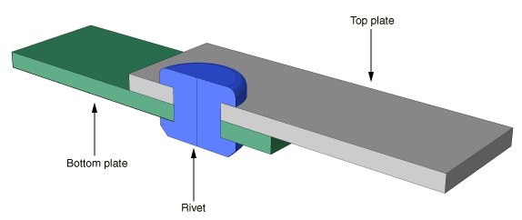
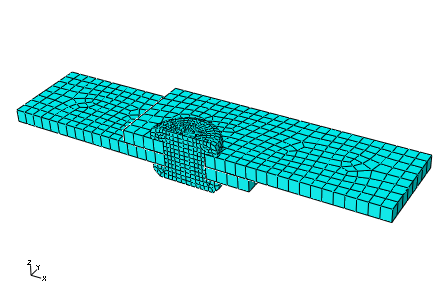
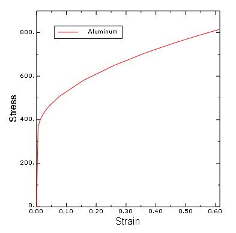
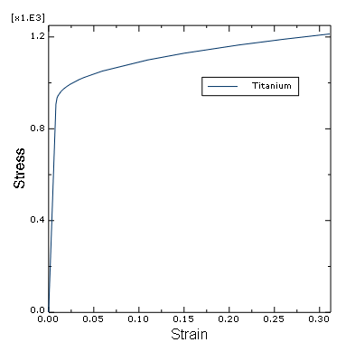
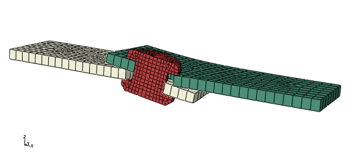
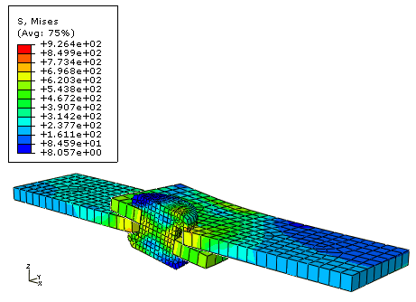
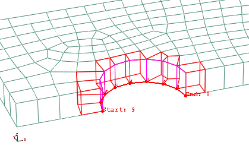

# 12.7 Abaqus/Standard 3D example: shearing of a lap joint


This simulation of the shearing of a lap joint illustrates the use of general contact in Abaqus/Standard.

The model consists of two overlapping aluminum plates that are connected with a titanium rivet. The left end of the bottom plate is fixed, and the force is applied to the right end of the top plate to shear the joint. [Figure 12--27](ch12s07.md#gsa-lap-assy) shows the basic arrangement of the components. Because of symmetry, only half of the joint is modeled to reduce computational cost. Frictional contact is assumed.

**Figure 12–27** Lap joint analysis.



### 12.7.1 Mesh design

Select the element type before designing the mesh. The mesh used for the plates should consist of C3D8I elements; the rivet should be meshed with C3D8R and C3D6 elements (a representative mesh is shown in [Figure 12--28](ch12s07.md#gsk-gen-lap-mesh-gsk)).

**Figure 12–28** Mesh.



### 12.7.2 Preprocessing---creating the model

The steps that follow assume that you have access to the full input file for this example. This input file, `lap_joint.inp`, is provided in ["Shearing of a lap joint," Section A.14](ap01s14.md). Instructions on how to fetch and run the script are given in [Appendix A, "Example Files](ap01.md).” If you wish to create the entire model using Abaqus/CAE, please refer to ["Abaqus/Standard 3D example: shearing of a lap joint," Section 12.8 of Getting Started with Abaqus: Interactive Edition](../gsa/gsa-link.md#gsa-cnt-exalapjoint).

### 12.7.3 Reviewing the input file---the model data

We first review the model definition, including the node and element definitions, and section and material properties.

**Model description**

The input file starts with a relevant description of the simulation and model in the [*HEADING](../key/key-link.md#usb-kws-mheading) option.

```
*HEADING
Shearing of a lap joint
SI units (N, kg, mm, s)
```

**Nodal coordinates and element connectivity**

Check that the preprocessor used the correct element type for the plates and rivet. Provide meaningful element set names, such as `PLATE` and `RIVET`, for the elements. The [*ELEMENT](../key/key-link.md#usb-kws-melement) options in this model follow:

```
*ELEMENT, TYPE=C3D8I, ELSET=PLATE
...
*ELEMENT, TYPE=C3D8R, ELSET=RIVET
...
*ELEMENT, TYPE=C3D6,  ELSET=RIVET
...

```

The model definition also specifies the creation of node sets so that parts of the model can be constrained and moved easily. These sets are located at the following locations: at the bottom-left corner of the bottom plate (set `CORNER`), the left face of the bottom plate (set `FIX`), the right face of the top plate (set `PULL`), and the symmetry plane (set `SYMM`).

```
*NSET, NSET=CORNER
...
*NSET, NSET=FIX
...
*NSET, NSET=PULL
...
*NSET, NSET=SYMM
...

```
The first of these sets will be used to prevent rigid body motion in the 3-direction; the next two will be used to fix the end of one plate and pull the end of the other, respectively; the last one will be used to impose symmetry conditions.

**Section and material properties**

The plates are made from aluminum (elastic modulus of 71.7  103 MPa,  = 0.33). Its stress-strain behavior is shown in [Figure 12--29](ch12s07.md#gsa-alum).

**Figure 12–29** Aluminum stress-strain curve.



The rivet is made from titanium (elastic modulus of 112  103 MPa,  = 0.34). Its stress-strain behavior is shown in [Figure 12--30](ch12s07.md#gsa-titanium).

**Figure 12–30** Titanium stress-strain curve.



The following input options are needed to define the material properties:

```
*SOLID SECTION, MATERIAL=ALUMINUM, ELSET=PLATES
*MATERIAL, NAME=ALUMINUM
*ELASTIC
 71700., 0.33
*PLASTIC
 350.00, 0.
 368.71, 0.001
 376.50, 0.002
 391.98, 0.005
 403.15, 0.008
 412.36, 0.011
 422.87, 0.015
 444.17, 0.025
 461.50, 0.035
 507.90, 0.070
 581.50, 0.150
 649.17, 0.250
 704.22, 0.350
 728.78, 0.400
 751.85, 0.450
 773.68, 0.500
 794.44, 0.550
 814.28, 0.600
*SOLID SECTION, MATERIAL=TITANIUM, ELSET=RIVET
*MATERIAL, NAME=TITANIUM
*ELASTIC
 112000., 0.34
*PLASTIC
 907.00, 0.
 934.86, 0.001
 944.28, 0.002
 961.77, 0.005
 973.73, 0.008
 983.28, 0.011
 993.89, 0.015
 1014.7, 0.025
 1023.3, 0.030
 1051.1, 0.050
 1099.8, 0.100
 1129.0, 0.140
 1164.9, 0.200
 1190.2, 0.250
 1212.8, 0.300

```

### 12.7.4 Contact definitions

The contact definitions for the model are discussed here. 

**Defining contact**

Contact will be used to enforce the interactions between the plates and the rivet. The friction coefficient between all parts is assumed to be 0.05.

This problem could use either contact pairs or the general contact algorithm. We will use general contact in this problem to demonstrate the simplicity of the contact definition.

The contact property is defined using the [*SURFACE INTERACTION](../key/key-link.md#usb-kws-hsurfaceinteraction) option; a friction coefficient of 0.05 is specified.

```
*SURFACE INTERACTION, NAME=FRIC
*FRICTION
 0.05,
```

Use the [*CONTACT](../key/key-link.md#usb-kws-hcontact) option to define a general contact interaction. Use the ALL EXTERIOR parameter on the [*CONTACT INCLUSIONS](../key/key-link.md#usb-kws-hcontactinclusions) option to specify self-contact for the unnamed, all-inclusive surface defined automatically by Abaqus/Standard. The [*CONTACT PROPERTY ASSIGNMENT](../key/key-link.md#usb-kws-hcontpropassign) option is used to assign the contact property named `FRIC` to the general contact interaction.

```
*CONTACT
*CONTACT INCLUSIONS, ALL EXTERIOR
*CONTACT PROPERTY ASSIGNMENT
 , , FRIC
```

### 12.7.5 Reviewing the input file---the history data

**Step definition and boundary conditions**

Create a single static, general step and include the effects of geometric nonlinearity. Set the initial time increment to `0.05` and the total time to `1.0`. Accept the default output requests.

One end of the assembly is fixed while the other is pulled along the length of the plates (1-direction). In addition, a single node is fixed in the vertical (3-) direction to prevent rigid body motion and the nodes on the symmetry plane are fixed in the direction normal to the plane (2-direction). The boundary conditions are summarized in [Table 12--1](ch12s07.md#gss-lap-bcs-kw).

**Table 12–1** Summary of boundary conditions.
| Geometry Set | BCs |
| --- | --- |
| fix | U1 = 0.0 |
| pull | U1 = 2.5 |
| symm | U2 = 0.0 |
| corner | U3 = 0.0 |

The complete step definition required for the model appears below:

```
*STEP, NLGEOM=YES
*STATIC
 0.05, 1.
*BOUNDARY
 FIX,    1, 1
 PULL,   1, 1, 2.5
 SYMM,   2, 2
 CORNER, 3, 3
*OUTPUT, FIELD, VARIABLE=PRESELECT
*OUTPUT, HISTORY, VARIABLE=PRESELECT
*END STEP
```

### 12.7.6 Running the analysis

Save the input in the file `lap_joint.inp` (see ["Shearing of a lap joint," Section A.14](ap01s14.md)). Run the simulation using the following command:

```
abaqus job=lap_joint 
```
 Check the status and message files while the job is running to see how it is progressing.

**Status file**

This analysis should take approximately 13 increments to complete. The contents of the status file are shown below:

```
  SUMMARY OF JOB INFORMATION:
 STEP  INC ATT SEVERE EQUIL TOTAL  TOTAL      STEP       INC OF       DOF    IF
               DISCON ITERS ITERS  TIME/    TIME/LPF    TIME/LPF    MONITOR RIKS
               ITERS               FREQ
   1     1   1    11     2    13  0.0500     0.0500     0.05000   
   1     2   1     3     2     5  0.100      0.100      0.05000   
   1     3   1     4     2     6  0.175      0.175      0.07500   
   1     4   1     3     2     5  0.288      0.288      0.1125    
   1     5   1     4     5     9  0.456      0.456      0.1688    
   1     6   1U    6     0     6  0.456      0.456      0.1688    
   1     6   2     3     3     6  0.498      0.498      0.04219   
   1     7   1     2     6     8  0.541      0.541      0.04219   
   1     8   1     1     4     5  0.583      0.583      0.04219   
   1     9   1     0     4     4  0.625      0.625      0.04219   
   1    10   1     1     2     3  0.688      0.688      0.06328   
   1    11   1     1     3     4  0.783      0.783      0.09492   
   1    12   1     2     2     4  0.926      0.926      0.1424    
   1    13   1     1     2     3  1.00       1.00       0.07441   

```

### 12.7.7 Postprocessing

In Abaqus/Viewer, examine the deformation of the assembly.

**Deformed model shape and contour plots**

The basic results of this simulation are the deformation of the joint and the stresses caused by the shearing process. Plot the deformed model shape and the Mises stress, as shown in [Figure 12--31](ch12s07.md#gsa-lap-def) and [Figure 12--32](ch12s07.md#gsa-lap-mises), respectively.

**Figure 12–31** Deformed model shape.



**Figure 12–32** Mises stress.



**Contact pressures**

You will now plot the contact pressures in the lap joint.

Since it is difficult to see contact pressures when the entire model is displayed, use the **Display Groups** toolbar to display only the top plate in the viewport.

Create a path plot to examine the variation of the contact pressure around the bolt hole of the top plate.

**To create a path plot:**

1. In the Results Tree, double-click **Paths**. In the **Create Path** dialog box, select **Edge list** as the type and click **Continue**.
2. In the **Edit Edge List Path** dialog box, select the instance corresponding to the top plate and click **Add After**.
3. In the prompt area, select **by shortest distance** as the selection method.
4. In the viewport, select the edge at the left end of the bolt hole as the starting edge of the path and the node at the right end of the bolt hole as the end node of the path, as shown in [Figure 12--33](ch12s07.md#gsa-lap-path1-nls). **Figure 12--33** Path definition. 
5. Click **Done** in the prompt area to indicate that you have finished making selections for the path. Click **OK** to save the path definition and to close the **Edit Edge List Path** dialog box.
6. In the Results Tree, double-click **XYData**. Select **Path** in the **Create XY Data** dialog box, and click **Continue**.
7. In the **Y Values** frame of the **XY Data from Path** dialog box, click **Step/Frame**. In the **Step/Frame** dialog box, select the last frame of the step. Click **OK** to close the **Step/Frame** dialog box.
8. Make sure that the field output variable is set to **CPRESS**, and click **Plot** to view the path plot. Click **Save As** to save the plot. The path plot appears as shown in [Figure 12--34](ch12s07.md#gsa-lap-path2-nls). **Figure 12--34** CPRESS distribution around the bolt hole in top plate. 


