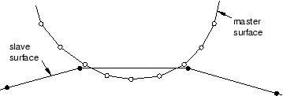

# 12.8 Defining contact in Abaqus/Explicit

Abaqus/Explicit provides two algorithms for modeling contact interactions. The general (“automatic”) contact algorithm allows very simple definitions of contact with very few restrictions on the types of surfaces involved (see ["Defining general contact interactions in Abaqus/Explicit," Section 36.4.1 of the Abaqus Analysis User's Guide](../usb/usb-link.md#usb-cni-acontactgeneral)). The contact pair algorithm has more restrictions on the types of surfaces involved and often requires more careful definition of contact; however, it allows for some interaction behaviors that currently are not available with the general contact algorithm (see ["Defining contact pairs in Abaqus/Explicit," Section 36.5.1 of the Abaqus Analysis User's Guide](../usb/usb-link.md#usb-cni-aexpcontactpair)). General contact interactions typically are defined by specifying self-contact for a default, element-based surface defined automatically by Abaqus/Explicit that includes all bodies in the model. To refine the contact domain, you can include or exclude specific surface pairs. Contact pair interactions are defined by specifying each of the individual surface pairs that can interact with each other.

### 12.8.1 Abaqus/Explicit contact formulation

The contact formulation in Abaqus/Explicit includes the constraint enforcement method, the contact surface weighting, and the sliding formulation.

**Constraint enforcement method**

For general contact ([*CONTACT](../key/key-link.md#usb-kws-hcontact)) Abaqus/Explicit enforces contact constraints using a penalty contact method, which searches for node-into-face and edge-into-edge penetrations in the current configuration. The penalty stiffness that relates the contact force to the penetration distance is chosen automatically by Abaqus/Explicit so that the effect on the time increment is minimal yet the penetration is not significant.

The contact pair algorithm ([*CONTACT PAIR](../key/key-link.md#usb-kws-hcontactpair)) uses a kinematic contact formulation by default that achieves precise compliance with the contact conditions using a predictor/corrector method. The increment at first proceeds under the assumption that contact does not occur. If at the end of the increment there is an overclosure, the acceleration is modified to obtain a corrected configuration in which the contact constraints are enforced. The predictor/corrector method used for kinematic contact is discussed in more detail in ["Contact constraint enforcement methods in Abaqus/Explicit," Section 38.2.3 of the Abaqus Analysis User's Guide](../usb/usb-link.md#usb-cni-aexpcontactconstraints); some limitations of this method are discussed in ["Common difficulties associated with contact modeling using contact pairs in Abaqus/Explicit," Section 39.2.2 of the Abaqus Analysis User's Guide](../usb/usb-link.md#usb-cni-aexpcontacttrouble).

The normal contact constraint for contact pairs can optionally be enforced with the penalty contact method, which can model some types of contact that the kinematic method cannot. For example, the penalty method allows modeling of contact between two rigid surfaces (except when both surfaces are analytical rigid surfaces). When the penalty contact formulation is used, equal and opposite contact forces with magnitudes equal to the penalty stiffness times the penetration distance are applied to the master and slave nodes at the penetration points. The penalty stiffness is chosen automatically by Abaqus/Explicit and is similar to that used by the general contact algorithm. A penalty scale factor can also be specified. To select the penalty method for a contact pair analysis, set the MECHANICAL CONSTRAINT parameter to PENALTY on the [*CONTACT PAIR](../key/key-link.md#usb-kws-hcontactpair) option.

**Contact surface weighting**

In the pure master-slave approach one of the surfaces is the master surface and the other is the slave surface. As the two bodies come into contact, the penetrations are detected and the contact constraints are applied according to the constraint enforcement method (kinematic or penalty). Pure master-slave weighting (regardless of the constraint enforcement method) will resist only penetrations of slave nodes into master facets. Penetrations of master nodes into the slave surface can go undetected, as shown in [Figure 12--35](ch12s08.md#gxi-pure-mast-slave), unless the mesh on the slave surface is adequately refined.

**Figure 12–35** Penetration of master nodes into slave surface with pure master-slave contact.

Balanced master-slave contact simply applies the pure master-slave approach twice, reversing the surfaces on the second pass. One set of contact constraints is obtained with surface 1 as the slave, and another set of constraints is obtained with surface 2 as the slave. The acceleration corrections or forces are obtained by taking a weighted average of the two calculations. For kinematic balanced master-slave contact a second correction is made to resolve any remaining penetrations, as described in ["Contact formulations for contact pairs in Abaqus/Explicit," Section 38.2.2 of the Abaqus Analysis User's Guide](../usb/usb-link.md#usb-cni-aexpcontactpairform). The balanced master-slave contact constraint when kinematic compliance is used is illustrated in [Figure 12--36](ch12s08.md#gxi-bal-mast-slave). 

**Figure 12–36** Balanced master-slave contact constraint with kinematic compliance.

The balanced approach minimizes the penetration of the contacting bodies and, thus, provides more accurate results in most cases.

The general contact algorithm uses balanced master-slave weighting whenever possible; pure master-slave weighting is used for general contact interactions involving node-based surfaces, which can act only as pure slave surfaces. For the contact pair algorithm Abaqus/Explicit will decide which type of weighting to use for a given contact pair based on the nature of the two surfaces involved and the constraint enforcement method used.

The general contact algorithm uses balanced master-slave weighting whenever possible; pure master-slave weighting is used for general contact interactions involving node-based surfaces, which can act only as pure slave surfaces. Use the [*CONTACT FORMULATION](../key/key-link.md#usb-kws-hcontformulation), TYPE=PURE MASTER-SLAVE to specify pure master-slave weighting for other general contact interactions.

For the contact pair algorithm Abaqus/Explicit will decide which type of weighting to use for a given contact pair based on the nature of the two surfaces involved and the constraint enforcement method used. The weight of the average can be specified by the user for balanced master-slave contact with the contact pair algorithm using the WEIGHT parameter on the [*CONTACT PAIR](../key/key-link.md#usb-kws-hcontactpair) option. For most element types the default weight is 0.5 so that the same weight is used for each of the acceleration corrections. Setting WEIGHT to 1.0 specifies a pure master-slave relationship with the first surface as the master surface. Conversely, a weight of zero means that the second surface is the master surface.

**Sliding formulation**

When defining a contact pair, you must decide whether the magnitude of the relative sliding will be small or finite. The default (and only option for general contact interactions) is the more general finite-sliding formulation. Small sliding is appropriate if the relative motion of the two surfaces is less than a small proportion of the characteristic length of an element face. The small-sliding formulation is selected by including the SMALL SLIDING parameter on the [*CONTACT PAIR](../key/key-link.md#usb-kws-hcontactpair) option. Using the small-sliding formulation when applicable results in a more efficient analysis.

