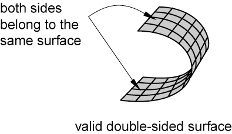
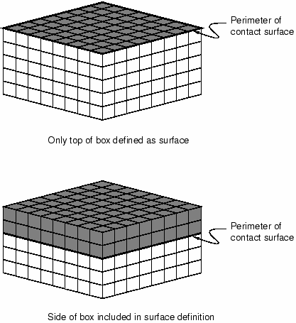
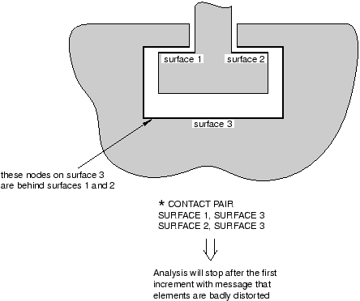
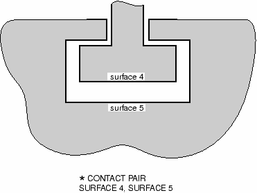
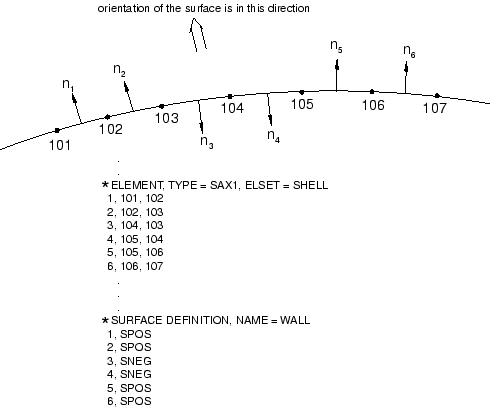
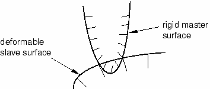
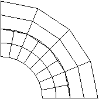

# 12.9 Modeling considerations in Abaqus/Explicit

We now discuss the following modeling considerations: correct definition of surfaces, overconstraints, mesh refinement, and initial overclosures.

### 12.9.1 Correct surface definitions

Certain rules must be followed when defining surfaces for use with each of the contact algorithms. The general contact algorithm has fewer restrictions on the types of surfaces that can be involved in contact; however, two-dimensional and node-based surfaces can be used only with the contact pair algorithm.

**Continuous surfaces**

Surfaces used with the general contact algorithm can span multiple unattached bodies. More than two surface facets can share a common edge. In contrast, all surfaces used with the contact pair algorithm must be continuous and simply connected. The continuity requirement has the following implications for what constitutes a valid or invalid surface definition for the contact pair algorithm:
- In two dimensions the surface must be either a simple, nonintersecting curve with two terminal ends or a closed loop. [Figure 12--37](ch12s09.md#gxi-val-inval-2d) shows examples of valid and invalid two-dimensional surfaces. **Figure 12--37** Valid and invalid two-dimensional surfaces for the contact pair algorithm. 
- In three dimensions an edge of an element face belonging to a valid surface may be either on the perimeter of the surface or shared by one other face. Two element faces forming a contact surface cannot be joined just at a shared node; they must be joined across a common element edge. An element edge cannot be shared by more than two surface facets. [Figure 12--38](ch12s09.md#gxi-val-inval-3d) illustrates valid and invalid three-dimensional surfaces. **Figure 12--38** Valid and invalid three-dimensional surfaces for the contact pair algorithm. 
- In addition, it is possible to define three-dimensional, double-sided surfaces. In this case both sides of a shell, membrane, or rigid element are included in the same surface definition, as shown in [Figure 12--39](ch12s09.md#gxi-double-side). **Figure 12--39** Valid double-sided surface. 

**Extending surfaces**

Abaqus/Explicit does not extend surfaces automatically beyond the perimeter of the surface defined by the user. If a node from one surface is in contact with another surface and it slides along the surface until it reaches an edge, it may “fall off the edge.” Such behavior can be particularly troublesome because the node may later reenter from the back side of the surface, thereby violating the kinematic constraint and causing large jumps in acceleration at that node. Consequently, it is good modeling practice to extend surfaces somewhat beyond the regions that will actually contact. In general, we recommend covering each contacting body entirely with surfaces; the additional computational expense is minimal.

[Figure 12--40](ch12s09.md#gxi-surf-perim) shows two simple box-like bodies constructed of brick elements. 

**Figure 12–40** Surface perimeters.

The upper box has a contact surface defined only on the top face of the box. While it is a permissible surface definition in Abaqus/Explicit, the lack of extensions beyond the “raw edge” could be problematic. In the lower box the surface wraps some distance around the side walls, thereby extending beyond the flat, upper surface. If contact is to occur only at the top face of the box, this extended surface definition minimizes contact problems by keeping any contacting nodes from going behind the contact surface.

**Mesh seams**

Two nodes with the same coordinate (double nodes) can generate a seam or crack in a valid surface that appears to be continuous, as shown in [Figure 12--41](ch12s09.md#gxi-double-node-mesh). A node sliding along the surface can fall through this crack and slide behind the contact surface. A large, nonphysical acceleration correction may be caused once penetration is detected. Mesh seams can be detected in Abaqus/Viewer by drawing the free edges of the model. Any seams that are not part of the desired perimeter can be double-noded regions.

**Figure 12–41** Example of a double-noded mesh.

**Complete surface definition**

[Figure 12--42](ch12s09.md#gsx-incorsurfdef) illustrates a two-dimensional model of a simple connection between two parts. 

**Figure 12–42** Example of an incorrect surface definition.

The contact definition shown in the figure is not adequate for modeling this connection because the surfaces do not represent a complete description of the geometry of the bodies. At the beginning of the analysis some of the nodes on surface 3 find that they are “behind” surfaces 1 and 2. [Figure 12--43](ch12s09.md#gsx-corr-surf-def) shows an adequate surface definition for this connection. The surfaces are continuous and describe the entire geometry of the contacting bodies.

**Figure 12–43** Correct surface definition.

**Consistent surface normals**

Single-sided surfaces on shell, membrane, or rigid elements must be defined so that the normal directions do not “flip” as the surface is traversed. [Figure 12--44](ch12s09.md#gsx-inconsist-norms) shows a mesh of SAX1 elements whose normals are not continuous from one element to the next. The face identifier SPOS indicates that the surface is on the face with the positive outward normal, and the face identifier SNEG indicates the reverse. If a surface was defined using the SPOS face for all the elements, Abaqus/Explicit would issue a warning message stating that the surface is not valid. 

**Figure 12–44** Inconsistent surface normals.

A valid surface could be defined with this mesh if the surface definition shown in the figure, which uses both SPOS and SNEG face identifiers to accommodate the inconsistent element normals, is used.

It is not necessary for the normals of all the underlying shell, membrane, or rigid elements to have a consistent positive orientation for a double-sided surface; if possible, Abaqus/Explicit will define the surface such that its facets have consistent normals, even if the underlying elements do not have consistent normals. The facet normals will be the same as the element normals if the element normals are all consistent; otherwise, an arbitrary positive orientation is chosen for the surface. If it is not possible to make the facet normals consistent (for example, if the surface contains a T-intersection of shells), the surface can be used with the general contact algorithm but not with the contact pair algorithm.

**Highly warped surfaces**

No special treatment of warped surfaces is required for the general contact algorithm. However, when a surface used with the contact pair algorithm contains highly warped facets, a more expensive tracking approach must be used than the approach required when the surface does not contain highly warped facets. To keep the solution as efficient as possible, Abaqus monitors the warpage of the surfaces and issues a warning if surfaces become too warped; if the normal directions of adjacent facets differ by more than 20, Abaqus issues a warning message. Once a surface is deemed to be highly warped, Abaqus switches from the more efficient contact search approach to a more accurate search approach to account for the difficulties posed by the highly warped surface.

For the sake of efficiency Abaqus does not check for highly warped surfaces every increment. Rigid surfaces are checked for high warpage only at the start of the step, since rigid surfaces do not change shape during the analysis. Deformable surfaces are checked for high warpage every 20 increments by default. Some analyses may have surfaces whose warpage increases in severity quite suddenly, making the default 20 increment frequency check inadequate. The user can change the frequency of the warping checks by setting the WARP CHECK PERIOD parameter on the [*CONTACT CONTROLS](../key/key-link.md#usb-kws-hcontactcontrols) option to the desired number of increments. Some analyses in which the surface warping is less than 20 may also require the more accurate contact search approach associated with highly warped surfaces. Use the WARP CUT OFF parameter on the [*CONTACT CONTROLS](../key/key-link.md#usb-kws-hcontactcontrols) option to redefine the angle that defines high warpage.

**Rigid element discretization**

Complex rigid surface geometries can be modeled using rigid elements. Rigid elements in Abaqus/Explicit are not smoothed; they remain faceted exactly as defined by the user. The advantage of unsmoothed surfaces is that the surface defined by the user is exactly the same as the surface used by Abaqus; the disadvantage is that faceted surfaces require much higher mesh refinement to define smooth bodies accurately. In general, using a large number of rigid elements to define a rigid surface does not increase the CPU costs significantly. However, a large number of rigid elements does increase the memory overhead significantly.

The user must ensure that the discretization of any curved geometry on rigid bodies is adequate. If the rigid body discretization is too coarse, contacting nodes on the deformable body may “snag,” leading to erroneous results, as illustrated in [Figure 12--45](ch12s09.md#gxi-potential-effect). 

**Figure 12–45** Potential effect of coarse rigid body discretization.

A node that is snagged on a sharp corner may be trapped from further sliding along the rigid surface for some time. Once enough energy is released to slide beyond the sharp corner, the node will snap dynamically before contacting the adjacent facet. Such motions cause noisy solutions. The more refined the rigid surface, the smoother the motion of the contacting slave nodes. The general contact algorithm includes some numerical rounding of features that prevents snagging of nodes from becoming a concern for discrete rigid surfaces. In addition, penalty enforcement of the contact constraints reduces the tendency for snagging to occur. Analytical rigid surfaces should normally be used with the contact pair algorithm for rigid bodies whose shape is an extruded profile or a surface of revolution.

### 12.9.2 Overconstraining the model

Just as multiple conflicting boundary conditions should not be defined at a given node, multi-point constraints and contact conditions enforced with the kinematic method generally should not be defined at the same node because they may generate conflicting kinematic constraints. Unless the constraints are entirely orthogonal to one another, the model will be overconstrained; the resulting solution will be quite noisy, as Abaqus/Explicit tries to satisfy the conflicting constraints. Penalty contact constraints and multi-point constraints acting on the same nodes will not generate conflicts because the penalty constraints are not enforced as strictly as the multi-point constraints.

### 12.9.3 Mesh refinement

For contact as well as all other types of analyses, the solution improves as the mesh is refined. For contact analyses using a pure master-slave approach, it is especially important that the slave surface is refined adequately so that the master surface facets do not overly penetrate the slave surface. The balanced master-slave approach does not require high mesh refinement on the slave surface to have adequate contact compliance. Mesh refinement is generally most important with pure master-slave contact between deformable and rigid bodies; in this case the deformable body is always the pure slave surface and, thus, must be refined enough to interact with any feature on the rigid body. [Figure 12--46](ch12s09.md#gxi-inadeq-surf) shows an example of the penetration that can occur if the discretization of the slave surface is poor compared to the dimensions of the features on the master surface. If the deformable surface were more refined, the penetrations of the rigid surface would be much less severe.

**Figure 12–46** Example of inadequate slave surface discretization.

**Tie constraints**

Using the [*TIE](../key/key-link.md#usb-kws-mtie) option prevents surfaces initially in contact from penetrating, separating, or sliding relative to one another. Tie constraints are, therefore, an easy means of mesh refinement. Since any gaps that exist between the two contact surfaces, however small, will result in nodes that are not tied to the opposite contact boundary, you must use the ADJUST=YES parameter to ensure that the two surfaces are exactly in contact at the start of the analysis.

The tie constraint formulation constrains translational and, optionally, rotational degrees of freedom. When using tied contact with structural elements, you must ensure that any unconstrained rotations will not cause problems.

### 12.9.4 Initial contact overclosure

Abaqus/Explicit will automatically adjust the undeformed coordinates of nodes on contact surfaces to remove any initial overclosures. When using the balanced master-slave approach, both surfaces are adjusted; when using the pure master-slave approach, only the slave surface is adjusted. Displacements associated with adjusting the surface to remove overclosures do not cause any initial strain or stress for contact defined in the first step of the analysis. When conflicting constraints exist, initial overclosures may not be completely resolved by repositioning nodes. In this case severe mesh distortions can result near the beginning of an analysis when the contact pair algorithm is used. The general contact algorithm stores any unresolved initial penetrations as offsets to avoid large initial accelerations.

In subsequent steps any nodal adjustments to remove initial overclosures cause strains that often cause severe mesh distortions because the entire nodal adjustments occur in a single, very brief increment. This is especially true when the kinematic constraint method is used. For example, if a node is overclosed by 1.0  103 m and the increment time is 1.0  107 s, the acceleration applied to the node to correct the overclosure is 2.0  1011 m/s2. Such a large acceleration applied to a single node typically will cause warnings about deformation speed exceeding the wave speed of the material and warnings about severe mesh distortions a few increments later, once the large acceleration has deformed the associated elements significantly. Even a very slight initial overclosure can induce extremely large accelerations for kinematic contact. In general, it is important that in the second step and beyond any new contact surfaces that you define are not overclosed.

[Figure 12--47](ch12s09.md#gxi-orig-overclose) shows a common case of initial overclosure of two contact surfaces. All of the nodes on the contact surfaces lie exactly on the same arc of a circle; but since the mesh of the inner surface is finer than that of the outer surface and since the element edges are linear, some nodes on the finer, inner surface initially penetrate the outer surface. 

**Figure 12–47** Original overclosure of two contact surfaces.

Assuming that the pure master-slave approach is used, [Figure 12--48](ch12s09.md#gxi-corrected-surf) shows the initial, strain-free displacements applied to the slave-surface nodes by Abaqus/Explicit. In the absence of external loads this geometry is stress free. If the default, balanced master-slave approach is used, a different initial set of displacements is obtained, and the resulting mesh is not entirely stress free.

**Figure 12–48** Corrected contact surfaces.

