# 12.10 Abaqus/Explicit example: circuit board drop test


In this example you will investigate the behavior of a circuit board in protective crushable foam packaging dropped at an angle onto a rigid surface. Your goal is to assess whether the foam packaging is adequate to prevent circuit board damage when the board is dropped from a height of 1 meter. You will use the general contact capability in Abaqus/Explicit to model the interactions between the different components. [Figure 12--49](ch12s10.md#gxi-dimen-milmat) shows the dimensions of the circuit board and foam packaging in millimeters and the material properties.

**Figure 12–49** Dimensions in millimeters and material properties.


### 12.10.1 Coordinate system

While the circuit board will be dropped at an angle, it is easiest to use the [*SYSTEM](../key/key-link.md#usb-kws-msystem) option to define the mesh aligned with a local rectangular coordinate system, as shown in [Figure 12--49](ch12s10.md#gxi-dimen-milmat). The [*SYSTEM](../key/key-link.md#usb-kws-msystem) option transforms nodal coordinates from the local coordinate system to the global coordinate system. This option allows you to define the circuit board in the *x–z* plane of the local coordinate system, which is rotated by the desired angle relative to the global coordinate system.

The [*SYSTEM](../key/key-link.md#usb-kws-msystem) option defines a new coordinate system by specifying three points: a local origin, a point on the local *x*-axis, and a point in the local *x–y* plane. Before defining the nodes for the circuit board, use the following option to tilt the mesh so that it lands on its corner:

```
*SYSTEM
0., 0., 0., .5, .707, .25
-.5, .707, -.5
```
 All subsequent nodal definitions will be in this local coordinate system. To reset the coordinate system to the default, use another [*SYSTEM](../key/key-link.md#usb-kws-msystem) option with no data lines.

### 12.10.2 Mesh design

The overall mesh for this problem is shown in [Figure 12--50](ch12s10.md#gsx-circuit-board). 

**Figure 12–50** Mesh of the circuit board and foam packaging.

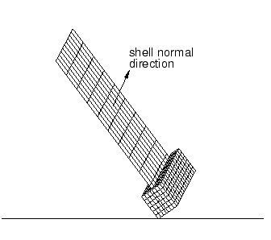

Define the circuit board so that the shell normals are in the direction indicated. Defining the bottom corner of the foam packaging as the origin of your model will ensure the correct positioning of the circuit board and packaging. Since the ground onto which the board will be dropped is effectively rigid, use a single R3D4 element for this part of the model. The packaging is a three-dimensional solid structure that should be modeled using C3D8R elements. The circuit board itself can be considered as a thin, flat plate with various chips attached to it. Therefore, model the circuit board with S4R elements, and model the chips with MASS elements.

Since you will be using shell elements for the circuit board, Abaqus/Explicit will, by default, use the original shell element thickness when checking for contact. The circuit board and its slot in the foam packaging are both the same thickness (2 mm) so that there is a snug fit between the two bodies. In this example the circuit board is a mesh of 10  10 S4R elements, and the foam packaging is a mesh of 6  7  15 elements, as shown in [Figure 12--51](ch12s10.md#gsx-pack-mesh-detail). 

**Figure 12–51** Packaging mesh detail.

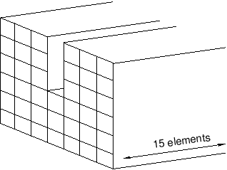

The MASS elements are positioned as shown in [Figure 12--52](ch12s10.md#gsx-mass-elem-position). The mesh for the packaging is too coarse near the impacting corner to provide highly accurate results. However, the mesh is adequate for a low-cost preliminary study.

**Figure 12–52** Position of mass elements on circuit board. Numbers in parentheses are (*x, y*) coordinates in millimeters based on a local origin at the bottom left-hand corner of the circuit board.

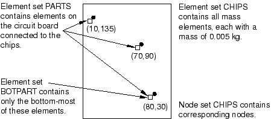

### 12.10.3 Node and element sets

The steps that follow assume that you have access to the full input file for this example. This input file, `circuit.inp`, is provided in ["Circuit board drop test," Section A.15](ap01s15.md). Instructions on how to fetch and run the script are given in [Appendix A, "Example Files](ap01.md).”

[Figure 12--52](ch12s10.md#gsx-mass-elem-position) and [Figure 12--53](ch12s10.md#gsx-necessary-sets) show all of the sets necessary to apply the element properties, loads, initial conditions, and boundary conditions, as well as to request output for postprocessing. 

**Figure 12–53** Necessary node and element sets.

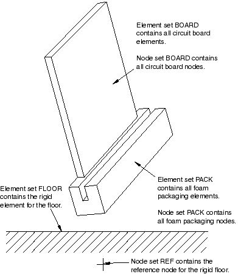

Include the circuit board elements in an element set called `BOARD`, and include the corresponding circuit board nodes in a node set called `BOARD`. Similarly, for the foam packaging include the elements in an element set called `PACK`, and include the nodes in a node set called `PACK`. The element sets will be used to refer to material properties, and the node sets will be used to apply initial conditions. Create an element set called `FLOOR` containing the floor's rigid element and a node set called `REF` containing the reference node for the rigid surface modeling the floor. Include the mass elements modeling the chips in an element set called `CHIPS`.

### 12.10.4 Simulating free fall

Two methods could be used to simulate the circuit board being dropped from a height of 1 meter. You could model the circuit board and foam at a height of 1 meter above the rigid surface and allow Abaqus/Explicit to calculate the motion under the influence of gravity; however, this method is clearly impractical because of the large number of increments required to complete the “free-fall” part of the simulation. The most efficient method is to model the circuit board and packaging in an initial position very close to the surface with an initial velocity to simulate the 1 meter drop (4.43 m/s).

### 12.10.5 Reviewing the input file---the model data

We now review the model data required for this simulation, including the model description, the node and element definitions, element and material properties, boundary and initial conditions, and surface definitions. You can review these data by fetching and opening the input file `circuit.inp`.

**Model description**

The [*HEADING](../key/key-link.md#usb-kws-mheading) option in this example provides a suitable heading for your model. SI units are used in this example.

```
*HEADING
Circuit board drop test
1.0 meter drop
SI units (kg, m, s, N)
```

**Nodal coordinates and element connectivity**

Use your preprocessor to generate the mesh in the local coordinate system. Precede the nodal definitions with the [*SYSTEM](../key/key-link.md#usb-kws-msystem) option to transform the nodes into the tilted coordinate system, as described previously. In `circuit.inp`, the nodal definitions for the foam packaging and circuit board look like

```
*SYSTEM
0., 0., 0., .5, .707, .25
-.5, .707, -.5
*NODE
1,     0.005, -0.010, 0.012
11,    0.005, -0.010, 0.162
.
.
** Reset coordinate system
**
*SYSTEM
```

When you have finished defining the nodes in the rotated, local coordinate system, use the [*SYSTEM](../key/key-link.md#usb-kws-msystem) option again without any data lines so that additional node numbers will be given in the global coordinate system. Define the nodes for the rigid surface so that it is large enough to keep the deformable bodies from falling off any of its edges. Use a 0.1 mm vertical clearance from the bottom corner of the foam packaging to ensure that there is no initial overclosure of the contact surfaces.

**Element properties**

Give each element set appropriate section properties. Include the appropriate MATERIAL parameter on each section option so that each set of elements is linked to a material definition. We have named the foam packaging material `FOAM`, and we will define it in the next section. 

```
*SOLID SECTION, ELSET=PACK, MATERIAL=FOAM, CONTROLS=HGLASS
*SECTION CONTROLS, NAME=HGLASS, HOURGLASS=ENHANCED

```

For the circuit board it is most meaningful to output stress results in the longitudinal and lateral directions, aligned with the edges of the board. Therefore, we need to specify local material directions for the circuit board mesh. We can use the same local coordinate system that we previously defined using the [*SYSTEM](../key/key-link.md#usb-kws-msystem) option. The desired material directions can be achieved using the [*ORIENTATION](../key/key-link.md#usb-kws-morientation) option with the DEFINITION=COORDINATES parameter. On the first data line specify the *x*-, *y*-, and *z*-coordinates of two points, *a* and *b*, respectively, to define the local coordinate system. On the second data line specify an additional rotation of 90 about the local 2- (or *y-*) axis. The name of the ORIENTATION is then referred to on the [*SHELL SECTION](../key/key-link.md#usb-kws-mshellsection) option.

```
*SHELL SECTION, ELSET=BOARD, MATERIAL=PCB, ORIENTATION=OR1
0.002,
*ORIENTATION, NAME=OR1, SYSTEM=RECTANGULAR,
DEFINITION=COORDINATES
0.5, 0.707, 0.25, -0.5, 0.707, -0.5
2, 90.0

```

The mass of each of the chips on the circuit board is defined to be 0.005 kg using the [*MASS](../key/key-link.md#usb-kws-mmass) option.

```
*MASS, ELSET=CHIPS
0.005,
```

Define the rigid body by referring to the element set `FLOOR` and the rigid body reference node on the [*RIGID BODY](../key/key-link.md#usb-kws-mrigidbody) option. The actual node *number* of the reference node must be specified, not the node set name.

```
*RIGID BODY, ELSET=FLOOR, REF NODE=*<reference node number>*
```

**Material properties**

We You now need to define the material properties for the circuit board and the foam packaging. For the circuit board use a PCB elastic material with a Young's modulus of 45 GPa, a Poisson's ratio of 0.3, and a density of 500 kg/m3.

```
*MATERIAL, NAME=PCB
*ELASTIC
45.E9, 0.3
*DENSITY
500.,
```

The foam packaging material is modeled using the crushable foam plasticity model. Use the [*ELASTIC](../key/key-link.md#usb-kws-melastic) option to define the Young's modulus as 3 MPa and the Poisson's ratio as 0.0. The material density is 100 kg/m3. 

```
*MATERIAL, NAME=FOAM
*ELASTIC
 3.E6, 0.0
*DENSITY
 100.,
```

The yield surface of a crushable foam in the *p–q* (pressure stress–Mises equivalent stress) plane is illustrated in [Figure 12--54](ch12s10.md#gsx-crushfoam-mod). 

**Figure 12–54** Crushable foam model: yield surface in the *p–q* plane.


The [*CRUSHABLE FOAM](../key/key-link.md#usb-kws-mcrushfoam), HARDENING=VOLUMETRIC option uses two data items to define the initial yield behavior. 
```
*CRUSHABLE FOAM, HARDENING=VOLUMETRIC
 1.1, 0.1
```
The first data item is the the ratio of initial yield stress in uniaxial compression to initial yield stress in hydrostatic compression, 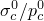; we have chosen it to be 1.1. The second data item is the ratio of yield stress in hydrostatic tension to initial yield stress in hydrostatic compression, . This data item is given as a positive value; in this problem we have chosen it to be 0.1.

Include hardening effects with the [*CRUSHABLE FOAM HARDENING](../key/key-link.md#usb-kws-mcrushfoamhardening) option. The first data item on each line is the yield stress in uniaxial compression, given as a positive value; the second data item on each line is the absolute value of the corresponding plastic strain. The crushable foam hardening model follows the curve shown in [Figure 12--55](ch12s10.md#gsx-foam-hardening-v). 

**Figure 12–55** Foam hardening material data.


```
*CRUSHABLE FOAM HARDENING
0.22000E6, 0.0
0.24651E6, 0.1
0.27294E6, 0.2
0.29902E6, 0.3
0.32455E6, 0.4
0.34935E6, 0.5
0.37326E6, 0.6
0.39617E6, 0.7
0.41801E6, 0.8
0.43872E6, 0.9
0.45827E6, 1.0
0.49384E6, 1.2
0.52484E6, 1.4
0.55153E6, 1.6
0.57431E6, 1.8
0.59359E6, 2.0
0.62936E6, 2.5
0.65199E6, 3.0
0.68334E6, 5.0
0.68833E6, 10.0
```

**Boundary conditions**

The rigid surface representing the floor is fully constrained by applying a fixed boundary condition to the reference node, which was previously defined as node set `REF`.

```
*BOUNDARY
REF, ENCASTRE
```

**Initial conditions**

The circuit board and foam packaging is given an initial velocity of 4.43 m/s in the global 3-direction, corresponding to the velocity at the end of a 1 meter free fall. 

```
*INITIAL CONDITIONS, TYPE=VELOCITY
BOARD, 3, -4.43
PACK, 3, -4.43
```

**Defining contact**

Either contact algorithm could be used for this problem. However, the definition of contact using the contact pair algorithm would be more cumbersome since, unlike general contact, the surfaces involved in contact pairs cannot span more than one body. We use the general contact algorithm in this example to demonstrate the simplicity of the contact definition for more complex geometries.

First, a named contact property is defined using the [*SURFACE INTERACTION](../key/key-link.md#usb-kws-hsurfaceinteraction) option, a friction coefficient of 0.3 is defined.

```
*SURFACE INTERACTION, NAME=FRIC
*FRICTION
0.3,
```

Use the [*CONTACT](../key/key-link.md#usb-kws-hcontact) option to define a general contact interaction. Use the ALL EXTERIOR parameter on the [*CONTACT INCLUSIONS](../key/key-link.md#usb-kws-hcontactinclusions) option to specify self-contact for the unnamed, all-inclusive surface defined automatically by Abaqus/Explicit. The [*CONTACT PROPERTY ASSIGNMENT](../key/key-link.md#usb-kws-hcontpropassign) option is used to assign the contact property named `FRIC` to the general contact interaction.

```
*CONTACT
*CONTACT INCLUSIONS, ALL EXTERIOR
*CONTACT PROPERTY ASSIGNMENT
 , , FRIC
```

### 12.10.6 Reviewing the input file---the history data

The [*DYNAMIC](../key/key-link.md#usb-kws-hdynamic), EXPLICIT option is used to select a dynamic stress/displacement analysis using explicit integration. The time period of the step is defined as 20 ms.

```
*STEP
*DYNAMIC, EXPLICIT
, 0.02
```

**Output requests**

The preselected field data are written to the output database file by including the following line in the input file:

```
*OUTPUT, FIELD, VARIABLE=PRESELECT
```
Values of vertical nodal displacement (U3), velocity (V3), and acceleration (A3) will be written for each of the attached chips as history data to the output database file. An output interval of 0.07 ms has been selected.
```
*OUTPUT, HISTORY, TIME INTERVAL=0.07E-3
*NODE OUTPUT, NSET=CHIPS
U3, V3, A3
```

Energy values will be written summed over the entire model. Specifically, write values for kinetic energy (ALLKE), internal energy (ALLIE), elastic strain energy (ALLSE), artificial energy (ALLAE), and the energy dissipated by plastic deformation (ALLPD).

```
*ENERGY OUTPUT
ALLIE, ALLKE, ALLPD, ALLAE, ALLSE
```

The end of the step is indicated with the [*END STEP](../key/key-link.md#usb-kws-hendstep) option.

### 12.10.7 Running the analysis

Run the analysis using the following command:

```
abaqus job=circuit analysis
```
This analysis is somewhat more complicated than the previous analyses in this guide, and it may take 45 minutes or more to run to completion, depending on the power of your computer.

**Status file**

Information concerning the initial stable time increment can be found at the top of the status file. The 10 most critical elements (i.e., those resulting in the smallest time increments) are also shown in rank order. 

```
 -------------------------------------------------------------------------------
 MODEL INFORMATION (IN GLOBAL X-Y COORDINATES)
-------------------------------------------------------------------------------

   Total mass in model = 3.49594E-02
   Center of mass of model = (-1.076765E-02, 4.948691E-02, 8.492255E-02)

    Moments of Inertia :
                 About Center of Mass              About Origin
      I(XX)          6.655668E-05                  4.042925E-04
      I(YY)          9.949297E-05                  3.556680E-04
      I(ZZ)          6.893156E-05                  1.585989E-04
      I(XY)         -1.344118E-05                  5.187227E-06
      I(YZ)         -5.240504E-06                 -1.521594E-04
      I(ZX)          3.958677E-05                  7.155426E-05

-------------------------------------------------------------------------------
 STABLE TIME INCREMENT INFORMATION
-------------------------------------------------------------------------------

  The stable time increment estimate for each element is based on
  linearization about the initial state.

   Initial time increment = 8.80392E-07

   Statistics for all elements:
      Mean = 1.04795E-05
      Standard deviation = 3.99235E-06

   Most critical elements :
    Element number   Rank    Time increment   Increment ratio
   ----------------------------------------------------------
          98          1       8.803920E-07      1.000000E+00
          83          2       8.803923E-07      9.999997E-01
          80          3       8.803923E-07      9.999996E-01
          79          4       8.803925E-07      9.999995E-01
          71          5       8.803925E-07      9.999994E-01
          30          6       8.803926E-07      9.999993E-01
          36          7       8.803926E-07      9.999993E-01
          69          8       8.803926E-07      9.999993E-01
          77          9       8.803926E-07      9.999993E-01
          86         10       8.803926E-07      9.999993E-01
                                   :
                                   :
                                   :
-------------------------------------------------------------------------------
 SOLUTION PROGRESS
-------------------------------------------------------------------------------

 STEP 1  ORIGIN 0.0000

  Total memory used for step 1 is approximately 3.7 megabytes.
  Global time estimation algorithm will be used.
  Scaling factor:  1.0000
  Variable mass scaling factor at zero increment:  1.0000
              STEP     TOTAL        CPU      STABLE   CRITICAL     KINETIC
INCREMENT     TIME      TIME       TIME   INCREMENT    ELEMENT      ENERGY
        0  0.000E+00 0.000E+00   00:00:00 8.394E-07         98   3.430E-01
Results number 0 at increment zero.
ODB Field Frame Number      0 of      5 requested intervals at increment zero.
     1188  1.000E-03 1.000E-03   00:00:03 8.394E-07         91   3.123E-01
                                   :
                                   :
                                   :

```

### 12.10.8 Postprocessing

Start Abaqus/Viewer by typing the following:

```
abaqus viewer odb=circuit
```
at the operating system prompt.

**Checking material directions**

The material directions obtained from this orientation definition can be checked with Abaqus/Viewer. 

**To plot the material orientation:**

1. First, change the view to a more convenient setting. If it is not visible, display the **Views** toolbar by selecting ****View****Toolbars****Views**** from the main menu bar. In the **Views** toolbar, select the X--Z setting.
2. From the main menu bar, select ****Plot****Material Orientations****On Deformed Shape****. The orientations of the material directions for the circuit board at the end of the simulation are shown. The material directions are drawn in different colors. The material 1-direction is blue, the material 2-direction is yellow, and the 3-direction, if it is present, is red.
3. To view the initial material orientation, select ****Result****Step/Frame****. In the **Step/Frame** dialog box that appears, select `Increment 0`. Click **Apply**. Abaqus displays the initial material directions.
4. To restore the display to the results at the end of the analysis, select the last increment available in the **Step/Frame** dialog box; and click **OK**.

**Animation of results**

You will create a time-history animation of the deformation to help you visualize the motion and deformation of the circuit board and foam packaging during impact.

**To create a time-history animation:**

1. Plot the deformed model shape at the end of the analysis.
2. From the main menu bar, select ****Animate****Time History****. The animation of the deformed model shape begins.
3. From the main menu bar, select ****View****Parallel**** to turn off perspective.
4. In the context bar, click  to pause the animation after a full cycle has been completed.
5. In the context bar, click  and then select a node on the foam packaging near one of the corners that impacts the floor. When you restart the animation the camera will move with the selected node. If you zoom in on the node, it will remain in view throughout the animation. **Note:**To reset the camera to follow the global coordinate system, click  in the context bar.

While you view the deformation history of the drop test, take note of when the foam is in contact with the floor. You should observe that the initial impact occurs over the first 4 ms of the analysis. A second impact occurs from about 8 ms to 15 ms. The deformed state of the foam and board at approximately 4 ms after impact is shown in [Figure 12--56](ch12s10.md#gxi-def-mesh-4ms-v).

**Figure 12–56** Deformed mesh at 4 ms.


**Plotting model energy histories**

Plot graphs of various energy variables versus time. Energy output can help you evaluate whether an Abaqus/Explicit simulation is predicting an appropriate response.

**To plot energy histories:**

1. In the Results Tree, click mouse button 3 on **History Output** for the output database named `circuit.odb`. From the menu that appears, select **Filter**.
2. In the filter field, enter `*ALL*` to restrict the history output to just the energy output variables.
3. Select the ALLAE output variable, and save the data as `Artificial Energy`.
4. Select the ALLIE output variable, and save the data as `Internal Energy`.
5. Select the ALLKE output variable, and save the data as `Kinetic Energy`.
6. Select the ALLPD output variable, and save the data as `Plastic Dissipation`.
7. Select the ALLSE output variable, and save the data as `Strain Energy`.
8. In the Results Tree, expand the **XYData** container.
9. Select all five curves. Click mouse button 3, and select **Plot** from the menu that appears to view the *X--Y* plot. Next, you will customize the appearance of the plot; begin by changing the line styles of the curves.
10. Open the **Curve Options** dialog box.
11. In this dialog box, apply different line styles and thicknesses to each of the curves displayed in the viewport. Next, reposition the legend so that it appears inside the plot.
12. Double-click the legend to open the **Chart Legend Options** dialog box.
13. In this dialog box, switch to the **Area** tabbed page, and toggle on **Inset**.
14. In the viewport, drag the legend over the plot. Now change the format of the *X*-axis labels.
15. In the viewport, double-click the *X*-axis to access the **X Axis** options in the **Axis Options** dialog box.
16. In this dialog box, switch to the **Axes** tabbed page, and select the **Engineering** label format for the *X*-axis. The energy histories appear as shown in [Figure 12--57](ch12s10.md#gxi-energy-vs-time-v). **Figure 12--57** Energy results versus time. 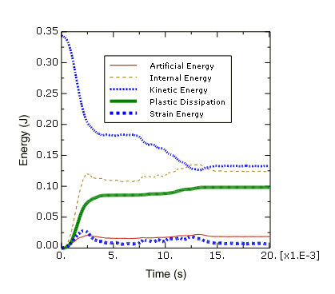

First, consider the kinetic energy history. At the beginning of the simulation the components are in free fall, and the kinetic energy is large. The initial impact deforms the foam packaging, thus reducing the kinetic energy. The components then bounce and rotate about the impacted corner until the opposite side of the foam packaging impacts the floor at about 8 ms, further reducing the kinetic energy.

The deformation of the foam packaging during impact causes a transfer of kinetic energy to internal energy in the foam packaging and the circuit board. From [Figure 12--57](ch12s10.md#gxi-energy-vs-time-v) we can see that the internal energy increases as the kinetic energy decreases. In fact, the internal energy is composed of elastic energy and plastically dissipated energy, both of which are also plotted in [Figure 12--57](ch12s10.md#gxi-energy-vs-time-v). Elastic energy rises to a peak and then falls as the elastic deformation recovers, but the plastically dissipated energy continues to rise as the foam is deformed permanently.

Another important energy output variable is the artificial energy, which is a substantial fraction (approximately 15%) of the internal energy in this analysis. By now you should know that the quality of the solution would improve if the artificial energy could be decreased to a smaller fraction of the total internal energy.

*What causes high artificial strain energy in this problem?*

Contact at a single node—such as the corner impact in this example—can cause hourglassing, especially in a coarse mesh. Two common strategies for reducing the artificial strain energy are to refine the mesh or to round the impacting corner. For the current exercise, however, we shall continue with the original mesh, realizing that improving the mesh would lead to an improved solution.

**Evaluating acceleration histories at the chips**

The next result we wish to examine is the acceleration of the chips attached to the circuit board. Excessive accelerations during impact may damage the chips. Therefore, in order to assess the desirability of the foam packaging, we need to plot the acceleration histories of the three chips. Since we expect the accelerations to be greatest in the 3-direction, we will plot the variable A3.

**To plot acceleration histories:**

1. In the Results Tree, filter the **History Output** container according to `*A3*`, select the acceleration `A3` of the nodes `60`, `357`, and `403` in the set `CHIPS`; and plot the three *X--Y* data objects. The *X--Y* plot appears in the viewport. As before, customize the plot appearance to obtain a plot similar to [Figure 12--58](ch12s10.md#gxi-acceleration-v). **Figure 12--58** Acceleration of the three chips in the *Z-*direction. 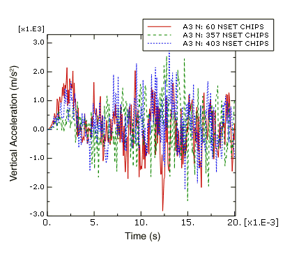

Next, we will evaluate the plausibility of the acceleration data recorded at the bottom chip. To do this, we will integrate the acceleration data to calculate the chip velocity and displacement and compare the results to the velocity and displacement data recorded directly by Abaqus/Explicit.

**To integrate the bottom chip acceleration history:**

1. In the Results Tree, filter the **History Output** container according to `*Node 403*`, select the acceleration `A3` of node `403`; and save the data as `A3`.
2. In the Results Tree, double-click **XYData**; then select **Operate on XY data** in the **Create XY Data** dialog box. Click **Continue**.
3. In the **Operate on XY Data** dialog box, integrate acceleration `A3` to calculate velocity and subtract the initial velocity magnitude of 4.43 m/s. The expression at the top of the dialog box should appear as: ``` integrate ( "A3" ) - 4.43 ```
4. Click **Plot Expression** to plot the calculated velocity curve.
5. In the Results Tree, click mouse button 3 on the velocity `V3` history output for node `403`; and select **Add to Plot** from the menu that appears. The *X--Y* plot appears in the viewport. As before, customize the plot appearance to obtain a plot similar to [Figure 12--59](ch12s10.md#gxi-velocity-v). The velocity curve you produced by integrating the acceleration data may be different from the one pictured here. The reason for this will be discussed later. **Figure 12--59** Velocity the bottom chip in the *Z-*direction. 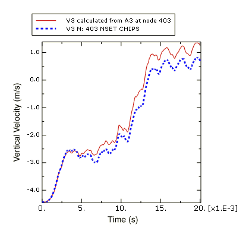
6. In the **Operate on XY Data** dialog box, integrate acceleration `A3` a second time to calculate chip displacement. The expression at the top of the dialog box should appear as: ``` integrate ( integrate ( "A3" ) - 4.43 ) ```
7. Click **Plot Expression** to plot the calculated displacement curve. Notice that the *Y-*value type is length. In order to plot the calculated displacement with the same *Y-*axis as the displacement output recorded during the analysis, we must save the *X--Y* data and change the *Y-*value type to displacement.
8. Click **Save As** to save the calculated displacement curve as `U3-from-A3`.
9. In the **XYData** container of the Results Tree, click mouse button 3 on `U3-from-A3`; and select **Edit** from the menu that appears.
10. In the **Edit XY Data** dialog box, choose **Displacement** as the *Y-*value type.
11. In the Results Tree, double-click `U3--from-A3` to recreate the calculated displacement plot with the displacement *Y-*value type.
12. In the Results Tree, click mouse button 3 on the displacement `U3` history output for node `403`; and select **Add to Plot** from the menu that appears. The *X--Y* plot appears in the viewport. As before, customize the plot appearance to obtain a plot similar to [Figure 12--60](ch12s10.md#gxi-botchip-disp-v). Again, the curve you produced by integrating the acceleration data may be different from the one pictured here. The reason for this will be discussed later. **Figure 12--60** Displacement of the bottom chip in the *Z-*direction. 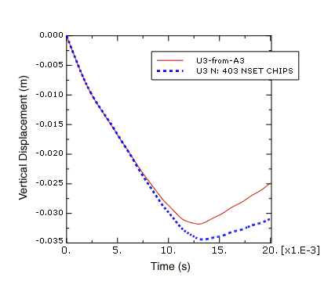

*Why are the velocity and displacement curves calculated by integrating the acceleration data different from the velocity and displacement recorded during the analysis? *

In this example the acceleration data has been corrupted by a phenomenon called aliasing. Aliasing is a form of data corruption that occurs when a signal (such as the results of an Abaqus analysis) is sampled at a series of discrete points in time, but not enough data points are saved in order to correctly describe the signal. The aliasing phenomenon can be addressed using digital signal processing (DSP) methods, a fundamental principle of which is the Nyquist Sampling Theorem (also known as the Shannon Sampling Theorem). The Sampling Theorem requires that a signal be sampled at a rate that is greater than twice the signal's highest frequency. Therefore, the maximum frequency content that can be described by a given sampling rate is half that rate (the Nyquist frequency). Sampling (storing) a signal with large-amplitude oscillations at frequencies greater than the Nyquist frequency of the sample rate may produce significantly distorted results due to aliasing. In this example the chip acceleration was sampled every 0.07 ms, which is a sampling rate of 14.3 kHz (the sample rate is the inverse of the sample size). The recorded data was aliased because the chip acceleration response has frequency content above 7.2 kHz (half the sample rate).

**Aliasing of a sine wave**

To better understand how aliasing distorts data, consider a 1 kHz sine wave sampled using various sampling rates, as shown in [Figure 12--61](ch12s10.md#gsa-sinewave). 

**Figure 12–61** 1 kHz sine wave sampled at 1.1 kHz and 3 kHz.


According to the Sampling Theorem, this signal must be sampled at a rate greater than 2 kHz to avoid alias distortions. We will evaluate what happens when the sample rate is greater than or less than this value.

Consider the data recorded with a sample rate of 1.1 kHz; this rate is less than the required 2 kHz rate. The resulting curve exhibits alias distortions because it is an extremely misleading representation of the original 1 kHz sine wave.

Now consider the data recorded with a sample rate of 3 kHz; this rate is greater than the required 2 kHz rate. The frequency content of the original signal is captured without aliasing. However, this sample rate is not high enough to guarantee that the peak values of the sampled signal are captured very accurately. To guarantee 95% accuracy of the recorded local peak values, the sampling rate must exceed the signal frequency by a factor of ten or more.

**Avoiding aliasing**

In the previous two examples of aliasing (the aliased chip acceleration and the aliased sine wave), it would not have been obvious from the aliased data alone that aliasing had occurred. In addition, there is no way to uniquely reconstruct the original signal from the aliased data alone. Therefore, care should be taken to avoid aliasing your analysis results, particularly in situations when aliasing is most likely to occur.

Susceptibility to aliasing depends on a number of factors, including output rate, output variable, and model characteristics. Recall that signals with large-amplitude oscillations at frequencies greater than half the sampling rate (the Nyquist frequency) may be significantly distorted due to aliasing. The two output variables that are most likely to have large-amplitude high-frequency content are accelerations and reaction forces. Therefore, these variables are the most susceptible to aliasing. Displacements, on the other hand, are lower in frequency content by nature, so they are much less susceptible to aliasing. Other result variables, such as stress and strain, fall somewhere in between these two extremes. Any model characteristic that reduces the high-frequency response of the solution will decrease the analysis’s susceptibility to aliasing. For example, an elastically dominated impact problem would be even more susceptible to aliasing than this circuit board drop test which includes energy absorbing packaging.

The safest way to ensure that aliasing is not a problem in your results is to request output at every increment. When you do this, the output rate is determined by the stable time increment, which is based on the highest possible frequency response of the model. However, requesting output at every increment is often not practical because it would result in very large output files. In addition, output at every increment is usually much more data than you need; there is no need to capture high-frequency solution noise when what you are really interested in is the lower-frequency structural response. An alternative method for avoiding aliasing is to request output at a lower rate and use the Abaqus/Explicit real-time filtering capabilities to remove high-frequency content from the result before writing data to the output database file. This technique uses less disk space than requesting output every increment; however, it is up to you to ensure that your output rate and filter choices are appropriate (to avoid aliasing or other distortions related to digital signal processing).

Abaqus/Explicit offers filtering capabilities for both field and history data. Filtering of history data only is discussed here.

### 12.10.9 Rerunning the analysis with output filtering

In this section you will add real-time filters to the history output requests for the circuit board drop test analysis. While Abaqus/Explicit does allow you to create user-defined output filters (Butterworth, Chebyshev Type I, and Chebyshev Type II) based on criteria that you specify, in this example we will use the built-in antialiasing filter. The built-in antialiasing filter is designed to give you the best un-aliased representation of the results recorded at the output rate you specify on the output request. To do this, Abaqus/Explicit internally applies a low-pass, second-order, Butterworth filter with a cutoff frequency set to one-sixth of the sampling rate. For more information, see “Overview of filtering Abaqus history output” in the Dassault Systmes Knowledge Base at [www.3ds.com/support/knowledge-base](http://www.3ds.com/support/knowledge-base). For more information on defining your own real-time filters, see ["Filtering output and operating on output in Abaqus/Explicit" in "Output to the output database," Section 4.1.3 of the Abaqus Analysis User's Guide](../usb/usb-link.md#usb-out-odboutput-filter). 

**Modifying the history output requests**

When Abaqus writes nodal history output to the output database, it gives each data object a name that indicates the recorded output variable, the filter used (if any), the node number, and the node set. For this exercise you will be creating multiple output requests for the bottom-most chip (node `403`) that differ only by the output sample rate, which is not a component of the history output name. To easily distinguish between the similar output requests, create two new sets for node `403`. Name one of the new sets `BotChip-all` and the other `BotChip-largeInc`.

```
*NSET, NSET=BotChip-all
403
*NSET, NSET=BotChip-largeInc
403
```

Next, add a new history output request for the vertical displacement, velocity, and acceleration of the chips. In addition, request element logarithmic strain components (LE11, LE22 and LE12), and logarithmic principal strain (LEP) at the top face (section point 5) of element set `BOTPART` of the circuit board to which the bottom-most chip is attached. For these output requests record the data at every 0.07 ms and apply the built-in antialiasing filter. 

```
*OUTPUT, HISTORY, TIME INTERVAL=0.07E-3, FILTER=ANTIALIASING
*NODE OUTPUT, NSET=CHIPS
 U3, V3, A3
*ELEMENT OUTPUT, ELSET=BOTPART
 5,
 LE11, LE22, LE12, LEP
```

Request history output at every increment for the vertical displacement, velocity, and acceleration of the bottom-most chip. Use node set `BotChip-all` for this output request.

```
*OUTPUT, HISTORY, FREQUENCY=1
*NODE OUTPUT, NSET=BotChip-all
 U3, V3, A3
```

Add one more output request for the vertical displacement, velocity, and acceleration of the bottom-most chip. This time request the output every 0.7 ms and apply the built-in antialiasing filter. Use node set `BotChip-largeInc`.

```
*OUTPUT, HISTORY, TIME INTERVAL=0.7E-3, FILTER=ANTIALIASING
*NODE OUTPUT, NSET=BotChip-largeInc
 U3, V3, A3
```

When you are finished, there will be four history output requests for the bottom chip (the original one and the three added here).

**Evaluating the filtered acceleration of the bottom chip**

When the analysis completes, test the plausibility of the acceleration history output for the bottom chip recorded every 0.07 ms using the built-in, antialiasing filter. Do this by saving and then integrating the filtered acceleration data (`A3_ANTIALIASING` for node `403` in set `CHIPS`) and comparing the results to recorded velocity and displacement data, just as you did earlier for the unfiltered version of these results. This time you should find that the velocity and displacement curves calculated by integrating the filtered acceleration are very similar to the velocity and displacement values written to the output database during the analysis. You may also have noticed that the velocity and displacement results are the same regardless of whether or not the built-in antialiasing filter is used.  This is because the highest frequency content of the nodal velocity and displacement curves is much less than half the sampling rate.  Consequently, no aliasing occurred when the data was recorded without filtering, and when the built-in antialiasing filter was applied it had no effect because there was no high frequency response to remove.

Next, compare the acceleration `A3` history output recorded every increment with the two acceleration `A3` history curves recorded every 0.07 ms. Plot the data recorded at every increment first so that it does not obscure the other results.

**To plot the acceleration histories **

1. In the Results Tree, filter the **History Output** container according to `*A3*Node 403*` and double-click the acceleration `A3` history output for the node set `BotChip-all`.
2. Select the two acceleration `A3` history output objects for `Node 403` in the set `CHIPS` (one filtered with the built-in antialiasing filter and the other with no filtering) using **[Ctrl]****+Click**; click mouse button 3 and select **Add to Plot** from the menu that appears. The *X--Y* plot appears in the viewport. Zoom in to view only the first third of the results and customize the plot appearance to obtain a plot similar to [Figure 12--62](ch12s10.md#gsx-a3filter-exp-v). **Figure 12--62** Comparison of acceleration output with and without filtering. 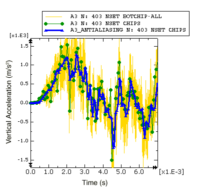

First consider the acceleration history recorded every increment. This curve contains a lot of data, including high-frequency solution noise which becomes so large in magnitude that it obscures the structurally-significant lower-frequency components of the acceleration. When output is requested every increment, the output time increment is the same as the stable time increment, which (in order to ensure stability) is based on a conservative estimate of the highest possible frequency response of the model. Frequencies of structural significance are typically two to four orders of magnitude less than the highest frequency of the model. In this example the stable time increment ranges between 8.4  104 ms to 8.8  104 ms (see the status file, `circuit.sta`), which corresponds to a sample rate of about 1 MHz; this sample rate has been rounded down for this discussion, even though it means that the value is not conservative. Recalling the Sampling Theorem, the highest frequency that can be described by a given sample rate is half that rate; therefore, the highest frequency of this model is about 500 kHz and typical structural frequencies could be as high as 2–3 kHz (more than 2 orders of magnitude less than the highest model frequency). While the output recorded every increment contains a lot of undesirable solution noise in the 3 to 500 kHz range, it is guaranteed to be good (not aliased) data, which can be filtered later with a postprocessing operation if necessary.

Next consider the data recorded every 0.07 ms without any filtering. Recall that this is the curve we know to be corrupted by aliasing. The curve jumps from point to point by directly including whatever the raw acceleration value happens to be after each 0.07 ms interval. The variable nature of the high-frequency noise makes this aliased result very sensitive to otherwise imperceptible variations in the solution (due to differences between computer platforms, for example), hence the results you recorded every 0.07 increments may be significantly different from those shown in [Figure 12--62](ch12s10.md#gsx-a3filter-exp-v).  Similarly, the velocity and displacement curves we produced by integrating the aliased acceleration ([Figure 12--59](ch12s10.md#gxi-velocity-v) and [Figure 12--60](ch12s10.md#gxi-botchip-disp-v)) data are extremely sensitive to small differences in the solution noise.

When the built-in antialiasing filter is applied to the output requested every 0.07 ms, frequency content that is too high to be captured by the 14.3 kHz sample rate is filtered out before the result is written to the output database. To do this, Abaqus internally defines a low-pass, second-order, Butterworth filter. Low-pass filters attenuate the frequency content of a signal that is above a specified cutoff frequency. An ideal low-pass filter would completely eliminate all frequencies above the cutoff frequency while having no effect on the frequency content below the cutoff frequency. In reality there is a transition band of frequencies surrounding the cutoff frequency that are partially attenuated. To compensate for this, the built-in antialiasing filter has a cutoff frequency that is  one-sixth of the sample rate, a value lower than the Nyquist frequency of one-half the sample rate. In most cases (including this example), this cutoff frequency is adequate to ensure that all frequency content above the Nyquist frequency has been removed before the data are written to the output database.

Abaqus/Explicit does not check to ensure that the specified output time interval provides an appropriate cutoff frequency for the internal antialiasing filter; for example, Abaqus does not check that only the noise of the signal is eliminated. When the acceleration data are recorded every 0.07 ms, the internal antialiasing filter is applied with a cutoff frequency of 2.4 kHz. This cutoff frequency is nearly the same value we previously determined to be the maximum physically meaningful frequency for the model (more than two orders of magnitude less than the maximum frequency the stable time increment can capture). The 0.07 ms output interval was intentionally chosen for this example to avoid filtering frequency content that could be physically meaningful. Next, we will study the results when the antialiasing filter is applied with a sample interval that is too large.

**To plot the filtered acceleration histories**

1. In the Results Tree, double-click the acceleration `A3` history output for the node set `BotChip-all`.
2. Select the two filtered acceleration `A3_ANTIALIASING` history output objects for `Node 403`; click mouse button 3 and select **Add to Plot** from the menu that appears. The *X--Y* plot appears in the viewport. Zoom out and customize the plot appearance to obtain a plot similar to [Figure 12--63](ch12s10.md#gsx-a3filter-exp-largeinc-v). **Figure 12--63** Filtered acceleration with different output sampling rates. 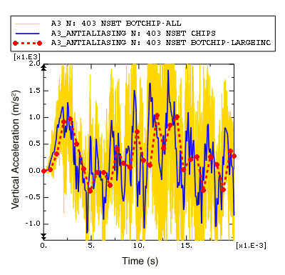

[Figure 12--63](ch12s10.md#gsx-a3filter-exp-largeinc-v) clearly illustrates some of the problems that can arise when the built-in antialiasing filter is used with too large an output time increment. First, notice that many of the oscillations in the acceleration output are filtered out when the acceleration is recorded with large time increments. In this dynamic impact problem it is likely that a significant portion of the removed frequency content is physically meaningful. Previously, we estimated that the frequency of the structural response may be as large as 2–3 kHz; however, when the sample interval is 0.7 ms, filtering is performed with a low cutoff frequency of 0.24 kHz (sample interval of 0.7 ms corresponds to a sample frequency of 1.43 kHz, one-sixth of which is the 0.24 kHz cutoff frequency). Even though the results recorded every 0.7 ms may not capture all physically meaningful frequency content, it does capture the low-frequency content of the acceleration data without distortions due to aliasing. Keep in mind that filtering decreases the peak value estimations, which is desirable if only solution noise is filtered, but can be misleading when physically meaningful solution variations have been removed.

Another issue to note is that there is a time delay in the acceleration results recorded every 0.7 ms. This time delay (or phase shift) affects all real-time filters. The filter must have some input in order to produce output; consequently the filtered result will include some time delay. While some time delay is introduced for all real-time filtering, the time delay becomes more pronounced as the filter cutoff frequency decreases; the filter must have input over a longer span of time in order to remove lower frequency content. Increasing the filter order (an option if you have created a user-defined filter, rather than using the second-order built-in antialiasing filter) also results in an increase in the output time delay. For more information, see ["Filtering output and operating on output in Abaqus/Explicit" in "Output to the output database," Section 4.1.3 of the Abaqus Analysis User's Guide](../usb/usb-link.md#usb-out-odboutput-filter).

Use the real-time filtering functionality with caution. In this example we would not have been able to identify the problems with the heavily filtered data if we did not have appropriate data for comparison. In general it is best to use a minimal amount of filtering in Abaqus/Explicit, so that the output database contains a rich, un-aliased, representation for the solution recorded at a reasonable number of time points (rather than at every increment). If additional filtering is necessary, it can be done as a postprocessing operation in Abaqus/Viewer.

**Filtering acceleration history in Abaqus/Viewer**

In this section we will use Abaqus/Viewer to filter the acceleration history data written to the output database. Filtering as a postprocessing operation in Abaqus/Viewer has several advantages over the real-time filtering available in Abaqus/Explicit. In the Abaqus/Viewer you can quickly filter *X–Y* data and plot the results. You can easily compare the filtered results to the unfiltered results to verify that the filter produced the desired effect. Using this technique you can quickly iterate to find appropriate filter parameters. In addition, the Abaqus/Viewer filters do not suffer from the time delay that is unavoidable when filtering is applied during the analysis. Keep in mind, however, that postprocessing filters cannot compensate for poor analysis history output; if the data has been aliased or if physically meaningful frequencies have been removed, no postprocessing operation can recover the lost content.

To demonstrate the differences between filtering in Abaqus/Viewer and filtering in Abaqus/Explicit, we will filter the acceleration of the bottom chip in Abaqus/Viewer and compare the results to the filtered data Abaqus/Explicit wrote to the output database.

**To filter acceleration history:**

1. In the Results Tree, select the acceleration `A3` history output for the node set `BotChip-all`, and save the data as `A3-all`.
2. In the Results Tree, double-click **XYData**; then select **Operate on XY data** in the **Create XY Data** dialog box. Click **Continue**.
3. In the **Operate on XY Data** dialog box, filter `A3-all` with filter options that are equivalent to those applied by the Abaqus/Explicit built-in antialiasing filter when the output increment is 0.7 ms. Recall that the built-in antialiasing filter is a second-order Butterworth filter with a cutoff frequency that is one-sixth of the output sample rate; hence, the expression at the top of the dialog box should appear as ``` butterworthFilter ( xyData="A3-all", cutoffFrequency=1/(6*0.0007) ) ```
4. Click **Plot Expression** to plot the filtered acceleration curve.
5. In the Results Tree, click mouse button 3 on the filtered acceleration `A3_ANTIALIASING` history output for node set `BotChip-largeInc`; and select **Add to Plot** from the menu that appears. If you wish, also add the filtered acceleration history for node `403` in the set `CHIPS`. The *X--Y* plot appears in the viewport. As before, customize the plot appearance to obtain a plot similar to [Figure 12--64](ch12s10.md#gsx-a3filter-vis-exp-v). **Figure 12--64** Comparison of acceleration filtered in Abaqus/Explicit and Abaqus/Viewer. 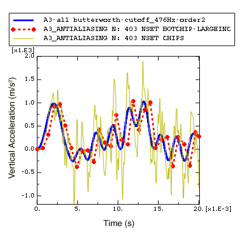

In [Figure 12--64](ch12s10.md#gsx-a3filter-vis-exp-v) it is clear that the postprocessing filter in Abaqus/Viewer does not suffer from the time delay that occurs when filtering is performed while the analysis is running. This is because the Abaqus/Viewer filters are bidirectional, which means that the filtering is applied first in a forward pass (which introduces some time delay) and then in a backward pass (which removes the time delay). As a consequence of the bidirectional filtering in Abaqus/Viewer, the filtering is essentially applied twice, which results in additional attenuation of the filtered signal compared to the attenuation achieved with a single-pass filter. This is why the local peaks in the acceleration curve filtered in Abaqus/Viewer are a bit lower than those in the curve filtered by Abaqus/Explicit.

To develop a better understanding of the Abaqus/Viewer filtering capabilities, return to the **Operate on XY Data** dialog box and filter the acceleration data with other filter options. For example, try different cutoff frequencies. 

*Can you confirm that the cutoff frequency of 2.4 kHz associated with the built-in antialiasing filter with a time increment size of 0.07 was appropriate? Does increasing the cutoff frequency to 6 kHz, 7 kHz, or even 10 kHz produce significantly different results?*

You should find that a moderate increase in the cutoff frequency does not have a significant effect on the results, implying that we probably have not missed physically meaningful frequency content when we filtered with a cutoff frequency of 2.4 kHz.

Compare the results of filtering the acceleration data with Butterworth and Chebyshev Type I filters. The Chebyshev filter requires a ripple factor parameter (*rippleFactor*), which indicates how much oscillation you will allow in exchange for an improved filter response; see ["Filtering output and operating on output in Abaqus/Explicit" in "Output to the output database," Section 4.1.3 of the Abaqus Analysis User's Guide](../usb/usb-link.md#usb-out-odboutput-filter) for more information. For the Chebyshev Type I filter a ripple factor of 0.071 will result in a very flat pass band with a ripple that is only 0.5%. 

*You may not notice much difference between the filters when the cutoff frequency is 5 kHz, but what about when the cutoff frequency is 2 kHz? What happens when you increase the order of the *Chebyshev Type I* filter?*

Compare your results to those shown in [Figure 12--65](ch12s10.md#gsx-a3filter-vis-v).

**Figure 12–65** Comparison of acceleration filtered with Butterworth and Chebyshev Type I filters.

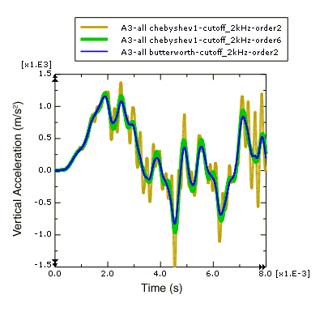

**Note:**The Abaqus/Viewer postprocessing filters are second-order by default. To define a higher order filter you can use the *filterOrder* parameter with the **butterworthFilter** and the **chebyshev1Filter** operators. For example, use the following expression in the **Operate on XY Data** dialog box to filter `A3-all` with a sixth-order Chebyshev Type I filter using a cutoff frequency of 2 kHz and a ripple factor of 0.017.

```
chebyshev1Filter ( xyData="A3-all" , cutoffFrequency=2000,
 rippleFactor= 0.017, filterOrder=6)
```

The second-order Chebyshev Type I filter with a ripple factor of 0.071 is a relatively weak filter, so some of the frequency content above the 2 kHz cutoff frequency is not filtered out. When the filter order is increased, the filter response is improved so that the results are more like the equivalent Butterworth filter. For more information on the *X–Y* data filters available in Abaqus/Viewer see ["Operating on saved X--Y data objects," Section 47.4 of the Abaqus/CAE User's Guide](../usi/usi-link.md#usv-xyp-operating).

**Filtering strain history in Abaqus/Viewer**

Strain in the circuit board near the location of the chips is another result that may assist us in determining the effectiveness of the foam packaging. If the strain under the chips exceeds a limiting value, the solder securing the chips to the board will fail. We wish to identify the peak strain in any direction. Therefore, the maximum and minimum principal logarithmic strains are of interest. Principal strains are one of a number of Abaqus results that are derived from nonlinear operators; in this case a nonlinear function is used to calculate principal strains from the individual strain components. Some other common results that are derived from nonlinear operators are principal stresses, Mises stress, and equivalent plastic strains. Care must be taken when filtering results that are derived from nonlinear operators, because nonlinear operators (unlike linear ones) can modify the frequency of the original result. Filtering such a result may have undesirable consequences; for example, if you remove a portion of the frequency content that was introduced by the application of the nonlinear operator, the filtered result will be a distorted representation of the derived quantity. In general, you should either avoid filtering quantities derived from nonlinear operators or filter the underlying quantities before calculating the derived quantity using the nonlinear operator. 

The strain history output for this analysis was recorded every 0.07 ms using the built-in antialiasing filter. To verify that the antialiasing filter did not distort the principal strain results, we will calculate the principal logarithmic strains using the filtered strain components and compare the result to the filtered principal logarithmic strains.

**To calculate the principal logarithmic strains:**

1. In the Results Tree, filter the **History Output** according to `*LE*`, select the logarithmic strain component `LE11` on the `SPOS` surface of the element in set `BOTPART`, and save the data as `LE11`.
2. Similarly, save the `LE12` and `LE22` strain components for the same element as `LE12` and `LE22`, respectively.
3. In the Results Tree, double-click **XYData**; then select **Operate on XY data** in the **Create XY Data** dialog box. Click **Continue**.
4. In the **Operate on XY Data** dialog box, use the saved logarithmic strain components to calculate the maximum principal logarithmic strain. The expression at the top of the dialog box should appear as: ``` (("LE11"+"LE22")/2) + sqrt( power(("LE11"-"LE22")/2,2) + power("LE12"/2,2) ) ```
5. Click **Save As** to save calculated maximum principal logarithmic strain as `LEP-Max`.
6. Edit the expression in the **Operate on XY Data** dialog box to calculate the minimum principal logarithmic strain. The modified expression should appear as: ``` (("LE11"+"LE22")/2) - sqrt( power(("LE11"-"LE22")/2,2) + power("LE12"/2,2) ) ```
7. Click **Save As** to save calculated minimum principal logarithmic strain as `LEP-Min`. In order to plot the calculated principal logarithmic strains with the same *Y-*axis as the strains recorded during the analysis, change the *Y-*value type to strain.
8. In the **XYData** container of the Results Tree, click mouse button 3 on `LEP-Max`; and select **Edit** from the menu that appears.
9. In the **Edit XY Data** dialog box, choose **Strain** as the *Y-*value type.
10. Similarly, edit `LEP-Min` and select **Strain** as the *Y-*value type.
11. Using the Results Tree, plot `LEP-Man` and `LEP-Min` along with the principal strains recorded during the analysis (`LEP1` and `LEP2`) for the element in set `BOTPART`.
12. As before, customize the plot appearance to obtain a plot similar to [Figure 12--66](ch12s10.md#gxi-prin-strain-v). **Figure 12--66** Principal logarithmic strain values versus time. 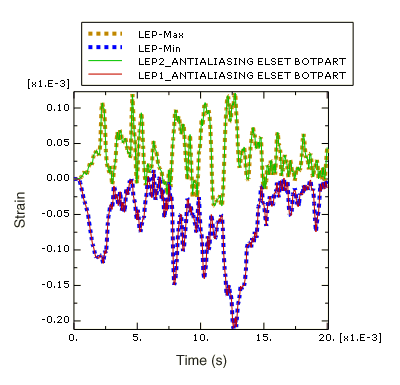

In [Figure 12--66](ch12s10.md#gxi-prin-strain-v) we see that the filtered principal logarithmic strain curves recorded during the analysis are indistinguishable from the principal logarithmic strain curves calculated from the filtered strain components. Therefore the antialiasing filter (cutoff frequency 2.4 kHz) did not remove any of the frequency content introduced by the nonlinear operation to calculate principal strains form the original strain data. Next, filter the strain data with a lower cutoff frequency of 500 Hz.

**To filter principal logarithmic strains with a cutoff frequency of 500 Hz:**

1. In the Results Tree, double-click **XYData**; then select **Operate on XY data** in the **Create XY Data** dialog box. Click **Continue**.
2. In the **Operate on XY Data** dialog box, filter the maximum principal logarithmic strain `LEP-Max` using a second-order Butterworth filter with a cutoff frequency of 500 Hz. The expression at the top of the dialog box should appear as: ``` butterworthFilter(xyData="LEP-Max", cutoffFrequency=500) ```
3. Click **Save As** to save the calculated maximum principal logarithmic strain as `LEP-Max-FilterAfterCalc-bw500`.
4. Similarly, filter the logarithmic strain components `LE11`, `LE12`, and `LE22` using the same second-order Butterworth filter with a cutoff frequency of 500 Hz. Save the resulting curves as `LE11--bw500`, `LE12--bw500`, and `LE22--bw500`, respectively.
5. Now calculate the maximum principal logarithmic strain using the filtered logarithmic strain components. The expression at the top of the **Operate on XY Data** dialog box should appear as: ``` (("LE11-bw500"+"LE22-bw500")/2) + sqrt( power(("LE11-bw500"-"LE22-bw500")/2,2) + power("LE12-bw500"/2,2) ) ```
6. Click **Save As** to save the calculated maximum principal logarithmic strain as `LEP-Max-CalcAfterFilter-bw500`.
7. In the **XYData** container of the Results Tree, click mouse button 3 on `LEP-Max-CalcAfterFilter-bw500`; and select **Edit** from the menu that appears.
8. In the **Edit XY Data** dialog box, choose **Strain** as the *Y-*value type.
9. Plot `LEP-Max-CalcAfterFilter-bw500` and `LEP-Max-FilterAfterCalc-bw500` as shown in [Figure 12--67](ch12s10.md#gxi-prin-strain-filter-v). **Figure 12--67** Principal logarithmic strain calculated before and after filtering (cutoff frequency 500 Hz). 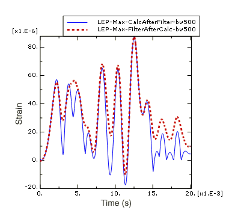

In [Figure 12--67](ch12s10.md#gxi-prin-strain-filter-v) you can see that there is a significant difference between filtering the strain data before and after the principal strain calculation. The curve that was filtered after the principal strain calculation is distorted because some of the frequency content introduced by applying the nonlinear principal-stress operator is higher than the 500 Hz filter cutoff frequency. In general, you should avoid directly filtering quantities that have been derived from nonlinear operators; whenever possible filter the underlying components and then apply the nonlinear operator to the filtered components to calculate the desired derived quantity.

**Strategy for recording and filtering Abaqus/Explicit history output**

Recording output for every increment in Abaqus/Explicit generally produces much more data than you need. The real-time filtering capability allows you to request history output less frequently without distorting the results due to aliasing. However, you should ensure that your output rate and filtering choices have not removed physically meaningful frequency content nor distorted the results (for example, by introducing a large time delay or by removing frequency content introduced by nonlinear operators). Keep in mind that no amount of postprocessing filtering can recover frequency content filtered out during the analysis, nor can postprocessing filtering recover an original signal from aliased data. In addition, it may not be obvious when results have been over-filtered or aliased if additional data are not available for comparison. A good strategy is to choose a relatively high output rate and use the Abaqus/Explicit filters to prevent aliasing of the history output, so that valid and rich results are written to the output database. You may even wish to request output at every increment for a couple of critical locations. After the analysis completes, use the postprocessing tools in Abaqus/Viewer to quickly and iteratively apply additional filtering as desired.


