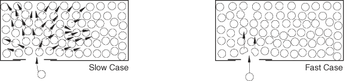

# 13.1 Analogy for explicit dynamics

To provide you with a more intuitive understanding of the differences between a slow, quasi-static loading case and a rapid loading case, we use the analogy illustrated in [Figure 13--1](ch13s01.md#gxi-fast-case). 

**Figure 13–1** Analogy for slow and fast loading cases.

The figure shows two cases of an elevator full of passengers. In the slow case the door opens and you walk in. To make room, the occupants adjacent to the door slowly push their neighbors, who push their neighbors, and so on. This disturbance passes through the elevator until the people next to the walls indicate that they cannot move. A series of waves pass through the elevator until everyone has reached a new equilibrium position. If you increase your speed slightly, you will shove your neighbors more forcefully than before, but in the end everyone will end up in the same position as in the slow case.

In the fast case the door opens and you run into the elevator at high speed, permitting the occupants no time to rearrange themselves to accommodate you. You will injure the two people directly in front of the door, while the other occupants will be unaffected.

The same thinking is true for quasi-static analyses. The speed of the analysis often can be increased substantially without severely degrading the quality of the quasi-static solution; the end result of the slow case and a somewhat accelerated case are nearly the same. However, if the analysis speed is increased to a point at which inertial effects dominate, the solution tends to localize, and the results are quite different from the quasi-static solution.

