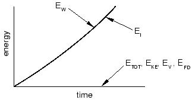
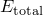

# 13.4 Energy balance

The most general means of evaluating whether or not a simulation is producing an appropriate quasi-static response involves studying the various model energies. The following is the energy balance equation in Abaqus/Explicit:

where  is the internal energy,  is the viscous energy dissipated,  is the frictional energy dissipated,  is the kinetic energy,  is the internal heat energy,  is the work done by the externally applied loads, and , , and  are the work done by contact penalties, by constraint penalties, and by propelling added mass, respectively.  is the external heat energy through external fluxes. The sum of these energy components is , which should be constant. In the numerical model  is only approximately constant, generally with an error of less than 1%.

To illustrate energy balance with a simple example, consider the uniaxial tensile test shown in [Figure 13--6](ch13s04.md#gxi-uni-tensile-test). 

**Figure 13–6** Uniaxial tensile test.

The energy history for the quasi-static test would appear as shown in [Figure 13--7](ch13s04.md#gxi-hist-tensile-test). 

**Figure 13–7** Energy history for quasi-static tensile test.

If a simulation is quasi-static, the work applied by the external forces is nearly equal to the internal energy of the system. The viscously dissipated energy is generally small unless viscoelastic materials, discrete dashpots, or material damping are used. We have already established that the inertial forces are negligible in a quasi-static analysis because the velocity of the material in the model is very small. The corollary to both of these conditions is that the kinetic energy is also small. As a general rule the kinetic energy of the deforming material should not exceed a small fraction (typically 5% to 10%) of its internal energy throughout most of the process. 

When comparing the energies, remember that Abaqus/Explicit reports a global energy balance, which includes the kinetic energy of any rigid bodies with mass. Since only the deformable bodies are of interest when evaluating the results, the kinetic energy of the rigid bodies should be subtracted from  when evaluating the energy balance. 

For example, if you are simulating a transport problem with rolling rigid dies, the kinetic energy of the rigid bodies may be a significant portion of the total kinetic energy of the model. In such cases you must subtract the kinetic energy associated with rigid body motions before a meaningful comparison with internal energy can be made.

