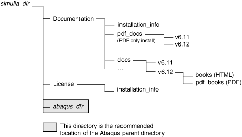

# B.1 SIMULIA 父目录

与 Abaqus 许可和文档安装相关的所有文件都存储在 SIMULIA 父目录中。建议也将 Abaqus 产品安装在 SIMULIA 父目录内。SIMULIA 父目录的建议名称为 `SIMULIA`；在本指南中，SIMULIA 父目录在路径列表中被称为 `*simulia_dir*`。根据所选的安装选项，将在 `*simulia_dir*` 下创建以下目录：

| `License` | 许可相关所有文件的默认目录（许可文件、服务器日志文件和许可选项文件）。 |
| --- | --- |
|  | `installation_info` | 包含许可安装过程和 Windows 卸载程序（如果使用）的 FLEXnet 许可启动命令和日志文件的目录。 |
| `Documentation` | 文档相关所有文件的默认目录。 |
|  | `installation_info` | 包含重新启动 Web 服务器的命令以及文档安装过程和 Windows 卸载程序（如果使用）的日志文件的目录。 |
|  | `docs` | 包含 HTML 加 PDF 文档安装的特定版本书籍文件的目录。 |
|  | `pdf_docs` | 包含仅 PDF 文档安装的特定版本书籍文件的目录。 |

SIMULIA 父目录结构的说明如图 [Figure B--1](ap02s01.md#sgb-directories-simulia-nls) 所示。

**图 B–1** SIMULIA 父目录结构。

