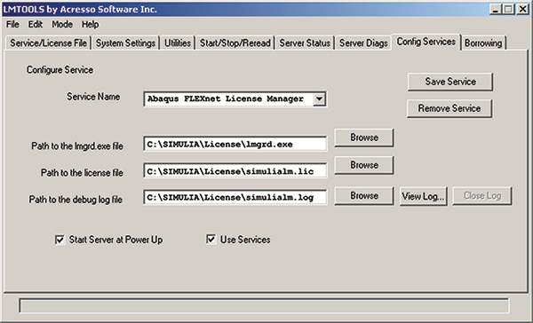

# 3.6 FLEXnet Licensing administration tools


FLEXnet Licensing provides administration tools to help manage the network licensing activities. The Abaqus licensing installation procedure installs the license file and the Abaqus license server. The FLEXnet Licensing administration tools are installed in `*simulia_dir*/License`. If you have installed Abaqus products on the license server, you can access the `License` directory using the `abaqus` command. Running the command

```
abaqus licensing
```
 without additional arguments displays a command usage summary of all available FLEXnet Licensing administration tools. The FLEXnet Licensing End User Guide Version 11.6 contains detailed information on the syntax and options of the FLEXnet Licensing administration tools. You can download this guide from the **Licensing** section of the **Support** page at [www.3ds.com/simulia](http://www.3ds.com/simulia).

On Windows platforms the licensing tools are also available using the FLEXnet Licensing toolchest **LMTOOLS**. The **LMTOOLS** toolchest can be accessed from the **Start** menu or by executing one of the following commands:

```
abaqus licensing lmtools

*or*

*simulia_dir*/License/lmtools
```

The following sections describe the syntax and options of several commonly used FLEXnet Licensing administration tools and **LMTOOLS** procedures:
- ["lmdiag," Section 3.6.1](ch03s06.md#sgb-chp-net-lic-lmdiag)
- ["lmdown," Section 3.6.2](ch03s06.md#sgb-chp-net-lic-lmdown)
- ["lmhostid," Section 3.6.3](ch03s06.md#sgb-chp-net-lic-lmhostid)
- ["lmpath," Section 3.6.4](ch03s06.md#sgb-chp-net-lic-lmpath)
- ["lmremove," Section 3.6.5](ch03s06.md#sgb-chp-net-lic-lmremove)
- ["lmreread," Section 3.6.6](ch03s06.md#sgb-chp-net-lic-lmreread)
- ["lmstat," Section 3.6.7](ch03s06.md#sgb-chp-net-lic-lmstat)
- ["Installing FLEXnet licensing as a Windows service," Section 3.6.8](ch03s06.md#sgb-chp-net-lic-service)
- ["Starting the FLEXnet server using **LMTOOLS**," Section 3.6.9](ch03s06.md#sgb-chp-net-lic-start)

### 3.6.1 lmdiag

The `lmdiag` tool allows you to diagnose problems when you cannot check out a license.

**Syntax and Options**

`lmdiag` [`-c` *license_file_list*] [`-n`] [*feature*[:*keyword=value*]]

**`-c *license_file_list*`**

Diagnose the specified files.

**`-n`**

Run in non-interactive mode; `lmdiag` will not prompt for any input in this mode. In this mode extended connection diagnostics (see below) are not available.

**`*feature*`**

Diagnose this feature only.

**`*keyword*=*value*`**

If a license file contains multiple lines for a particular feature, you can select a particular line for `lmdiag` to report on. For example,

```
lmdiag f1:HOSTID=12345678
```
 attempts a checkout on the line with the hostid “12345678.” *keyword* can be one of the following:- VERSION
- HOSTID
- EXPDATE
- KEY
- VENDOR_STRING
- ISSUER

If no *feature* is specified, `lmdiag` operates on all features in the license files in your list. `lmdiag` first prints information about the license, then attempts to check out each license. If the checkout succeeds, `lmdiag` indicates this. If the checkout fails, `lmdiag` gives you the reason for the failure. If the checkout fails because `lmdiag` cannot connect to the license server, you have the option of running “extended connection diagnostics.”

These extended diagnostics attempt to connect to each TCP/IP port on the license server machine and detect if the port number in the license file is incorrect. `lmdiag` indicates each TCP/IP port number that is listening. If it is an `lmgrd` process, `lmdiag` indicates this as well. If `lmdiag` finds the vendor daemon for the feature being tested, it indicates the correct port number for the license file to correct the problem.

See The FLEXnet Licensing End User Guide Version 11.6 for additional information. This guide is available for download from the **Licensing** section of the **Support** page at [www.3ds.com/simulia](http://www.3ds.com/simulia).

**To use **LMTOOLS** (Windows platforms) to run `lmdiag`:**

1. From the **Start** menu, select ****Programs****Abaqus Licensing****Licensing utilities****.
2. Verify that **Configuration using Services** is enabled on the **Service/License File** tabbed page, and select the **Server Diags** tab.
3. Click **Perform Diagnostics**.

### 3.6.2 lmdown

The `lmdown` tool allows for the graceful shutdown of selected license daemons (both `lmgrd` and selected vendor daemons) on all machines.

**Syntax and Options**

`lmdown` `-c` *license_file_list* [`-vendor` *vendor*] [`-q`] [`-all`]

**`-c *license_file_list*`**

Use the specified license files. Specifying `-c` *license_file_list* is always recommended with `lmdown`.

**`-vendor *vendor*`**

Shut down only this vendor daemon. `lmgrd` continues running. 

**`-q`**

Do not prompt or print a header. Otherwise, `lmdown` asks “Are you sure? [y/n]:.”

**`-all`**

If multiple servers are specified, automatically shut down all of them. `-q` is implied with `-all`.

You can protect the unauthorized execution of `lmdown` when you start up the license manager daemon `lmgrd`. Shutting down the servers causes users to lose their licenses. See the `-local`, `-2` `-p`, and `-x` options in ["FLEXnet license server manager lmgrd," Section 3.5](ch03s05.md), for details about securing access to `lmdown`.

If `lmdown` encounters more than one server (for example, if `-c` specifies a directory with many `*.lic` files), a choice of license servers to shut down is presented.

**Note:**On UNIX platforms, do *not* use `kill -9` to shut down the license servers. On Windows platforms, if you must use the **Task Manager** to kill the FLEXnet Licensing service, be sure to end the `lmgrd` process first, then all the vendor daemon processes.

To stop and restart a single vendor daemon, use `lmdown` `-vendor` *vendor*, then use `lmreread` `-vendor` *vendor* to restart the vendor daemon (see ["lmreread," Section 3.6.6](ch03s06.md#sgb-chp-net-lic-lmreread)).

When shutting down a three-server redundant license server, there is a one-minute delay before the servers shut down. `lmdown` shuts down all three license servers of a set of redundant license servers. If you need to shut down one of a set of redundant license servers (not recommended because if either of the remaining machines becomes unavailable, the license server will stop serving licenses), you must kill both the `lmgrd` and vendor daemon processes on that license server machine.

**To use **LMTOOLS** (Windows platforms) to run `lmdown`:**

1. From the **Start** menu, select ****Programs****Abaqus Licensing****Licensing utilities****.
2. Verify that **Configuration using Services** is enabled on the **Service/License File** tabbed page, and select the **Start/Stop/Reread** tab.
3. Click **Stop Server**.

### 3.6.3 lmhostid

The `lmhostid` tool returns the FLEXnet Licensing host id of the current platform. 

**Syntax and Options**

`lmhostid` [`-n`] 

**`-n`**

Only the host id is returned as a string, which is appropriate to use with `HOSTID=` in the license file. Header text is suppressed.

**Example**

The following is an example of `lmhostid` output:

```
lmutil - Copyright (c) 1989-2008 Acresso Software
The FLEXlm host ID of this machine is "69021c89"
```

**To use **LMTOOLS** (Windows platforms) to run `lmhostid`:**

1. From the **Start** menu, select ****Programs****Abaqus Licensing****Licensing utilities****.
2. Verify that **Configuration using Services** is enabled on the **Service/License File** tabbed page, and select the **System Settings** tab. The host id is listed under **Ethernet Address**.

### 3.6.4 lmpath

The `lmpath` tool allows direct control over FLEXnet license path settings. It is most useful for checking current license path settings for diagnostic purposes.

**Syntax and Options**

`lmpath` {`-add` | `-override`} {*vendor* | `all`} *license_file_list*

**`-add`**

Prepends *license_file_list* to the current license file list or creates the license file list, if it does not exist, initializing it to *license_file_list*. Duplicates are discarded.

**`-override`**

Overrides the existing license file list with *license_file_list*. If *license_file_list* is the null string (`""`), the specified list is deleted.
- `lmpath -override all ""` Deletes the value of `LM_LICENSE_FILE`.
- `lmpath -override *vendor* ""` Deletes the value of `*VENDOR*_LICENSE_FILE`

** `*vendor*`**

A vendor daemon name. Affects the value of `*VENDOR*_LICENSE_FILE`.

**`all`**

Refers to all vendor daemons. Affects the value of `LM_LICENSE_FILE`.

**`*license_file_list*`**

A colon-separated list on Linux platforms or a semicolon-separated list on Windows platforms. If *license_file_list* is the null string (`""`), the specified entry is deleted.

**Note:**`lmpath` works by setting `$HOME/.flexlmrc` on Linux platforms and the FLEXnet Licensing registry entry on Windows platforms.

To display the current license path settings, use the command

```
lmpath -status
```
The following information is displayed:
```
lmutil - Copyright (C) 1989-2008 Acresso Software
Known Vendors:
_____________
demo: ./counted.lic:./uncounted.lic
_____________
Other Vendors:
_____________
/usr/local/flexlm/licenses/license.lic
```
Where the path is set to a directory, all of the `*.lic` files are listed separately.

**To use **LMTOOLS** (Windows platforms) to run `lmpath`:**

1. From the **Start** menu, select ****Programs****Abaqus Licensing****Licensing utilities****.
2. Verify that **Configuration using Services** is enabled on the **Service/License File** tabbed page, and select the **Utilities** tab.
3. Click **List All Vendor Paths**.

### 3.6.5 lmremove

The `lmremove` tool allows you to remove a single user's license for a specified feature. If the application is active, it rechecks out the license shortly after it is freed by `lmremove`. If an Abaqus process terminates abnormally, it may not return license tokens to the license pool even though the tokens are no longer needed. In this situation `lmremove` can be used to return Abaqus/CAE and Abaqus/Viewer tokens to the license pool. The *user*, *user_host*, *display*, *server_host*, *port*, and *handle* information must be obtained from the output of `lmstat -a`. The `lmremove` tool should not be used to return Abaqus analysis job tokens to the license pool; see [Appendix F, "Troubleshooting Abaqus FLEXnet licensing](ap06.md),” for more information.

**Note:**The `lmremove` tool does not free licenses for use by other jobs. To temporarily free a license for use by another job, a running analysis job can be suspended using the Abaqus **suspend** utility (refer to ["Job execution control," Section 3.2.39 of the Abaqus Analysis User's Guide](../usb/usb-link.md#usb-int-dsuspend), for details). A running analysis job can be terminated using the Abaqus **terminate** utility or the appropriate operating system utility to stop the executable for the analysis job. For an example of using the `lmremove` tool, see ["lmstat," Section 3.6.7](ch03s06.md#sgb-chp-net-lic-lmstat).

**Syntax and Options**

`lmremove` [`-c` *license_file_list*] *feature* *user* *user_host* *display*or `lmremove` [`-c` *license_file_list*] `-h` *feature* *server_host* *port* *handle*

**`-c *license_file_list*`**

Specifies the license files.

**`*feature*`**

Name of the feature checked out by the user.

** `*user*`**

Name of the user whose license you are removing, as reported by `lmstat -a`.

**`*user_host*`**

Name of the host the user is logged on to, as reported by `lmstat -a`.

**`*display*`**

Name of the display where the user is working, as reported by `lmstat -a`.

**`*server_host*`**

Name of the host on which the license server is running, as reported by `lmstat -a`.

**`*port*`**

TCP/IP port number where the license server is running, as reported by `lmstat -a`.

**`*handle*`**

License handle, as reported by `lmstat -a`.

The `lmremove` tool removes all instances of *user* on *user_host* and *display* from usage of *feature*. If the `-c *license_file_list*` option is specified, the indicated file is used as the license file. The `-h` variation uses *server_host*, *port*, and license *handle*, as reported by `lmstat -a`.

### 3.6.6 lmreread

The `lmreread` tool causes the license manager to reread the license file and start any new vendor daemons that have been added. In addition, all currently running vendor daemons are signaled to reread the license file and their end-user options files for changes in feature licensing information or option settings. If report logging is enabled, any report log data still in the vendor daemon's internal data buffer are flushed. `lmreread` recognizes changes to server machine host names but cannot be used to change server TCP/IP port numbers.

If the optional vendor daemon name is specified, only the named daemon rereads the license file and its end-user options file (in this case `lmgrd` does not reread the license file).

**Syntax and Options**

`lmreread` [`-c` *license_file_list*] [`-vendor` *vendor*] [`-all`]

**`-c *license_file_list*`**

Use the specified license files.

**`-vendor *vendor*`**

Only this vendor daemon rereads the license file. `lmgrd` restarts the vendor daemon if necessary.

**`-all`**

If more than one `lmgrd` is specified, instructs all `lmgrd`s to reread.

You may want to protect the execution of `lmreread`. See the `-2` `-p` and `-x` options in ["FLEXnet license server manager lmgrd," Section 3.5](ch03s05.md), for details about securing access to `lmreread`.

To stop and restart a single vendor daemon, use `lmdown` `-vendor` *vendor*, then use `lmreread` `-vendor` *vendor*, which restarts the vendor daemon.

**Note:**If you use the `-c` *license_file_list* option, the license files specified are read by `lmreread`, not by `lmgrd`; `lmgrd` rereads the file it read originally.

**To use **LMTOOLS** (Windows platforms) to run `lmreread`:**

1. From the **Start** menu, select ****Programs****Abaqus Licensing****Licensing utilities****.
2. Verify that **Configuration using Services** is enabled on the **Service/License File** tabbed page, and select the **Start/Stop/Reread** tab.
3. Select ** Abaqus 6.14 FLEXnet License Manager**, and click **ReRead License File**.

### 3.6.7 lmstat

The `lmstat` tool helps you monitor the status of all FLEXnet network licensing activities, including:
- Daemons that are running
- License files
- Users of individual features
- Users of features served by a specific vendor daemon

The `lmstat` tool prints information that it receives from the license server; therefore, it does not report on unserved licenses such as uncounted licenses. To report on an uncounted license, the license must be added to a served license file and the application must be directed to use the license server for that license file (via *@host, port@host,* or `USE_SERVER`). Queued users and licenses shared due to duplicate grouping are also not returned by `lmstat`.

**Syntax and Options**

`lmstat` [`-a`] [`-c` *license_file_list*] [`-f` [*feature*]] [`-i` [*feature*]] [`-s` [*server*]][`-S` [*vendor*]] [`-t` *timeout_value*]

**`-a`**

Displays all information.

**`-c *license_file_list*`**

Specifies the license files to use.

**`-f [*feature*]`**

Displays the users of *feature*. If *feature* is not specified, usage information for all features is displayed.

**`-i [*feature*]`**

Displays information from the `FEATURE/INCREMENT` line for the specified *feature* or for all features if *feature* is not specified.

**`-s [*server*]`**

Displays the status of all license files in `$VENDOR_LICENSE_FILE` or `$LM_LICENSE_FILE` on *server* or on all servers if *server* is not specified.

**`-S [*vendor*]`**

Lists all users of the specified vendor's features.

**`-t *timeout_value*`**

Sets the connection timeout to *timeout_value*. This limits the amount of time `lmstat` spends attempting to connect to *server*.

**Note:**The `lmstat -a` command is a potentially expensive command. With many active users, this command generates a lot of network activity.

The `lmremove` tool requires the output of the `lmstat -a` command, as shown in the example below.

**Example**

The output for the command

```
*simulia_dir*/License/lmstat -a
```
where *simulia_dir* is the SIMULIA parent directory, looks similar to the following:
```
License server status: 27000@firestar
    License file(s) on firestar: *simulia_dir*/License/simulialm.lic:
   firestar: license server UP (MASTER) v11.6
Vendor daemon status (on firestar):
 ABAQUSLM: UP v11.6
Feature usage info:
Users of cae: (Total of 4 licenses issued; Total of 1 license
in use)
  "cae" v61.2, vendor: ABAQUSLM
  floating license
    smith watt watt (v61.2) (firestar/27000 101), 
start Tue 3/1 9:29
```
where

| `smith` | *user* | User name |
| --- | --- | --- |
| `watt` | *user_host* | Host where user is running |
| `watt` | *display* | Display where user is running |
| `v61.2` | *release* | Release of feature |
| `firestar` | *server_host* | Host where license server is running |
| `27000` | *port* | Port on *server_host* where license server is running |
| `101` | *handle* | License handle |
| `start Tue 3/1 9:29` | *checkout_time* | Time that this license was checked out |

**Note:**The `lmremove` tool does not free licenses for use by other jobs (see ["lmremove," Section 3.6.5](ch03s06.md#sgb-chp-net-lic-lmremove), for more information).

To use the `lmremove` tool to free the license for a job run by user `smith`, you would use the command
```
abaqus licensing lmremove cae smith watt watt
```
where

| `cae` | *feature* | Name of the feature checked out by the user |
| --- | --- | --- |
| `smith` | *user* | Name of the user whose license you are removing, as reported by `lmstat -a` |
| `watt` | *user_host* | Name of the host the user is logged into, as reported by `lmstat -a` |
| `watt` | *display* | Name of the display where the user is working, as reported by `lmstat -a` |

**To use **LMTOOLS** (Windows platforms) to run `lmstat -a`:**

1. From the **Start** menu, select ****Programs****Abaqus Licensing****Licensing utilities****.
2. Verify that **Configuration using Services** is enabled on the **Service/License File** tabbed page, and select the **Server Status** tab.
3. Verify that **Display Everything** is enabled, and click **Perform Status Enquiry**.

### 3.6.8 Installing FLEXnet licensing as a Windows service

You must be logged in as Administrator to install licensing as a Windows service. You use the installation procedure to install the licensing administration tools. You must use the following procedure to install and start the service:

1. To access **LMTOOLS** from the **Start** menu, select ****Programs****Abaqus Licensing****Licensing utilities****.
2. Verify that **Configuration using Services** is enabled on the **Service/License File** tabbed page, and select the **Config Services** tab.
3. In the **Service Name** text field, type `Abaqus 6.14 FLEXnet License Manager`.
4. Specify the paths to the `lmgrd.exe` file, the license file, and the debug log file, as shown in [Figure 3--1](ch03s06.md#sgb-lmtools-service). **Figure 3--1** The **Config Services** tabbed page of **LMTOOLS.** 
5. Toggle on **Use Services**. **Start Server at Power Up** becomes available.
6. Toggle on **Start Server at Power Up**, and click **Save Service**.
7. Select the **Start/Stop/Reread** tab, and click **Start Server**.
8. From the main menu bar, select ****File****Exit**** to close the dialog box.

### 3.6.9 Starting the FLEXnet server using **LMTOOLS**

You must be logged in as Administrator to start the server.

1. To access **LMTOOLS** from the **Start** menu, select ****Programs****Abaqus Licensing****Licensing utilities****.
2. Verify that **Configuration using Services** is enabled on the **Service/License File** tabbed page, and select the **Start/Stop/Reread** tab.
3. Click **Start Server**.
4. From the main menu bar, select ****File****Exit**** to close the dialog box.


