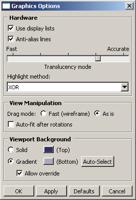
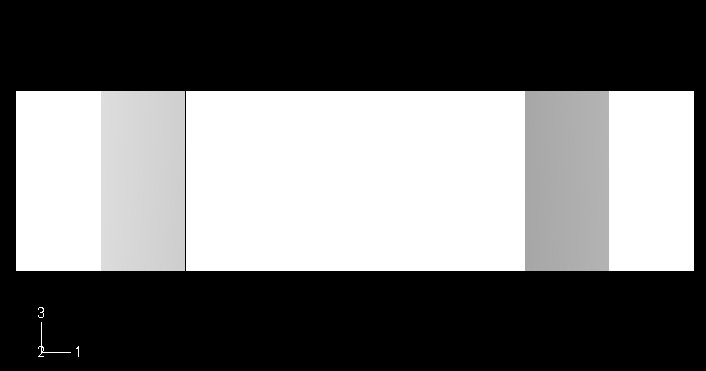
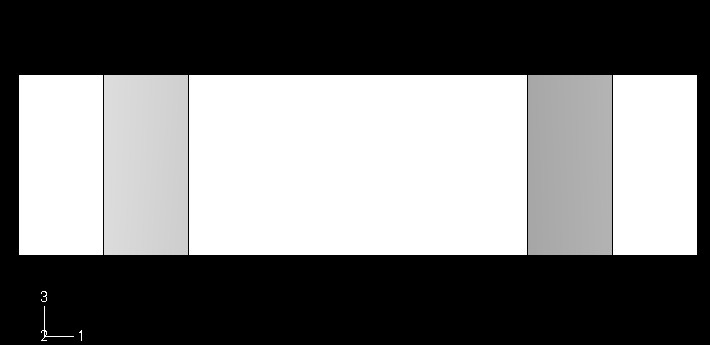
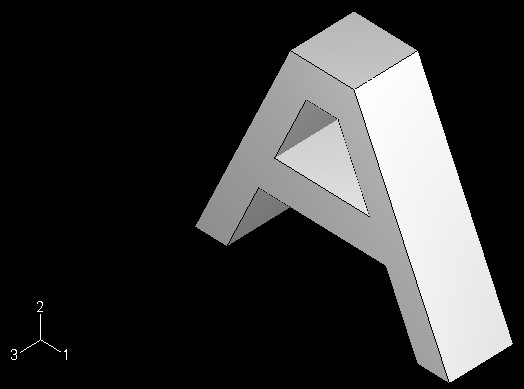
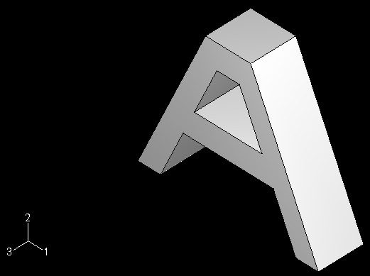

# 5.3 Tuning graphics cards


This section contains the information that you need to configure Abaqus/CAE and Abaqus/Viewer for a graphics adapter that is not yet qualified.

### 5.3.1 Why is tuning necessary?

SIMULIA tunes and qualifies a limited set of graphics adapters prior to each release. Tuning parameters for these graphics adapters are included in Abaqus. However, new graphics adapters and new drivers for existing graphics adapters become available between releases. Tuning may enable you to take advantage of these new adapters and drivers without waiting for a new release of Abaqus/CAE or Abaqus/Viewer. 

Abaqus/CAE and Abaqus/Viewer use OpenGL for high-speed graphics rendering. While the OpenGL standard has strict conformance tests, some features are implementation dependent and require tuning to function correctly. Tuning a new graphics adapter or driver ensures that Abaqus/CAE and Abaqus/Viewer graphics are rendered correctly and that maximum rendering performance is obtained for each system. 

You can find the latest information on qualified graphics adapters on the **Support** page at [www.3ds.com/simulia](http://www.3ds.com/simulia). If you read the information on this page and follow the tuning procedures described in this section, you should be able to render Abaqus/CAE and Abaqus/Viewer graphics correctly and with maximum performance. If you continue to experience problems, you should contact your local technical support office for assistance.

### 5.3.2 How can I tune the parameters?

Abaqus/CAE and Abaqus/Viewer provide the following two methods for tuning graphics parameters:
- Select ****View****Graphics Options**** from the main menu bar. Abaqus displays the **Graphics Options** dialog box shown in [Figure 5--1](ch05s03.md#graphics-options-db) from which you can select the desired settings. This approach allows you to select from only the most commonly used tuning parameters. **Figure 5--1** The **Graphics Options** dialog box.  The settings in the **Graphics Options** dialog box are described in [Chapter 7, "Configuring graphics display options," of the Abaqus/CAE User's Guide](../usi/usi-link.md#uss-pfm).
- Use an Abaqus Scripting Interface command to select the desired settings. You can enter the command in the command line interface (CLI) and modify the values of the tuning parameters. This approach provides complete control of all the tuning parameters and is described in ["Using the Abaqus Scripting Interface to tune the graphics parameters," Section 5.3.3](ch05s03.md#sgb-chp-view-tune-acl). This section also describes how you can use an Abaqus Scripting Interface command to obtain information about the graphics card that you are using.

[Table 5--1](ch05s03.md#table-tuning-params) shows the tuning parameters that are available from Abaqus/CAE and Abaqus/Viewer. The table also shows the standard value of each parameter and whether you can use the **Graphics Options** dialog box to modify it. Certain parameters can be modified only before starting an Abaqus/CAE or Abaqus/Viewer session (see ["Making your graphics configuration permanent," Section 5.3.4](ch05s03.md#sgb-chp-view-tune-permanent), for details on modifying parameters on startup).

**Table 5–1** Tuning parameters.
| Parameter | Standard value | Modify using **Graphics Options** dialog box | Modify only on startup |
| --- | --- | --- | --- |
| *displayLists* | On | Yes | No |
| *antiAlias* | On | Yes | No |
| *translucencyMode* 2 | More accurate than fast | Yes | No |
| *highlightMethod* 3 | Hardware | Yes | No |
| *highlightMethodHint* | Hardware | Yes | No |
| *dragMode* | As-is | Yes | No |
| *autoFitAfterRotate* | Off | Yes | No |
| *backgroundColor* | #333366 | Yes | No |
| *backgroundBottomColor* | #acacc1 | Yes | No |
| *backgroundStyle* | Gradient | Yes | No |
| *backgroundOverride* | On | Yes | No |
| *doubleBuffering* | On | No | No |
| *polygonOffsetConstant* | 0.0 to 100.0 | No | No |
| *polygonOffsetSlope* | 0.0 to 100.0 | No | No |
| *printPolygonOffsetConstant* | 0.0 to 100.0 | No | No |
| *printPolygonOffsetSlope* | 0.0 to 100.0 | No | No |
| *textureMapping* | On | No | No |
| *printTextureMapping* | On | No | No |
| *vertexArrays* | On | No | No |
| *vertexArraysInDisplayLists* | On | No | No |
| *backfaceCulling* | On | No | No |
| *directRendering* | On | No | Yes |
| *accelerateOffScreen* | Off | No | Yes |
| *backingStore* | On | No | No |
| *hardwareAcceleration* 4 | On | No | Yes |
| *hardwareOverlay* | None | No | Yes |
| *hardwareOverlayAvailable* 5 | None | No | N/A |
| *shadersAvailable* 5 | None | No | N/A |
| *viewManipDisplayListThreshold* 1 | 40 | No | No |
| *contourRangeTexturePrecision* | 5.0106 | No | No |
| 1The threshold is only used in the Visualization module of Abaqus/CAE (Abaqus/Viewer) when display lists are enabled. |
| 2Translucency mode settings for rendering of translucent objects range from 1 (optimized for performance) to 5 (optimized for accuracy). The default value is 4. |
| 3The highlight method is indirectly set by setting the *highlightMethodHint* parameter. Abaqus uses this value to determine an appropriate setting for *highlightMethod*. |
| 4Hardware acceleration is applicable only to Windows platforms. |
| 5You cannot directly set the *hardwareOverlayAvailable* parameter or the *shadersAvailable* parameter. Abaqus automatically sets these parameters by detecting the available hardware on your system. |

### 5.3.3 Using the Abaqus Scripting Interface to tune the graphics parameters

You can enter Abaqus Scripting Interface commands in the command line interface to tune your graphics parameters and to find out information about the graphics adapter installed on your system. This section explains how to use the Abaqus Scripting Interface to modify the graphics options; the Abaqus Scripting Interface is described in detail in the [Abaqus Scripting User's Guide](../cmd/cmd-link.md#cmd).

In general, you should use the default values for most of the parameters. However, Abaqus provides the capability to modify parameters to fix the following specific problems:
- The *hardwareAcceleration* parameter controls a number of different graphics tuning parameters and generally should not be modified. Hardware acceleration options are discussed in ["Hardware acceleration (all platforms)," Section 5.1.1](ch05s01.md#sgb-chp-view-cust-hardware).
- The *hardwareOverlay* parameter is controlled by the *hardwareOverlayAvailable* parameter. If your system supports hardware overlay planes, Abaqus/CAE and Abaqus/Viewer will use them by default. If your system supports hardware overlay planes but viewports display a solid color and will not display a model, you may need to manually set *hardwareOverlay*=OFF.
- The *contourRangeTexturePrecision* parameter sets the tolerance used when computing the appropriate scale for transforming result (contour) values to texture values. When set too low, the "out of range" colors may be shown incorrectly for values near the range limits.
- Some graphics adapters do not support the use of textures to generate contour plots properly. If you experience problems displaying contour plots (for example, all contours appear gray or the system aborts), you need to set *textureMapping*=OFF to emulate texture mapping in software. Similarly, if you experience problems printing contour plots, you need to set *printTextureMapping*=OFF.
- Some graphics adapters do not fully support the use of vertex arrays to process information about vertices. Some specific problems indicate that vertex arrays are not fully supported: when you drag the radius of a circle in the Sketcher, the circle is not visible; when you display an *X--Y* plot, the axis labels are not visible; and some facets in the shaded display of a mesh are missing. If you experience any of these problems, set *vertexArraysInDisplayLists*=OFF. If this does not resolve the problem, suppress the use of vertex arrays altogether by setting *vertexArrays*=OFF.
- The *backfaceCulling* parameter controls the display of facets that are determined to be facing away from the viewer. If the front sides of elements appear to be missing in the display or if the display is incomplete, set *backfaceCulling*=OFF.
- You can disable direct rendering (set *directRendering*=OFF) for Linux systems that do not behave correctly when accessing the graphics hardware directly.
- You can disable hardware-accelerated off-screen rendering (set *accelerateOffScreen*=OFF) when you want printed images to be rendered without OpenGL hardware acceleration or if you experience problems with the Probe functionality in the Visualization module of Abaqus/CAE (Abaqus/Viewer).
- You can disable the backing store (set *backingStore*=OFF) when you want to conserve memory. When *accelerateOffScreen*=ON, the memory for the backing store is allocated from memory on the graphics card. When OFF, the memory for backing store is allocated from system memory. The backing store is generated by rendering the viewport to an off-screen area. Subsequent viewport refreshes are performed more quickly by copying the off-screen area to the viewport window. Even when *backingStore*=ON, the backing store will not be created if the viewport can be redrawn sufficiently quickly.
- The *translucencyMode* parameter determines whether Abaqus/CAE optimizes the rendering of translucent objects for performance, accuracy, or for a level in between. Lower values provide better performance, while higher values provide greater accuracy.
- The *polygonOffsetConstant* and *polygonOffsetSlope* parameters, which affect onscreen display, require manual tuning for each graphics adapter. On Linux systems the *printPolygonOffsetConstant* and *printPolygonOffsetSlope* parameters can generally be set equal to the same values as the corresponding onscreen display parameters. On Windows systems the *printPolygonOffsetConstant* and *printPolygonOffsetSlope* parameters do not generally need to be adjusted.
- The *viewManipDisplayListThreshold* parameter can be lowered if there is an unacceptable delay when initiating view manipulation operations in the the Visualization module. Increasing this value may increase the delay for large models but should produce improved graphics performance during the view manipulation. If set high with a large model, the delay can be many seconds and in excessive cases may exceed system graphics memory and result in an empty display (no visible model) for the view manipulation. You can tune the graphics parameters using the following Abaqus Scripting Interface objects:
- GraphicsOptions: The members of the GraphicsOptions object determine the current graphics settings. These settings can be modified during a session using the `setValues` method. The arguments to the `setValues` method are described in ["setValues," Section 17.9.1 of the Abaqus Scripting Reference Guide](../ker/ker-link.md#ker-graphicsoptions-setvalues-pyc). You can view the current settings of the graphics parameters by entering the following command in the command line interface: ``` print session.graphicsOptions ``` The following output is typical: ``` ({'accelerateOffScreen': OFF, 'antiAlias': ON, 'autoFitAfterRotate': OFF, 'backfaceCulling': ON, 'backgroundBottomColor': '#acacc1', 'backgroundColor': '#333366', 'backgroundOverride': ON, 'backgroundStyle': GRADIENT, 'backingStore': ON, 'contourRangeTexturePrecision': 5.0e-06 'directRendering': ON, 'displayLists': ON, 'doubleBuffering': ON, 'dragMode': AS_IS, 'graphicsDriver': OPEN_GL, 'hardwareAcceleration': ON, 'hardwareOverlay': OFF, 'hardwareOverlayAvailable': False, 'highlightMethod': SOFTWARE_OVERLAY, 'highlightMethodHint': (HARDWARE_OVERLAY, SOFTWARE_OVERLAY, XOR, BLEND), 'polygonOffsetConstant': 2.0, 'polygonOffsetSlope': 0.75, 'printPolygonOffsetConstant': 1.0, 'printPolygonOffsetSlope': 0.75, 'printTextureMapping': ON, 'shadersAvailable': True, 'stencil': False, 'textureMapping': ON, 'translucencyMode': 3, 'vertexArrays': ON, 'vertexArraysInDisplayLists': ON, 'viewManipDisplayListThreshold': 40}) ``` **Note:**Some of the parameters listed above have been deprecated. For information on accessing deprecated parameters, see ["BackwardCompatibility object," Section 53.4 of the Abaqus Scripting Reference Guide](../ker/ker-link.md#ker-utl-deprecated-pyc). The following command uses the `setValues` method to modify some members of the GraphicsOptions object: ``` session.graphicsOptions.setValues(autoFitAfterRotate=ON, dragMode=AS_IS) ``` You can enter this command in the command line interface.
- GraphicsInfo: The members of the GraphicsInfo object provide information about the graphics adapter installed on your system. This information may be useful for determining how to tune the graphics adapter. The members are described in ["GraphicsInfo object," Section 17.8 of the Abaqus Scripting Reference Guide](../ker/ker-link.md#ker-graphicsinfo-pyc). The members are for reference only and cannot be modified. You can view the graphics information by entering the following command in the command line interface: ``` print session.graphicsInfo ``` The following output is typical on Windows platforms: ``` ({'glRenderer': 'Quadro FX 560/PCI/SSE2', 'glVendor': 'NVIDIA Corporation', 'glVersion': (2, 0, '.3'), 'glxClientVendor': None, 'glxClientVersion': (None, None, None), 'glxServerVendor': None, 'glxServerVersion': (5, 1, None)}) ```

**Tuning the polygonOffsetConstant and polygonOffsetSlope parameters**

If display lists are enabled, you will not see the effect of tuning these parameters; therefore, you must toggle off **Use display lists** before attempting to tune your graphics adapter. Alternatively, you can enter the following command in the command line interface:

```
session.graphicsOptions.setValues(displayLists=OFF)
```

Setting drag mode to AS_IS is helpful for fine tuning the parameters. Rotating the view interactively will show you if minor adjustments are necessary.

```
session.graphicsOptions.setValues(dragMode=AS_IS)
```

It is recommended that you tune *polygonOffsetConstant* first, then tune *polygonOffsetSlope*. To tune these parameters, you should first display the part that is generated by the example script in ["Creating a part," Section 3.1 of the Abaqus Scripting User's Guide](../cmd/cmd-link.md#cmd-int-overview-examplepart). To retrieve the script, use the following command in a command prompt window (operating system shell): 

```
abaqus fetch job=modelAExample
```
Select ****File****Run Script**** from the main menu bar, select the example script from the **Run Script** dialog box that appears, and click **OK**. The example script creates a new viewport; however, Abaqus should display only one viewport while you are trying to tune the graphics parameters. Select any old viewports and delete them by selecting ****Viewport****Delete Current**** from the main menu bar.

**To tune the polygonOffsetConstant parameter:**

1. From the **Views** toolbar, apply the bottom view .
2. In the command line interface, enter the following commands: ``` session.graphicsOptions.setValues(polygonOffsetSlope=0.0) session.graphicsOptions.setValues(polygonOffsetConstant=0.0) ```
3. Display the bottom view again to refresh the display.
4. Examine the model for visible lines. If all lines are not visible, repeat Step 2, increasing the value of the polygon offset constant by a small increment; for example, `0.1`. The normal range for this parameter is between `0.5` and `1.5`, and two decimal places usually provide sufficient precision. You should attempt to find a value as small as possible that produces a correct display. Values that are too large may cause the lines to appear to float above the part. The following figures illustrate the lines that should be visible in your model. [Figure 5--2](ch05s03.md#bad-polygon-constant) illustrates the model with an incorrect value for *polygonOffsetConstant*; some lines are missing between the shaded areas. **Figure 5--2** Incorrect value for *polygonOffsetConstant*.  [Figure 5--3](ch05s03.md#good-polygon-constant) illustrates the model with a correct value for *polygonOffsetConstant*; all the shaded areas are separated by lines. **Figure 5--3** Correct value for *polygonOffsetConstant*. 

After you have derived a value for *polygonOffsetConstant*, you can tune *polygonOffsetSlope*.

**To tune the polygonOffsetSlope parameter:**

1. From the **Views** toolbar, apply the isometric view . This view shows edges at a 45 angle on at least one axis.
2. In the command line interface, enter the following command: ``` session.graphicsOptions.setValues(polygonOffsetSlope=1.0) ```
3. Examine the model for visible lines. If all lines are not visible, repeat Step 2, increasing the value of the polygon offset slope by a small increment; for example, `0.1` or `0.05`. The normal range for this parameter is between `1.0` and `2.0`, and two decimal places usually provide sufficient precision. If the *polygonOffsetConstant* value is too low, it may force the *polygonOffsetSlope* to be high. High values of *polygonOffsetSlope * may cause the edges of hidden polygons to show through where they meet visible polygons. In this case, raise the *polygonOffsetConstant* value to get an acceptable value for *polygonOffsetSlope*. [Figure 5--4](ch05s03.md#bad-polygon-slope) illustrates the model with an incorrect value for *polygonOffsetSlope*; some line segments are missing between the shaded areas, there is a line missing inside the hole, and some lines appear dashed when they should appear solid. **Figure 5--4** Incorrect value for *polygonOffsetSlope*.  [Figure 5--5](ch05s03.md#good-polygon-slope) illustrates the model with a correct value for *polygonOffsetSlope*; all the shaded areas are separated by solid lines. **Figure 5--5** Correct value for *polygonOffsetSlope*. 

Test the tuned values of *polygonOffsetConstant* and *polygonOffsetSlope* on several models to make sure the values are satisfactory. When you have finished tuning the graphics parameters, you should return your settings for display lists and drag mode to the original values.

When you are satisfied with the parameter settings, you should modify the environment file as described in ["Making your graphics configuration permanent," Section 5.3.4](ch05s03.md#sgb-chp-view-tune-permanent).

### 5.3.4 Making your graphics configuration permanent

Once you are satisfied with the values you have specified for the tuning parameters, you can make the changes permanent by including an `onCaeGraphicsStartup` function in your environment file (`abaqus_v6.env`). To avoid conflicts with other graphics settings, you should add the customized `onCaeGraphicsStartup` function only to the environment file in your home directory (see ["Using the Abaqus environment file," Section 4.1](ch04s01.md), for details on environment file location and execution).

The members of the DefaultGraphicsOptions object determine the default graphics settings that are enabled when you start a session and when you click **Defaults** in the **Graphics Options** dialog box. You can view the default graphics settings by entering the following command in the command line interface:

```
print session.defaultGraphicsOptions
```

You use the `setValues` method in the environment file (`abaqus_v6.env`) to modify the members of the DefaultGraphicsOptions object. To set your default graphics options in the environment file, you must use the `session.defaultGraphicsOptions` object instead of the `session.graphicsOptions` object that you modified from the command line interface. The following example environment file configures your Abaqus/CAE and Abaqus/Viewer graphics settings: 

```
def onCaeGraphicsStartup():
    session.defaultGraphicsOptions.setValues(
        polygonOffsetConstant=1.0,
        polygonOffsetSlope=1.2)
```


