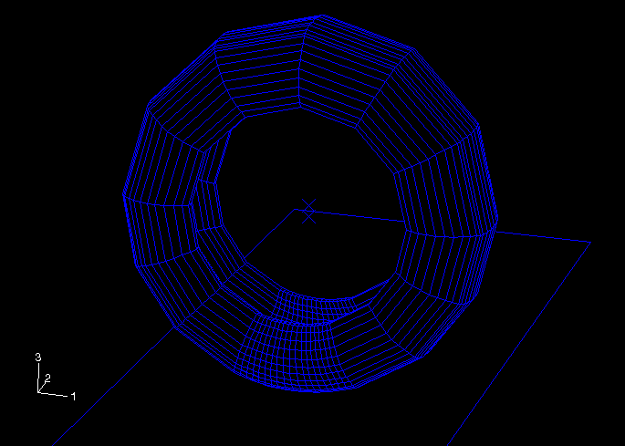
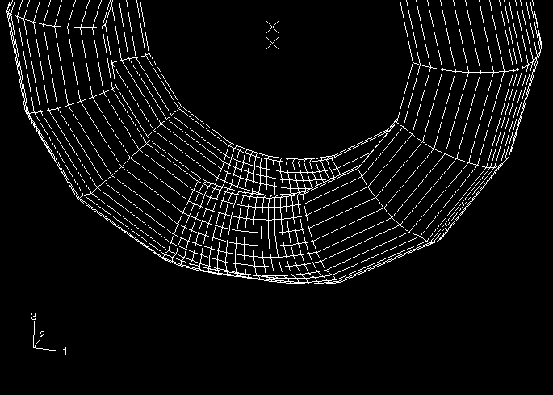

# 4.3 Example 3: Tire


This example models a tire. The substructure is created after solving a highly nonlinear prestress problem to account for inflating the tire and giving it a footprint due to contact with the road.

**To perform the analysis for the tire:**

1. Enter the following commands to extract the input files from the compressed archive files provided with the Abaqus release: ``` abaqus fetch job=adams_ex3A abaqus fetch job=adams_ex3A_nodes abaqus fetch job=adams_ex3B abaqus fetch job=adams_ex3C ```
2. You must perform three Abaqus analyses. 1. Enter the following command to solve an axisymmetric model for the tire inflation: ``` abaqus job=adams_ex3A ``` 2. Enter the following command to create the three-dimensional model of the tire from the axisymmetric model and its results and to calculate the footprint of the tire in contact with the road: ``` abaqus job=adams_ex3B oldjob=adams_ex3A ``` 3. Enter the following command to create the substructure model: ``` abaqus job=adams_ex3C oldjob=adams_ex3B ```
3. Enter commands to execute the Abaqus Interface for MSC.ADAMS and to create a modal neutral file for use with ADAMS/Flex. - On UNIX platforms enter the following commands: ``` setenv MDI_MNFWRITE_OPTIONS negative_roots_OK abaqus adams job=adams_ex3C unsetenv MDI_MNFWRITE_OPTIONS ``` - On Windows platforms enter the following commands: ``` set MDI_MNFWRITE_OPTIONS=negative_roots_OK abaqus adams job=adams_ex3C set MDI_MNFWRITE_OPTIONS= ```

This example extends the discussion of the model described in ["Symmetric results transfer for a static tire analysis," Section 3.1.1 of the Abaqus Example Problems Guide](../exa/exa-link.md#exa-veh-resultstrans). The Abaqus analyses of `adams_ex3A` and `adams_ex3B` essentially replicate the inflation and footprint analysis of the tire as described in that section. However, a few modifications have been made to `adams_ex3B` to prepare it for the substructure analysis that follows:
- The rim and hub are modeled as a rigid body, whose reference node is located at the axle. Six degrees of freedom of the reference node will be among the retained degrees of freedom of the substructure.
- The footprint analysis is controlled by applying loads and boundary conditions to this reference node.
- The [*MODEL CHANGE](../key/key-link.md#usb-kws-hmodelchange), ACTIVATE option is used in the first step of the analysis. This option does not affect the results of that step but is required so that the road-tire contact pair can be removed before creating the substructure in the Abaqus restart analysis of `adams_ex3C`.
- The third step has output requests for CDISP and CSTRESS to determine the tire nodes in contact with the road at the end of the footprint analysis. A subset of these nodes will be among the retained nodes of the substructure.

The tire model in its original and deformed states is shown in [Figure 4--2](ch04s03.md#adm-tire-undeformed) and [Figure 4--3](ch04s03.md#adm-tire-deformed). 

**Figure 4–2** Tire model in the original state.



**Figure 4–3** Tire model in the deformed state.



The Abaqus analysis of `adams_ex3C `restarts from the inflation and footprint analysis of `adams_ex3B` and consists of the following three steps: 
- The tire is isolated from the road. The [*MODEL CHANGE](../key/key-link.md#usb-kws-hmodelchange), REMOVE, TYPE=CONTACT PAIR option is used to remove the rigid surface representing the road. The mechanics of the solution are unchanged, since the [*BOUNDARY](../key/key-link.md#usb-kws-hboundary), FIXED option is used to specify that the nodes in node set `FOOTPR` have displacements identical to their computed values at the end of the previous step. One effect of this step is to reformulate the stiffness matrix of the tire without the Lagrange multipliers that were used to enforce the contact constraints; this leads to a more realistic substructure matrix. This step writes displacements for all nodes to the results file so that deformed nodal coordinates will be written to the results file.
- Twenty normal modes of the tire are computed. This step has boundary conditions to restrain all degrees of freedom that will be retained in the substructure, plus additional restraints to maintain the footprint shape. This step writes element mass matrices for all elements and eigenvectors for all modes to the results file. The eight lowest vibration frequencies computed in this step are shown in [Table 4--4](ch04s03.md#table-admtire-restrained). **Table 4--4** Fixed-interface vibration frequencies for the prestressed tire. | Frequency, Hz | | --- | | 57 | | 65 | | 70 | | 83 | | 94 | | 99 | | 108 | | 118 | To compute the modes and frequencies for the unrestrained, prestressed tire, remove all boundary conditions and run a separate analysis. The eight lowest eigenvalues for this analysis are shown in [Table 4--5](ch04s03.md#table-admtire-prestressed). **Table 4--5** Eigenvalues computed by Abaqus for the unrestrained prestressed tire, using all DOFs of the FEA model. | Eigenvalue | | --- | | 3743 | | 1970 | | 0 | | 0 | | 0 | | 0 | | 3.048E+05 | | 3.208E+05 | The prestress has eliminated two of the zero eigenvalues that would be expected in an unstressed free vibration calculation. These eigenvalues are significantly negative; hence, their retention in the modal neutral file is optional and is controlled by an environment variable, as discussed in ["Translating modes with negative eigenvalues," Section 3.4](ch03s04.md).
- The substructure is created. The list of retained nodal degrees of freedom includes six degrees of freedom at the hub and three degrees of freedom at 35 nodes of the footprint. These contribute 111 degrees of freedom to the substructure. In addition, 20 fixed-interface normal modes are retained, so the substructure mass and stiffness matrices have 131 degrees of freedom. Depending on the engineering use of the substructure, you can choose other retained degrees of freedom. You can experiment with retaining a different number of nodes or possibly only the normal component of displacement at some nodes. In addition, the number of fixed-interface normal modes can be varied. The [*SUBSTRUCTURE MATRIX OUTPUT](../key/key-link.md#usb-kws-ssubmatrixoutput) option uses the optional parameter SLOAD=YES to write the modal load components to the results file. Thus, after translation, the loads corresponding to the fraction of vehicle weight that prestressed the tire will be in the modal neutral file used by ADAMS/Flex.

After reorthogonalizing the component modes computed by Abaqus, the Abaqus Interface for MSC.ADAMS reports the eigenvalues and frequencies of the modes it will store in the modal neutral file. As written to the screen during that translation step, the eigenvalues for the first eight modes are shown in [Table 4--6](ch04s03.md#table-admtire-final).

**Table 4–6** Eigenvalues computed by the Abaqus Interface for MSC.ADAMS for the tire, using component modal synthesis with 20 vibration modes and 111 static modes.
| Eigenvalue |
| --- |
| 3741 |
| 1969 |
| 0 |
| 0 |
| 0 |
| 0 |
| 3.139E+05 |
| 3.289E+05 |

The Abaqus input files, `adams_ex3B.inp` and `adams_ex3C.inp`, are shown below.

```
`adams_ex3B.inp`
```

```
`*heading
 tire superelement w/ symmetric results transfer
 step 0: generate full 3d model using tiretransfer_axi_full
 step 1: equilibrate results
 step 2: footprint analysis (displacement control)
 step 3: footprint analysis (load control)
 units: kg, m
*preprint,model=yes,history=yes
*node,nset=road
 9999,   0.0,   0.0, -0.02
*symmetric model generation,revolve,element=200,node=200
 0.0, 0.0, 0.0,    0.0, 1.0, 0.0
 0.0, 0.0, 1.0
 90.0, 3
 70.0, 3
 15.0, 7
 10.0, 4
 15.0, 7
 70.0, 3
 90.0, 3
*symmetric results transfer,step=1,inc=4
*elset,elset=foot,gen
 1001, 4801, 200
 1002, 4802, 200
 1003, 4803, 200
 1004, 4804, 200
 1005, 4805, 200 
 1007, 4807, 200
 1008, 4808, 200
 1009, 4809, 200
 1010, 4810, 200
 1011, 4811, 200
 1012, 4812, 200
 1014, 4814, 200
*surface,type=cylinder,name=sroad
 0., 0.,-0.31657,   1., 0.,-0.31657
 0., 1.,-0.31657
 start, -0.3, 0.
 line,   0.3, 0.
*rigid body,ref node=9999,analytical surface=sroad
*surface,name=stread
 foot, s3
*contact pair,interaction=srigid
 stread, sroad
*surface interaction,name=srigid
*friction
 0.0
*elset,elset=sect,generate
 2800, 3200, 1
*nset,nset=sect,generate
 2800, 3400, 1
*nset,nset=foot,elset=foot
*nset,nset=noutp,generate
 1055, 5055, 200
*file format,zero increment
**************************************************
*step,inc=100,nlgeom=yes
 1:  inflation
*static, long term
** 0.25, 1.0
1.,1.,1.
*model change, activate
*restart,write,overlay
*boundary
 rim_ref, 1, 6
*dload
belt,p5, 200.e3
side,p5, 200.e3
*node print,nset=road,freq=100
 u,
 rf,
*el print,freq=0
*node file,nset=foot,freq=100
*output,field,freq=100
*element output
 s,le
*node output,nset=foot
 u,
*contact output, var=preselect
*output,history,freq=1
*node output, nset=road
 u, rf
*end step
**************************************************
*step,inc=100,nlgeom=yes
 2:  footprint (displacement controlled)
*static, long term
 0.2, 1.0
*restart,write,overlay
*print,contact=yes
*boundary,op=new
 rim_ref,  1, 6
 road, 1, 2
 road, 4, 6
 road, 3, , 0.02
*node print,nset=road,freq=100
 u,
 rf,
*el print,freq=0
*end step
**************************************************
*step,inc=100,nlgeom=yes
 3:  footprint (load controlled)
*static, long term
 1.0, 1.0
*boundary,op=new
 rim_ref,  1, 6
 road, 1, 2
 road, 4, 6
*cload,op=new
 road, 3, 3300.
*contact print
cdisp,cstress
*end step
**************************************************`
```

```
`adams_ex3C.inp`
```

```
`*heading
 tire superelement w/ symmetric results transfer
 Restart to identify nodes in footprint
 step 4: remove contact constraints
 step 5: extract fixed interface modes
 step 6: generate superelement
 units: kg, m
*preprint,model=yes,history=yes
*restart,read,step=3,write,overlay
*elset,elset=eall
tread,side,belt
**
**************************************************
*nset,nset=footpr,unsorted
**
** This is the list of tire nodes found to be in contact with the 
** road at the end of the previous step.
** (These nodes had status CL in the contact print table.)
**
 1850, 1855, 1905, 2045, 2050, 2055, 2100, 2105, 2245, 2250, 2255, 
 2300, 2305, 2440, 2445, 2450, 2455, 2495, 2500, 2505, 2640, 2645, 
 2650, 2655, 2695, 2700, 2705, 2840, 2845, 2850, 2855, 2895, 2900, 
 2905, 3040, 3045, 3050, 3055, 3095, 3100, 3105, 3240, 3245, 3250, 
 3255, 3295, 3300, 3305, 3440, 3445, 3450, 3455, 3495, 3500, 3505, 
 3640, 3645, 3650, 3655, 3695, 3700, 3705, 3845, 3850, 3855, 3900, 
 3905, 4045, 4050, 4055, 4100, 4105, 4250, 4255, 4305 
**************************************************
*nset,nset=footpr_retnodes
**
** This is the list of nodes in the above footprint that will be 
** retained in the substructure.
**
 1850, 1855, 1905, 2045, 2100, 2440, 2445, 2450, 2455, 2505, 2500, 
 2495, 3040, 3045, 3050, 3055, 3105, 3100, 3095, 3640, 3645, 3650, 
 3655, 3705, 3700, 3695, 4045, 4050, 4105, 4100, 4250, 4255, 4305, 
 2050, 2105
**
**************************************************
*step,inc=1,nlgeom
 4: remove contact constraints
*static
1.,1.
*boundary,fixed,op=new
 rim_ref,1,6
 footpr,1,3
 road,1,6
*model change, type=contact pair, remove
 stread, sroad
**
** Write displacements for all nodes to the results file.
** (Needed so the MNF contains deformed nodal coordinates)
*node file
U,
*end step
**
**************************************************
*step
 5: extract fixed interface modes
*frequency, eigensolver=lanczos
20,
**
*boundary,op=new
 road, 1, 6
 rim_ref,1,6
 footpr,1,3
**
** Write element mass matrices to the results file.
*element matrix output, mass=yes, elset=eall
**
** Write eigenvectors to the results file.
*node file
U,
*end step
**
**************************************************
*step
 6: generate superelement
*substructure generate, type=z101, overwrite,
 recovery matrix=yes, mass matrix=yes
**
*boundary,op=new
 road, 1, 6
*retained nodal dofs, sorted=no
rim_ref,1,6
footpr_retnodes,1,3
*select eigenmodes, generate
1,20,1
*substructure matrix output, stiffness=yes, mass=yes,
 sload=yes, recovery matrix=yes
*end step
**
**************************************************`
```
 


