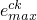

# *BRITTLE SHEAR

### *BRITTLE SHEAR定义与脆性开裂模型一起使用的材料的后开裂剪切行为。

此选项用于定义在脆性开裂模型中使用的材料的后开裂剪切行为。[*BRITTLE SHEAR](ch02abk15.md)选项必须与[*BRITTLE CRACKING](ch02abk13.md)选项一起使用，必须紧接在其之后。[*BRITTLE SHEAR](ch02abk15.md)选项可与[*BRITTLE FAILURE](ch02abk14.md)选项配合使用以指定脆性失效准则。

**产品：**Abaqus/Explicit  Abaqus/CAE

**类型：**模型数据

**级别：**模型

**Abaqus/CAE：**属性模块

##### **参考：**

- ["混凝土开裂模型，" Abaqus Analysis User's Guide第23.6.2节](../usb/usb-link.md#usb-mat-ccracking)
- [*BRITTLE CRACKING](ch02abk13.md)
- [*BRITTLE FAILURE](ch02abk14.md)

### **可选参数：**

DEPENDENCIES

将此参数设置为除了温度之外还包括在开裂剪切行为定义中的场变量依赖项数。如果省略此参数，则假定定义开裂剪切行为的参数是常数或仅取决于温度。有关更多信息，请参阅["材料数据定义，" Abaqus Analysis User's Guide第21.1.2节](../usb/usb-link.md#usb-mat-cmaterialdata)中的"使用DEPENDENCIES参数定义场变量依赖"。

TYPE

设置TYPE=RETENTION FACTOR（默认）以通过直接输入剪切保留因子-裂纹张开应变关系来指定后开裂剪切行为。

设置TYPE=POWER LAW以通过输入幂律剪切保留模型的材料参数*p*和来指定后开裂剪切行为。

### **包含TYPE=RETENTION FACTOR参数时的数据行（默认）：**

**第一行：**

每个温度值的第一点必须具有1.0的保留因子和0.0的开裂应变。

**后续行（仅在DEPENDENCIES参数的值大于五时才需要）：**

根据需要重复此组数据行，以将后开裂剪切行为定义为温度和其他预定义场变量的函数。

### **包含TYPE=POWER LAW参数时的数据行：**

**第一行：**

**后续行（仅在DEPENDENCIES参数的值大于五时才需要）：**

根据需要重复此组数据行，以将后开裂剪切行为定义为温度和其他预定义场变量的函数。

