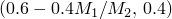
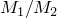
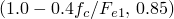
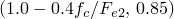
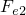

# *BUCKLING REDUCTION FACTORS

### *BUCKLING REDUCTION FACTORS为具有PIPE截面的框架单元的屈曲strut响应定义屈曲折减系数。

此选项用于定义ISO方程中使用的两个系数，该方程预测具有屈曲strut响应的框架单元的（响应切换到仅屈曲时的轴向载荷）。对于非默认屈曲包络线，[*BUCKLING REDUCTION FACTORS](ch02abk19.md)选项只能与[*FRAME SECTION](ch06abk34.md)，SECTION=PIPE，YIELD STRESS=选项和[*BUCKLING ENVELOPE](ch02abk17.md)选项配合使用。对于默认屈曲包络线，它只能与[*FRAME SECTION](ch06abk34.md)，BUCKLING，SECTION=PIPE，YIELD STRESS=选项配合使用。

**产品：**Abaqus/Standard

**类型：**模型数据

**级别：**部件、部件实例、模型

##### **参考：**

- ["框架单元，" Abaqus Analysis User's Guide第29.4.1节](../usb/usb-link.md#usb-elm-eframe)
- ["框架截面行为，" Abaqus Analysis User's Guide第29.4.2节](../usb/usb-link.md#usb-elm-eusingframesection)
- ["框架单元的屈曲strut响应，" Abaqus Theory Guide第3.9.3节](../stm/stm-link.md#stm-elm-strut)

### **可选参数：**

AXIS1

包含此参数以定义计算关于第一横截面方向弯曲的屈曲折减系数的方法。

设置AXIS1=TYPE1（默认）以将设置为的常数值。

设置AXIS1=TYPE2用于无分布横向载荷的构件。则=max，其中是单元端部关于第一横截面轴的较小与较大弯矩比。

设置AXIS1=TYPE3用于有分布横向载荷的构件。则=min，其中是压缩轴向应力，是对应于第一横截面方向的欧拉屈曲应力。

AXIS2

包含此参数以定义计算关于第二横截面方向弯曲的屈曲折减系数的方法。

设置AXIS2=TYPE1（默认）以将设置为的常数值。

设置AXIS2=TYPE2用于无分布横向载荷的构件。则=max，其中是单元端部关于第二横截面轴的较小与较大弯矩比。

设置AXIS2=TYPE3用于有分布横向载荷的构件。则=min，其中是压缩轴向应力，是对应于第二横截面方向的欧拉屈曲应力。

### **定义屈曲折减系数的数据行：**

**第一行（也是唯一数据行）：**

如果数据行上给出空白，则将其解释为零。如果数据行上给出空白或零值，并且为此折减系数包含了AXIS1或AXIS2参数，则参数值将覆盖数据行上给出的零值。如果数据行上给出了非零值，并且为同一折减系数指定了AXIS1或AXIS2参数，则会发出错误。

