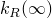
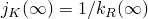
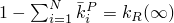

# *COMBINED TEST DATA

### *COMBINED TEST DATA同时指定归一化的剪切和体积柔量或松弛模量与时间的函数关系。

此选项只能与[*VISCOELASTIC](ch21abk04.md)选项结合使用，且不能与[*SHEAR TEST DATA](ch18abk13.md)和[*VOLUMETRIC TEST DATA](ch21abk08.md)选项一起使用。

**产品：**Abaqus/Standard  Abaqus/Explicit  Abaqus/CAE  

**类型：**模型数据

**级别：**模型

**Abaqus/CAE：**Property模块

##### **参考：**

- ["时域粘弹性"，Abaqus Analysis User's Guide第22.7.1节](../usb/usb-link.md#usb-mat-ctimevisco)
- [*VISCOELASTIC](ch21abk04.md)

### **可选参数：**

SHRINF

要指定蠕变测试数据，请将此参数设置为长期归一化剪切柔量的值。

要指定松弛测试数据，请将此参数设置为长期归一化剪切模量的值。

剪切柔量与剪切模量的关系为：。拟合过程将在约束中使用指定值。

VOLINF

要指定蠕变测试数据，请将此参数设置为长期归一化体积柔量的值。

要指定松弛测试数据，请将此参数设置为长期归一化体积模量的值。体积柔量与体积模量的关系为：。拟合过程将在约束中使用此值。

### **指定蠕变测试数据的数据行：**

**第一行：**

根据需要重复上述数据行以给出柔量-时间数据。

### **指定松弛测试数据的数据行：**

**第一行：**

根据需要重复上述数据行以给出模量-时间数据。

