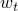
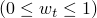

# *CONCRETE COMPRESSION DAMAGE

### *CONCRETE COMPRESSION DAMAGE为混凝土损伤塑性模型定义压缩损伤属性。

此选项用于为混凝土损伤塑性材料模型定义压缩损伤（或刚度退化）属性。[*CONCRETE COMPRESSION DAMAGE](ch03abk29.md)选项必须与[*CONCRETE DAMAGED PLASTICITY](ch03abk31.md)、[*CONCRETE TENSION STIFFENING](ch03abk33.md)和[*CONCRETE COMPRESSION HARDENING](ch03abk30.md)选项结合使用。此外，[*CONCRETE TENSION DAMAGE](ch03abk32.md)选项可用于指定拉伸刚度退化损伤。

**产品：**Abaqus/Standard  Abaqus/Explicit  Abaqus/CAE  

**类型：**模型数据

**级别：**模型

**Abaqus/CAE：**Property模块

##### **参考：**

- ["混凝土损伤塑性"，Abaqus Analysis User's Guide第23.6.3节](../usb/usb-link.md#usb-mat-cconcretedamaged)
- [*CONCRETE DAMAGED PLASTICITY](ch03abk31.md)
- [*CONCRETE TENSION STIFFENING](ch03abk33.md)
- [*CONCRETE COMPRESSION HARDENING](ch03abk30.md)
- [*CONCRETE TENSION DAMAGE](ch03abk32.md)

### **可选参数：**

DEPENDENCIES

将此参数设置为除了温度之外还包括在压缩损伤定义中的场变量依赖项数。如果省略此参数，则假定压缩损伤行为仅取决于温度。请参见["指定场变量依赖性"，Abaqus Analysis User's Guide第21.1.2节"材料数据定义"](../usb/usb-link.md#usb-mat-cmaterialdata-fvdepen)，以获取更多信息。

TENSION RECOVERY

此参数用于定义刚度恢复因子，该因子确定在载荷从压缩变为拉伸时恢复的拉伸刚度量。如果，材料完全恢复拉伸刚度；如果，则没有刚度恢复。的中间值会导致拉伸刚度的部分恢复。默认值为0.0。

### **定义压缩损伤的数据行：**

**第一行：**

每个温度值的第一点必须具有0.0的压碎应变和0.0的压缩损伤值。

**后续行（仅在DEPENDENCIES参数的值大于五时需要）：**

根据需要重复此组数据行，以定义压缩损伤行为对压碎应变、温度和其他预定义场变量的依赖关系。

