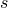

# *DAMPING

### *DAMPING指定材料阻尼。

**警告：**在Abaqus/Explicit中使用刚度比例材料阻尼可能会显著减少稳定时间增量，并可能导致更长的分析时间。请参见Abaqus分析用户指南第26.1.1节中的["材料阻尼"](../usb/usb-link.md#usb-mat-cdampingopt)。

此选项用于为Abaqus/Standard中的基于模式的分析和直接积分动态分析以及Abaqus/Explicit中的显式动态分析提供材料阻尼。

阻尼在材料数据块中定义，但使用 [*BEAM GENERAL SECTION](ch02abk05.md) 选项、[*SHELL GENERAL SECTION](ch18abk14.md) 选项、[*ROTARY INERTIA](ch17abk20.md) 选项、[*MASS](ch13abk04.md) 选项或 [*SUBSTRUCTURE PROPERTY](ch18abk46.md) 选项定义的单元除外。对于 [*BEAM GENERAL SECTION](ch02abk05.md)、[*SHELL GENERAL SECTION](ch18abk14.md) 和 [*SUBSTRUCTURE PROPERTY](ch18abk46.md) 选项，必须将 [*DAMPING](ch04abk06.md) 选项与属性引用结合使用。对于 [*MASS](ch13abk04.md) 和 [*ROTARY INERTIA](ch17abk20.md) 选项，必须使用与这些选项关联的 ALPHA 或 COMPOSITE 参数指定阻尼。阻尼也可以使用 [*GLOBAL DAMPING](ch07abk15.md) 选项定义为步骤数据，也可能来自连接器和阻尼器等阻尼单元。

**产品：**Abaqus/Standard  Abaqus/Explicit  Abaqus/CAE  

**类型：**模型数据  

**级别：**部件、部件实例  

**Abaqus/CAE：**属性模块

##### **参考：**

- ["材料阻尼，" Abaqus分析用户指南第26.1.1节](../usb/usb-link.md#usb-mat-cdampingopt)
- ["动态分析程序：概述，" Abaqus分析用户指南第6.3.1节](../usb/usb-link.md#usb-anl-adynamicproc)
- ["显式动态分析，" Abaqus分析用户指南第6.3.3节](../usb/usb-link.md#usb-anl-aexpdynamic)

### **可选参数：**

ALPHA

将此参数设置为  因子，以在以下程序中创建Rayleigh质量比例阻尼：
- [*DYNAMIC](ch04abk43.md)（Abaqus/Standard 或 Abaqus/Explicit）
- [*COMPLEX FREQUENCY](ch03abk26.md)
- [*STEADY STATE DYNAMICS](ch18abk34.md)，DIRECT
- [*STEADY STATE DYNAMICS](ch18abk34.md)，SUBSPACE PROJECTION
- [*STEADY STATE DYNAMICS](ch18abk34.md) 允许非对角阻尼
- [*MODAL DYNAMIC](ch13abk18.md) 允许非对角阻尼

此参数在使用不基于SIM架构的Lanczos或子空间迭代特征值提取的基于模式的程序中被忽略。默认值为 ALPHA=0。（单位为 [T1](../popups/usb-int-iconventions-unitsym.md)。）

在Abaqus/Explicit中设置 ALPHA=TABULAR 以指定质量比例阻尼取决于温度和/或场变量。

BETA

将此参数设置为  因子，以在以下程序中创建Rayleigh刚度比例阻尼：
- [*DYNAMIC](ch04abk43.md)（Abaqus/Standard 或 Abaqus/Explicit）
- [*COMPLEX FREQUENCY](ch03abk26.md)
- [*STEADY STATE DYNAMICS](ch18abk34.md)，DIRECT
- [*STEADY STATE DYNAMICS](ch18abk34.md)，SUBSPACE PROJECTION
- [*STEADY STATE DYNAMICS](ch18abk34.md) 允许非对角阻尼
- [*MODAL DYNAMIC](ch13abk18.md) 允许非对角阻尼

此参数在使用不基于SIM架构的Lanczos或子空间迭代特征值提取的基于模式的程序中被忽略。默认值为 BETA=0。（单位为 T。）

在Abaqus/Explicit中设置 BETA=TABULAR 以指定刚度比例阻尼取决于温度和/或场变量。

COMPOSITE

此参数仅适用于Abaqus/Standard分析。

将此参数设置为临界阻尼分数，用于在与此材料一起计算模式的复合阻尼因子时使用。复合阻尼用于遵循子空间迭代特征值提取或使用不基于SIM架构的Lanczos特征求解器进行特征值提取的基于模式的程序，但 [*STEADY STATE DYNAMICS](ch18abk34.md)、SUBSPACE PROJECTION 除外。使用 [*MODAL DAMPING](ch13abk17.md)、VISCOUS=COMPOSITE（或 MODAL=COMPOSITE）选项来激活复合模态阻尼。

默认值为 COMPOSITE=0。

DEPENDENCIES

此参数仅在 ALPHA=TABULAR 和/或 BETA=TABULAR 时适用于Abaqus/Explicit分析。

除了温度之外，将此参数设置为  和/或  因子定义中包含的场变量数量。如果省略此参数，则假定Rayleigh阻尼是常数或仅取决于温度。请参见Abaqus分析用户指南第21.1.2节中的["指定场变量依赖性"](../usb/usb-link.md#usb-mat-cmaterialdata-fvdepen)，了解更多详细信息。

STRUCTURAL

将此参数设置为  因子，以在以下程序中创建虚刚度比例阻尼：
- [*FREQUENCY](ch06abk35.md)，DAMPING PROJECTION=ON
- [*STEADY STATE DYNAMICS](ch18abk34.md)，DIRECT
- [*STEADY STATE DYNAMICS](ch18abk34.md)，SUBSPACE PROJECTION
- [*STEADY STATE DYNAMICS](ch18abk34.md) 允许非对角阻尼
- [*MODAL DYNAMIC](ch13abk18.md) 允许非对角阻尼
- [*COMPLEX FREQUENCY](ch03abk26.md) 使用SIM架构

此参数在使用不基于SIM架构的Lanczos或子空间迭代特征值提取的基于模式的程序中被忽略。

默认值为 STRUCTURAL=0。

### **在Abaqus/Explicit中定义温度和/或场变量依赖的质量比例阻尼（ALPHA=TABULAR）的数据行：**

**第一行：**

**后续行（仅在 DEPENDENCIES 参数值大于六时需要）：**

根据需要重复此组数据行，以将alpha阻尼定义为温度和其他预定义场变量的函数。

### **在Abaqus/Explicit中定义温度和/或场变量依赖的刚度比例阻尼（BETA=TABULAR）的数据行：**

**第一行：**

**后续行（仅在 DEPENDENCIES 参数值大于六时需要）：**

根据需要重复此组数据行，以将beta阻尼定义为温度和其他预定义场变量的函数。

### **在Abaqus/Explicit中定义温度和/或场变量依赖的质量和刚度比例阻尼（ALPHA=TABULAR 和 BETA=TABULAR）的数据行：**

**第一行：**

**后续行（仅在 DEPENDENCIES 参数值大于五时需要）：**

根据需要重复此组数据行，以将alpha和beta阻尼定义为温度和其他预定义场变量的函数。

