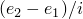

# *ELSET

### *ELSET将单元分配到单元集。

此选项用于将单元分配到单元集。

**产品：**Abaqus/Standard  Abaqus/Explicit  Abaqus/CFD  Abaqus/CAE

**类型：**模型或历史数据

**级别：**部件，部件实例，装配，模型，步骤

**Abaqus/CAE：**集合工具集

##### **参考：**

- ["单元定义，" Abaqus分析用户指南第2.2.1节](../usb/usb-link.md#usb-int-ielement)

### **必需参数：**

ELSET

将此参数设置为元素将被分配到的单元集名称。

### **可选参数：**

GENERATE

如果包含此参数，每个数据行应给出第一个单元 、最后一个单元  以及这些单元之间单元编号的增量 *i*。然后，从  到  以 *i* 为步长的所有单元将被添加到集合中。*i* 必须是一个整数，使得  是一个整数（不是分数）。

INSTANCE

将此参数设置为包含数据行上列出的单元的部件实例名称。此参数只能在装配级别使用，旨在作为命名约定的快捷方式。它只能用于以部件实例装配定义的模型。

INTERNAL

Abaqus/CAE使用INTERNAL参数来标识内部创建的集合。INTERNAL参数仅用于以部件实例装配定义的模型。默认是省略INTERNAL参数。

UNSORTED

如果包含此参数，此单元集中的单元将按给出的顺序分配到集合中（或添加到已存在的集合中）。

如果省略此参数，集合中的单元将按其单元编号的升序排序，并消除重复项。

### **如果省略GENERATE参数的数据行：**

**第一行：**

根据需要重复此数据行。每行最多允许16个条目。

### **如果包含GENERATE参数的数据行：**

**第一行：**

根据需要重复此数据行。

