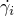
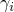
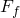
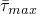

# *FRICTION

### *FRICTION指定摩擦模型。

此选项用于将摩擦特性引入控制接触表面、接触对或连接器单元相互作用的机械表面相互作用模型。它必须与[*SURFACE INTERACTION](ch18abk50.md)选项、[*CONNECTOR FRICTION](ch03abk43.md)选项一起使用，或在Abaqus/Standard分析中与[*CHANGE FRICTION](ch03abk17.md)、[*GAP](ch07abk01.md)、[*INTERFACE](ch09abk22.md)或[*ITS](ch09abk23.md)选项一起使用。

**产品：**Abaqus/Standard   Abaqus/Explicit   Abaqus/CAE   

**类型：**Abaqus/Standard中的模型或历史数据；Abaqus/Explicit中的历史数据  

**级别：**Abaqus/Standard中的部件，部件实例，装配，模型；Abaqus/Explicit中的步骤  

**Abaqus/CAE：**相互作用模块

##### **参考：**

- ["连接器行为，" Abaqus Analysis User's Guide第31.2.1节](../usb/usb-link.md#usb-elm-econnectorbehavior)
- ["机械接触特性概述，" Abaqus Analysis User's Guide第37.1.1节](../usb/usb-link.md#usb-cni-acontactmechanical)
- ["摩擦行为，" Abaqus Analysis User's Guide第37.1.5节](../usb/usb-link.md#usb-cni-afriction)
- ["FRIC，" Abaqus User Subroutines Reference Guide第1.1.8节](../sub/sub-link.md#sub-rtn-ufric)
- ["FRIC_COEF，" Abaqus User Subroutines Reference Guide第1.1.9节](../sub/sub-link.md#sub-rtn-ufriccoef)
- ["VFRIC，" Abaqus User Subroutines Reference Guide第1.2.5节](../sub/sub-link.md#sub-rtn-uexpfric)
- ["VFRIC_COEF，" Abaqus User Subroutines Reference Guide第1.2.6节](../sub/sub-link.md#sub-rtn-uexpfriccoef)
- ["VFRICTION，" Abaqus User Subroutines Reference Guide第1.2.7节](../sub/sub-link.md#sub-rtn-uexpfriction)
- [*CHANGE FRICTION](ch03abk17.md)
- [*CONNECTOR FRICTION](ch03abk43.md)
- [*GAP](ch07abk01.md)
- [*INTERFACE](ch09abk22.md)
- [*ITS](ch09abk23.md)
- [*SURFACE INTERACTION](ch18abk50.md)

### **可选的互斥参数：**

ELASTIC SLIP

此参数仅适用于Abaqus/Standard分析。

在稳态传输分析中，将此参数设置为允许的弹性滑移速度（）的绝对值，用于粘着摩擦的刚度方法。在所有其他分析过程中，将此参数设置为允许的弹性滑移（）的绝对值，用于粘着摩擦的刚度方法。如果省略此参数，则由SLIP TOLERANCE值定义弹性滑移（或弹性滑移速度）。

LAGRANGE

此参数仅适用于Abaqus/Standard分析，不能在与连接器单元定义摩擦时使用。

包含此参数以选择摩擦的拉格朗日乘子公式。

ROUGH

此参数不能在与连接器单元定义摩擦时使用。

包含此参数以指定完全粗糙（无滑移）摩擦。

SLIP TOLERANCE

此参数仅适用于Abaqus/Standard分析。

将此参数设置为的值（在稳态传输分析中定义为允许最大弹性滑移速度与角速度乘以旋转体直径的比率，或在所有其他分析过程中定义为允许最大弹性滑移与特征接触表面面尺寸的比率）。默认值为SLIP TOLERANCE=.005。

当为连接器单元定义摩擦时，（如果可能）被定义为允许最大弹性滑移与模型中特征单元尺寸的比率。在这种情况下，默认值为SLIP TOLERANCE=.0001。

USER

此参数不能在与连接器单元定义摩擦时使用。

在Abaqus/Standard分析中，如果摩擦模型将在用户子程序[`FRIC`](../sub/sub-link.md#sub-xsl-fric)中定义，则设置USER=FRIC（默认）。如果摩擦系数将在用户子程序[`FRIC_COEF`](../sub/sub-link.md#sub-xsl-fric_coef)中定义，则设置USER=COEFFICIENT。

在Abaqus/Explicit分析中，如果摩擦模型将在用户子程序[`VFRIC`](../sub/sub-link.md#sub-xsl-vfric)中定义，则设置USER=FRIC（默认）。如果摩擦模型将在用户子程序[`VFRICTION`](../sub/sub-link.md#sub-xsl-vfriction)中定义，则设置USER=FRICTION。[`VFRIC`](../sub/sub-link.md#sub-xsl-vfric)适用于接触对，而[`VFRICTION`](../sub/sub-link.md#sub-xsl-vfriction)适用于通用接触。如果摩擦系数将在用户子程序[`VFRIC_COEF`](../sub/sub-link.md#sub-xsl-vfric_coef)中定义，则设置USER=COEFFICIENT。[`VFRIC_COEF`](../sub/sub-link.md#sub-xsl-vfric_coef)仅能与通用接触一起使用。

### **可选参数：**

ANISOTROPIC

此参数仅适用于Abaqus/Standard分析，不能在与连接器单元定义摩擦时使用。

如果定义各向异性摩擦，则包含此参数。

DEPENDENCIES

将此参数设置为除滑移率、接触压力和温度外还包括在摩擦系数定义中的场变量依赖项数。如果省略此参数，则假定摩擦系数没有依赖项或仅取决于滑移率、接触压力和温度。有关详细信息，请参见["指定场变量依赖"在"材料数据定义，" Abaqus Analysis User's Guide第21.1.2节](../usb/usb-link.md#usb-mat-cmaterialdata-fvdepen)。

DEPVAR

此参数仅在包含USER参数时有效。

将DEPVAR设置为用户子程序[`FRIC`](../sub/sub-link.md#sub-xsl-fric)（在Abaqus/Standard分析中）或用户子程序[`VFRIC`](../sub/sub-link.md#sub-xsl-vfric)和[`VFRICTION`](../sub/sub-link.md#sub-xsl-vfriction)（在Abaqus/Explicit分析中）所需的状态相关变量数量。默认值为DEPVAR=0。

EXPONENTIAL DECAY

包含此参数以通过指数曲线定义的平滑过渡区指定单独的静摩擦和动摩擦系数。

ANISOTROPIC和TAUMAX参数不能与此参数一起使用。

PROPERTIES

此参数仅在包含USER参数时有效。

将此参数设置为在Abaqus/Standard分析的用户子程序[`FRIC`](../sub/sub-link.md#sub-xsl-fric)和[`FRIC_COEF`](../sub/sub-link.md#sub-xsl-fric_coef)中或在Abaqus/Explicit分析的用户子程序[`VFRIC`](../sub/sub-link.md#sub-xsl-vfric)、[`VFRIC_COEF`](../sub/sub-link.md#sub-xsl-vfric_coef)和[`VFRICTION`](../sub/sub-link.md#sub-xsl-vfriction)中定义摩擦模型所需的数据属性值数量。默认值为PROPERTIES=0。

SHEAR TRACTION SLOPE

此参数仅适用于Abaqus/Explicit分析。

将此参数设置为定义为两个表面之间弹性滑移函数的剪切牵引力曲线的斜率。如果省略此参数或不存在摩擦力，则不会激活剪切软化。此参数不能与用户子程序[`VFRIC`](../sub/sub-link.md#sub-xsl-vfric)、[`VFRIC_COEF`](../sub/sub-link.md#sub-xsl-vfric_coef)和[`VFRICTION`](../sub/sub-link.md#sub-xsl-vfriction)结合使用。

TAUMAX

将此参数设置为等效剪切应力极限，；即等效剪切应力的最大可达值。如果在Abaqus/Standard分析中没有给出值或TAUMAX=0，则对等效剪切应力没有限制。在Abaqus/Explicit分析中不允许零值。

TEST DATA

此参数仅在使用EXPONENTIAL DECAY参数时有效。

如果指数衰减系数，，将由Abaqus计算，则包含此参数。如果省略此参数，则衰减系数必须直接在线数据行上给出。

### **如果省略USER、ROUGH、EXPONENTIAL DECAY和ANISOTROPIC参数，则定义摩擦系数的数据行：**

**第一行：**

**后续行（仅当DEPENDENCIES参数的值大于四时才需要）：**

根据需要重复此组数据行，以将摩擦系数定义为接触压力、滑移率、平均表面温度和其他预定义场变量的函数。

### **如果使用ANISOTROPIC参数且省略USER、ROUGH和EXPONENTIAL DECAY参数，则定义摩擦系数的数据行：**

**第一行：**

**后续行（仅当DEPENDENCIES参数的值大于三时才需要）：**

根据需要重复此组数据行，以将摩擦系数定义为接触压力、滑移率、平均表面温度和其他预定义场变量的函数。

### **如果使用EXPONENTIAL DECAY参数且直接指定衰减系数，则定义静摩擦和动摩擦系数的数据行：**

**第一行（唯一行）：**

### **如果使用EXPONENTIAL DECAY和TEST DATA参数，则数据行：**

**第一行：**

**第二行：**

**第三行（可选）：**

### **当使用ROUGH参数时，数据行：**

在这种情况下没有数据行。

### **如果使用PROPERTIES参数，则定义用户子程序属性的数据行：**

**第一行：**

根据需要重复此数据行，以完整定义用户子程序[`FRIC`](../sub/sub-link.md#sub-xsl-fric)、[`FRIC_COEF`](../sub/sub-link.md#sub-xsl-fric_coef)、[`VFRIC`](../sub/sub-link.md#sub-xsl-vfric)、[`VFRIC_COEF`](../sub/sub-link.md#sub-xsl-vfric_coef)和[`VFRICTION`](../sub/sub-link.md#sub-xsl-vfriction)按PROPERTIES值指示所需的所有属性。

### **当使用USER参数但不使用PROPERTIES参数时，数据行：**

在这种情况下没有数据行。
