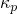

# *KAPPA

### *KAPPA指定由温度梯度和等效压力应力驱动的质量扩散材料参数。

此选项分别使用材料参数  和  来引入温度和压力驱动的质量扩散。它必须紧跟在 [*DIFFUSIVITY](ch04abk23.md) 选项之后。对于 [*DIFFUSIVITY](ch04abk23.md) 选项的每次使用，[*KAPPA](ch11abk01.md) 可以与 TYPE=TEMP 一起使用一次，也可以与 TYPE=PRESS 一起使用一次。[*KAPPA](ch11abk01.md), TYPE=TEMP 和 [*DIFFUSIVITY](ch04abk23.md), LAW=FICK 选项是互斥的。

**产品：** Abaqus/Standard  Abaqus/CAE  

**类型：** 模型数据  

**级别：** 模型  

**Abaqus/CAE：** Property 模块

##### **参考文献：**

- ["扩散率，" Abaqus Analysis User's Guide 第 26.4.1 节](../usb/usb-link.md#usb-mat-cdiffusivity)
- [*DIFFUSIVITY](ch04abk23.md)

### **可选参数：**

DEPENDENCIES

将此参数设置为  或  定义中包含的场变量数量。如果省略此参数，则假定  或  不依赖于任何场变量，但可能仍然依赖于浓度和温度。请参阅 ["指定场变量依赖性" in "材料数据定义，" Abaqus Analysis User's Guide 第 21.1.2 节](../usb/usb-link.md#usb-mat-cmaterialdata-fvdepen)，获取更多信息。

TYPE

设置 TYPE=TEMP（默认）以定义 （控制由温度梯度引起的质量扩散）。设置 TYPE=PRESS 以定义 （控制由等效压力应力梯度引起的质量扩散）。

### **定义 Soret 效应因子的数据行（TYPE=TEMP）：**

**第一行：**

**后续行（仅在 DEPENDENCIES 参数的值大于五时需要）：**

根据需要重复此组数据行，以将  定义为浓度、温度和其他预定义场变量的函数。

### **定义压力应力因子的数据行（TYPE=PRESS）：**

**第一行：**

**后续行（仅在 DEPENDENCIES 参数的值大于五时需要）：**

根据需要重复此组数据行，以将  定义为浓度、温度和其他预定义场变量的函数。

