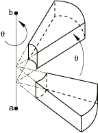

# *MAP SOLUTION

### *MAP SOLUTION将解决方案从旧网格映射到新网格。

此选项用于将早期分析的解决方案变量传输到占据相同空间的新网格。

**产品：**Abaqus/Standard  

**类型：**模型数据  

**级别：**模型  

##### **参考：**

- ["网格到网格的解决方案映射，" Abaqus Analysis User's Guide第12.4.1节](../usb/usb-link.md#usb-anl-amapsolution)

### **可选参数：**

INC

将此参数设置为要读取的旧解决方案的增量号。如果省略此参数，则将读取有解决方案可用的最后一个增量。

如果使用了INC参数，则必须指定STEP参数。

STEP

将此参数设置为要读取的旧解决方案的步骤号。如果省略此参数，则将读取有解决方案可用的最后一步和增量。

UNBALANCED STRESS

如果应力不平衡要在线性地在步骤中解决，则设置UNBALANCED STRESS=RAMP（默认）。

如果应力不平衡要在第一个增量中解决，则设置UNBALANCED STRESS=STEP。

### **平移旧模型网格的数据行：**

**第一行（也是唯一一行）：**

### **平移和/或旋转旧模型网格的数据行：**

**第一行：**

输入零值以应用纯旋转。

**第二行：**

如果同时指定了平移和旋转，则先应用平移后应用旋转。

**图13.3-1** 旧模型网格的旋转。

