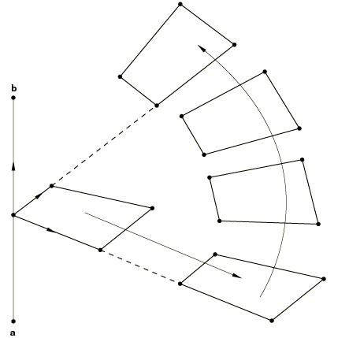
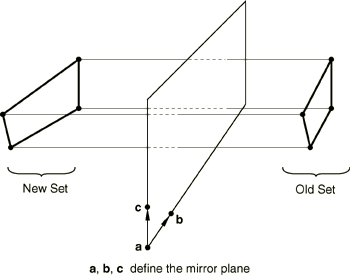
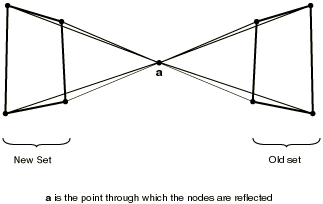
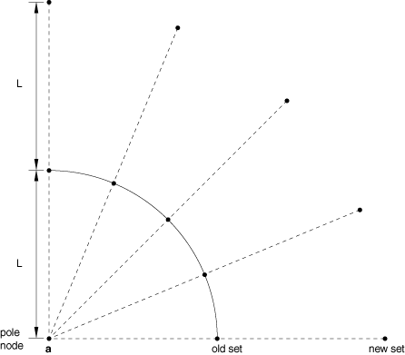

# *NCOPY

### *NCOPY通过复制创建节点。

此选项用于复制节点集以创建新的节点集。

**产品：**Abaqus/Standard  Abaqus/Explicit  Abaqus/CFD  Abaqus/CAE  

**类型：**模型数据  

**级别：**部件、部件实例  

**Abaqus/CAE：**不适用；复制草图的部分和实例化部件具有类似目的。

##### **参考：**

- ["节点定义，" Abaqus Analysis User's Guide第2.1.1节](../usb/usb-link.md#usb-int-inode)

### **必需参数：**

CHANGE NUMBER

将此参数设置为一个整数，该整数将被添加到每个现有节点编号以定义正在创建的节点的节点编号。

OLD SET

将此参数设置为正在复制的节点集名称。此集合将用于复制操作，操作使用的是此[*NCOPY](ch14abk01.md)选项出现在输入文件中时属于它的节点。

### **必需的互斥参数：**

POLE

如果新节点是通过从极点投影旧集中的节点创建的，则包含此参数。每个新节点的位置将是对应的旧节点位于极点和新节点之间的等距位置。

此参数对于创建与无限单元关联的节点特别有用。

REFLECT

设置REFLECT=LINE以通过直线反射创建新节点。

设置REFLECT=MIRROR以通过平面反射创建新节点。

设置REFLECT=POINT以通过点反射创建新节点。

SHIFT

如果新节点要通过旧节点集中节点的平移和/或旋转来创建，则包含此参数。如果同时指定了平移和旋转，则平移在旋转之前应用一次。

### **可选参数：**

MULTIPLE

此参数与SHIFT参数一起使用以定义旋转应应用的次数。默认值为MULTIPLE=1。

NEW SET

将此参数设置为此操作创建的节点将被分配到的节点集名称。如果旧集未排序且新集尚不存在，则此新节点集将是未排序的。否则，此新节点集将是排序的。

如果省略此参数，则新创建的节点不会被分配到节点集。

### **如果包含SHIFT参数的数据行：**

**第一行：**

**第二行：**

### **如果REFLECT=LINE的数据行：**

**第一行（也是唯一一行）：**

### **如果REFLECT=MIRROR的数据行：**

**第一行：**

**第二行：**

### **如果REFLECT=POINT的数据行：**

**第一行（也是唯一一行）：**

### **如果包含POLE参数的数据行：**

**第一行（也是唯一一行）：**

**图14.1-1** [*NCOPY](ch14abk01.md)、SHIFT选项。

**图14.1-2** [*NCOPY](ch14abk01.md)、REFLECT=LINE选项。

**图14.1-3** [*NCOPY](ch14abk01.md)、REFLECT=MIRROR选项。

**图14.1-4** [*NCOPY](ch14abk01.md)、REFLECT=POINT选项。

**图14.1-5** [*NCOPY](ch14abk01.md)、POLE选项。

