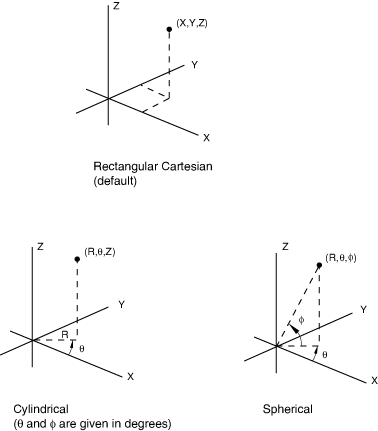

# *NGEN

### *NGEN增量生成节点。

此选项用于增量生成节点。

**产品：**Abaqus/Standard  Abaqus/Explicit  Abaqus/CFD  Abaqus/CAE  

**类型：**模型数据  

**级别：**部件、部件实例  

**Abaqus/CAE：**不适用；节点是在对模型进行网格划分时生成的。

##### **参考：**

- ["节点定义，" Abaqus Analysis User's Guide第2.1.1节](../usb/usb-link.md#usb-int-inode)

### **可选参数：**

LINE

设置LINE=P以沿抛物线生成节点。在这种情况下，用户必须定义一个额外的点，即两个端点之间的中点。

设置LINE=C以沿圆弧生成节点。在这种情况下，用户必须定义一个额外的点，即圆心。

如果省略此参数，则节点将沿直线生成。

NSET

将此参数设置为其节点将被分配到的节点集名称。两个端节点也将包含在节点集中。使用此选项创建或修改的节点集始终是排序的。

SYSTEM

设置SYSTEM=RC（默认）以在笛卡尔坐标系中定义额外的节点。设置SYSTEM=C以在圆柱坐标系中定义额外的节点。设置SYSTEM=S以在球坐标系中定义额外的节点。

### **增量生成节点的数据行：**

**第一行：**

根据需要重复此数据行。

**图14.3-1** 坐标系。

