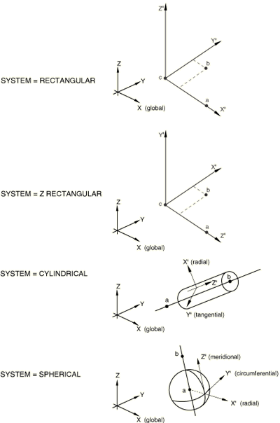

# *ORIENTATION

### *ORIENTATION为材料或单元属性定义、运动耦合约束、惯性释荷荷载的自由方向或连接器定义局部轴系统。

此选项用于定义材料属性定义的局部坐标系；用于积分点的材料计算；用于单元属性定义（例如连接器单元）；用于应力、应变和单元截面力分量的输出；以及用于运动和分布耦合约束。可以使用分布为实体连续单元和壳单元定义空间变化的局部坐标系。

[*ORIENTATION](ch15abk01.md)选项也可用于为具有不变量公式的各向异性超弹性材料指定局部材料方向。局部方向是相对于局部坐标系定义的。

在Abaqus/Standard中，[*ORIENTATION](ch15abk01.md)选项可用于为接触对相互作用属性以及弹簧、阻尼器和JOINTC单元定义局部方向；用于定义惯性释荷荷载的局部自由方向；以及用于表面变量分量的输出。

在Abaqus/Explicit中，[*ORIENTATION](ch15abk01.md)选项可用于在参考配置中初始化织物材料的经纱和纬纱方向。位于织物平面中的纱线方向是相对于正交坐标系的两个面内轴定义的。

**产品：**Abaqus/Standard  Abaqus/Explicit  Abaqus/CAE  

**类型：**模型数据  

**级别：**部件、部件实例、装配  

**Abaqus/CAE：**属性模块、相互作用模块和荷载模块

##### **参考：**

- ["方向，" Abaqus Analysis User's Guide第2.2.5节](../usb/usb-link.md#usb-int-corientation)
- ["ORIENT，" Abaqus User Subroutines Reference Guide第1.1.15节](../sub/sub-link.md#sub-rtn-uorient)

### **必需参数：**

NAME

将此参数设置为一个标签，该标签将用于引用方向定义。同一输入文件中的方向名称必须唯一。

### **可选参数：**

DEFINITION

设置DEFINITION=COORDINATES（默认）通过给出适用于SYSTEM选择的三个点*a*、*b*以及可选的*c*（原点）的坐标来定义局部系统。对于此参数值，可以使用分布为实体连续单元和壳单元创建空间变化的局部坐标系以定义点*a*和*b*的空间变化坐标。目前不支持使用分布来定义可选点*c*的坐标。

设置DEFINITION=NODES通过给出点*a*、*b*以及可选的*c*（原点）的全局节点编号来定义局部系统。

设置DEFINITION=OFFSET TO NODES通过给出局部节点编号（在使用方向的单元上）来定义局部系统。此参数值不能与弹簧、阻尼器或JOINTC单元一起使用。此外，它不能与[*KINEMATIC COUPLING](ch11abk03.md)、[*INERTIA RELIEF](ch09abk17.md)或[*CONTACT PAIR](ch03abk68.md)选项一起使用。

对于所有DEFINITION参数值，可以通过使用分布定义空间变化的附加旋转角来为实体连续单元和壳单元创建空间变化的局部坐标系。

LOCAL DIRECTIONS

此参数仅与具有首选材料方向（或纤维方向）的各向异性材料相关，例如各向异性超弹性材料或在Abaqus/Explicit中的织物材料。

将此参数设置为适用于材料模型的局部方向数量（例如，织物材料为两个）。局部方向是相对于由当前方向定义在材料点产生的正交系统指定的。最多可以指定三个局部方向作为局部方向系统定义的一部分。

对于Abaqus/Explicit中的织物材料，两个纱线方向是相对于正交系统的面内轴给出的。如果没有指定局部方向作为方向定义的一部分，则假定局部材料方向与参考配置中正交系统的面内轴匹配。

SYSTEM

设置SYSTEM=RECTANGULAR（默认）通过三个点*a*、*b*和*c*定义矩形笛卡尔系统。点*c*是系统的原点，点*a*必须位于轴上，点*b*必须位于平面中。

设置SYSTEM=CYLINDRICAL通过在圆柱系统极轴上给出两点*a*和*b*来定义圆柱系统。局部轴为1=径向，2=周向，3=轴向。

设置SYSTEM=SPHERICAL通过给出球心*a*和极轴上的点*b*来定义球面系统。局部轴为1=径向，2=周向，3=子午线。

设置SYSTEM=Z RECTANGULAR通过三个点*a*、*b*和*c*定义矩形笛卡尔系统。点*c*是系统的原点，点*a*必须位于轴上，点*b*必须位于平面中。

在Abaqus/Standard分析中设置SYSTEM=USER以在用户子程序[`ORIENT`](../sub/sub-link.md#sub-xsl-orient)中定义局部坐标系。如果指定了SYSTEM=USER，则忽略DEFINITION参数和与此选项关联的任何数据行。

### **使用DEFINITION=COORDINATES定义方向的数据行：**

**第一行：**

**第二行：**

**当包含LOCAL DIRECTIONS参数时的第三行：**

根据需要重复上述数据行以定义额外的局部方向，每行一个方向。

### **当DEFINITION=COORDINATES时，使用分布为实体连续单元和壳单元定义空间变化方向的数据行：**

**第一行：**

**第二行：**

**当包含LOCAL DIRECTIONS参数时的第三行：**

根据需要重复上述数据行以定义额外的局部方向，每行一个方向。

### **使用DEFINITION=NODES定义方向的数据行：**

**第一行：**

**第二行：**

**当包含LOCAL DIRECTIONS参数时的第三行：**

根据需要重复上述数据行以定义额外的局部方向，每行一个方向。

### **使用DEFINITION=OFFSET TO NODES定义方向的数据行：**

**第一行：**

**第二行：**

**当包含LOCAL DIRECTIONS参数时的第三行：**

根据需要重复上述数据行以定义额外的局部方向，每行一个方向。

### **使用用户子程序定义方向（SYSTEM=USER）：**

当指定SYSTEM=USER时，此选项不使用数据行。相反，必须使用用户子程序[`ORIENT`](../sub/sub-link.md#sub-xsl-orient)来定义方向。

**图15.1-1** 方向系统。

