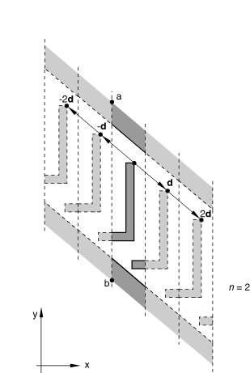
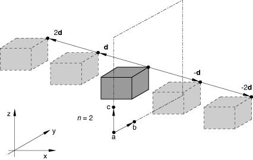

# *PERIODIC

### *PERIODIC为腔体辐射热传递分析定义周期性对称。

此选项用于通过给定方向上的周期性重复来定义腔体对称。它只能跟在[*RADIATION SYMMETRY](ch17abk05.md)选项之后使用。

**产品：**Abaqus/Standard  Abaqus/CAE  

**类型：**历史数据  

**级别：**步骤

**Abaqus/CAE：**相互作用模块

##### **参考：**

- ["腔体辐射，" Abaqus Analysis User's Guide第41.1.1节](../usb/usb-link.md#usb-cni-acavityradiation)
- [*RADIATION SYMMETRY](ch17abk05.md)

### **必需参数：**

TYPE

设置TYPE=2D以创建由模型中定义的腔体表面和根据二维距离向量通过其重复生成的系列相似图像组成的腔体。重复图像由平行于线的边界限定。此选项仅适用于二维情况。

设置TYPE=3D以创建由模型中定义的腔体表面和根据三维距离向量通过其重复生成的系列相似图像组成的腔体。重复图像由平行于平面的边界限定。此选项仅适用于三维情况。

设置TYPE=ZDIR以创建由模型中定义的腔体表面和沿*z*方向重复生成的系列相似图像组成的腔体。重复图像由恒定*z*坐标的边界限定。此选项仅适用于轴对称情况。

### **可选参数：**

NR

将此参数设置为用于由周期性对称引起的腔体视角因子数值计算中的重复次数。结果是腔体由模型中定义的腔体表面加上两倍的NR相似图像组成，因为假定周期性对称适用于距离向量的正方向和负方向。默认值为NR=2。

### **定义二维腔体周期性对称的数据行（TYPE=2D）：**

**第一行（也是唯一一行）：**

### **定义三维腔体周期性对称的数据行（TYPE=3D）：**

**第一行：**

**第二行：**

### **定义轴对称腔体周期性对称的数据行（TYPE=ZDIR）：**

**第一行（也是唯一一行）：**

**图16.5-1** [*PERIODIC](ch16abk05.md)、TYPE=2D选项。

**图16.5-2** [*PERIODIC](ch16abk05.md)、TYPE=3D选项。

**图16.5-3** [*PERIODIC](ch16abk05.md)、TYPE=ZDIR选项。

