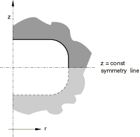

# *REFLECTION

### *REFLECTION为腔体辐射热传递分析定义反射对称性。

此选项用于通过直线或平面反射定义腔体对称性。它只能跟在[*RADIATION SYMMETRY](ch17abk05.md)选项之后使用。

**产品：**Abaqus/Standard  Abaqus/CAE  

**类型：**历史数据  

**级别：**步骤  

**Abaqus/CAE：**相互作用模块

##### **参考：**

- ["腔体辐射，" Abaqus Analysis User's Guide第41.1.1节](../usb/usb-link.md#usb-cni-acavityradiation)
- [*RADIATION SYMMETRY](ch17abk05.md)

### **必需参数：**

TYPE

设置TYPE=LINE以创建由模型中定义的腔体表面及其通过直线的反射组成的腔体。参见[图17.13-1](ch17abk13.md#kreflection-line)。此选项仅适用于二维情况。

设置TYPE=PLANE以创建由模型中定义的腔体表面及其通过平面的反射组成的腔体。参见[图17.13-2](ch17abk13.md#kreflection-plane)。此选项仅适用于三维情况。

设置TYPE=ZCONST以创建由模型中定义的腔体表面及其通过*z*坐标恒定直线的反射组成的腔体。参见[图17.13-3](ch17abk13.md#kreflection-zconst)。此选项仅适用于轴对称情况。

### **定义二维腔体反射的数据行（TYPE=LINE）：**

**第一行（也是唯一一行）：**

### **定义三维腔体反射的数据行（TYPE=PLANE）：**

**第一行：**

**第二行：**

### **定义轴对称腔体反射的数据行（TYPE=ZCONST）：**

**第一行（也是唯一一行）：**

**图17.13-1** [*REFLECTION](ch17abk13.md)，TYPE=LINE选项。

**图17.13-2** [*REFLECTION](ch17abk13.md)，TYPE=PLANE选项。

**图17.13-3** [*REFLECTION](ch17abk13.md)，TYPE=ZCONST选项。

