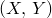
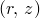
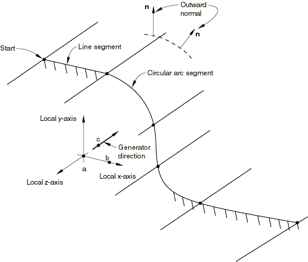

# *RIGID SURFACE

### *RIGID SURFACE定义解析刚体表面。

在Abaqus/Standard分析中定义三维拖链元素的 海底时必须使用此选项。对于所有其他情况，定义解析刚体表面的首选选项是[*SURFACE](ch18abk47.md)和[*RIGID BODY](ch17abk18.md)选项。

**产品：**Abaqus/Standard  Abaqus/CAE  

**类型：**模型数据  

**级别：**零件，零件实例  

**Abaqus/CAE：**零件模块

##### **参考：**

- ["表面：概述，" Abaqus Analysis User's Guide第2.3.1节](../usb/usb-link.md#usb-int-asurfoverview)
- ["解析刚体表面定义，" Abaqus Analysis User's Guide第2.3.4节](../usb/usb-link.md#usb-int-arigidsurf)
- ["拖链，" Abaqus Analysis User's Guide第32.11.1节](../usb/usb-link.md#usb-elm-edragchain)
- ["RSURFU，" Abaqus User Subroutines Reference Guide第1.1.16节](../sub/sub-link.md#sub-rtn-ursurfu)
- [*SURFACE](ch18abk47.md)

### **必需参数：**

ELSET

将此参数设置为包含可能与正在定义的刚体表面相互作用的IRS型单元或三维拖链单元的单元集名称。

ELSET和NAME参数是互斥的。

NAME

将此参数设置为一个标签，用于引用正在创建的刚体表面。此表面名称用于通过[*CONTACT PAIR](ch03abk68.md)选项定义与另一个表面的接触相互作用。

ELSET和NAME参数是互斥的。

REF NODE

将此参数设置为刚体参考节点的节点编号或包含刚体参考节点的节点集名称。如果选择节点集名称，则该节点集必须恰好包含一个节点。

此参数仅在与NAME参数一起使用时才相关。

TYPE

设置TYPE=SEGMENTS以通过定义连接的线段在平面模型的平面或轴对称模型的平面中创建二维刚体表面。

设置TYPE=CYLINDER以通过提供连接的线段然后沿指定生成向量扫描来定义三维刚体表面。

设置TYPE=REVOLUTION以通过提供连接的线段来定义三维刚体表面，这些线段在平面中给出并绕轴旋转。

设置TYPE=USER以通过用户子程序[`RSURFU`](../sub/sub-link.md#sub-xsl-rsurfu)定义刚体表面。

### **可选参数：**

FILLET RADIUS

此参数可与TYPE=SEGMENTS、TYPE=CYLINDER或TYPE=REVOLUTION一起使用，以定义曲率半径来平滑相邻直线段、相邻圆弧段以及相邻直线段和圆弧段之间的不连续性。它对使用TYPE=USER定义的刚体表面没有影响。

### **TYPE=USER不需要数据行。**

### **定义使用TYPE=SEGMENTS创建的表面的数据行：**

**第一行：**

第二行和后续数据行定义形成刚体表面轮廓的各种直线、圆和抛物线段（参见下文其格式）。

### **定义使用TYPE=CYLINDER创建的表面的数据行：**

**第一行：**

**第二行：**

**第三行：**

第四行和后续数据行定义形成刚体表面轮廓的各种直线、圆和抛物线段（参见下文其格式）。

### **定义使用TYPE=REVOLUTION创建的表面的数据行：**

**第一行：**

**第二行：**

第三行和后续数据行定义形成刚体表面轮廓的各种直线、圆和抛物线段（参见下文其格式）。

### **定义TYPE=SEGMENTS、TYPE=CYLINDER和TYPE=REVOLUTION刚体表面的线段的数据行：**

**定义直线段的数据行：**

**定义圆弧段的数据行（弧必须小于180度）：**

**定义抛物线弧段的数据行：**

对于使用TYPE=SEGMENTS创建的刚体表面，*x*和*y*坐标是全局*X*和*Y*坐标或*r*和*z*坐标。对于使用TYPE=CYLINDER创建的刚体表面，*x*和*y*坐标是局部*x*和*y*坐标。对于使用TYPE=REVOLUTION创建的刚体表面，*x*和*y*坐标是局部*r*和*z*坐标。

**图17.19-1** [*RIGID SURFACE](ch17abk19.md)，TYPE=CYLINDER。

**图17.19-2** [*RIGID SURFACE](ch17abk19.md)，TYPE=REVOLUTION。

