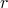
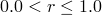
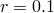
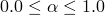
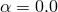
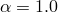
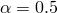

# *SECTION CONTROLS

### *SECTION CONTROLSSpecify section controls.

**警告：**使用大于默认值的沙漏控制参数可能会产生过度刚性的响应，如果值过大甚至可能导致不稳定。发生于默认沙漏控制参数的沙漏现象通常表明网格过于粗糙。因此，通常情况下改进网格比添加更强的沙漏控制更好。

此选项用于：
- 为Abaqus/Standard和Abaqus/Explicit中的减缩积分单元以及Abaqus/Standard中的改进四面体或三角形单元选择非默认的沙漏控制方法，
- 缩放沙漏控制中使用的默认系数，以及
- 为实体单元激活畸变控制。

在Abaqus/Explicit中，此选项还用于：
- 为8节点砖块单元选择非默认的运动学公式，
- 为实体和壳单元选择二阶精确公式，
- 缩放壳单元的钻孔刚度，
- 关闭小应变壳单元S3RS和S4RS的钻孔刚度，
- 将膜单元中的初始构型应力逐步引入模型，
- 缩放线性和二次体粘度，
- 为光滑粒子流体动力学分析指定额外的控制参数，
- 指定单元在完全损坏时是否必须被删除，
- 指定标量退化参数的阈值，当达到或超过该值时认为单元已完全损坏，以及
- 指定与光滑粒子流体动力学（SPH）分析相关的控制参数。

此选项与[*MEMBRANE SECTION](ch13abk16.md)、[*SHELL GENERAL SECTION](ch18abk14.md)、[*SHELL SECTION](ch18abk15.md)和/或[*SOLID SECTION](ch18abk22.md)选项配合使用。它可以与[*BEAM SECTION](ch02abk06.md)和[*BEAM GENERAL SECTION](ch02abk05.md)配合使用以缩放线和体粘度。它还可以与[*SOLID SECTION](ch18abk22.md)、[*SHELL SECTION](ch18abk15.md)、[*MEMBRANE SECTION](ch13abk16.md)、[*COHESIVE SECTION](ch03abk24.md)和[*CONNECTOR SECTION](ch03abk50.md)选项配合使用：
- 指定单元在完全损坏时是否必须被删除，
- 指定标量退化参数的阈值，当达到或超过该值时认为单元已完全损坏，以及
- 在Abaqus/Standard中，指定控制粘性正则化的粘度系数。

对于导入分析，必须在原始分析中选择必要的[*SECTION CONTROLS](ch18abk01.md)设置，即使某些设置对原始分析不适用；原始分析中指定的设置会被传递到导入分析中。

**产品：**Abaqus/Standard  Abaqus/Explicit  Abaqus/CAE

**类型：**模型数据

**级别：**模型

**Abaqus/CAE：**Mesh模块

##### **参考：**

- ["Section controls," Section 27.1.4 of the Abaqus Analysis User's Guide](../usb/usb-link.md#usb-elm-esectioncontrol)
- [*COHESIVE SECTION](ch03abk24.md)
- [*CONNECTOR SECTION](ch03abk50.md)
- [*MEMBRANE SECTION](ch13abk16.md)
- [*SHELL GENERAL SECTION](ch18abk14.md)
- [*SHELL SECTION](ch18abk15.md)
- [*SOLID SECTION](ch18abk22.md)

### **必需参数：**

NAME

将此参数设置为用于引用截面控制定义的标签。同一输入文件中的所有截面控制名称必须唯一。

### **可选参数：**

CONVERSION CRITERION

此参数仅适用于涉及连续体单元转换为SPH粒子的Abaqus/Explicit分析。

设置CONVERSION CRITERION=TIME（默认）以指定连续体单元转换为SPH粒子的时间。

设置CONVERSION CRITERION=STRAIN以指定连续体单元转换为SPH粒子时的最大主应变（绝对值）。

设置CONVERSION CRITERION=STRESS以指定连续体单元转换为SPH粒子时的最大主应力（绝对值）。

设置CONVERSION CRITERION=USER以指定连续体单元转换为SPH粒子时用户定义的标准。

DISTORTION CONTROL

此参数适用于包含C3D10I单元的Abaqus/Explicit分析和Abaqus/Standard分析中的实体截面。

设置DISTORTION CONTROL=YES以激活约束，防止可压碎材料的负单元体积或过度畸变。对于具有超弹性或超泡沫材料的单元，这是默认值。DISTORTION CONTROL参数与线性运动学无关，不能防止因时间不稳定、沙漏不稳定或物理上不真实的变形而导致的单元畸变。

设置DISTORTION CONTROL=NO以取消激活约束，防止可压碎材料的负单元体积或过度畸变。对于具有超弹性或超泡沫材料的单元，这是默认值。

DRILL STIFFNESS

此参数仅适用于小应变壳单元S3RS和S4RS。

设置DRILL STIFFNESS=ON（默认）以激活对S3RS和S4RS单元钻孔模式的约束。

设置DRILL STIFFNESS=OFF以取消激活对钻孔模式的约束。取消钻孔约束可能导致这些单元节点处旋转自由度的大值。

对于有限应变常规壳单元（如S4R），钻孔约束始终处于激活状态。

ELEMENT CONVERSION

此参数仅适用于涉及连续体单元转换为SPH粒子的Abaqus/Explicit分析。

设置ELEMENT CONVERSION=NO（默认）以阻止连续体单元转换为SPH粒子。

设置ELEMENT CONVERSION=YES以允许连续体单元转换为SPH粒子。

ELEMENT DELETION

此参数适用于所有具有渐进损伤行为的单元，连接器单元除外。

设置ELEMENT DELETION=YES以允许单元在完全损坏时被删除。对于所有具有损伤演化模型的单元，这是默认值。但是，此值不适用于孔隙压力粘性单元。

设置ELEMENT DELETION=NO以允许完全损坏的单元保留在计算中。单元保留由MAX DEGRADATION指定值给出的残余刚度。此外，具有三维应力状态（包括广义平面应变单元）的单元可以承受静水压应力，具有一维应力状态的单元可以承受压应力。这是孔隙压力粘性单元的默认值，不适用于梁单元。

HOURGLASS

设置HOURGLASS=COMBINED以为Abaqus/Explicit中具有减缩积分的实体和膜单元定义粘性-刚度形式的沙漏控制。

设置HOURGLASS=ENHANCED（Abaqus/Standard和Abaqus/Explicit中具有超弹性和超泡沫材料的单元的默认值；Abaqus/Standard中的默认值，也是Abaqus/Explicit中改进四面体或三角形单元的唯一选项）以为Abaqus/Standard和Abaqus/Explicit中具有减缩积分的实体、膜、有限应变壳单元以及改进四面体或三角形单元定义基于增强应变方法的沙漏控制。对于这种情况，将忽略数据行上的任何数据。

设置HOURGLASS=RELAX STIFFNESS（Abaqus/Explicit的默认值，具有超弹性和超泡沫材料的单元除外）以为Abaqus/Explicit中所有具有减缩积分的单元使用积分粘弹性形式的沙漏控制。此值不支持欧拉EC3D8R单元。

设置HOURGLASS=STIFFNESS（Abaqus/Standard的默认值，具有超弹性、超泡沫材料和改进四面体或三角形单元除外）以为Abaqus/Standard和Abaqus/Explicit中所有具有减缩积分的单元以及Abaqus/Standard中的改进四面体或三角形单元定义严格弹性的沙漏控制。

设置HOURGLASS=VISCOUS（欧拉EC3D8R单元的默认值）以为Abaqus/Explicit中具有减缩积分的实体和膜单元定义用于控制沙漏模式的沙漏阻尼。

INITIAL GAP OPENING

此参数仅适用于使用孔隙压力粘性单元的Abaqus/Standard分析。

将此参数设置为用于孔隙压力粘性单元切向流连续性方程中的初始间隙开口值。默认值为0.002。

KERNEL

此参数仅适用于涉及光滑粒子流体动力学（SPH）的Abaqus/Explicit分析。

设置KERNEL=CUBIC（默认）以为SPH形式使用三次样条插值器。

设置KERNEL=QUADRATIC以为SPH形式使用二次插值器。

设置KERNEL=QUINTIC以为SPH形式使用五次插值器。

KINEMATIC SPLIT

包含此参数以仅更改8节点砖块单元的运动学公式。

设置KINEMATIC SPLIT=AVERAGE STRAIN（Abaqus/Explicit中的默认值）以使用均匀应变公式和沙漏控制中的沙漏形状向量。这是Abaqus/Standard可用的唯一选项。

设置KINEMATIC SPLIT=CENTROID以在Abaqus/Explicit中使用质心应变公式和沙漏控制中的沙漏基向量。

设置KINEMATIC SPLIT=ORTHOGONAL以在Abaqus/Explicit中使用质心应变公式和沙漏控制中的沙漏形状向量。

如果SECOND ORDER ACCURACY=YES，则KINEMATIC SPLIT参数将在Abaqus/Explicit中重置为AVERAGE STRAIN。

LENGTH RATIO

此参数仅适用于Abaqus/Explicit分析，并且仅在使用DISTORTION CONTROL参数时有效。

将此参数设置为  () 以在为可压碎材料使用畸变控制时定义长度比。默认值为 。

MAX DEGRADATION

此参数适用于所有具有渐进损伤行为的单元，连接器单元除外。

将此参数设置为材料点被认为完全损坏的损伤变量阈值。此参数还决定在为ELEMENT DELETION参数设置为NO的单元保留的残余刚度量。对于粘性单元、连接器单元和具有平面应力公式的单元以外的单元，如果单元从网格中删除，则默认值为1.0，否则为0.99。对于粘性单元、连接器单元和具有平面应力公式的单元，默认值始终为1.0。

PERTURBATION

此参数仅适用于Abaqus/Standard分析。

将此参数设置为要应用于FLEXION-TORSION连接器第二方向的微小扰动。

RAMP INITIAL STRESS

此参数适用于Abaqus/Explicit分析中的膜单元。

将此参数设置为从零初始值到最终值一的总时间型幅值名称。指定此参数后，单元刚度将受到控制，直到幅值达到其最终值一，从而逐步而非突然地引入初始应力。

SECOND ORDER ACCURACY

此参数仅适用于Abaqus/Explicit分析；在Abaqus/Standard中，单元公式始终是二阶精确的。

设置SECOND ORDER ACCURACY=YES以为经历大量旋转（>5次）的问题使用二阶精确的实体或壳单元公式。

设置SECOND ORDER ACCURACY=NO（默认）以使用一阶精确的实体或壳单元。

SECOND ORDER ACCURACY参数与线性运动学无关。

VISCOSITY

此参数适用于Abaqus/Standard分析中的粘性单元、连接器单元和具有平面应力公式的单元（平面应力、壳、连续壳和膜单元）。

将此参数设置为粘性正则化方案中用于粘性单元或连接器单元的粘度系数值，或设置为连接器失效建模中使用的阻尼系数值。当此参数用于指定纤维增强材料损伤模型的粘度系数时，指定值将应用于所有损伤模式。默认值为0.0。

WEIGHT FACTOR

此参数仅适用于Abaqus/Explicit分析。

将此参数设置为  () 以缩放常数沙漏刚度项和沙漏阻尼项对沙漏控制公式的贡献。设置  或  分别对应于纯常数刚度沙漏控制和纯阻尼沙漏控制。默认值为 。此选项仅在HOURGLASS参数设置为COMBINED时用于实体和膜单元。

### **定义沙漏控制、体粘度、钻孔刚度和光滑粒子流体动力学相关控制的数据行：**

**第一行：**

**第二行（可选，仅在与光滑粒子流体动力学配合使用时）：**

**第三行（可选，仅在与光滑粒子流体动力学配合使用以控制粒子跟踪框大小时）：**

**第四行（可选，仅在与连续体单元转换为光滑粒子流体动力学粒子配合使用时）：**

# Abaqus Keywords Reference Guide

[Trademarks and Legal Notices](../popups/usb-lgl.md)

[Conversion Tables, Constants, and Material Properties](../popups/usb-tbl.md)

[Preface](../popups/usb-pre.md)

1. S

## 18. S

