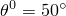

# *SHELL GENERAL SECTION

### *SHELL GENERAL SECTION定义通用任意弹性壳截面。

此选项用于定义通用任意弹性壳截面。

**产品：**Abaqus/Standard  Abaqus/Explicit  Abaqus/CAE

**类型：**模型数据

**级别：**部件、部件实例

**Abaqus/CAE：**Property模块

##### **参考：**

- ["Shell elements: overview," Section 29.6.1 of the Abaqus Analysis User's Guide](../usb/usb-link.md#usb-elm-eshelloverview)
- ["Using a general shell section to define the section behavior," Section 29.6.6 of the Abaqus Analysis User's Guide](../usb/usb-link.md#usb-elm-eusingshellgensect)
- ["UGENS," Section 1.1.35 of the Abaqus User Subroutines Reference Guide](../sub/sub-link.md#sub-rtn-uugens)

### **必需参数：**

ELSET

将此参数设置为包含要定义截面行为的壳单元的单元集名称。

### **Abaqus/Explicit中的必需参数，Abaqus/Standard中的可选参数：**

DENSITY

将此参数设置为壳单位表面积的质量。

如果省略MATERIAL和COMPOSITE参数，则此密度代表壳的质量，因为没有给出材料定义。

如果使用MATERIAL或COMPOSITE参数，则壳的质量包括此参数的贡献以及材料定义的任何贡献。

### **可选参数：**

BENDING ONLY

包含此参数以忽略壳中的膜刚度效应。弯曲刚度和横向剪切刚度系数正常计算。膜-弯耦合系数设置为零。对角膜刚度系数设置为最大对角弯曲刚度项的1×10^6倍。非对角膜刚度系数设置为零。

CONTROLS

在Abaqus/Explicit分析中，将此参数设置为截面控制定义（参见["Section controls," Section 27.1.4 of the Abaqus Analysis User's Guide](../usb/usb-link.md#usb-elm-esectioncontrol)）的名称，用于指定二阶精确单元公式选项、非默认沙漏控制公式选项或比例因子。

在Abaqus/Standard分析中，将此参数设置为截面控制定义的名称，用于指定增强沙漏控制公式（参见["Section controls," Section 27.1.4 of the Abaqus Analysis User's Guide](../usb/usb-link.md#usb-elm-esectioncontrol)），或用于后续的Abaqus/Explicit导入分析。

LAYUP

此参数仅在使用COMPOSITE参数时相关。

将此参数设置为复合铺层（参见[Abaqus/CAE User's Guide第23章，"复合铺层"](../usi/usi-link.md#usi-adv-layups)）的名称。Abaqus/CAE使用此名称来标识包含壳截面的复合铺层。

MEMBRANE ONLY

包含此参数以忽略壳中的弯曲刚度效应。膜刚度和横向剪切刚度系数正常计算。膜-弯耦合系数设置为零。对角弯曲刚度系数设置为最大对角膜刚度项的1×10^6倍。非对角弯曲刚度系数设置为零。

OFFSET

包含此参数以定义从壳中面到参考表面（包含单元节点）的距离（以壳厚度的分数表示）。此参数接受正值或负值、标签SPOS或SNEG，或在Abaqus/Standard分析中接受分布名称（参见["Distribution definition," Section 2.8.1 of the Abaqus Analysis User's Guide](../usb/usb-link.md#usb-int-adefiningdistributions)）。

偏移正值在正法线方向（参见["Shell elements: overview," Section 29.6.1 of the Abaqus Analysis User's Guide](../usb/usb-link.md#usb-elm-eshelloverview)）。当OFFSET=0.5（或SPOS）时，壳的上表面为参考表面。当OFFSET=-0.5（或SNEG）时，壳的下表面为参考表面。默认值为OFFSET=0，表示壳的中面为参考表面。此参数对连续壳被忽略。

在Abaqus/Standard分析中，可以通过将OFFSET设置为分布名称来指定空间变化的偏移。用于定义壳偏移的分布必须具有默认值。默认偏移量由分配给壳截面但未在分布中专门分配值的任何壳单元使用。

ORIENTATION

将此参数设置为方向定义（参见["Orientations," Section 2.2.5 of the Abaqus Analysis User's Guide](../usb/usb-link.md#usb-int-corientation)）的名称，以与截面力和截面应变一起使用。

POISSON

包含此参数以定义壳厚度方向行为。

将此参数设置为非零值，以使平面应力条件下厚度方向应变成为膜应变的线性函数。POISSON参数的值必须在-1.0和0.5之间。

设置POISSON=ELASTIC以基于材料定义的初始各向同性弹性部分自动选择此参数值。

默认值为POISSON=0.5。

SMEAR ALL LAYERS

此参数仅在使用COMPOSITE参数时相关。

包含此参数以忽略材料层堆叠顺序。横向剪切刚度系数正常计算。膜-弯耦合项设置为零，弯曲刚度项计算为T^2/12乘以相应的膜刚度项，其中T是壳的总厚度。

STACK DIRECTION

此参数仅对连续壳相关。

将此参数设置为1、2、3或ORIENTATION，以定义连续壳堆叠或厚度方向。指定数值之一以选择元素的相应等参数方向作为堆叠或厚度方向。默认值为STACK DIRECTION=3。

如果STACK DIRECTION=ORIENTATION，则还需要ORIENTATION参数。

要获得所需的厚度方向，STACK DIRECTION参数的适当数值取决于单元连接性。对于与网格无关的规格，请使用STACK DIRECTION=ORIENTATION。如果分配给ORIENTATION参数的方向使用分布定义（["Distribution definition," Section 2.8.1 of the Abaqus Analysis User's Guide](../usb/usb-link.md#usb-int-adefiningdistributions)），则不支持STACK DIRECTION=ORIENTATION。

SYMMETRIC

此参数仅在使用COMPOSITE参数时相关。

如果复合壳中的层关于中心芯对称，则包含此参数。如果使用分布（["Distribution definition," Section 2.8.1 of the Abaqus Analysis User's Guide](../usb/usb-link.md#usb-int-adefiningdistributions)）在任何复合层上定义了空间变化的厚度或方向角，则不能使用此参数。

THICKNESS MODULUS

此参数仅对连续壳相关。

将此参数设置为有效厚度模量。默认有效厚度模量是基于材料定义的初始面内剪切模量的两倍。

ZERO

如果截面通过其一般刚度定义，则将此参数设置为 ，即热膨胀的参考温度（例如，ZERO=50表示 ）。

如果指定了COMPOSITE、MATERIAL或USER参数，则忽略此参数。

### **以下参数是可选的、互斥的，仅在截面不是在数据行上通过其一般刚度定义时使用：**

COMPOSITE

包含此参数以指示壳由具有不同线性弹性材料行为的层组成。

MATERIAL

将此参数设置为壳所组成的单一线性弹性材料名称。

USER

此参数仅适用于Abaqus/Standard分析，不能与连续壳单元配合使用。有关在线性扰动分析中使用此选项的信息，请参见["Using a general shell section to define the section behavior," Section 29.6.6 of the Abaqus Analysis User's Guide](../usb/usb-link.md#usb-elm-eusingshellgensect)。

包含此参数以指示壳截面刚度在用户子程序[`UGENS`](../sub/sub-link.md#sub-xsl-ugens)中定义。

### **以下参数是可选的、互斥的，只能与MATERIAL、COMPOSITE或USER参数组合使用：**

NODAL THICKNESS

包含此参数以指示壳厚度不应从数据行读取，而应从使用[*NODAL THICKNESS](ch14abk08.md)选项在节点处指定的厚度进行插值。对于复合截面，总厚度从节点插值，数据行上指定的层厚度按比例缩放。此参数对连续壳被忽略。

SHELL THICKNESS

将此参数设置为分布（["Distribution definition," Section 2.8.1 of the Abaqus Analysis User's Guide](../usb/usb-link.md#usb-int-adefiningdistributions)）的名称以定义空间变化的厚度。如果此参数用于非复合截面，则忽略数据行上的厚度。对于复合截面，总厚度由分布定义，数据行上指定的层厚度按比例缩放。此参数对连续壳被忽略。

用于定义壳厚度的分布必须具有默认值。默认厚度由分配给壳截面但未在分布中专门分配值的任何壳单元使用。

### **以下可选参数只能与USER参数组合使用：**

I PROPERTIES

将此参数设置为用户子程序[`UGENS`](../sub/sub-link.md#sub-xsl-ugens)中所需数据需要的整数属性值数量。默认值为I PROPERTIES=0。

PROPERTIES

将此参数设置为用户子程序[`UGENS`](../sub/sub-link.md#sub-xsl-ugens)中所需数据需要的实数（浮点）属性值数量。默认值为PROPERTIES=0。

UNSYMM

如果截面刚度矩阵不对称，则包含此参数。此参数将调用非对称方程求解功能。

VARIABLES

将此参数设置为必须为截面存储的解相关变量数量。默认值为VARIABLES=1。

### **当省略MATERIAL、COMPOSITE和USER参数时使用的可选参数：**

DEPENDENCIES

将此参数设置为除了温度之外还包括缩放模量定义中的场变量依赖项数。如果省略此参数，则假定模量是常数或仅取决于温度。

### **如果包含MATERIAL参数时的数据行：**

**第一行（也是唯一行）：**

### **如果包含COMPOSITE参数时的数据行：**

**第一行：**

根据需要重复此数据行以定义壳的层。叠层壳层相对于壳法线正方向的顺序由数据行的顺序定义。如果包含SYMMETRIC参数，则仅指定从底层到中面的一半层。

### **如果省略MATERIAL、COMPOSITE和USER参数以直接定义壳截面时的数据行：**

**第一行：**

重复此数据行三次。总共输入21个条目，前两行每行8个，第三行5个。

**第二行（可选）：**

**第三行（可选）：**

**后续行（仅在DEPENDENCIES参数值大于五时需要）：**

根据需要重复此组数据行，以将Y和  定义为温度和其他预定义场变量的函数。

### **如果省略MATERIAL、COMPOSITE和USER参数，使用分布定义空间变化壳截面刚度时的数据行：**

**第一行：**

**第二行（可选）：**

**第三行（可选）：**

**后续行（仅在DEPENDENCIES参数值大于五时需要）：**

根据需要重复此组数据行，以将Y和  定义为温度和其他预定义场变量的函数。

### **如果包含USER参数时的数据行：**

**第一行：**

**第二行：**

根据需要重复此数据行以定义[`UGENS`](../sub/sub-link.md#sub-xsl-ugens)中所需的属性。对于实数和整数值，每行输入八个值。

