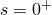
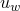

# *SORPTION

### *SORPTION定义吸收和解吸行为。

此选项用于在耦合湿润液体流动和多孔介质应力分析中定义部分饱和多孔介质的吸收和解吸行为。

**产品：**Abaqus/Standard  Abaqus/CAE

**类型：**模型数据

**级别：**模型

**Abaqus/CAE：**Property模块

##### **参考：**

- ["Sorption," Section 26.6.4 of the Abaqus Analysis User's Guide](../usb/usb-link.md#usb-mat-csorption)

### **可选参数：**

LAW

设置LAW=LOG以通过分析对数形式定义吸收或解吸行为。

设置LAW=TABULAR（默认）以表格形式定义吸收或解吸行为。

TYPE

设置TYPE=ABSORPTION（默认）以定义吸收行为。

设置TYPE=EXSORPTION以定义解吸行为（这必须是对同一材料的选项重复使用）。

设置TYPE=SCANNING以定义扫描线（这必须是对同一材料的选项重复使用）。

### **TYPE=ABSORPTION或TYPE=EXSORPTION且LAW=TABULAR时的数据行：**

**第一行：**

根据需要重复此数据行，以从  到  在 *s* 的递增值中定义  和 *s* 之间的关系。必须至少指定两行数据。

### **TYPE=ABSORPTION或TYPE=EXSORPTION且LAW=LOG时的数据行：**

**第一行（也是唯一行）：**

### **TYPE=SCANNING时的数据行：**

**第一行（也是唯一行）：**

