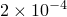

# *STATIC

### *STATIC静态应力/位移分析。

此选项用于指示该步应作为静态载荷步进行分析。

**产品：**Abaqus/Standard  Abaqus/CAE

**类型：**历史数据

**级别：**步

**Abaqus/CAE：**Step模块

##### **参考：**

- ["Static stress analysis," Section 6.2.2 of the Abaqus Analysis User's Guide](../usb/usb-link.md#usb-anl-astatic)
- ["Unstable collapse and postbuckling analysis," Section 6.2.4 of the Abaqus Analysis User's Guide](../usb/usb-link.md#usb-anl-apostbuckling)
- ["Adiabatic analysis," Section 6.5.4 of the Abaqus Analysis User's Guide](../usb/usb-link.md#usb-anl-aadiabaticanal)
- ["Solving nonlinear problems," Section 7.1.1 of the Abaqus Analysis User's Guide](../usb/usb-link.md#usb-anl-anonlineareqns)
- ["Deformation plasticity," Section 23.2.13 of the Abaqus Analysis User's Guide](../usb/usb-link.md#usb-mat-cdeformationplast)

### **在线性扰动分析中不使用参数或数据行。**

### **一般静态分析的可选参数：**

ADIABATIC

包含此参数以执行绝热应力分析。此参数仅与具有Mises屈服面的各向同性金属塑性材料相关，且仅在指定了[*INELASTIC HEAT FRACTION](ch09abk16.md)选项时才有意义。

ALLSDTOL

包含此参数以指示将在此步中激活自适应自动阻尼算法。将此参数设置为稳定能量与总应变能量的最大允许比值。初始阻尼因子通过STABILIZE参数或FACTOR参数指定。然后，该阻尼因子将基于收敛历史和ALLSDTOL值在步中调整。如果此参数设置为零，则不会激活自适应自动阻尼算法；将在整个步中使用恒定阻尼因子。如果此参数包含但未指定值，则默认值为0.05。如果省略此参数但包含具有耗散能量分数默认值的STABILIZE参数，则自适应自动阻尼算法将自动激活，ALLSDTOL=0.05。

此参数必须与STABILIZE参数配合使用（参见["Solving nonlinear problems," Section 7.1.1 of the Abaqus Analysis User's Guide](../usb/usb-link.md#usb-anl-anonlineareqns)）。

CONTINUE

设置CONTINUE=NO（默认）以指定此步不会从前一个通用步的结果中继承阻尼因子。在这种情况下，初始阻尼因子将基于声明的阻尼强度和步第一增量解重新计算，或可以直接指定。

设置CONTINUE=YES以指定此步将继承紧邻前一个通用步结束时的阻尼因子。

此参数必须与ALLSDTOL和STABILIZE参数配合使用。

DIRECT

此参数选择用户对步中间接增量的直接控制。如果使用此参数，则使用数据行第一项定义大小的恒定增量。如果省略此参数，则Abaqus/Standard将选择增量（在第一增量第一次尝试时尝试用户的初始时间增量后）。

参数可以具有值NO STOP。如果包含此值，则在完成允许的最大迭代次数（如[*CONTROLS](ch03abk75.md)选项所定义）后，即使未满足平衡容差，也将接受增量的解。如果使用此值，通常需要非常小的增量且至少两次迭代。*不推荐此方法；仅在分析师对如何解释以这种方式获得的结果有透彻理解的特殊情况下才应使用。*

FACTOR

如果由于局部不稳定预期问题可能不稳定，且Abaqus计算的阻尼因子不合适，则将此参数设置为自动阻尼算法（参见["Solving nonlinear problems," Section 7.1.1 of the Abaqus Analysis User's Guide](../usb/usb-link.md#usb-anl-anonlineareqns)）中使用的阻尼因子。此参数必须与STABILIZE参数配合使用，并覆盖基于耗散能量分数值对阻尼因子的自动计算。

如果包含RIKS参数，则不能使用此参数。

FULLY PLASTIC

此参数仅与需要使用变形理论塑性进行"完全塑性"分析的情况相关。为此，将此参数设置为被监测完全塑性行为的单元集名称。

当单元集中所有本构计算点的解都是完全塑性时（定义为等效应变是偏移屈服应变的10倍），步将结束。如果超过[*STEP](ch18abk36.md)选项给定的最大增量数或[*STATIC](ch18abk31.md)数据行给定的时间段，步将提前结束。

LONG TERM

包含此参数以获得具有时域粘弹性的完全松弛长期弹性解或双层粘塑性长期弹塑性解。如果省略LONG TERM参数，则对于时域粘弹性获得瞬时弹性解，对于双层粘塑性获得弹塑性和弹性粘性网络组合响应。此参数仅与时域粘弹性和双层粘塑性材料相关。

RIKS

包含此参数以对比例加载情况使用改进的Riks方法（["Unstable collapse and postbuckling analysis," Section 6.2.4 of the Abaqus Analysis User's Guide](../usb/usb-link.md#usb-anl-apostbuckling)）。

STABILIZE

如果由于局部不稳定预期问题可能不稳定，则包含此参数以使用自动稳定。将此参数设置为自动阻尼算法（参见["Solving nonlinear problems," Section 7.1.1 of the Abaqus Analysis User's Guide](../usb/usb-link.md#usb-anl-anonlineareqns)）的耗散能量分数。如果省略此参数，则不会激活稳定算法。如果此参数包含但未指定值，则耗散能量分数的默认值为 ，并且自适应自动阻尼算法将默认在此步中激活，ALLSDTOL=0.05；设置ALLSDTOL=0以停用自适应自动阻尼算法。如果使用FACTOR参数，则任何耗散能量分数值都将被阻尼因子覆盖。

如果包含RIKS参数，则不能使用此参数。

### **一般静态分析的数据行：**

**第一行（也是唯一行）：**

### **Riks方法的数据行：**

**第一行（也是唯一行）：**

