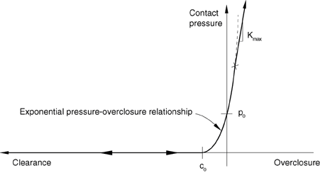

# *SURFACE BEHAVIOR

### *SURFACE BEHAVIOR定义接触的替代压力-闭合关系。

此选项用于在机械接触分析中修改默认的硬接触压力-闭合关系。影响此选项的是表面法线方向的机械相互作用。它必须与[*SURFACE INTERACTION](ch18abk50.md)选项一起使用，或在Abaqus/Standard分析与[*GAP](ch07abk01.md)选项或[*INTERFACE](ch09abk22.md)选项一起使用。默认情况下，Abaqus/Standard将确定是否使用或不使用拉格朗日乘子来强制执行接触约束。您可以使用[*CONTACT CONTROLS](ch03abk57.md)选项覆盖默认值。

**产品：**Abaqus/Standard  Abaqus/Explicit  Abaqus/CAE

**类型：**Abaqus/Standard中的模型数据；Abaqus/Explicit中的模型或历史数据

**级别：**Abaqus/Standard中的部件、部件实例、装配、模型；Abaqus/Explicit中的步

**Abaqus/CAE：**Interaction模块

##### **参考：**

- ["Mechanical contact properties: overview," Section 37.1.1 of the Abaqus Analysis User's Guide](../usb/usb-link.md#usb-cni-acontactmechanical)
- ["Contact pressure-overclosure relationships," Section 37.1.2 of the Abaqus Analysis User's Guide](../usb/usb-link.md#usb-cni-anormalinteraction)
- [*CONTACT CONTROLS](ch03abk57.md)
- [*GAP](ch07abk01.md)
- [*INTERFACE](ch09abk22.md)
- [*SURFACE INTERACTION](ch18abk50.md)

### **可选的互斥参数：**

AUGMENTED LAGRANGE

此参数仅适用于具有默认"硬"压力-闭合关系的Abaqus/Standard分析。

包含此参数以选择增强拉格朗日方法强制执行接触约束。参见["Contact constraint enforcement methods in Abaqus/Standard," Section 38.1.2 of the Abaqus Analysis User's Guide](../usb/usb-link.md#usb-cni-acontactconstraints)，了解与此方法相关的默认罚刚度和穿透容差（此方法使用的默认罚刚度通常比直接罚方法更硬）。您可以在数据行上指定或修改罚刚度。

DIRECT

此参数仅适用于Abaqus/Standard分析。

包含此参数以选择直接强制执行接触约束，无需近似或使用增强迭代。

PENALTY

此参数仅适用于具有默认"硬"压力-闭合关系的Abaqus/Standard分析。

设置PENALTY=LINEAR（默认）以选择线性罚方法强制执行接触约束。参见["Contact constraint enforcement methods in Abaqus/Standard," Section 38.1.2 of the Abaqus Analysis User's Guide](../usb/usb-link.md#usb-cni-acontactconstraints)，了解默认线性罚刚度的讨论。您可以在数据行上指定或修改罚刚度。

设置PENALTY=NONLINEAR以选择非线性罚方法强制执行接触约束。参见["Contact constraint enforcement methods in Abaqus/Standard," Section 38.1.2 of the Abaqus Analysis User's Guide](../usb/usb-link.md#usb-cni-acontactconstraints)，了解默认非线性罚刚度的讨论。您可以在数据行上指定或修改最终非线性罚刚度和其他非线性罚控制参数。

### **可选参数：**

NO SEPARATION

包含此参数以防止一旦建立接触后两个表面的任何分离。

PRESSURE-OVERCLOSURE

使用此参数选择默认硬接触以外的接触压力-闭合关系。

设置PRESSURE-OVERCLOSURE=HARD（默认）以选择没有物理软化的压力-闭合关系。请注意，如果使用罚或增强拉格朗日约束强制方法，则会发生一些数值软化。

设置PRESSURE-OVERCLOSURE=EXPONENTIAL以定义指数压力-闭合关系。

设置PRESSURE-OVERCLOSURE=LINEAR以定义线性压力-闭合关系。

设置PRESSURE-OVERCLOSURE=SCALE FACTOR以基于缩放默认接触刚度定义分段线性压力-闭合关系。此选项仅适用于Abaqus/Explicit中的通用接触算法。

设置PRESSURE-OVERCLOSURE=TABULAR以表格形式定义分段线性压力-闭合关系。

如果未定义接触区域（如可能发生在基于节点的表面或GAP或ITT型接触单元上），则"压力"应被解释为力。对于与三维梁或桁架的接触，"压力"应被解释为每单位长度上的力。

当用于修改默认表面行为时，PRESSURE-OVERCLOSURE参数不能与Abaqus/Standard分析中的NO SEPARATION参数一起使用。

### **AUGMENTED LAGRANGE和PENALTY=LINEAR的可选数据行：**

**第一行（也是唯一行）：**

### **PENALTY=NONLINEAR的可选数据行：**

**第一行（也是唯一行）：**

### **PRESSURE-OVERCLOSURE=EXPONENTIAL的数据行：**

**第一行（也是唯一行）：**

### **PRESSURE-OVERCLOSURE=LINEAR的数据行：**

**第一行（也是唯一行）：**

### **PRESSURE-OVERCLOSURE=SCALE FACTOR的数据行：**

**第一行（也是唯一行）：**

### **PRESSURE-OVERCLOSURE=TABULAR的数据行：**

**第一行：**

按闭合值的升序根据需要重复此数据行，以将闭合定义为压力的函数。需要至少两行数据。压力-闭合关系通过继续相同的斜率在最后一个闭合点之外进行外推（参见[图18.48-4](ch18abk48.md#ksurfacebehavior-soft1)）。

**图18.48-1** 非线性罚压力-闭合关系。

**图18.48-2** 指数压力-闭合关系。

**图18.48-3** 比例因子压力-闭合关系。

**图18.48-4** 以表格形式定义的压力-闭合关系。

