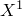

# *SYSTEM

### *SYSTEM指定用于定义节点的局部坐标系。

此选项用于通过接受相对于指定局部直角坐标系的坐标来定义节点，并在全局坐标系中生成节点坐标。

**产品：**Abaqus/Standard  Abaqus/Explicit  Abaqus/CFD  Abaqus/CAE

**类型：**模型数据

**级别：**部件、部件实例

**Abaqus/CAE：**不适用；在Assembly模块中实例化部件会创建局部坐标系。

##### **参考：**

- ["节点定义," Section 2.1.1 of the Abaqus Analysis User's Guide](../usb/usb-link.md#usb-int-inode)

**此选项没有关联的参数。**

### **定义局部坐标系的数据行：**

**第一行：**

**第二行（可选；如果未提供，则*Z*轴方向保持不变，且轴投影到平面上）：**

**图18.59-1** 局部坐标系。

