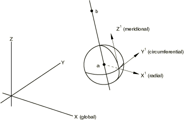

# *TRANSFORM

### *TRANSFORM在节点处指定局部坐标系。

此选项用于为节点上的位移和旋转自由度指定局部坐标系。

**产品：**Abaqus/Standard  Abaqus/Explicit  Abaqus/CFD  Abaqus/CAE

**类型：**模型数据

**级别：**部件、部件实例、装配

**Abaqus/CAE：**在Load模块中为规定条件定义节点坐标系。

##### **参考：**

- ["变换坐标系," Section 2.1.5 of the Abaqus Analysis User's Guide](../usb/usb-link.md#usb-int-ptransform)

### **必需参数：**

NSET

将此参数设置为正在为其给出局部变换系统的节点集名称。

### **可选参数：**

TYPE

设置TYPE=R（默认）以指示直角笛卡尔系统（[图19.11-1](ch19abk11.md#ktransform-cartesian)）。设置TYPE=C以指示圆柱系统（[图19.11-2](ch19abk11.md#ktransform-cylindrical)）。设置TYPE=S以指示球形系统（[图19.11-3](ch19abk11.md#ktransform-spherical)）。

### **定义变换坐标系的数据行：**

**第一行（也是唯一行）：**

**图19.11-1** 笛卡尔变换选项。

**图19.11-2** 圆柱变换选项。

**图19.11-3** 球形变换选项。

