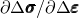

# *USER MATERIAL

### *USER MATERIAL定义用于子程序`UMAT`、`UMATHT`或`VUMAT`的材料常数。

此选项用于输入用于用户定义机械模型（Abaqus/Standard中的用户子程序[`UMAT`](../sub/sub-link.md#sub-xsl-umat)或Abaqus/Explicit中的用户子程序[`VUMAT`](../sub/sub-link.md#sub-xsl-vumat)）的材料常数。在Abaqus/Standard中，它还用于输入用于用户定义热材料模型（用户子程序[`UMATHT`](../sub/sub-link.md#sub-xsl-umatht)）的材料常数。

**产品：**Abaqus/Standard  Abaqus/Explicit  Abaqus/CAE

**类型：**模型数据

**级别：**模型

**Abaqus/CAE：**Property模块

##### **参考：**

- ["用户定义的机械材料行为," Section 26.7.1 of the Abaqus Analysis User's Guide](../usb/usb-link.md#usb-mat-cusermat)
- ["用户定义的热材料行为," Section 26.7.2 of the Abaqus Analysis User's Guide](../usb/usb-link.md#usb-mat-cthusermat)
- ["UMAT," Section 1.1.41 of the Abaqus User Subroutines Reference Guide](../sub/sub-link.md#sub-rtn-uumat)
- ["UMATHT," Section 1.1.42 of the Abaqus User Subroutines Reference Guide](../sub/sub-link.md#sub-rtn-umatht)
- ["VUMAT," Section 1.2.20 of the Abaqus User Subroutines Reference Guide](../sub/sub-link.md#sub-rtn-uexpmat)

### **必需参数：**

CONSTANTS

将此参数设置为正在输入的常数数量。

### **可选参数：**

HYBRID FORMULATION

此参数仅适用于Abaqus/Standard分析。

设置HYBRID FORMULATION=INCREMENTAL（默认）以使用基于增量拉格朗日乘子的混合元素公式。

设置HYBRID FORMULATION=TOTAL以使用基于总拉格朗日乘子的混合元素公式。

设置HYBRID FORMULATION=INCOMPRESSIBLE以使用混合元素定义不可压缩材料响应。

TYPE

此参数仅适用于Abaqus/Standard分析。

如果常数用于定义材料的机械行为，则设置TYPE=MECHANICAL（默认）。

如果常数用于定义材料的热构成行为，则设置TYPE=THERMAL。

如果正在建模材料的用户定义机械行为和用户定义热行为，则应在材料数据块中重复[*USER MATERIAL](ch20abk08.md)选项，以使用TYPE参数的每个值。

UNSYMM

此参数仅适用于Abaqus/Standard分析。

如果材料刚度矩阵，，不是对称的，或者当使用热构成模型且不是对称的时，包含此参数。此参数导致Abaqus/Standard使用其非对称方程求解过程。

### **定义材料常数的数据行：**

**第一行：**

根据需要重复此数据行，以定义所有材料常数。

