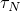
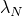

# *WAVE

### *WAVE定义用于浸没结构计算的重力波。

此选项用于定义用于施加载荷的重力波。

**产品：**Abaqus/Aqua

**类型：**模型数据

**级别：**模型

##### **参考：**

- ["Abaqus/Aqua分析," Section 6.11.1 of the Abaqus Analysis User's Guide](../usb/usb-link.md#usb-anl-aaqua)
- ["VWAVE," Section 1.2.25 of the Abaqus User Subroutines Reference Guide](../sub/sub-link.md#sub-rtn-uexpwave)
- ["UWAVE," Section 1.1.56 of the Abaqus User Subroutines Reference Guide](../sub/sub-link.md#sub-rtn-uuwave)

### **可选参数：**

INPUT

将此参数设置为包含此选项数据行的备用输入文件名称。有关此类文件名的语法，请参见["输入语法规则," Section 1.2.1 of the Abaqus Analysis User's Guide](../usb/usb-link.md#usb-int-iinputsyntax)。如果省略此参数，则假定数据跟随在关键字行之后。

TYPE

设置TYPE=STOKES（默认）以使用Stokes五阶波理论。

设置TYPE=AIRY以使用Airy（线性化）波理论。

设置TYPE=GRIDDED（仅限Abaqus/Standard）以使用网格数据定义流体粒子速度、加速度、自由表面高程和动态压力。

设置TYPE=USER以允许用户定义的波并更新流体变量，如速度、加速度、自由表面高程、压力和压力梯度。

### **TYPE=AIRY的可选参数：**

WAVE PERIOD

包含此参数以指示数据行中的第二个字段指定波周期，。如果省略此参数，则数据行中的第二个字段指定波长，。

### **TYPE=GRIDDED的必需参数：**

DATA FILE

将此参数设置为包含网格数据的文件名称。该文件必须是一个顺序二进制格式文件，包含["Abaqus/Aqua分析," Section 6.11.1 of the Abaqus Analysis User's Guide](../usb/usb-link.md#usb-anl-aaqua)中描述的格式的记录。

### **TYPE=GRIDDED的可选参数：**

MINIMUM

将此参数设置为结构在所有时间*t*完全浸没所在的最低高程。如果省略此参数，则将结构的高程与瞬时自由表面进行比较以检查流体表面穿透。

QUADRATIC

包含此参数以指示使用波数据的二次插值来确定网格点之间的信息。如果省略此参数，则使用线性插值。

### **TYPE=USER的可选参数：**

STOCHASTIC

此参数仅适用于Abaqus/Standard分析。

包含此参数以使中间构型可用于用户子程序[`UWAVE`](../sub/sub-link.md#sub-xsl-uwave)。将此参数设置为一个随机数种子，用于随机分析。如果省略此参数或包含但未指定值，则随机数种子使用默认值0.0。此值传递到用户子程序[`UWAVE`](../sub/sub-link.md#sub-xsl-uwave)。否则Abaqus/Aqua不使用它。

PROPERTIES

此参数仅适用于Abaqus/Explicit分析。

将此参数设置为用户定义波所需的常量属性数量。默认值为零。此值作为整数参数`NPROPS`传递到用户子程序[`VWAVE`](../sub/sub-link.md#sub-xsl-vwave)，而属性值作为实数数组`PROPS`传递。

DEPVAR

此参数仅适用于Abaqus/Explicit分析。

将此参数设置为用户定义波所需的状态变量数量。默认值为零。此值作为整数参数`NSTATEVAR`传递到用户子程序[`VWAVE`](../sub/sub-link.md#sub-xsl-vwave)。状态变量存储在施加Abaqus/Aqua载荷的单元节点上，并作为实数数组参数`STATEVAR`传递到用户子程序[`VWAVE`](../sub/sub-link.md#sub-xsl-vwave)。您必须在用户子程序中更新状态变量。它们在每个步开始时初始化为零。

### **定义Stokes五阶波的数据行（TYPE=STOKES）：**

**第一行（也是唯一行）：**

### **定义Airy波的数据行（TYPE=AIRY）：**

**第一行：**

根据需要重复此数据行以定义多个波列；每行一个波分量。

### **定义网格波数据的 数据行（TYPE=GRIDDED）：**

**第一行（也是唯一行）：**

### **在Abaqus/Standard分析中定义随机用户波理论（TYPE=USER）的频率与波幅数据的数据行：**

**第一行：**

根据需要重复此数据行以定义波谱。这些数据对传递到用户子程序[`UWAVE`](../sub/sub-link.md#sub-xsl-uwave)。否则Abaqus/Aqua不使用它们。

### **在Abaqus/Explicit分析中定义波理论（TYPE=USER）的数据行：**

**第一行：**

根据需要重复此数据行以包含所有属性，每行最多八个值。

