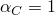
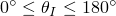
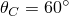
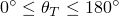
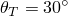

# *ADAPTIVE MESH CONTROLS

### *ADAPTIVE MESH CONTROLSSpecify controls for the adaptive meshing and advection algorithms.

This option is used to control various aspects of the adaptive meshing and advection algorithms applied to an adaptive mesh domain. It can be used only in conjunction with the [*ADAPTIVE MESH](ch01abk04.md) option.

**Products: **Abaqus/Standard  Abaqus/Explicit  Abaqus/CAE  

**Type: **History data 

**Level: **Step

**Abaqus/CAE: **Step module

##### **References:**

- ["Defining ALE adaptive mesh domains in Abaqus/Explicit," Section 12.2.2 of the Abaqus Analysis User's Guide](../usb/usb-link.md#usb-anl-aaledomains)
- ["ALE adaptive meshing and remapping in Abaqus/Explicit," Section 12.2.3 of the Abaqus Analysis User's Guide](../usb/usb-link.md#usb-anl-aaleremesh)
- ["Defining ALE adaptive mesh domains in Abaqus/Standard," Section 12.2.6 of the Abaqus Analysis User's Guide](../usb/usb-link.md#usb-anl-aalestd)
- ["ALE adaptive meshing and remapping in Abaqus/Standard," Section 12.2.7 of the Abaqus Analysis User's Guide](../usb/usb-link.md#usb-anl-aalestdremesh)
- [*ADAPTIVE MESH](ch01abk04.md)

### **Required parameter: **

NAME

Set this parameter equal to a label that will be used to refer to this adaptive mesh controls definition. Adaptive mesh control names in the same input file must be unique.

### **Optional parameters: **

ADVECTION

This parameter applies only to Abaqus/Explicit analyses.

Set ADVECTION=SECOND ORDER (default) to use a second-order algorithm to remap solution variables after adaptive meshing has been performed.

Set ADVECTION=FIRST ORDER to use a first-order algorithm to remap solution variables after adaptive meshing has been performed.

CURVATURE REFINEMENT

This parameter applies only to Abaqus/Explicit analyses.

Set this parameter equal to the solution dependence weight, . The default value is .

GEOMETRIC ENHANCEMENT

Set GEOMETRIC ENHANCEMENT=YES (default in Abaqus/Explicit analyses) to use smoothing algorithms that are enhanced based on evolving element geometry.

Set GEOMETRIC ENHANCEMENT=NO  (default in Abaqus/Standard analyses) to use the conventional form of the smoothing algorithms.

INITIAL FEATURE ANGLE

Set this parameter equal to the initial geometric feature angle, , in degrees (). This angle is used to detect geometric edges and corners. The default value is . Setting  will ensure that no geometric edges or corners are detected or enforced.

MESH CONSTRAINT ANGLE

This parameter applies only to Abaqus/Explicit analyses.

Set this parameter equal to the mesh constraint angle, , in degrees (). The default value is .

When adaptive mesh constraints are applied to nodes on Lagrangian or sliding boundary regions, the analysis will terminate if the angle between the normal to the boundary region and the direction of the prescribed constraint becomes less than . When adaptive mesh constraints are applied to nodes that are part of a Lagrangian or active geometric edge, the analysis will terminate if the angle between the prescribed constraint and the plane perpendicular to the edge becomes less than .

MESHING PREDICTOR

This parameter is interpreted differently in Abaqus/Explicit and Abaqus/Standard analyses.

In an Abaqus/Explicit analysis, set MESHING PREDICTOR=CURRENT (default if the adaptive mesh domain has no Eulerian boundary regions) to perform adaptive meshing based on current nodal positions; this method is recommended for all Lagrangian-like problems and for problems with very large distortions. Set MESHING PREDICTOR=PREVIOUS (default if the adaptive mesh domain has one or more Eulerian boundary regions) to perform adaptive meshing based on the positions of the nodes at the end of the previous adaptive mesh increment; this technique is recommended for Eulerian-like problems where material flow is significant compared to the overall deformation.

In an Abaqus/Standard analysis, set MESHING PREDICTOR=CURRENT to perform adaptive meshing based on the positions of the nodes at the start of the current adaptive mesh increment. Set MESHING PREDICTOR=PREVIOUS (default) to perform adaptive meshing based on the nodal positions in the original mesh.

MOMENTUM ADVECTION

This parameter applies only to Abaqus/Explicit analyses.

Set MOMENTUM ADVECTION=ELEMENT CENTER PROJECTION (default) to use the element center projection method for advecting momentum. This method is less expensive than the half-index shift method.

Set MOMENTUM ADVECTION=HALF INDEX SHIFT to use the half-index shift method for momentum advection. This algorithm is more expensive computationally but may demonstrate better dispersion properties than the element center projection method.

RESET

Include this parameter to reset all adaptive mesh controls to their default values. Controls that are specified with other parameters on the same [*ADAPTIVE MESH CONTROLS](ch01abk06.md) option are retained. If this parameter is omitted, only the specified controls will be changed in the current step; the others will remain at their settings from previous steps.

SMOOTHING OBJECTIVE

This parameter applies only to Abaqus/Explicit analyses.

Set SMOOTHING OBJECTIVE=UNIFORM (default if the adaptive mesh domain has no Eulerian boundary regions in explicit dynamic analysis) to perform adaptive meshing that minimizes element distortion and improves element aspect ratios at the expense of diffusing initial mesh gradation. This objective is recommended for problems with moderate to large overall deformation.

Set SMOOTHING OBJECTIVE=GRADED (default if the adaptive mesh domain has one or more Eulerian boundary regions in explicit dynamic analysis) to perform adaptive meshing that attempts to preserve initial mesh gradation while reducing distortions as the analysis evolves. This objective is recommended only for adaptive mesh domains with reasonably structured graded meshes undergoing low to moderate overall deformation.

TRANSITION FEATURE ANGLE

Set this parameter equal to the transition geometric feature angle, , in degrees (). This angle is used to determine when geometric edges and corners should be deactivated to allow remeshing across them. The default value is . Setting  will ensure that no geometric edges or corners are deactivated.

### **Data line to define weights for combining the mesh smoothing methods in Abaqus/Explicit analyses: **

**First (and only) line:**

Each of the weights must be zero or positive and their sum should typically be 1.0. If the sum of the weights is less than 1.0, the mesh smoothing algorithm will be less aggressive at each adaptive mesh increment. If the sum of the weights is greater than 1.0, their values are normalized so that their sum is 1.0.

### **Data line to define weights for combining the mesh smoothing methods in Abaqus/Standard analyses: **

**First (and only) line:**

Each of the weights must be zero or positive and their sum must be nonzero. The weights are significant only in a relative sense; their values are normalized so that their sum is 1.0.

