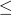

# *AMPLITUDE

### *AMPLITUDEDefine an amplitude curve.

This option allows arbitrary time (or frequency in an Abaqus/Standard analysis) variations of load, displacement, and other prescribed variable magnitudes to be given throughout a step.

**Products: **Abaqus/Standard  Abaqus/Explicit  Abaqus/CFD  Abaqus/CAE  

**Type: **Model or history data  

**Level: **Model,  Step

**Abaqus/CAE: **Amplitude toolset; bubble loading is not supported. Similar functionality is available in the Interaction module.

##### **Reference:**

- ["Amplitude curves," Section 34.1.2 of the Abaqus Analysis User's Guide](../usb/usb-link.md#usb-prc-pamplitude)

### **Required parameter: **

NAME

Set this parameter equal to a label that will be used to refer to the amplitude curve.

### **Optional parameters: **

DEFINITION

Set DEFINITION=TABULAR (default) to give the amplitude-time (or amplitude-frequency) definition in tabular form.

Set DEFINITION=EQUALLY SPACED, PERIODIC, MODULATED, DECAY, SMOOTH STEP, SOLUTION DEPENDENT, or BUBBLE to define the amplitude according to the definitions given in ["Amplitude curves," Section 34.1.2 of the Abaqus Analysis User's Guide](../usb/usb-link.md#usb-prc-pamplitude).

Set DEFINITION=USER to define the amplitude via user subroutines [`UAMP`](../sub/sub-link.md#sub-xsl-uamp) and [`VUAMP`](../sub/sub-link.md#sub-xsl-vuamp). 

Set DEFINITION=ACTUATOR to define the amplitude via co-simulation with a logical modeling program.

Parameter settings of BUBBLE, SOLUTION DEPENDENT, USER, and ACTUATOR are not available in Abaqus/CFD analyses.

INPUT

Set this parameter equal to the name of the alternate input file containing the data lines for this option. See ["Input syntax rules," Section 1.2.1 of the Abaqus Analysis User's Guide](../usb/usb-link.md#usb-int-iinputsyntax), for the syntax of such file names. If this parameter is omitted, it is assumed that the data follow the keyword line. 

This parameter cannot be used if DEFINITION=USER or DEFINITION=ACTUATOR.

SCALEX

Set this parameter equal to the value by which the time values are to be scaled. The default is 1. 

This parameter cannot be used if DEFINITION=SOLUTION DEPENDENT, BUBBLE, USER, or ACTUATOR.

SCALEY

Set this parameter equal to the value by which the amplitude values are to be scaled. The default is 1.

This parameter cannot be used if DEFINITION=SOLUTION DEPENDENT, BUBBLE, or USER.

SHIFTX

Set this parameter equal to the value by which the time values are to be shifted. The default is 0. 

This parameter cannot be used if DEFINITION=SOLUTION DEPENDENT, BUBBLE, USER, or ACTUATOR.

SHIFTY

Set this parameter equal to the value by which the amplitude values are to be shifted. The default is 0.

This parameter cannot be used if DEFINITION=SOLUTION DEPENDENT, BUBBLE, or USER.

TIME

Set TIME=STEP TIME (default) for step time. If the step in which the amplitude is referenced is in the frequency domain, STEP TIME corresponds to frequency.

Set TIME=TOTAL TIME for total time accumulated over all non-perturbation analysis steps. 

See ["Conventions," Section 1.2.2 of the Abaqus Analysis User's Guide](../usb/usb-link.md#usb-int-iconventions), for a discussion of these time measures.

VALUE

Set VALUE=RELATIVE (default) for relative magnitude definition.

Set VALUE=ABSOLUTE for direct input of absolute magnitudes. In this case the data line values in the load option are ignored. Because the values given in the field definition are ignored, the absolute amplitude value will be used to define both the temperature and the gradient. For this reason, VALUE=ABSOLUTE should not be used when temperatures or predefined field variables are specified for nodes connected to beam and shell elements whose section definition includes TEMPERATURE=GRADIENTS (default).

### **Required parameter for DEFINITION=EQUALLY SPACED: **

FIXED INTERVAL

Set this parameter equal to the fixed time (or frequency) interval at which the amplitude data will be given.

### **Optional parameter for DEFINITION=EQUALLY SPACED: **

BEGIN

Set this parameter equal to the time (or lowest frequency) at which the first amplitude is given. The default is BEGIN=0.0.

### **Optional parameter for DEFINITION=TABULAR or DEFINITION=EQUALLY SPACED: **

SMOOTH

Set this parameter equal to the fraction of the time interval before and after each time point during which the piecewise linear time variation is to be replaced by a smooth quadratic time variation in any case when time derivatives of the amplitude definition are required. The defaults are SMOOTH=0.25 in Abaqus/Standard and SMOOTH=0.0 in Abaqus/Explicit. The allowable range is 0.0  SMOOTH  0.5. A value of 0.05 is suggested for amplitude definitions that contain large time intervals to avoid severe deviation from the specified definition. This parameter is applicable only when time derivatives are needed (for displacement or velocity boundary conditions in a direct integration dynamic analysis) and is ignored for all other uses of this option. This parameter is not available in Abaqus/CFD.

### **Optional parameters for DEFINITION=USER: **

PROPERTIES

Set this parameter equal to the number of properties being entered. The properties are available for use in user subroutines [`UAMP`](../sub/sub-link.md#sub-xsl-uamp) and [`VUAMP`](../sub/sub-link.md#sub-xsl-vuamp). They can be defined on the data lines or directly within the user subroutine. The default is PROPERTIES=0.

VARIABLES

Set this parameter equal to the number of solution-dependent state variables that must be stored with this amplitude definition. Its value must be greater than 0. The default is VARIABLES=1.

### **Data lines for DEFINITION=TABULAR or DEFINITION=SMOOTH STEP with four data points (eight entries) per line: **

**First line:**

Repeat this data line as often as necessary. Each line (except the last one) must have exactly four time/magnitude or frequency/magnitude data pairs.

### **Data lines for DEFINITION=TABULAR or DEFINITION=SMOOTH STEP with one data pair (two entries) per line: **

**First line:**

Repeat this data line as often as necessary. Each line must have exactly one time/magnitude or frequency/magnitude data pair.

### **Data lines for DEFINITION=EQUALLY SPACED with eight values per line: **

**First line:**

Repeat this data line as often as necessary. Each line (except the last one) must have exactly eight amplitude values.

### **Data lines for DEFINITION=EQUALLY SPACED with one value per line: **

**First line:**

Repeat this data line as often as necessary. Each line must have exactly one amplitude value.

### **Data lines to define periodic data (DEFINITION=PERIODIC): **

**First line:**

**Second line:**

Repeat this data line as often as necessary. Each line (except the last one) must have exactly eight entries, to a total of 2*N* entries.

### **Data line to define modulated data (DEFINITION=MODULATED): **

**First (and only) line:**

### **Data line to define exponential decay (DEFINITION=DECAY): **

**First (and only) line:**

### **Data line to define a solution-dependent amplitude (DEFINITION=SOLUTION DEPENDENT): **

**First (and only) line:**

### **Data lines to define bubble loading (DEFINITION=BUBBLE): **

**First line:**

**Second line:**

**Third line:**

**Fourth line:**

### **Data lines to define user amplitude properties when PROPERTIES is specified with DEFINITION=USER: **

**First line:**

Repeat this data line as often as necessary to define all amplitude properties.

### **There are no data lines if DEFINITION=ACTUATOR. **

