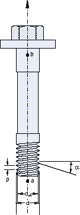
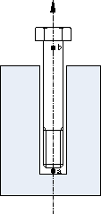

# *CLEARANCE

### *CLEARANCESpecify a particular initial clearance value and a contact direction for the slave nodes on a surface.

This option is used to define initial clearance values and/or contact directions precisely at contact slave nodes. In an Abaqus/Standard analysis it can also be used to define overclosure values. The [*CLEARANCE](ch03abk21.md) option can be used with small-sliding contact only ([*CONTACT PAIR](ch03abk68.md), SMALL SLIDING). In Abaqus/Explicit it can be used only in the first step of an analysis.

**Products: **Abaqus/Standard  Abaqus/Explicit  Abaqus/CAE  

**Type: **Model data in Abaqus/Standard; History data in Abaqus/Explicit  

**Level: **Model in Abaqus/Standard; Step in Abaqus/Explicit  

**Abaqus/CAE: **Interaction module

##### **References:**

- ["Common difficulties associated with contact modeling in Abaqus/Standard," Section 39.1.2 of the Abaqus Analysis User's Guide](../usb/usb-link.md#usb-cni-acontacttrouble)
- ["Common difficulties associated with contact modeling using contact pairs in Abaqus/Explicit," Section 39.2.2 of the Abaqus Analysis User's Guide](../usb/usb-link.md#usb-cni-aexpcontacttrouble)
- ["Adjusting initial surface positions and specifying initial clearances in Abaqus/Standard contact pairs," Section 36.3.5 of the Abaqus Analysis User's Guide](../usb/usb-link.md#usb-cni-aadjustsurfaces)
- ["Adjusting initial surface positions and specifying initial clearances for contact pairs in Abaqus/Explicit," Section 36.5.4 of the Abaqus Analysis User's Guide](../usb/usb-link.md#usb-cni-aexpadjustsurfaces)

### **Required parameters: **

CPSET

This parameter applies only to Abaqus/Explicit analyses.

Set this parameter equal to the name of the contact pair set name to associate these clearance data with the appropriate contact pairs.

MASTER

This parameter applies only to Abaqus/Standard analyses.

Set this parameter equal to the name of the master surface of the contact pair.

SLAVE

This parameter applies only to Abaqus/Standard analyses.

Set this parameter equal to the name of the slave surface of the contact pair.

### **Required, mutually exclusive parameters: **

TABULAR

Include this parameter to specify the slave nodes or the node sets and their corresponding initial clearance/overclosure values (and, if required, contact directions) on the data lines of this option. In an Abaqus/Explicit analysis only initial clearances are allowed.

VALUE

Set this parameter equal to the initial clearance/overclosure for the entire set of slave nodes. In Abaqus/Standard a positive value specifies an initial clearance, and a negative value specifies an initial overclosure. In an Abaqus/Explicit analysis this value must be positive since only initial clearances are allowed.

### **Optional parameters when the TABULAR parameter is included: **

BOLT

Include this parameter to indicate that the appropriate contact normal directions for a threaded bolt connection will be generated automatically based on thread geometry data and two points used to define a direction vector on the axis of the bolt and bolt-hole assembly specified on the data lines. This parameter is valid only for single threaded bolts.

INPUT

Set this parameter equal to the name of the alternate input file containing the data lines for this option. See ["Input syntax rules," Section 1.2.1 of the Abaqus Analysis User's Guide](../usb/usb-link.md#usb-int-iinputsyntax), for the syntax of such file names. The data lines in the alternate input file should be in the same format as that for the TABULAR parameter. 

If this parameter is omitted and the TABULAR parameter is included, it is assumed that the data follow the keyword line.

### **Data lines if the TABULAR parameter is included with neither the INPUT parameter nor the BOLT parameter: **

**First line:**

Repeat the above data line as often as necessary to define the clearance value and the direction in which Abaqus tests for contact between the slave node and the corresponding closest point on the master surface. The specification of the normal is optional. If the normal is given, it should be in the direction of the master surface's outward normal. If the normal is not given, Abaqus calculates it from the geometry of the master surface (see ["Common difficulties associated with contact modeling in Abaqus/Standard," Section 39.1.2 of the Abaqus Analysis User's Guide](../usb/usb-link.md#usb-cni-acontacttrouble), and ["Common difficulties associated with contact modeling using contact pairs in Abaqus/Explicit," Section 39.2.2 of the Abaqus Analysis User's Guide](../usb/usb-link.md#usb-cni-aexpcontacttrouble)).

### **Data lines if both the TABULAR parameter and the BOLT parameter are included without the INPUT parameter (see [Figure 3.21--1](ch03abk21.md#thread-bolt-connection) and [Figure 3.21--2](ch03abk21.md#thread-bolt-connection3)): **

**First line:**

**Second line:**

Repeat the second data line as often as necessary to define the clearance value and the direction vector on the axis of the bolt and bolt-hole assembly that Abaqus uses to calculate the contact normal directions based on the thread geometry (see ["Adjusting initial surface positions and specifying initial clearances in Abaqus/Standard contact pairs," Section 36.3.5 of the Abaqus Analysis User's Guide](../usb/usb-link.md#usb-cni-aadjustsurfaces), and ["Specifying initial clearance values precisely" in "Adjusting initial surface positions and specifying initial clearances for contact pairs in Abaqus/Explicit," Section 36.5.4 of the Abaqus Analysis User's Guide](../usb/usb-link.md#usb-cni-aexpadjustsurfaces-clearance)).

### **To define a clearance value by using the VALUE parameter: **

No data lines are used with this option when the VALUE parameter is specified.

**Figure 3.21–1** Thread geometry.

**Figure 3.21–2** Points *a* and *b* on the centerline of the bolt and bolt-hole assembly.

