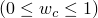
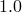

# *CONCRETE TENSION DAMAGE

### *CONCRETE TENSION DAMAGEDefine postcracking damage properties for the concrete damaged plasticity model.

This option is used to define postcracking damage (or stiffness degradation) properties for the concrete damaged plasticity material model. The [*CONCRETE TENSION DAMAGE](ch03abk32.md) option must be used in conjunction with the [*CONCRETE DAMAGED PLASTICITY](ch03abk31.md), [*CONCRETE TENSION STIFFENING](ch03abk33.md), and [*CONCRETE COMPRESSION HARDENING](ch03abk30.md) options. In addition, the [*CONCRETE COMPRESSION DAMAGE](ch03abk29.md) option can be used to specify compressive stiffness degradation damage.

**Products: **Abaqus/Standard  Abaqus/Explicit  Abaqus/CAE  

**Type: **Model data  

**Level: **Model  

**Abaqus/CAE: **Property module

##### **References:**

- ["Concrete damaged plasticity," Section 23.6.3 of the Abaqus Analysis User's Guide](../usb/usb-link.md#usb-mat-cconcretedamaged)
- [*CONCRETE DAMAGED PLASTICITY](ch03abk31.md)
- [*CONCRETE TENSION STIFFENING](ch03abk33.md)
- [*CONCRETE COMPRESSION HARDENING](ch03abk30.md)
- [*CONCRETE COMPRESSION DAMAGE](ch03abk29.md)

### **Optional parameters: **

COMPRESSION RECOVERY

This parameter is used to define the stiffness recovery factor, , which determines the amount of compression stiffness that is recovered as the loading changes from tension to compression. If , the material fully recovers the compressive stiffness; if , there is no stiffness recovery. Intermediate values of   result in partial recovery of the compressive stiffness. The default value is , which corresponds to the assumption that as cracks close the compressive stiffness is unaffected by tensile damage.

DEPENDENCIES

Set this parameter equal to the number of field variable dependencies included in the definition of the tension damage, in addition to temperature. If this parameter is omitted, it is assumed that the tension damage behavior depends only on temperature. See ["Specifying field variable dependence" in "Material data definition," Section 21.1.2 of the Abaqus Analysis User's Guide](../usb/usb-link.md#usb-mat-cmaterialdata-fvdepen), for more information.

TYPE

Set TYPE=STRAIN (default) to specify the tensile damage variable as a function of cracking strain.

Set TYPE=DISPLACEMENT to specify the tensile damage variable as a function of cracking displacement.

### **Data lines if the tensile damage is specified as a function of cracking strain (TYPE=STRAIN): **

**First line:**

The first point at each value of temperature must have a cracking strain of 0.0 and a tensile damage value of 0.0.

**Subsequent lines (only needed if the DEPENDENCIES parameter has a value greater than five):**

Repeat this set of data lines as often as necessary to define the dependence of the tensile damage behavior on cracking strain, temperature, and other predefined field variables.

### **Data lines if the tensile damage is specified as a function of cracking displacement (TYPE=DISPLACEMENT): **

**First line:**

The first point at each value of temperature must have a cracking displacement of 0.0 and a tensile damage value of 0.0.

**Subsequent lines (only needed if the DEPENDENCIES parameter has a value greater than five):**

Repeat this set of data lines as often as necessary to define the dependence of the tensile damage behavior on cracking displacement, temperature, and other predefined field variables.

